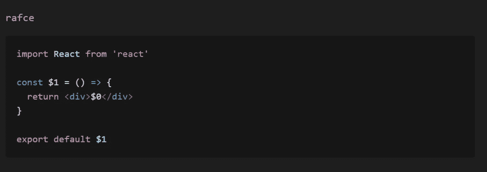
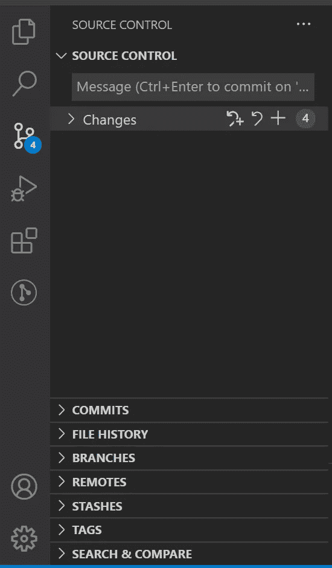

# 6 VS 代码扩展促进您的 Web 开发

> 原文：<https://javascript.plainenglish.io/6-vs-code-extensions-to-boost-your-web-development-1705d86c11da?source=collection_archive---------10----------------------->

Photo by [Marjan Blan | @marjanblan](https://unsplash.com/@marjan_blan?utm_source=medium&utm_medium=referral) on [Unsplash](https://unsplash.com/?utm_source=medium&utm_medium=referral)

如果您对 web 开发感兴趣，那么您可能已经遇到了最流行的 IDE，Visual Studio 代码。

从数百个可用的 VS 代码扩展中，这里有几个将帮助你加速你的 web 开发过程。

# 1.代码片段

代码片段扩展允许您在使用缩写的同时编写一段完整的代码。

例如，在 React 上工作时，一段标准代码正在创建一个功能组件。不是重复地重复相同的代码行，而是键入“rafce”并按 enter 键这样的缩写将注入创建功能组件所需的代码片段。

A sample code snippet from [ES7 React/Redux/GraphQL/React-Native snippets](https://marketplace.visualstudio.com/items?itemName=dsznajder.es7-react-js-snippets)

缩写是用您使用的扩展名预先配置的。您可以参考这些代码获取您需要的任何代码片段。

一些最常用的代码片段扩展是:

[JavaScript (ES6)代码片段](https://marketplace.visualstudio.com/items?itemName=xabikos.JavaScriptSnippets)

[棱角分明的片段(第 12 版)](https://marketplace.visualstudio.com/items?itemName=johnpapa.Angular2)

[ES7 React/Redux/graph QL/React-Native 片段](https://marketplace.visualstudio.com/items?itemName=dsznajder.es7-react-js-snippets)

# 2.实时服务器

在处理简单的 JavaScript、HTML 和 CSS 时，每当你改变代码时重新加载页面变得相当烦人。所以我们的救星来了——直播服务器。

要使用它，请安装扩展，右键单击您想要查看的 HTML 文件，然后选择“用 Live Server 打开”

它会在你的默认浏览器中为你想要查看的 HTML 文件自动启动一个活动服务器。

现在，您可以轻松地编写代码，而不必每次做一些更改时都刷新浏览器页面。

不客气。

# 3.CSS Peek

CSS Peek 是一个令人惊叹的扩展，可以让你通过类定义或 id 在 HTML 和 CSS 文件之间来回切换，就像 JavaScript 一样。

按 Ctrl 键并将鼠标悬停在类字符串或 id 上以查看其定义。当你按 Ctrl 键并点击类字符串时，它会直接把你带到 CSS 文件中类定义的位置。

手动在 CSS 文件中查找类，同时从 HTML 文件中引用它们，可以节省大量时间。

# 4.埃斯林特

ESLint 是 web 开发人员中最受欢迎的扩展之一，这是理所当然的。

它突出了林挺错误，给你林挺建议，也修复了林挺错误，而你的代码。它消除了从终端运行任何附加命令的需要。

您还可以根据您的项目定制林挺规则，确保您编写了功能和质量代码。

# 5.较美丽

Prettier 是一个固执己见的代码格式化程序，也就是说，它几乎没有自定义代码样式的选项。它在整个项目中强制执行一组一致的规则，导致统一的代码风格。

您可以配置更漂亮的格式保存您的代码，避免您查看无格式的代码。

# 6.吉特朗斯

GitLens 让您从 VS 代码中完全控制 Git 功能。它有许多功能，如查看修订历史、责任、注释和代码作者。

Git Source Control Sidebar. Snapshot by the author.

源代码控制选项允许您做几乎所有通常使用 Git 做的事情。您可以查看您的更改，提交它们，隐藏它们，切换分支，等等。，而无需在终端中键入 Git 命令。

这是您下一个项目的 VS 代码扩展综述。

你知道其他优秀的 VS 代码扩展吗？请在下面评论并告诉我们。它可能会帮助其他人的 web 开发之旅。

到那时，快乐的编码！

*更多内容请看*[***plain English . io***](https://plainenglish.io/)*。报名参加我们的* [***免费周报***](http://newsletter.plainenglish.io/) *。关注我们关于*[***Twitter***](https://twitter.com/inPlainEngHQ)*和*[***LinkedIn***](https://www.linkedin.com/company/inplainenglish/)*。查看我们的* [***社区不和谐***](https://discord.gg/GtDtUAvyhW) *加入我们的* [***人才集体***](https://inplainenglish.pallet.com/talent/welcome) *。*