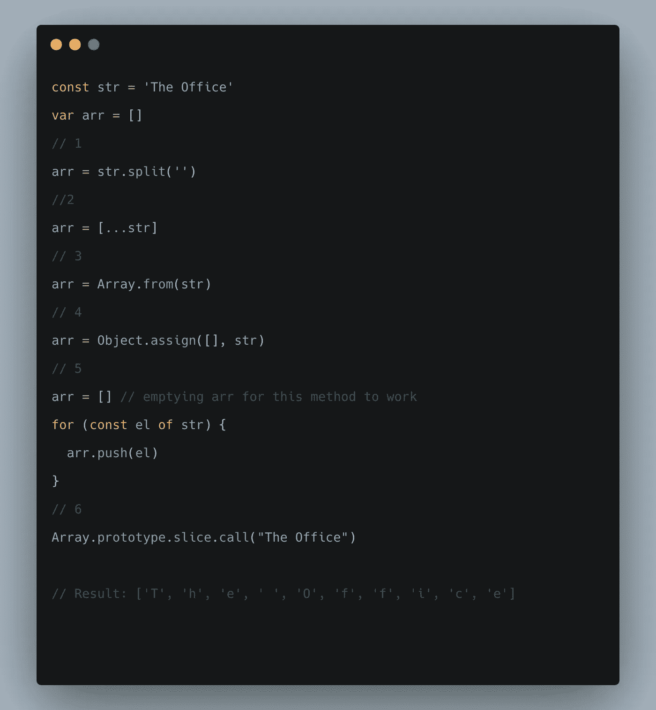

# 在 JavaScript 中将字符串转换为数组的 6 种方法

> 原文：<https://javascript.plainenglish.io/6-ways-to-convert-string-to-array-in-javascript-a57dac463464?source=collection_archive---------1----------------------->

## 探索将字符串转换为数组的 6 种方法及其优缺点。

数组是 JavaScript 中最强大的数据结构。我发现自己通过将字符串转换为数组来解决许多算法。所以我想到了巩固和比较各种方法来做同样的事情。

从字符串到数组的转换总是使用`split()`方法来完成，但是在 ES6 之后，有很多工具可以做同样的事情。让我们逐一查看每种方法，并讨论每种方法的优缺点。

# 1.使用。拆分(“”):

`split()`是一个 string 方法，用一个模式把一个字符串拆分成一个有序列表的数组。这是一种 ES6 方法，也是完成工作最干净的方式。

这种方法的另一个优点是我们可以用字符或空格来分隔字符串。下面是我们如何做到这一点的例子。

它也可以很好地与 Regex 一起工作。在这里可以找到`split()`T5 的完整文档。

这种方法完美地将字符串元素分离到一个数组中，但是有其局限性。

*注意:这种方法对于不常见的 Unicode 字符不太适用。这个方法返回字符的 Unicode，而不是实际的字符，这可能会使我们的工作稍微复杂一点(参考这里的***)但是 MDN 文档已经更新，所以如果我们只包含* `[*u*](https://developer.mozilla.org/en-US/docs/Web/JavaScript/Reference/Global_Objects/RegExp/unicode)` *标志，我们就可以使它与 Unicode 一起工作。更多* [*信息*](https://developer.mozilla.org/en-US/docs/Web/JavaScript/Reference/Global_Objects/String/split#description) *见* [*此处*](https://developer.mozilla.org/en-US/docs/Web/JavaScript/Reference/Global_Objects/String/split#description) *。**

# *2.使用扩展语法([…str])*

*这是 ES2015 的特性，使过渡变得非常容易。*

*这也有助于我们在`split()`的限制在这里被消除。考虑下面的例子。使用这种方法，我们可以很容易地拆分任何字符。*

# *3.使用 Array.from(str):*

*`Array. from()`方法从可迭代或类似数组的对象创建一个新的浅拷贝`Array`实例。*

*这种方法在处理不常用字符时不会引起任何问题。*

# *4.使用 Object.assign([]，str)*

*`Object. assign()`方法将一个或多个*源对象*的所有属性复制到一个*目标对象*。不过，对于这种方法，有两点需要记住。[一个](https://developer.mozilla.org/en-US/docs/Web/JavaScript/Reference/Global_Objects/Object/assign#examples)是`Object. assign()`拷贝属性值叫做深度拷贝(这里参考[这里参考](https://medium.com/@manjuladube/understanding-deep-and-shallow-copy-in-javascript-13438bad941c)知道深度拷贝和浅层拷贝的区别)。在使用这种方法之前，我们必须记住这一点。*

*另一个原因是我们有与`split()`方法相同的麻烦:它不能分离不常见的字符(我们看到的是 Unicode 而不是实际的字符)。*

# *5.使用老方法(对于循环和数组. push())*

*尽管我们有很多选择，但我不得不提到这个老派的方法，我们使用`for loop`和数组方法`push()`来推送字符串的元素。*

*这不是最干净的方法，但是对于那些想远离 JavaScript 不断变化的复杂性的人来说，这绝对值得一提(尽管我更喜欢其他方法)。*

*此外，它还能很好地处理不常见的(Unicode)字符。看下面的例子。*

# *6.使用 array . prototype . slice . call(' string ')*

*参考这个[博客](https://www.stevenchang.tw/blog/2020/05/23/JavaScript-slice-call-function)了解更多关于`.slice.call()`方法的内容。*

*该方法也有与`split()`方法相同的问题，所以在使用时要小心。*

## *参考资料:*

1.  *[https://stack overflow . com/questions/96428/how-do-I-split-a-string-breaking-at-a-special-character](https://stackoverflow.com/questions/96428/how-do-i-split-a-string-breaking-at-a-particular-character)*
2.  *[https://stack overflow . com/questions/4547609/how-to-get-character-array-from-a-string/34717402 # 34717402](https://stackoverflow.com/questions/4547609/how-to-get-character-array-from-a-string/34717402#34717402)*
3.  *[https://www . Steven Chang . tw/blog/2020/05/23/JavaScript-slice-call-function](https://www.stevenchang.tw/blog/2020/05/23/JavaScript-slice-call-function)*
4.  *[MDN 网络文档:拆分](https://developer.mozilla.org/en-US/docs/Web/JavaScript/Reference/Global_Objects/String/split)*
5.  *[MDN 网络文档:传播](https://developer.mozilla.org/en-US/docs/Web/JavaScript/Reference/Operators/Spread_syntax)*
6.  *[MDN Web 文档:Array.from](https://developer.mozilla.org/en-US/docs/Web/JavaScript/Reference/Global_Objects/Array/from)*
7.  *[MDN Web Docs: Object.assign](https://developer.mozilla.org/en-US/docs/Web/JavaScript/Reference/Global_Objects/Object/assign)*
8.  *[https://www . Samantha Ming . com/tidbits/83-4-ways-to-convert-string-to-character-array](https://www.samanthaming.com/tidbits/83-4-ways-to-convert-string-to-character-array)*

## **结论:**

*总而言之，下面是我们做这项工作的方法。*

**

*这是在 JavaScript 中将字符串转换成数组的 6 种方法。如果你使用了其他方法来完成工作，请在下面评论。*

*感谢您的阅读！*

*🙃*

**更多内容看* [***说白了就是***](https://plainenglish.io/) *。报名参加我们的* [***免费周报***](http://newsletter.plainenglish.io/) *。关注我们* [***推特***](https://twitter.com/inPlainEngHQ) ，[***LinkedIn***](https://www.linkedin.com/company/inplainenglish/)*，*[***YouTube***](https://www.youtube.com/channel/UCtipWUghju290NWcn8jhyAw)*，*[*不和*](https://discord.gg/GtDtUAvyhW) *。对增长黑客感兴趣？检查出* [***电路***](https://circuit.ooo/) *。**