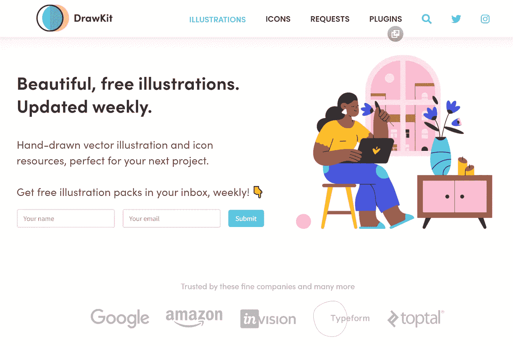
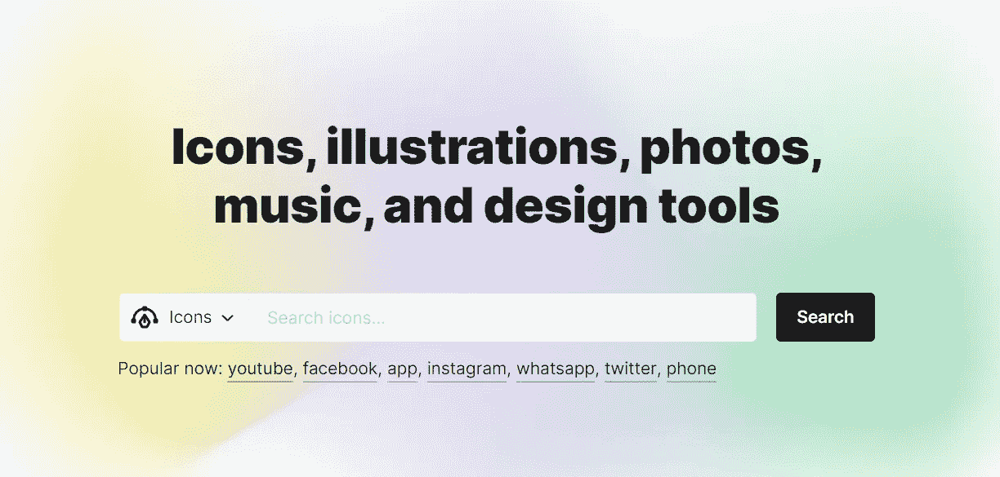
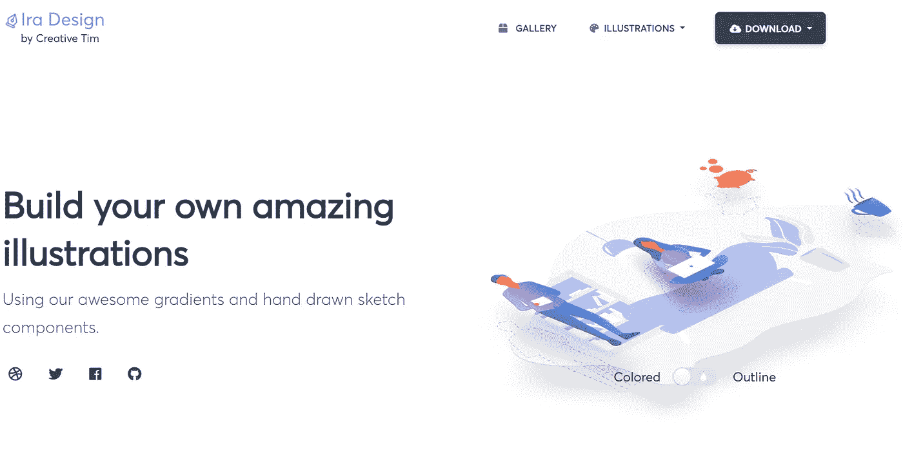
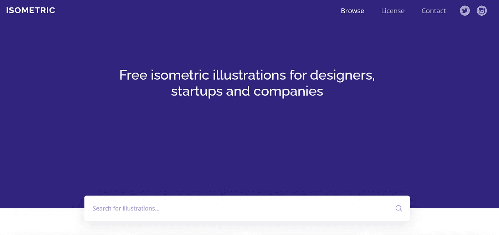
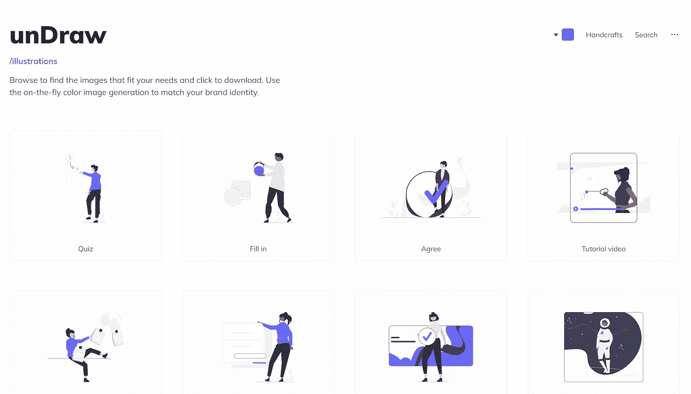
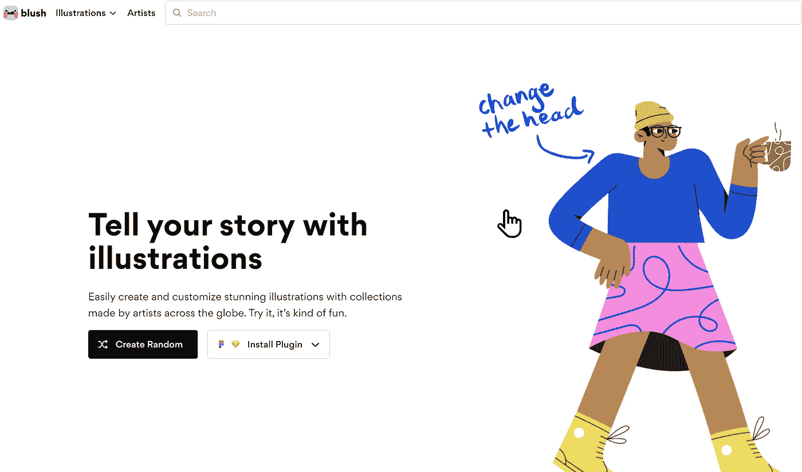
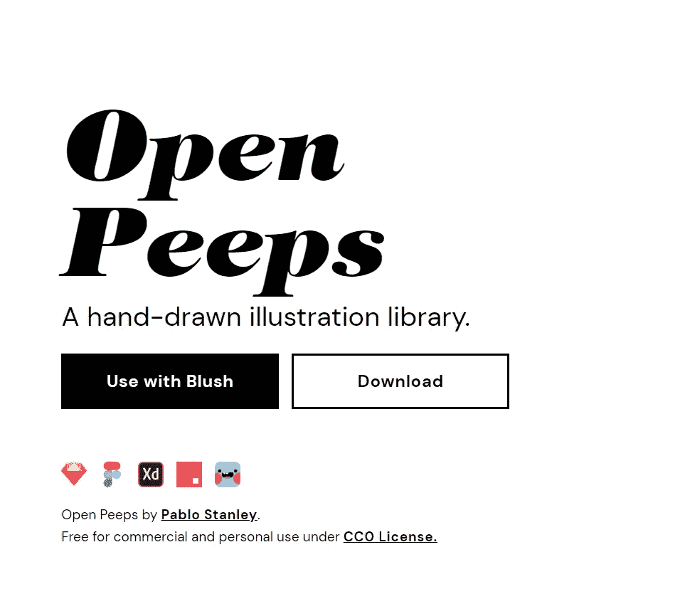

# 7+2 网站获得免费插图每个网络开发人员都应该知道

> 原文：<https://javascript.plainenglish.io/7-2-websites-to-get-free-illustrations-every-web-developer-should-know-6700570fb2ec?source=collection_archive---------15----------------------->

## 大多数程序员不知道这些很酷的网站

[Happy person photo](https://www.freepik.com/photos/happy-person) created by master1305 — [www.freepik.com](http://www.freepik.com)

今天，我有 7 个很棒的网站(+2 个补充)，可以用来为你的网站创建插图，并免费使用它们，没有任何问题。下次你想创建一个标志、一个网站、一句口号或者任何需要插图的东西时，你需要检查一下它们。

# 1.绘图工具包

Screenshot of Drawkit website taken by the author

提供每周更新的免费精美插图。大部分都是手绘的矢量插图和图标资源。

[**前往网站**](https://www.drawkit.io/)

# 2.图标 8

Screenshot of Icons8 website taken by the author

获得免费图标、插图、照片、音乐和设计工具

[**转到网站**](https://www.icons8.com/)

# 3.Ira 设计

Screenshot of Ira Design website taken by the author

使用 Ira 设计建立自己的惊人的插图。您可以使用它们令人惊叹的渐变和手绘草图组件来创建您独特的设计。此外，Ira 设计有一个画廊，你可以在那里找到已经创建的插图，以加强你的项目。

[**前往网站**](https://iradesign.io/)

# 4.等容线

Screenshot of Isometric website taken by the author

为设计师、初创公司和公司获取免费的等距插图。等距包含美丽的免费收集，SVG 等距插图。它们可以在你的网站、应用程序或任何项目中免费使用。

[**前往网站**](https://isometric.online/)

# 5.故事集

Screenshot of Storyset website taken by the author

Storyset 为您的下一个项目提供了精彩的免费定制插图。你可以定制，动画和下载他们的插图，使难以置信的登陆页面，应用程序或演示文稿。此外，还有一个 Figma 插件！

[**去网站**](https://www.storyset.com/)

# 6.拉开

Screenshot of unDraw website taken by the author

Undraw 是一个开源插图的集合，适用于你可以想象和创造的任何想法。这是一个不断更新的设计项目，有美丽的 SVG 图像，你可以完全免费使用，没有归属。

[**转到网站**](https://undraw.co/)

# 7.腮红+ 2 点加成

Screenshot of Blush website taken by the author

腮红可以用来轻松地创建和定制由全球艺术家制作的精美插图。它是完全免费的。您可以简单地从系列中选择一种风格，定制艺术或在自己的设计中使用提供的插图。之后，只需下载你创作的 PNG 或 SVG 文件，并在你的 web 应用程序、演示文稿或任何你想要的项目中使用它。

[**转到网站**](https://www.blush.design/)

# 7.1 开放式 peeps

Screenshot of Openpeeps website taken by the author

Openpeeps 是一个库，它的工作方式就像是由矢量手臂、腿和情感组成的积木。您可以混合这些元素来创建不同的 Peeps。你可以将服装和发型结合起来，用不同的面部表情来增添魅力和改变情绪。

[**转到网站**](https://www.openpeeps.com/)

# 7.2 人类

Screenshot of humaaans website taken by the author

Humaans 为腮红提供了不同的人体，可以在那里使用。你可以随心所欲地旋转和放置人体内的元素。他们就像是用肉和矢量做成的乐高积木。

[**前往网站**](https://www.humaaans.com/)

# 结束语

**感谢阅读 t** 他的文章！我希望你能找到一些有用的东西，并能在你的下一个项目中使用这些网站。

请随意分享您的宝贵意见，如果您心中有任何有用的网站，请不要忘记在社区评论中分享。此外，share❤️这篇文章与开发商的朋友，以帮助他们创造插图。

**快乐编码！**

*✍️写的*

***Paul Knulst*** *丈夫，两个孩子的父亲，极客，终身学习者，科技爱好者&软件工程师*

***问好*** *🙌***:*[GitHub](https://www.github.com/paulknulst)，[个人网站](https://www.paulsblog.dev)，[， *Twitter*](https://www.twitter.com/paulknulst) *，*[*LinkedIn*](https://www.linkedin.com/in/paulknulst/)*

**更多内容请看*[***plain English . io***](https://plainenglish.io/)*。报名参加我们的* [***免费周报***](http://newsletter.plainenglish.io/) *。关注我们关于*[***Twitter***](https://twitter.com/inPlainEngHQ)*和**[***LinkedIn***](https://www.linkedin.com/company/inplainenglish/)*。加入我们的* [***社区***](https://discord.gg/GtDtUAvyhW) *。***