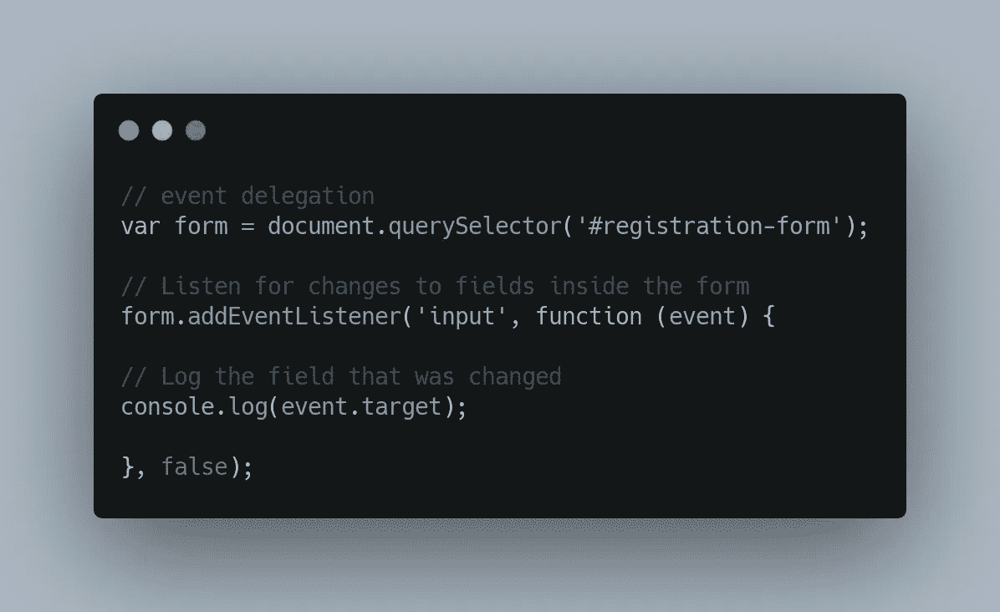
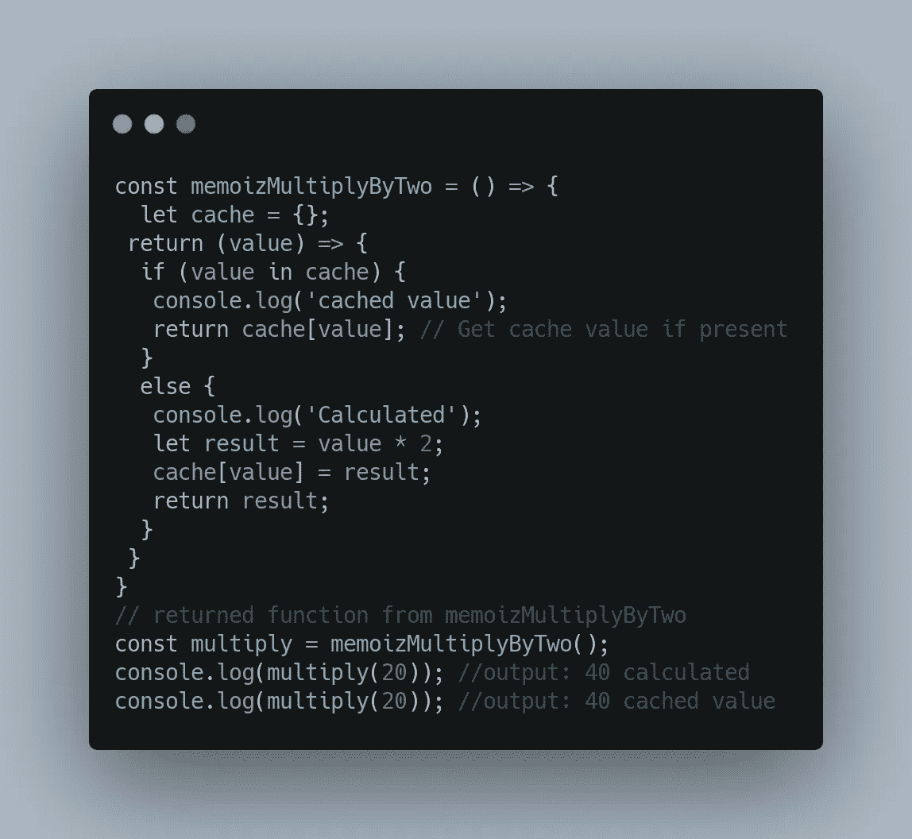
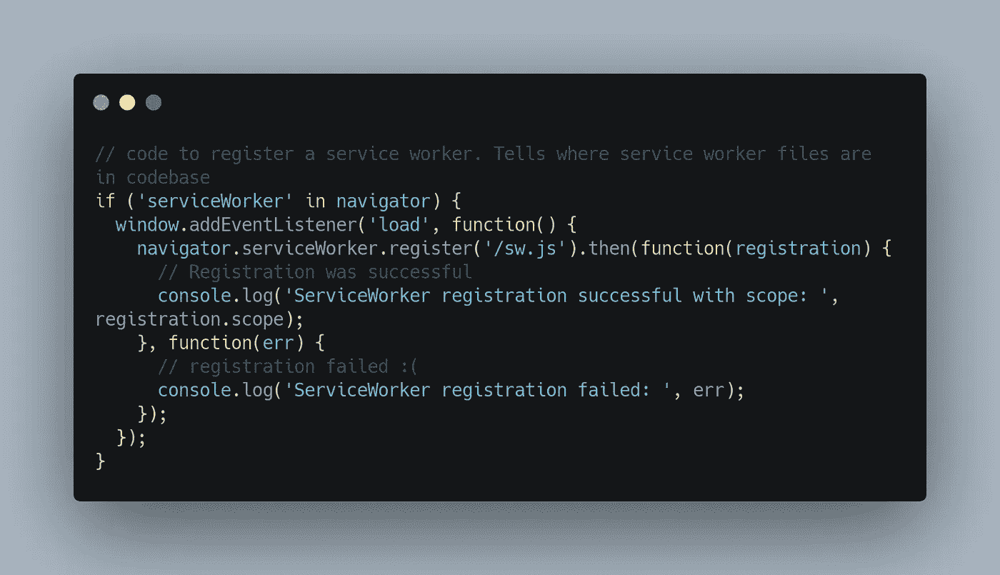
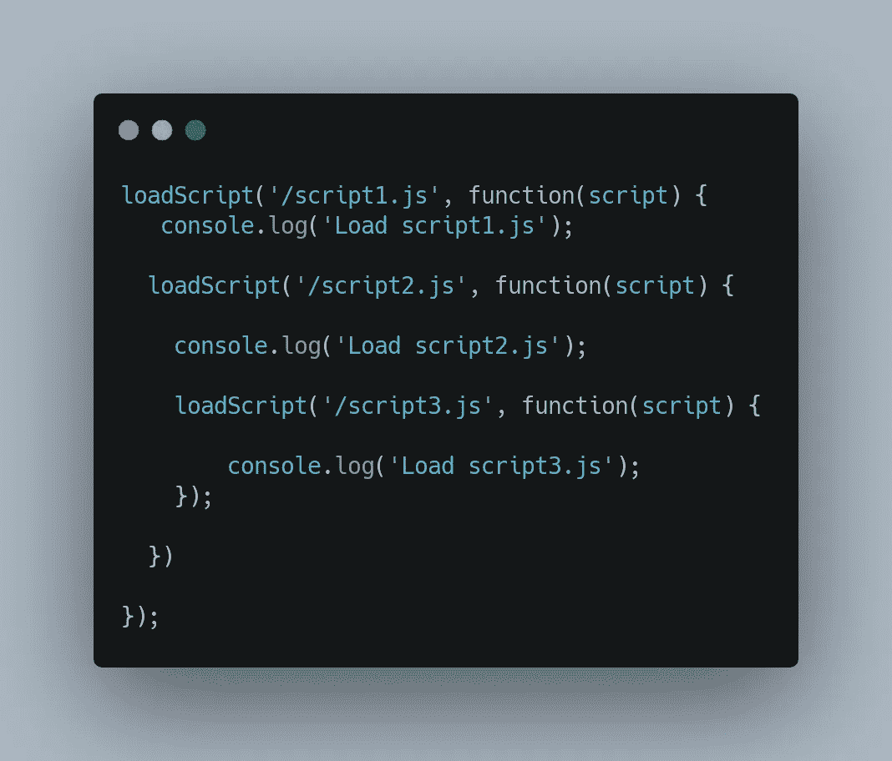
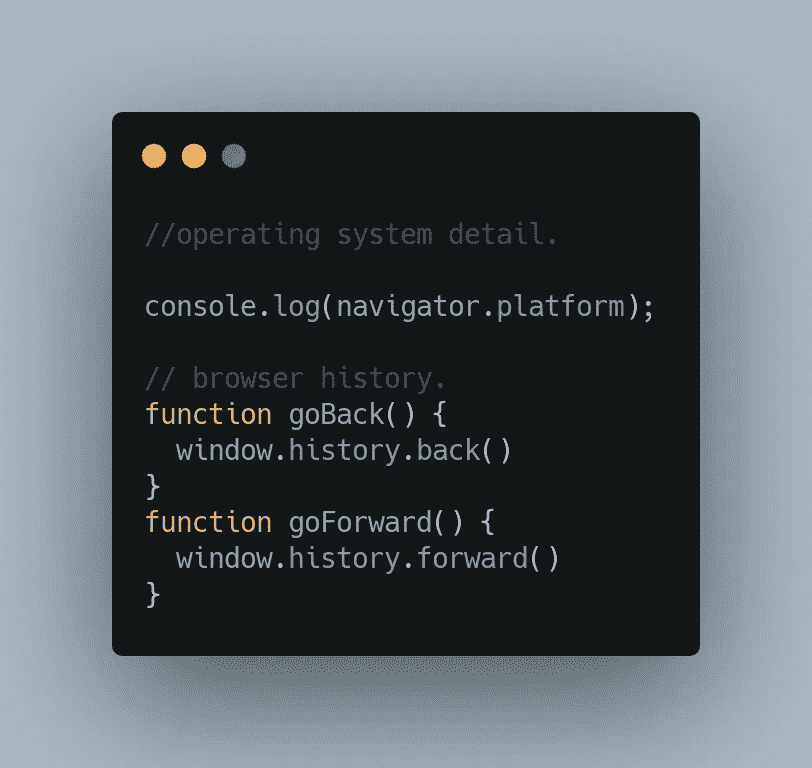
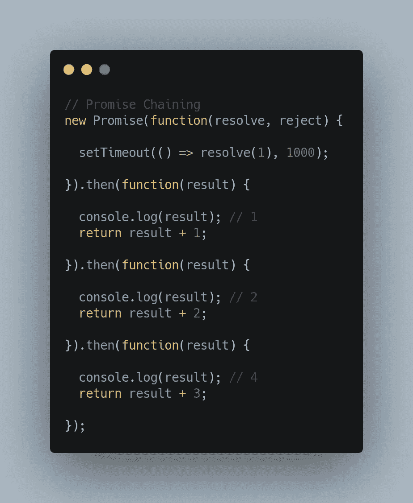

# 每个开发人员现在都应该知道的 7 种高级 JavaScript 技术(包括代码)

> 原文：<https://javascript.plainenglish.io/7-advanced-javascript-techniques-every-developer-should-know-by-now-including-code-4572d5d7a060?source=collection_archive---------6----------------------->

## 用这篇文章测试你的 JavaScript 知识。

Photo by [JESHOOTS.COM](https://unsplash.com/@jeshoots?utm_source=unsplash&utm_medium=referral&utm_content=creditCopyText) on [Unsplash](https://unsplash.com/s/photos/productive?utm_source=unsplash&utm_medium=referral&utm_content=creditCopyText)

技术的问题在于它每天都在发展。就像技术一样，每种编程语言也在以自己的方式走向成熟。核心开发人员正在开发新的很酷的功能，以帮助其他使用它们的开发人员。JavaScript 就是其中之一。

我最近读了一篇文章，说 JavaScript 是 2021 年最受欢迎的编程语言。所以我决定写这篇文章，因为 JavaScript 开发人员在日常工作中需要了解大量的新技术。

我们将在本帖中讨论以下高级 JavaScript 技术。它们如下:

1.  服务器发送的事件
2.  事件委托
3.  记忆化
4.  服务行业人员
5.  回调中的回调
6.  访问浏览器历史记录和操作系统详细信息
7.  承诺链

别再浪费时间了，让我们开始吧。

# 1.服务器发送的事件

服务器发送的事件(SSE)是一种服务器推送技术，使浏览器能够通过 HTTP 连接接收服务器的自动更新，而无需求助于轮询。

这些是单向通信通道，事件仅从服务器流向客户端。我们可以在脸书/Twitter 更新、股票价格更新、新闻提要等方面看到这种技术的应用。

# 2.事件委托

事件委托是监听父元素中所有事件的有效技术。在这里，您将一个父元素委托为其内部所有事件的侦听器。

例如，如果您想检测特定表单内的字段更改，可以使用事件委托技术:

event delegation

# 3.记忆化

记忆化是一种编程技术，通过缓存先前计算的结果来提高代码的性能。

每当我们第一次调用一个内存化的函数时，我们使用它的参数来索引缓存。如果数据存在于缓存中，我们直接发送输出，而不执行编程逻辑。

否则，我们执行编程逻辑，生成结果，并将其添加到缓存中。我们举一个用记忆化增加功能的例子。

# 4.服务行业人员

服务工作者是在后台运行的 JavaScript 文件，独立于网页，并提供不需要网页或用户交互的功能。

开发人员使用它来创建一个渐进式 web 应用程序，方法是构建一个服务工作者文件来为他们的用户创建离线 web 体验、后台同步、处理网络请求和管理缓存响应。

Register a Service Worker

# 5.回调中的回调

您可以将一个回调函数嵌套在另一个回调函数中，以便一个接一个地顺序执行操作。JavaScript 开发人员有时使用这种技术来加载脚本和发送连续的网络请求。

callback in a callback

# 6.访问浏览器历史记录和操作系统详细信息

用户可以使用窗口对象来访问操作系统和浏览器历史详细信息。

这是一种非常流行的检测用户从手机或桌面网站访问内容的方法。你可以用它创建一个类似于 iPhone 的 Twitter 或者 web 的 Twitter，或者 Android 的 Twitter 的功能。

Navigator 对象包含有关访问者的浏览器操作系统详细信息的信息。平台属性下提供了一些操作系统属性。

历史对象包含浏览器的历史。您可以使用 back 和 next 方法在浏览器历史记录中加载上一个和下一个 URL。

accessing OS and history

# 7.承诺链

承诺链是一种依次执行一系列异步任务的有效方式。这是一种更简洁的代码编写方式。根据大多数开发者的说法，它比回调地狱要好 10 倍。

让我们以计算最终结果的承诺链为例。

promise chaining

上面的代码基本上是不言自明的。我们将每个的结果发送到。then()函数获得期望的结果。

**感谢您阅读帖子。我希望你喜欢它。**

**你知道上面的 JavaScript 技术吗？还是你觉得它对初学者非常友好？**

**请在评论区告诉我。我很想知道你对此的看法。**

*更多内容看* [***说白了就是 io***](http://plainenglish.io/) *。报名参加我们的* [***免费周报***](http://newsletter.plainenglish.io/) *。在我们的* [***社区获得独家访问写作机会和建议***](https://discord.gg/GtDtUAvyhW) *。*