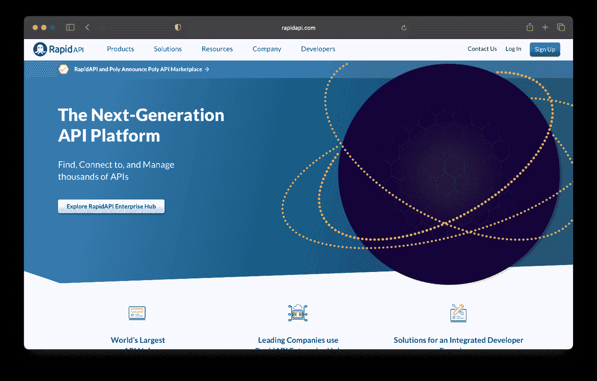

# 7 API 市场，让您的生活更轻松

> 原文：<https://javascript.plainenglish.io/7-api-marketplace-that-will-make-your-life-easier-736edc879c81?source=collection_archive---------4----------------------->

## 无论你是在寻找一个特定的 API，还是只想浏览可用的 API，这些市场都有你需要的。

如果你是一名开发人员，你可能会花很多时间使用[API](https://en.wikipedia.org/wiki/API)。事实上，您可能每天都在使用多个 API。虽然有很多很好的 API 市场，但是找到合适的市场是一个挑战。

[Midjourney](https://www.midjourney.com/)

为了帮助你，我列出了 7 个 API 市场，我认为它们会让你的生活更轻松。无论你是在寻找一个特定的 API，还是只想浏览可用的 API，这些市场都有你需要的。

# [养蜂人](https://apilayer.com/)

APILayer 是一个 API 的市场，它使得软件开发更加容易。由于 APILayer 上有如此多不同的 API，您可以使用这些 API 来构建应用程序，以帮助解决您业务中的特定问题。

您是否希望在您的应用程序或网站中添加一些很酷的功能，如为银行目的验证 BIN 号，或兑换货币？

那么你需要可靠的、可伸缩的 API！APILayer 是一个基于 web 的平台，允许开发人员和企业轻松找到满足其需求的完美 API。

# [NoCode API 市场](https://nocodeapi.com/marketplace/)

您是否发现自己在花时间连接各种第三方应用程序？为了访问各种来源的数据，您是否花费了无数的时间编写代码？

NoCodeAPI 是一项服务，它允许您连接到各种第三方应用程序，而无需编码，每周为您节省时间！

# RapidAPI

RapidAPI 是一个为开发者和他们的需求而构建的平台。你所需要做的就是去网站输入你想要的，它会显示你在那个类别下有多少 API，每个 API 有多少活跃用户，有多少开发者在使用每个 API，以及他们的评级。

# [gravite io](https://www.gravitee.io/)

如果您正在寻找开发和部署 API 的解决方案，那么 Graviteeio 就是不二之选，它是一个高性能的 API 平台，允许您快速创建和管理 API(无需编码),并支持实时分析通知。

使用 Gravitee，您可以通过简单的拖放界面立即设计和部署强大的 API，同时保持对数据的完全控制。

# 塞利戈

Celigo 是一款业务流程自动化工具，帮助您端到端地自动化和优化您的业务流程。无论您是正在寻找提高效率、改进生产力和降低成本的方法的 IT 经理还是业务线经理；或者首席技术官探索从预构建任务到完全定制的应用程序的自动化解决方案，Celigo 都能为您提供解决方案。

# 扎皮尔

您是希望实现工作自动化的个体工作者还是小企业主？或者，您可能是一名 IT 专业人员，正在努力为您的组织简化工作。 [Zapier](https://zapier.com/) 是一款软件，可以帮助你将用于工作的应用程序连接在一起，这样当一个应用程序做某件事情时，另一个应用程序会自动做其他事情作为回应。

# 邮递员 API 市场

[Postman API Marketplace](https://www.postman.com/explore) 是一个 API 和工作空间的开放集合，开发者可以快速地构建原型、测试并与其他开发者社区共享他们的 API。

您还可以使用 Postman 生成模拟请求，实时监控请求，并在您的生产环境中进行测试——所有这些都在 Postman 的免费版本中。

*更多内容看* [***说白了就是 io***](https://plainenglish.io/) *。报名参加我们的* [***免费周报***](http://newsletter.plainenglish.io/) *。关注我们关于* [***推特***](https://twitter.com/inPlainEngHQ) ， [***领英***](https://www.linkedin.com/company/inplainenglish/) *，*[***YouTube***](https://www.youtube.com/channel/UCtipWUghju290NWcn8jhyAw)*[***不和***](https://discord.gg/GtDtUAvyhW) *。对增长黑客感兴趣？检查* [***电路***](https://circuit.ooo/) *。**