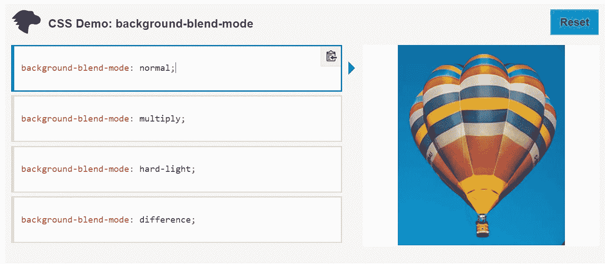
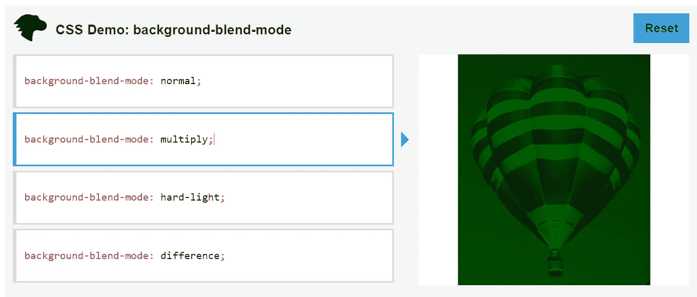
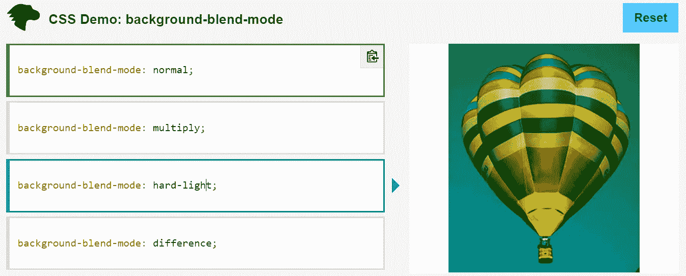
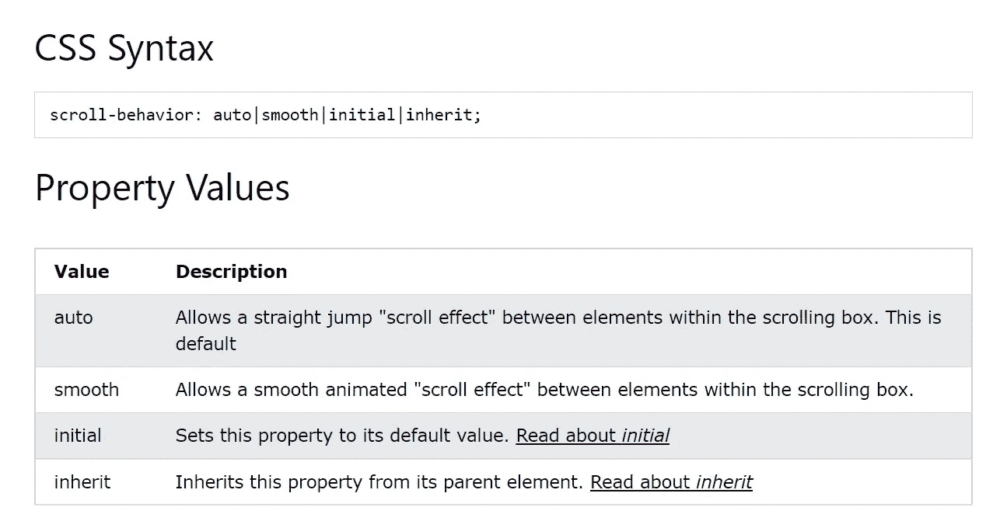
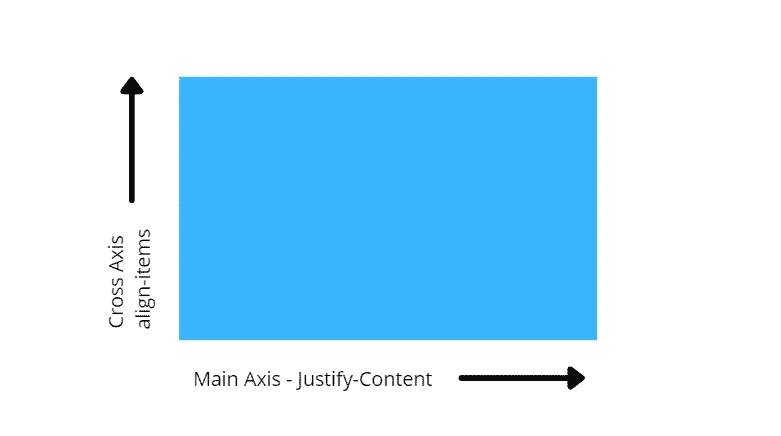

# 每个 Web 开发人员都应该知道的 7 个很棒的 CSS 技巧

> 原文：<https://javascript.plainenglish.io/7-awesome-css-hacks-that-every-web-developer-should-know-7f3fd5c3f32b?source=collection_archive---------1----------------------->

## 当你建立你的网站时，学习并应用它。


Photo by [Lala Azizli](https://unsplash.com/@lazizli?utm_source=medium&utm_medium=referral) on [Unsplash](https://unsplash.com?utm_source=medium&utm_medium=referral)

当我开发一个网站时，我几乎总是不得不使用某些 CSS 技巧。使用混合模式、CSS 渐变或裁剪路径技术创建一个粘性导航条。它们通常用于改善网站的外观。

为此，我收集了一些 CSS 代码。

我想，为什么不告诉你这一切呢？

那我们开始吧。

1.  **粘性导航条**

我们经常需要制作一个粘性的导航条，你知道吗，只用两行代码就可以做到。

```
{
 position: sticky,
 top: 0
}
```

是的，就是它，你有一个粘性的导航条。

**2。混合模式**

你知道你可以把图像和背景色混合吗？感谢 CSS 混合模式。

```
body{
 background-image: url(photo.png);
 background-color: #5902EC;
 background-blend-mode: lighten;
}
```

我们举一个来自 [MDN](https://developer.mozilla.org/en-US/docs/Web/CSS/background-blend-mode) 的例子。



这里，当我们添加`background-blend-mode: normal`时，图像的输出如上所示。



类似地，对于`background-blend-mode: multiply`,图像输出的变化如上所示。



正如你看到的图像的颜色变化时`background-blend-mode: hard-light`。

嗯，还有更多这样的背景混合模式值，如

*   背景-混合-模式:**屏幕**
*   背景混合模式:**叠加**
*   背景混合模式:**变暗**
*   背景混合模式:**变亮**
*   背景混合模式:**柔光**
*   背景-混合-模式:**排除**

还有[很多更多](https://developer.mozilla.org/en-US/docs/Web/CSS/blend-mode)。您还可以了解到 [mix-blend-mode](https://developer.mozilla.org/en-US/docs/Web/CSS/mix-blend-mode) 。

**3。剪辑路径**

clip-path CSS 属性定义一个剪辑区域，该区域决定显示元素的哪些部分。区域内的部分是可见的，而区域外的部分是隐藏的。

```
body{
 clip-path: ellipse(130px 140px at 10% 20%);
}
```

你也可以参考一些网站，比如 [Bennettfeely](https://bennettfeely.com/clippy/) 、 [CSSPortal](https://www.cssportal.com/css-clip-path-generator/) 来生成剪辑路径。

**4。滚动行为**

有更大的机会，更多的人会访问和喜欢一个拥有最好的用户设计和用户体验的网站。

因此，您可以使用滚动行为。

```
html{
 scroll-behavior: smooth;
}
```

它给网站增加了平滑滚动的效果。



src: [w3schools](https://www.w3schools.com/cssref/pr_scroll-behavior.asp)

**5。CSS 渐变**

CSS 中的渐变允许您在两种或多种颜色之间创建无缝过渡。

通常有三种类型的梯度。

*   **线性渐变**
*   **径向梯度**
*   **圆锥梯度**

这是一个例子。

```
body{
 background-color: #8EC5FC;
 background-image: linear-gradient(62deg, #8EC5FC 0%, #E0C3FC 100%);
}
```

**6。自定义光标**

我在学习网络编程的时候，看到了一些利用自定义光标制作的网站。老实说，我不知道什么是自定义光标。但是过了一段时间，我了解了自定义光标。我现在在我所有客户的网站上使用它。

```
body{  
 cursor: url("path-to-image.png"), auto;
}
```

**7。将任何东西居中**

在我的一次面试中，面试官让我将一个 div 居中。这是我知道的事情。

即使在设计网站时，你也几乎总是需要将一个 div 居中。如果你不知道，请相信我说的简单。

仅仅三行代码就能帮助你完成工作。

```
body{
 display: flex;
 align-item: center;
 justify-content: center;
}
```



还有，当你看到你的项目(内容)不在一行的时候。您可以简单地使用`display: flex`属性。

**让我们总结一下**

觉得有用？如果你喜欢阅读这样的故事，并想帮助我成为一名作家，那么请跟我来。每月花费 5 美元，你可以无限制地访问媒体内容。如果你通过我的链接注册，我会得到一点佣金。

就这些——谢谢。

[](/5-different-ways-you-can-make-money-as-a-developer-while-you-sleep-ad54715b6ad7) [## 作为一名开发者，你可以在睡觉的时候用 5 种不同的方式赚钱

### 不要指望博客，媒体，YouTube

javascript.plainenglish.io](/5-different-ways-you-can-make-money-as-a-developer-while-you-sleep-ad54715b6ad7) [](/how-to-make-an-extra-500-every-month-with-this-easy-side-hustle-bac6fd48cdfe) [## 如何用这种简单的方法每月多赚 500 美元

### 没有废话，请不要期待博客，YouTube，自由职业者，或媒体

javascript.plainenglish.io](/how-to-make-an-extra-500-every-month-with-this-easy-side-hustle-bac6fd48cdfe) 

*更多内容请看*[***plain English . io***](http://plainenglish.io/)*。报名参加我们的* [***免费每周简讯***](http://newsletter.plainenglish.io/) *。在我们的* [***社区***](https://discord.gg/GtDtUAvyhW) *获得独家获得写作机会和建议。*