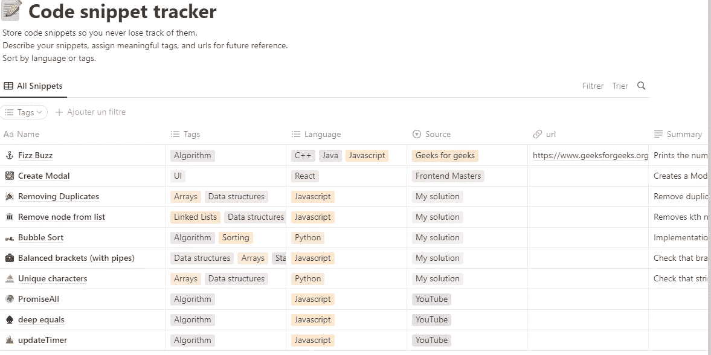
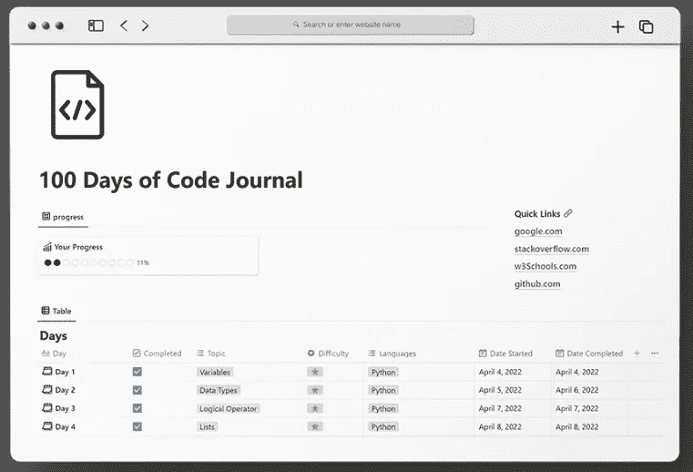
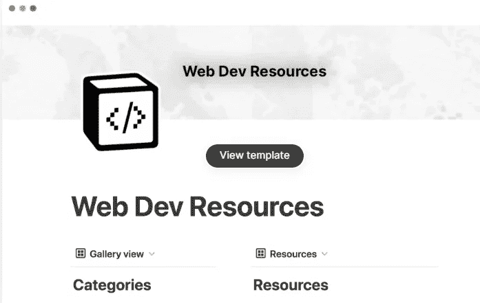
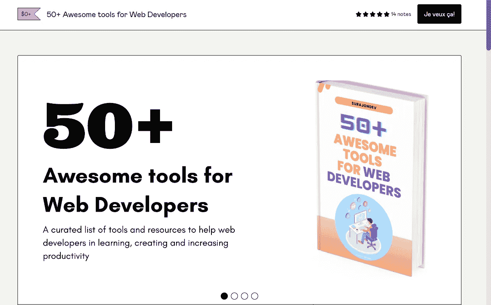
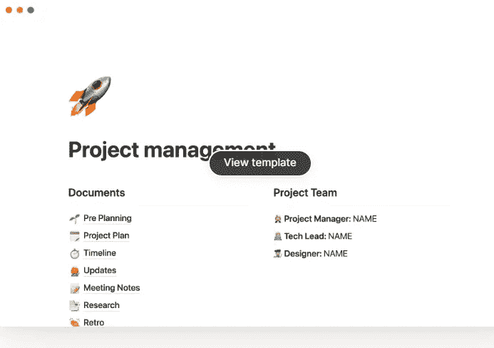
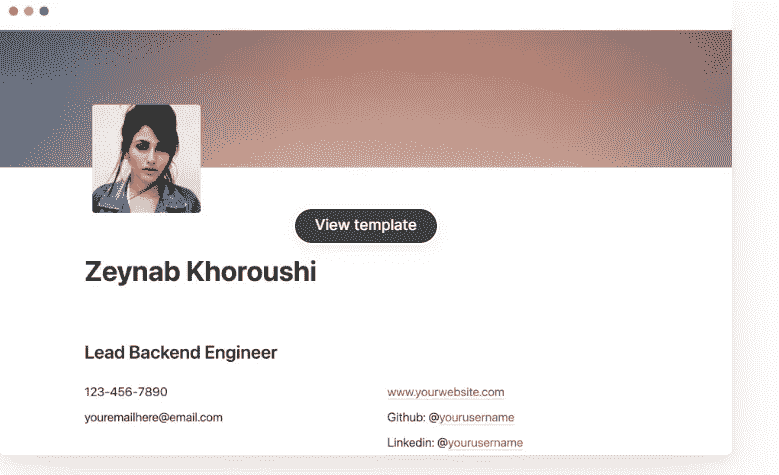
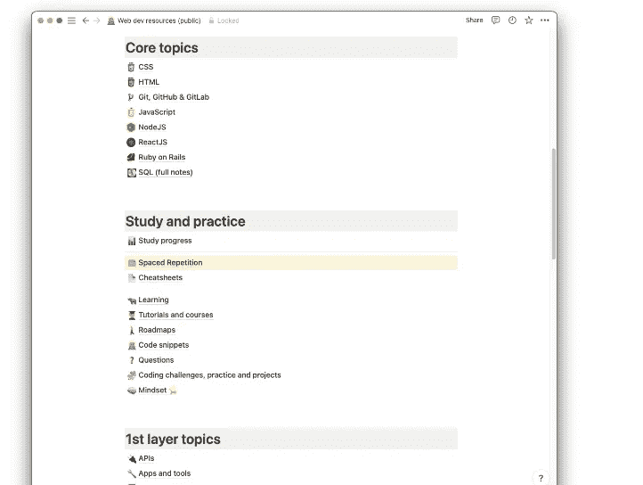

# 2023 年每个 Web 开发人员都应该使用的 7 个很棒的概念模板

> 原文：<https://javascript.plainenglish.io/7-awesome-notion-templates-every-web-developer-should-use-in-2023-634e9d5982a8?source=collection_archive---------1----------------------->

## 2023 年网站开发者有用的免费概念模板列表。

Photo by [Louise Viallesoubranne](https://unsplash.com/@louisemink?utm_source=medium&utm_medium=referral) on [Unsplash](https://unsplash.com?utm_source=medium&utm_medium=referral)

毫无疑问，观念是当今最好的生产力工具之一。这个工具越来越受欢迎，互联网上有数百万用户在使用它。

概念平台非常有用，它在生产力、项目管理和组织事物方面有很多好处。

concept 的主要好处之一是，它允许您创建定制的数据库和模板，这对于跟踪项目进度、管理任务和组织资源非常有用。

它还具有一系列格式和组织功能，例如创建嵌套页面、添加标签和注释以及创建待办事项列表的能力。

作为一名 web 开发人员，如果您想要管理您的工作流和组织您的项目，那么 concept 可能会非常有用。除此之外，它还会帮助你变得更有效率。

观念的另一个好处是你不必从头开始组织一切。该工具有许多免费的模板，您可以开始使用。您还可以轻松复制其他用户制作的模板。

这就是为什么在这篇文章中，我将与你分享一个免费的概念模板列表，每个 web 开发者都应该使用。所以让我们开始吧。

# 1.代码片段跟踪器

代码片段跟踪器是一个非常有用的概念模板，可以帮助你轻松跟踪项目中的任何代码片段。

Image captured by the author from Notion.

此模板允许您将所有代码片段组织在一个地方，以便您可以在需要时随时使用它们。

您还可以通过命名、添加标记或通过语言和源代码对代码片段进行排序。

# 2.100 天代码日志

如果你正在考虑开始一个为期 100 天的编码挑战，[这个概念模板](https://tonydavid.gumroad.com/l/100-days-of-code-journal)会对你非常有用。这将有助于你在挑战时轻松跟踪和记录你的进展。

The image is captured by the author from Gumroad.

该模板有一些很酷的有益功能，如进度条来查看您的进度，已经为您创建的 100 天页面，以及一个您可以添加资源快速链接的地方。

# 3.Web 开发资源

如果你正在寻找一大堆你可以使用的网络开发资源，这个[概念模板](https://www.notion.so/templates/web-development-resources)非常有用。它有一个不同类别的大型资源数据库，可以帮助您提高到 web 开发人员的下一个级别。

Image captured by the author from Notion.

这个模板的好处是，您还可以搜索资源并按类别过滤它们。

# 4.50 多种面向 web 开发人员的出色工具

这个有用的[模板](https://surajondev.gumroad.com/l/50-tools-web-developers)为每一个 web 开发者整理了一个 50+牛逼工具的大列表。它包含一个工具和资源列表，供 web 开发人员提高他们的知识和生产力。

The image is captured by the author from Gumroad.

# 5.项目管理模板

这个[概念模板](https://www.notion.so/templates/project-management)提供了一个可定制的系统来管理你的 web 开发项目，包括任务、截止日期和团队交流。

The picture was captured by the author from Notion.

因此，作为开发人员，该模板使您可以轻松地开始规划您的下一个项目。

# 6.简单简历

[简单简历](https://www.notion.so/templates/simple-resume)是另一个很棒的概念模板，让你在概念中轻松创建一个漂亮的简历网站。

Image captured by the author from Notion.

作为一名网络开发人员，如果你在找工作，拥有一份在线简历是非常重要的。所以这个模板让你更容易写出漂亮的开发者简历。

# 7.Web 开发常识书

web 开发常识书概念模板包含了许多有用的 web 开发内容，超过 400 页。

The image is captured by the author from Mailchi.

该模板附带了一个有用的工具和资源列表，可以帮助您提高知识水平，成为更好的开发人员。内容包括:

*   200 多个 HTML 和 CSS 问题。
*   Web 开发备忘单。
*   免费课程和教程的快速链接。
*   JavaScript、React、SQL、Ruby on Rails 等知识。
*   编码挑战等等。

# 结论

正如你在上面所看到的，这是一些很棒的概念模板的快速列表，作为一名 web 开发人员，你可以从中受益。因此，这些模板是节省时间和简化工作流程的宝贵资源。

*感谢您阅读本文。此外，如果您发现我的内容有用，并且您不是媒体会员，您可以在此处获取您的媒体会员资格***(媒体推荐链接)以无限制地访问媒体上的所有文章，并支持我们作为作者。**

* [## 通过我的推荐链接加入 Medium-Mehdi Aoussiad

### 阅读 Mehdi Aoussiad(以及媒体上成千上万的其他作家)的每一个故事。您的会员费直接支持…

mehdiouss.medium.com](https://mehdiouss.medium.com/membership) 

**延伸阅读:**

 [## 你应该在 2023 年使用的 10 个有用的 CSS 生成器工具

### 优秀的 CSS 工具列表，帮助您提高 web 开发人员的工作效率。

javascript.plainenglish.io](/10-useful-css-generator-tools-that-you-should-use-in-2023-14fde4cd225d)  [## 每个 Web 开发人员都应该知道的 7 个有用的 JavaScript 备忘单

### 一个伟大的 JavaScript 清单，以提高您的生产力。

javascript.plainenglish.io](/7-useful-javascript-cheatsheets-every-web-developer-should-know-9f67924d83f1) 

## 更多内容请访问 [PlainEnglish.io](https://plainenglish.io/) 。

*报名参加我们的* [***免费周报***](http://newsletter.plainenglish.io/) *。关注我们关于*[***Twitter***](https://twitter.com/inPlainEngHQ)，[***LinkedIn***](https://www.linkedin.com/company/inplainenglish/)***，***[*YouTube****，以及***](https://www.youtube.com/channel/UCtipWUghju290NWcn8jhyAw)*[***不和***](https://discord.gg/GtDtUAvyhW) *

## *希望扩大你的科技创业公司的知名度和采用率吗？检查[电路](https://circuit.ooo/?utm=publication-post-cta)。**