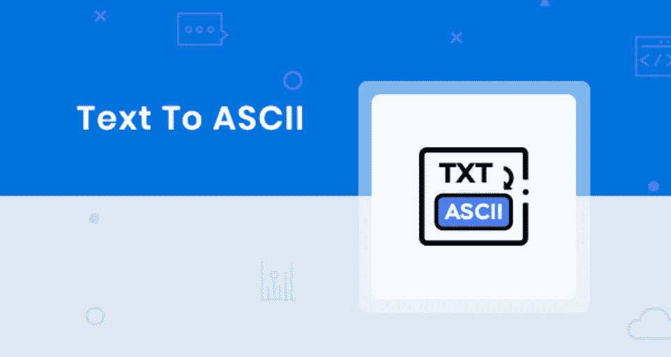
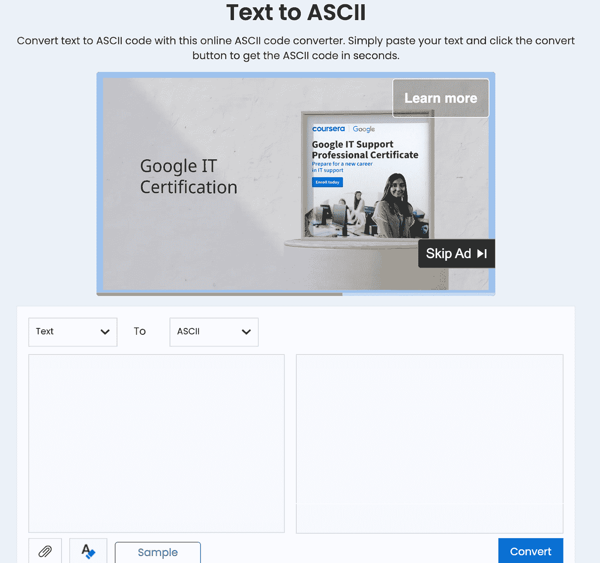
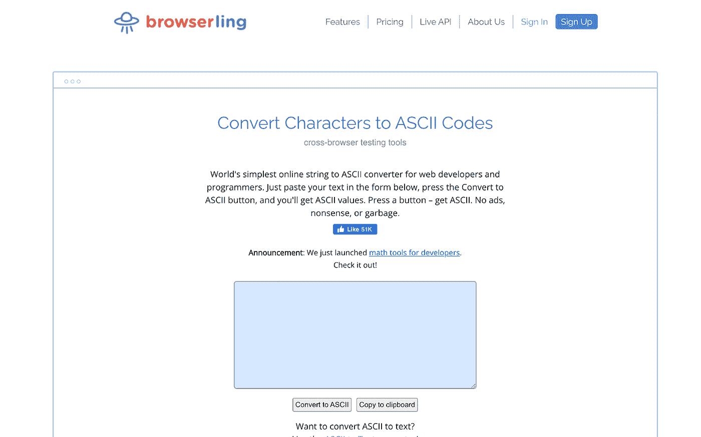
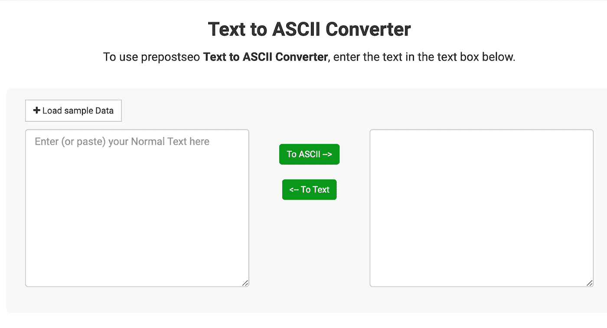
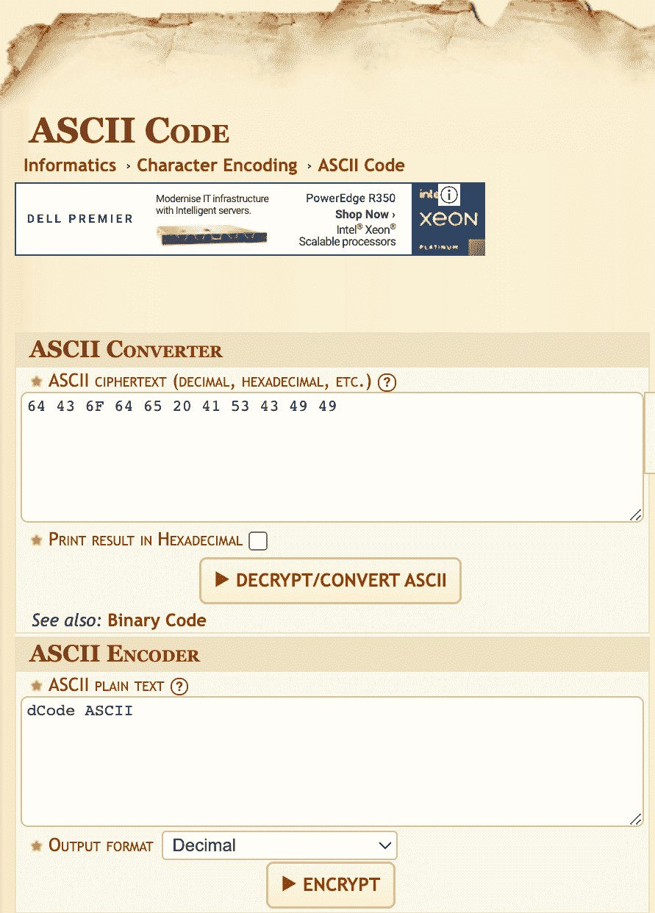
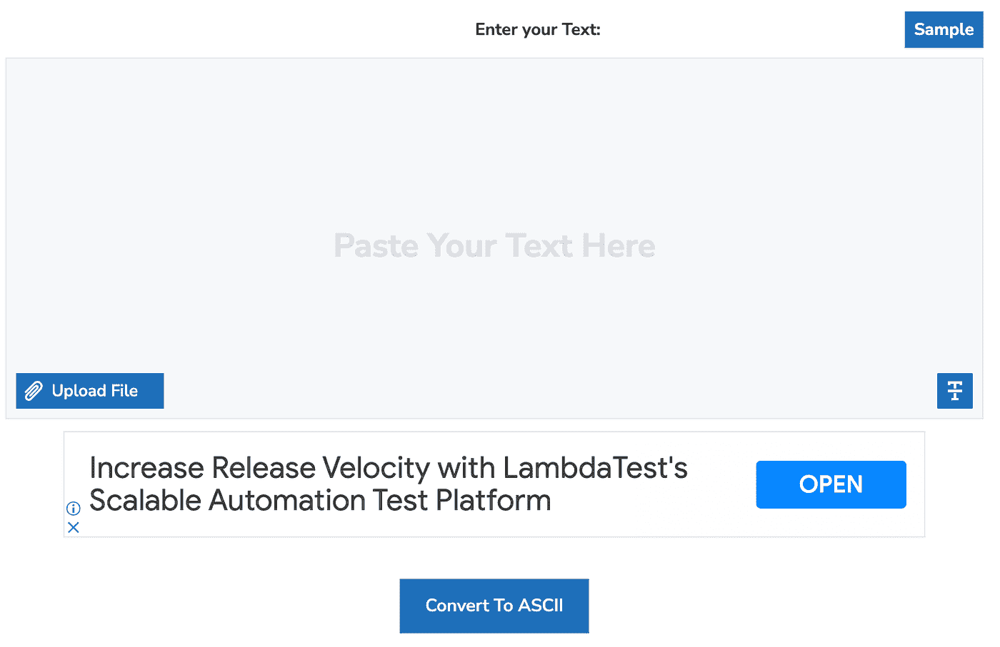
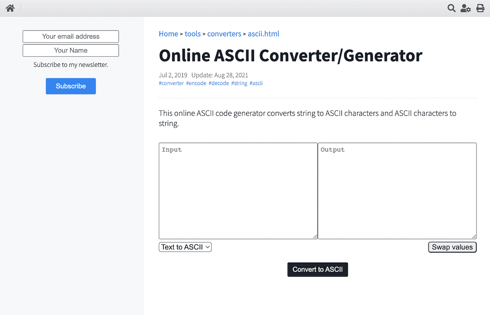
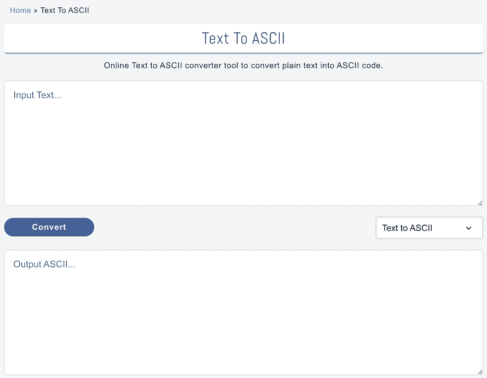

# 2023 年使用的 7 个最佳自由文本到 ASCII 代码转换器工具

> 原文：<https://javascript.plainenglish.io/7-best-free-text-to-ascii-code-converter-tools-to-use-in-2023-3c22645a14ce?source=collection_archive---------8----------------------->

ASCII 是美国信息交换标准代码的首字母缩写。这是计算机之间电子通信的标准字符编码格式。它用 256 个插槽中的 8 位数字代码在计算机中分配字母、数字、字符和其他符号。

在 [ASCII](https://en.wikipedia.org/wiki/ASCII) 出现之前，不同的计算机模型之间相互通信是相当具有挑战性的。原因是以前每种不同的计算机模型都有自己的表示数字、字符和字母的方式。

然而，ASCII 码的出现简化了不同型号的计算机之间的通信。

普通的、人类可读的文本被转换成 ASCII 码，因为计算机和其他智能设备只能理解和解释 ASCII 值。然而，对人类来说，记住 ASCII 值是一项艰巨且极具挑战性的工作。这就是文本到 ASCII 代码转换器工具发挥作用的地方。

使用转换器工具，您可以在几秒钟内获得任何字母、字符或符号的 ASCII 值。因此，我想在本文中列出一些最好的文本到 ASCII 代码转换工具。

# 你应该知道的 7 个最好的文本到 ASCII 码转换工具

## [**杜普利棋手**](https://www.duplichecker.com/text-to-ascii.php#:~:text=It%20is%20a%20coding%20system,has%20its%20own%20ASCII%20code.)

这是一个免费的在线 ASCII 代码转换器，具有简单而优雅的用户界面。简单地复制你想要转换的文本，粘贴它，然后点击**转换**按钮。您将立即获得文本的 ASCII 转换。

此外，您可以从您的计算机导入文件，并将其转换为 ASCII。此工具允许您将 ASCII 转换下载到文本文档中。

没有复杂的操作，Dupli Checker 的文本到 ASCII 码转换器产生 100%准确的结果。无论你使用的是 Android 还是 iOS 手机还是 Windows、macOS、Linux 系统，你都可以在任何地方使用这个工具。最好的部分是，你不需要创建一个帐户来使用这个工具。

## B [**rowserling**](https://www.browserling.com/tools/text-to-ascii)

这是一个在线的和最简单的文本到 ASCII 码的转换器，特别为程序员和开发者设计。复制要转换的文本，并将其粘贴到蓝色框中，如上图所示。点击**转换成 ASCII 码**，很快就能得到结果。

还有一个选项，**复制到剪贴板**，如你所见。点击它就可以复制整个结果，你可以把它粘贴到任何你想粘贴的地方。它还为您提供了 ASCII 到文本的转换器。这个转换器在执行[跨浏览器测试](https://www.browserstack.com/cross-browser-testing)时派上了用场。

## [**前置**](https://www.prepostseo.com/tool/text-to-ascii)

这是另一个简单免费的文本到 ASCII 码转换器。有了一个易于使用的用户界面，这个工具可以让你在任何时候都可以将你的文本转换成 ASCII，反之亦然。复制您的文本，将其粘贴到提供的字段中，并单击所需的选项— **到 ASCII** 或**文本**。

这个免费的在线转换器工具让你可以想用多少次就用多少次，而不用花一分钱。这是一个有效的工具，用户可以完全依赖结果的准确性。

## [**dCode**](https://www.dcode.fr/ascii-code)

dCode 也是一个免费的在线文本到 ASCII 码转换工具。它带有一个 ASCII 转换器和一个编码器。encore 将任何字符转换成等价的 ASCII 值。另一方面，ASCII 代码转换器将 ASCII 值转换为相应的字符。当您在提供的字段中输入文本时，结果显示在左侧。

## [**小型 SEO 工具**](https://smallseotools.com/text-to-ascii/)

这也是一个免费的在线文本到 ASCII 码转换工具，界面简单易用。无论是文本、单个字符还是长字符串，您都可以立即获得它的 ASCII 值。

您可以将您的文本复制并粘贴到给定的字段中，或者从您的系统上传文件，点击**转换为 ASCII** 按钮，并获得等效的 ASCII 格式。此外，这个工具保持最大的准确性。

## [**麻雀**](https://www.hacksparrow.com/tools/converters/ascii.html)

这是一个简单明了的在线文本到 ASCII 码转换器。此外，它支持将 ASCII 值转换成相应的字符。就在你想要转换的文本或字符串之后，点击**转换成 ASCII 码**按钮。输出字段显示等效的 ASCII 格式。

您可以在输入字段的底部看到下拉菜单。在那里，您可以选择是否要将文本转换为 ASCII，或者反之亦然。另一个特点是**交换值**。当你点击这个按钮时，输出变成输入，反之亦然。

## [制造**正文**制造](https://www.madeintext.com/text-to-ascii/)

这是一个简单易用的免费在线文本-ASCII 码转换器。复制文本，将其粘贴到输入字段，单击 Convert 按钮，并在输出字段中获得结果。极其简单，不是吗？

有一个选项可以将 ASCII 格式转换为等效的文本格式。从输入字段按钮右侧的下拉菜单中，选择 **ASCII 至文本格式**，并将任何 ASCII 值转换为相应的文本或字符。

# 结论

这是我列出的一些最好的文本到 ASCII 代码转换工具。它们都是免费使用的在线工具。此外，它们使用起来很简单，你不需要成为专家。

如果你喜欢这个列表，别忘了留下你的掌声！如果您想将任何其他工具添加到此列表中，请务必通过回复让我知道。

*将带着新内容回来！*

*更多内容看* [***说白了。报名参加我们的***](https://plainenglish.io/) **[***免费周报***](http://newsletter.plainenglish.io/) *。关注我们关于*[***Twitter***](https://twitter.com/inPlainEngHQ)，[***LinkedIn***](https://www.linkedin.com/company/inplainenglish/)*，*[***YouTube***](https://www.youtube.com/channel/UCtipWUghju290NWcn8jhyAw)*，以及* [***不和***](https://discord.gg/GtDtUAvyhW) ***。*****

***有兴趣缩放你的软件启动*** *？检查出* [***电路***](https://circuit.ooo?utm=publication-post-cta) *。*