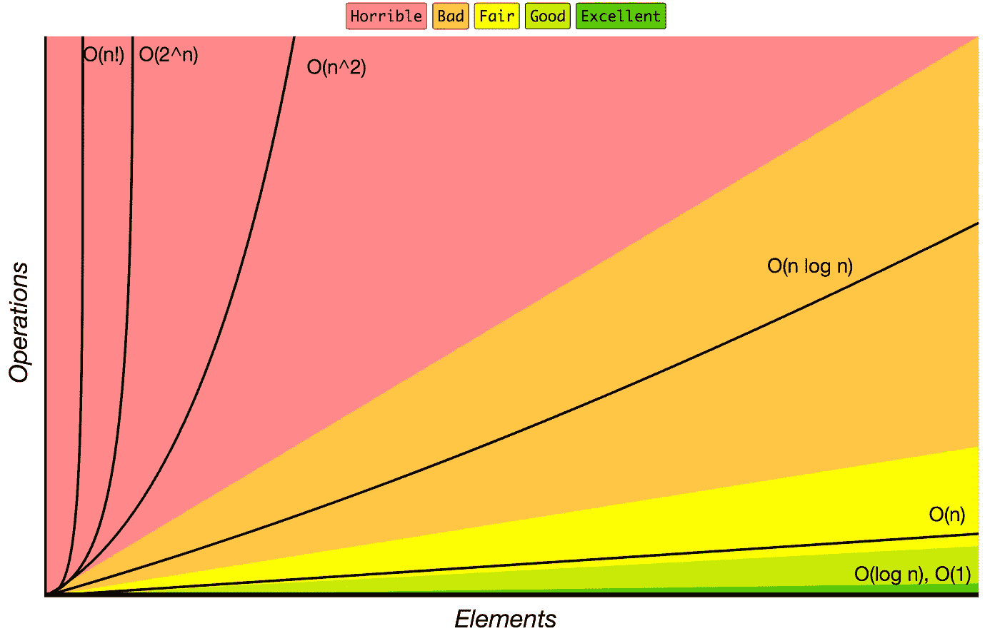
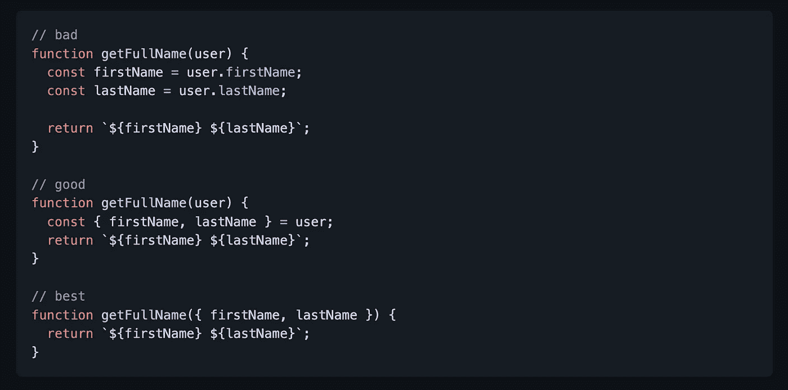
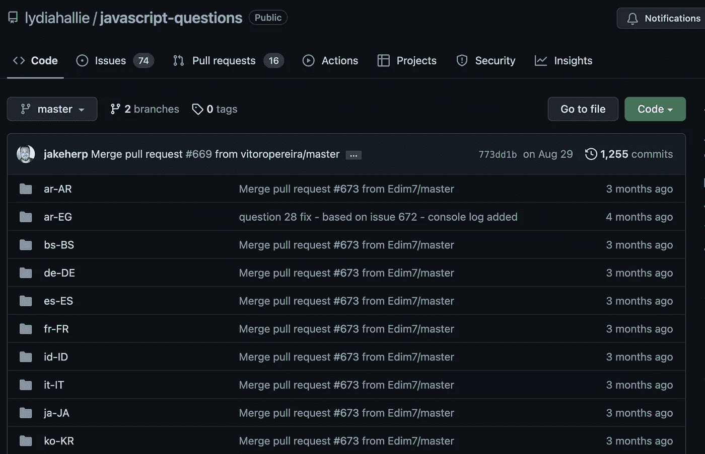
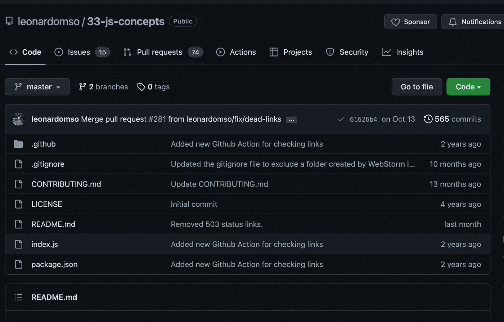
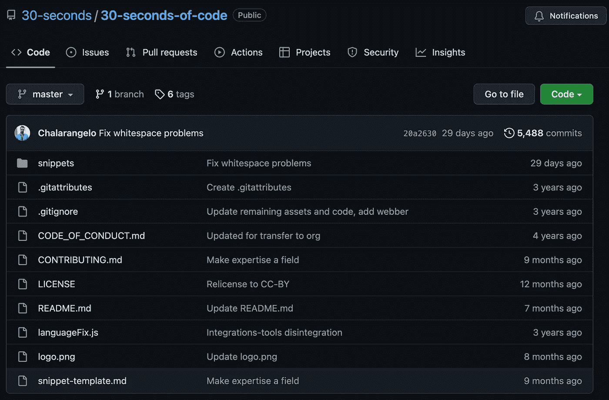

# 成为更好的 JavaScript 程序员的 7 个最佳 GitHub 库

> 原文：<https://javascript.plainenglish.io/7-best-github-repositories-to-become-a-better-javascript-programmer-8c8f6a681ae5?source=collection_archive---------0----------------------->

## 启动您的程序员之旅

Photo by [Mohammad Rahmani](https://unsplash.com/@afgprogrammer?utm_source=unsplash&utm_medium=referral&utm_content=creditCopyText) on [Unsplash](https://unsplash.com/s/photos/programmer?utm_source=unsplash&utm_medium=referral&utm_content=creditCopyText)

在我看来，在文档之后，GitHub 库是学习编程的最好方法之一。有很多资源可以帮助你学习编程，但你很容易迷失其中。我列出了 7 个资源库，可以帮助你成为更好的 JavaScript 程序员。

# 1.算法

算法和数据结构是软件开发的支柱。正如您从名称中已经猜到的，这个库包含了许多流行算法和数据结构的基于 JavaScript 的例子。每种算法和数据结构都有自己独立的自述文件，其中有相关的解释和链接供进一步阅读(包括 YouTube 视频)。这也是星级最高的 GitHub 库之一，拥有超过 155k 个星级。

 [## GitHub-trek Hleb/JavaScript-算法:📝用…实现的算法和数据结构

### 🇺🇦乌克兰正在被俄罗斯军队攻击。平民正在被杀害。住宅区正在被轰炸…

github.com](https://github.com/trekhleb/javascript-algorithms) 

# 2.java 描述语言

这张是 Airbnb 的。编程是一门艺术，开发者是艺术家。没有艺术家想把艺术搞砸。正如你已经猜到的，这个库包含了一些你在编程时可以遵循的最佳实践。它在 GitHub 上有超过 129k 颗星。

 [## GitHub-Airbnb/JavaScript:JavaScript 风格指南

### JavaScript 风格指南。通过在 GitHub 上创建帐户，为 airbnb/javascript 开发做出贡献。

github.com](https://github.com/airbnb/javascript) 

# 3.干净代码

干净代码罗伯特·c·马丁写的一本书是著名的软件工程原理之一。这个库为 JavaScript 改编了干净的代码。这不是一个风格指南。这是用 JavaScript 编写可读、可重用、可重构的[软件的指南。它在 GitHub 上有超过 75k 颗星。](https://github.com/ryanmcdermott/3rs-of-software-architecture)

 [## GitHub-ryanmcdermott/Clean-Code-javascript:适用于 JavaScript 的干净代码概念

### 《软件工程原理》,来自 Robert C. Martin 的书，改编为 JavaScript。这不是一个风格指南。这是…

github.com](https://github.com/ryanmcdermott/clean-code-javascript) 

# 4.JavaScript-问题

这个存储库包含一长串(高级)JavaScript 问题及其解释。你可以测试你对 JavaScript 的了解程度，复习一下你的知识，或者为你的编码面试做准备。这个库在 GitHub 上有超过 49.5k 颗星。

 [## GitHub-lydiahallie/javascript-questions:一长串(高级)JavaScript 问题，以及…

### 我在我的 Instagram 故事上发布了多项选择 JavaScript 问题，我也会在这里发布！最后更新时间:6 月 12 日…

github.com](https://github.com/lydiahallie/javascript-questions) 

# 5.33-js-概念

创建这个库的目的是帮助开发人员掌握他们在 JavaScript 中的概念。不是要求，是以后学习的指南。这个知识库在 GitHub 上有超过 53k 颗星星。

 [## GitHub-Leonardo MSO/33-js-概念:📜每个开发者都应该知道的 33 个 JavaScript 概念。

### 创建这个库的目的是帮助开发人员掌握他们在 JavaScript 中的概念。这不是一个…

github.com](https://github.com/leonardomso/33-js-concepts) 

# 6.项目指南

虽然开发一个新项目对你来说就像在绿地上滚动，但对其他人来说，维护它却是一个潜在的黑暗扭曲的噩梦。这个存储库包含一个指南列表，它被认为是 JavaScript 项目的最佳实践。它在 GitHub 上有超过 27.5k 颗星。

 [## GitHub-elsewhencode/project-guidelines:JavaScript 项目的一组最佳实践

### 中文版 | 日本語版 | 한국어 | Русский | Português | Italiana While developing a new project is like rolling on a green field for…

github.com](https://github.com/elsewhencode/project-guidelines) 

# 7.30 秒代码

这个存储库是 JavaScript 代码片段集合，包含各种各样的 ES6 辅助函数。它包括处理原语、数组和对象的助手，以及算法、DOM 操作函数和 Node.js 实用程序。它在 GitHub 上有超过 105k 颗星。

 [## GitHub - 30 秒/30 秒代码:适用于您所有开发的简短 JavaScript 代码片段…

### 满足您所有开发需求的简短 JavaScript 代码片段请访问我们的网站，查看我们的代码片段集。使用…

github.com](https://github.com/30-seconds/30-seconds-of-code) 

# 其他一些很棒的资源在哪里？

总有新的东西要学。如果你想了解更多的资源，请点击下面的链接。

 [## 让您的生活更轻松的 7 个最佳 Python 工具

### 增强您的 Python 开发能力

medium.com](https://medium.com/geekculture/7-best-python-tools-to-make-your-life-easier-6fc79c1a65e7) 

今天到此为止。我相信这些库会在你的开发之旅中给你很大的帮助。

如果你知道任何其他漂亮的 GitHub 库，请在评论中分享。直到我们再次见面，干杯！

*如果你愿意，可以在* [***推特***](https://twitter.com/FarhanTanvirBD) 上与我联系

*更多内容请看*[***plain English . io***](https://plainenglish.io/)*。报名参加我们的* [***免费周报***](http://newsletter.plainenglish.io/) *。关注我们上*[***Twitter***](https://twitter.com/inPlainEngHQ)[***LinkedIn***](https://www.linkedin.com/company/inplainenglish/)*[***YouTube***](https://www.youtube.com/channel/UCtipWUghju290NWcn8jhyAw)**和* [***不和***](https://discord.gg/GtDtUAvyhW) *对成长黑客感兴趣？检查* [***电路***](https://circuit.ooo/) ***。*****