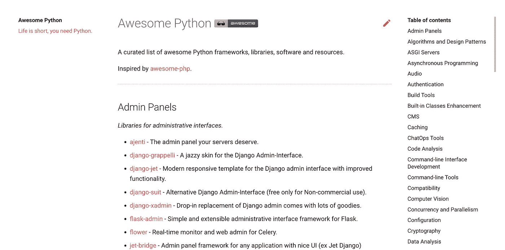

# 7 个最好的 GitHub 存储库来学习任何编程 LanguageーPart- 2

> 原文：<https://javascript.plainenglish.io/7-best-github-repositories-to-learn-any-programming-language-35a6a6a820f8?source=collection_archive---------8----------------------->

## 让你的程序员之旅充满活力。

Photo by [Max Duzij](https://unsplash.com/@max_duz?utm_source=medium&utm_medium=referral) on [Unsplash](https://unsplash.com?utm_source=medium&utm_medium=referral)

在我看来，在文档化之后，GitHub 存储库是学习编程的最佳途径之一。有太多的资源可以帮助你学习编程，你很容易迷失其中。我列出了 7 个存储库，它们将帮助您学习任何编程语言。

# 1.免费编程书籍

我相信这本书是获得任何知识的最好资源之一。不过编程书的缺点是有时会过时。因为技术变化很大，很难根据每次的变化来改变书本。但它仍然是一个巨大的资源。这个存储库是一个免费提供的编程书籍列表。它拥有 235，000 多颗恒星、9，700 多名观察者、7，000 多个提交者、1，900 多个贡献者和 49，000 多个分叉，已经成为 GitHub 最受欢迎的存储库之一。

 [## GitHub-ebook foundation/免费编程书籍:免费提供的编程书籍

### 本页面作为一个易于阅读的网站提供。通过点击或链接访问它们。这个列表最初是一个克隆…

github.com](https://github.com/EbookFoundation/free-programming-books) 

# 2.构建自己的 x

学习编程语言的另一个有效方法是在其中创建一个项目。这个存储库包含了精心编写的逐步说明，用于从头重新创建我们最喜欢的技术。您将能够从这个存储库中学到很多东西，比如用 Python 或 NodeJS 构建 Bot，或者使用 Go 创建自己的命令行工具等。这个存储库在 Github 上有超过 14 万颗恒星和超过 13 千个分叉。

 [## GitHub-code crafters-io/构建你自己的-x:通过重新创建你最喜欢的来掌握编程…

### 此存储库是一个精心编写的分步指南的汇编，用于从…重新创建我们最喜欢的技术

github.com](https://github.com/codecrafters-io/build-your-own-x) 

# 3.现实世界

虽然大多数“todo”演示都很好地概述了框架的功能，但它们通常缺乏使用该框架构建真实世界应用程序所需的知识和视角。这个存储库解决了这个问题，它允许你挑选任何一个前端和后端，看看它们如何协同工作，为一个真实世界、设计精美的全堆栈应用提供支持。这个存储库在 Github 上有超过 65k 颗恒星和超过 6k 个分叉。

 [## GitHub - gothinkster/realworld:“所有演示应用之母”——示范性全堆栈 media . com……

### “所有演示应用之母”——由 reactor、Angular、Node、Django 等公司提供支持的堪称典范的全堆栈 Medium.com 克隆……

github.com](https://github.com/gothinkster/realworld) 

# 4.令人敬畏的巨蟒

Python 是当前软件工程领域最著名的编程语言之一。如果您想了解和学习 Python 的强大功能，那么这是一个很好的资源。这个存储库包含一个精心挑选的奇妙的 Python 框架、库、软件和资源的集合。它在 Github 上拥有超过 13 万颗恒星和超过 21 千个分叉。

 [## GitHub - vinta/awesome-python:一个令人敬畏的 python 框架、库、软件和…

### 令人惊叹的 Python 框架、库、软件和资源的精选列表。灵感来自牛逼-php。用于…的库

github.com](https://github.com/vinta/awesome-python) 

# 5.开发者路线图

虽然这个库不会教你编程语言，但我相信这是一个有用的库。网络是一个广阔的地方。它充满了资源，很容易迷失自我。软件开发是一个广阔的领域。有各种类型的开发和技术堆栈。所以，很明显，你需要一个指导方针。这个存储库是一个路线图列表，它将帮助您了解成为理想的开发人员需要哪些编程语言和工具。它在 Github 上有超过 195k 的星星和超过 28k 的分叉。

 [## GitHub-kamranahmedse/开发者路线图:2022 年成为开发者的路线图

### 面向开发人员的社区驱动的路线图、文章和资源路线图正在变得可交互，并且已经…

github.com](https://github.com/kamranahmedse/developer-roadmap) 

# 6.面向初学者的网络开发

这个是微软的。正如你已经知道的，这个库是为 Web 开发的初学者准备的。这个资源库包含一个为期 12 周、24 节课的 JavaScript、CSS 和 HTML 基础课程。每堂课都包括课前和课后测验、完成课程的书面说明、解答、作业等等。它在 Github 上有超过 52k 的星星和超过 7k 的分叉。

 [## GitHub-Microsoft/Web-Dev-适合初学者:24 节课，12 周，作为一名 Web 开发人员入门

### 微软的 Azure Cloud 倡导者很高兴提供 12 周、24 节课的课程，全部关于 JavaScript、CSS 和…

github.com](https://github.com/microsoft/Web-Dev-For-Beginners) 

# 7.太棒了-自主主持

自托管是指在自己的服务器上托管和管理应用程序，而不是使用 SaaS 提供商。这是一个网络服务和网络应用程序的列表，它们可以使用自由软件托管在您自己的服务器上。它在 Github 上有超过 90k 的星星和超过 5k 的分叉。

 [## GitHub-awesome-self hosted/awesome-self hosted:自由软件网络服务和 web…

### 可以在你自己的服务器上托管的自由软件网络服务和网络应用的列表

github.com](https://github.com/awesome-selfhosted/awesome-selfhosted) 

# 前一部分在哪里？

学习编程有很多很棒的开源资源。我想分享尽可能多的资源，让你的开发之旅更轻松。

如果你错过了前面的部分，请检查下面。

 [## 学习任何编程语言的 7 个最佳 GitHub 库

### 启动您的程序员之旅。

javascript.plainenglish.io](/7-best-github-repositories-to-learn-any-programming-language-5843e5a3c8d8) 

今天到此为止。我相信这些知识库会帮助你学到很多新东西。

如果你知道任何其他漂亮的 GitHub 库，请在评论中分享。直到我们再次见面…干杯！

***想要连接？***

*如果你愿意，可以在*[***Twitter***](https://twitter.com/FarhanT99598254)**或*[***LinkedIn***](https://www.linkedin.com/in/farhan-tanvir-b08520151/)***上与我联系。****

**更多内容请看*[***plain English . io***](https://plainenglish.io/)*。报名参加我们的* [***免费每周简讯***](http://newsletter.plainenglish.io/) *。关注我们* [***推特***](https://twitter.com/inPlainEngHQ) *和*[***LinkedIn***](https://www.linkedin.com/company/inplainenglish/)*。查看我们的* [***社区不和谐***](https://discord.gg/GtDtUAvyhW) *加入我们的* [***人才集体***](https://inplainenglish.pallet.com/talent/welcome) *。**