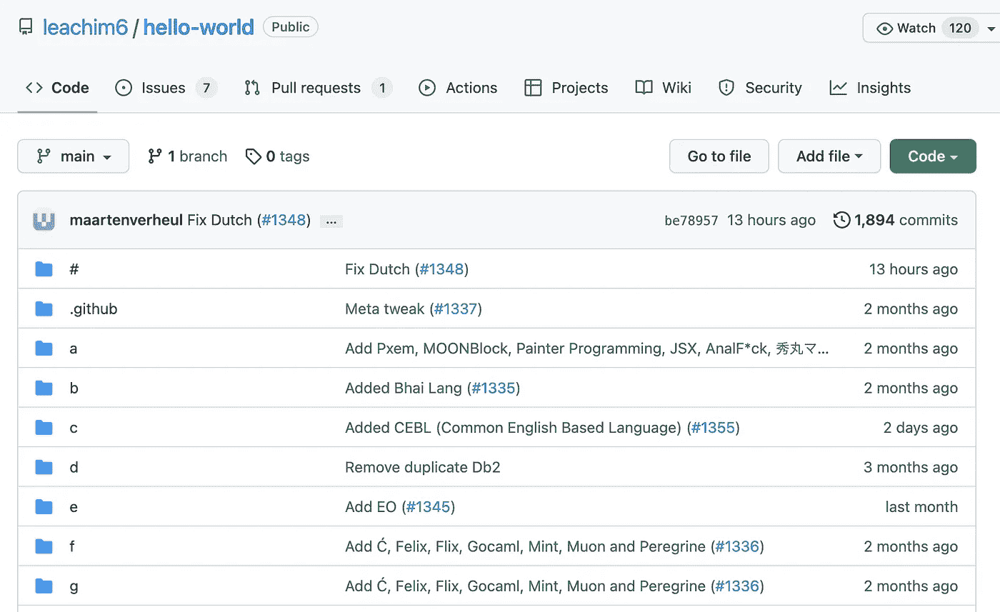
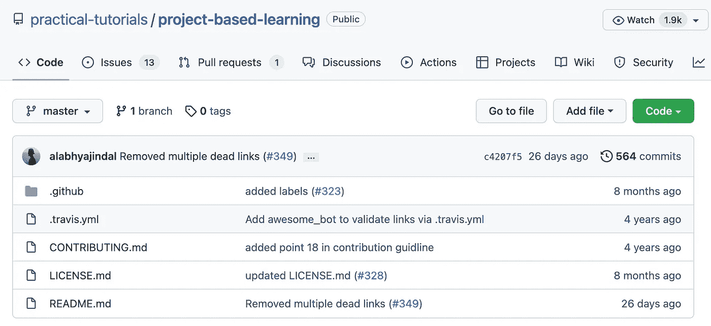
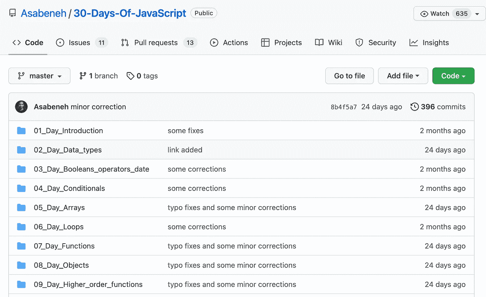
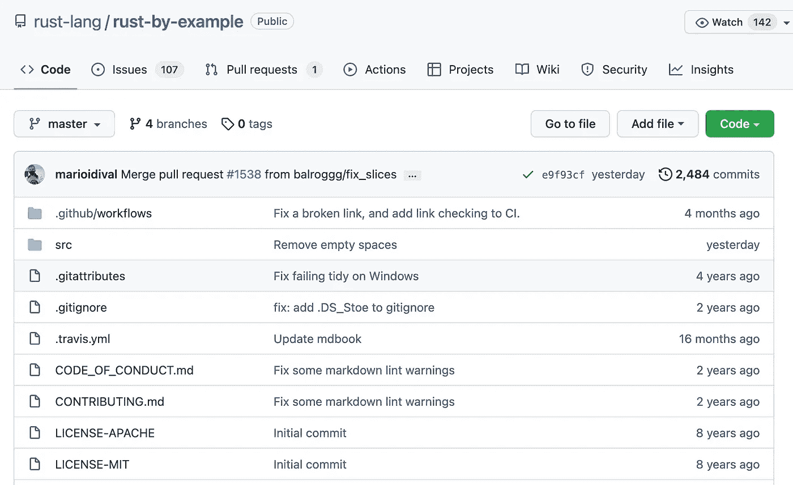
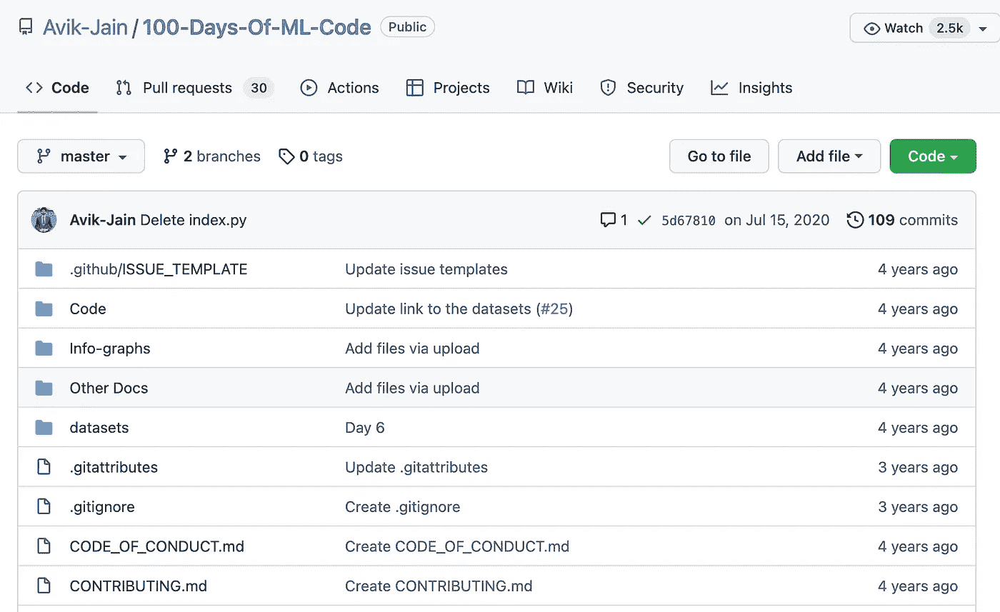
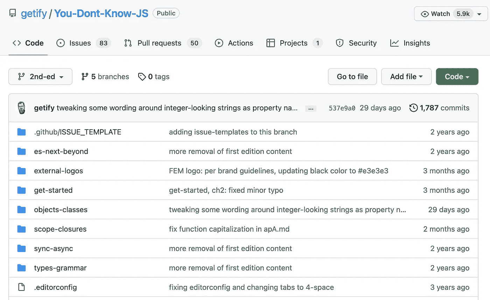
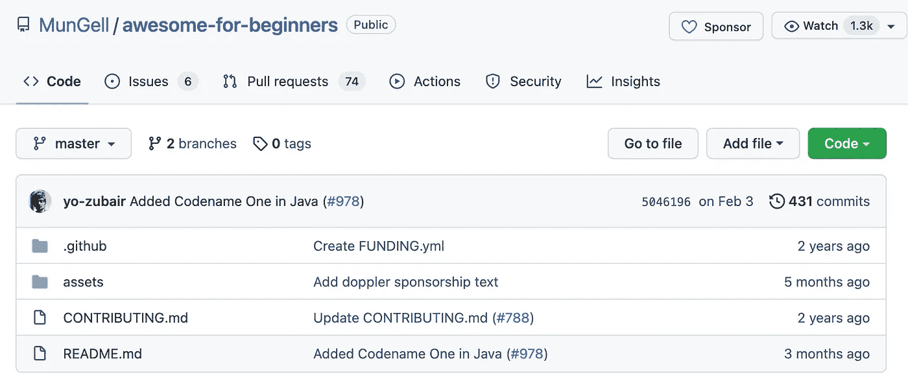

# 学习任何编程语言的 7 个最佳 GitHub 库

> 原文：<https://javascript.plainenglish.io/7-best-github-repositories-to-learn-any-programming-language-5843e5a3c8d8?source=collection_archive---------0----------------------->

## 启动您的程序员之旅。

Photo by [Pakata Goh](https://unsplash.com/@pakata?utm_source=medium&utm_medium=referral) on [Unsplash](https://unsplash.com?utm_source=medium&utm_medium=referral)

在我看来，在文档化之后，GitHub 库是学习编程的最佳途径之一。有很多可以学习编程的资源，很容易迷失在这些成堆的资源中。在这里，我编译了 7 个库，可以帮助你学习任何编程语言。

# 1.hello-world

这是最有趣的 GitHub 库之一。除了 hello world，还有什么更好的方法来介绍编程语言呢？。顾名思义，这个库是关于每种计算机语言的 Hello World。它总共支持 981 种语言，不久还会增加更多。这个库有超过 8k 的星和 1.6k 的叉。

 [## GitHub - leachim6/hello-world:每种计算机语言的 Hello world。感谢每一个…

### 每种计算机语言的 Hello world。感谢所有为此做出贡献的人，确保看到 contributing.md…

github.com](https://github.com/leachim6/hello-world) 

# 2.基于项目的学习

学习任何编程语言的另一个好方法是用该语言创建一个项目。这个存储库是基于项目的编程教程的集合，这些教程教导软件开发人员如何从头开始创建应用程序。这些教程被分解成不同的编程语言。教程中可能会用到多种技术和语言。这个库有超过 67k 个星和超过 10k 个叉。

 [## GitHub -实践-教程/基于项目的学习:基于项目的教程的精选列表

### 一系列编程教程，有抱负的软件开发人员在其中学习如何从头开始构建应用程序…

github.com](https://github.com/practical-tutorials/project-based-learning) 

# **3。PythonDataScienceHandbook**

数据科学是当今世界软件开发人员最热门的话题之一。如果你想精通 Python 中的数据科学，那么 [Python 数据科学手册](http://shop.oreilly.com/product/0636920034919.do)是最好的书籍之一。这个存储库包含完整的 Python 数据科学手册，以(免费！)Jupyter 笔记本。拥有 34k 多星，15k 多叉。

 [## GitHub-jakevdp/Python datascience Handbook:Python 数据科学手册:Jupyter 中的全文…

### 这个存储库包含完整的 Python 数据科学手册，以(免费！)Jupyter 笔记本。这本书…

github.com](https://github.com/jakevdp/PythonDataScienceHandbook) 

# 4.30 天的 JavaScript

如果你是 Javascript 新手，想从基础开始学习，那么这将是一个很好的资源库。顾名思义，这是一个为期 30 天的 JavaScript 编程挑战，有一步一步的学习 JavaScript 的教程。它有超过 20k 的星星和 4k 的叉子。

 [## 30 天的 JavaScript: 30 天的 JavaScript 编程挑战是一个…

### 30 天的 JavaScript 编程挑战是一个循序渐进的指南，学习 JavaScript 编程语言在 30…

github.com](https://github.com/Asabeneh/30-Days-Of-JavaScript) 

# 4.生锈的例子

Rust 是一种速度惊人且内存高效的编程语言。如果你对学习 Rust 感兴趣，那么这可能是一个很好的资源。它还包括一个实时代码编辑器。它有超过 4k 颗恒星。

 [## GitHub-rust-lang/Rust-by-examples:通过示例学习 Rust(包括实时代码编辑器)

### 通过例子学习 Rust(包括实时代码编辑器)如果你想通过例子阅读 Rust，你可以访问…

github.com](https://github.com/rust-lang/rust-by-example) 

# 5.百日毫升代码

如果你是学机器学习的，有可能你认识 [Siraj Raval](https://github.com/llSourcell) 。这个知识库是关于 Siraj Raval 提出的在 100 天内学习如何使用机器学习来编码。它有超过 37k 的星星和 9k 的叉子。

 [## GitHub - Avik-Jain/100 天的 ML 代码:100 天的 ML 编码

### Siraj Raval 提出的 100 天机器学习编码从这里获取数据集从这里查看代码…

github.com](https://github.com/Avik-Jain/100-Days-Of-ML-Code) 

# 6.你不知道 JS

这是最受欢迎的 JavaScript with 库之一，拥有超过 152k 个星级和超过 30k 个分支。如果你想深入研究 javascript，这个库是一个很好的资源。它包含了一系列深入 JavaScript 语言核心机制的书籍。

 [## GitHub-getify/You-don-Know-JS:JavaScript 系列丛书。推特上的@YDKJS。

### JavaScript 系列丛书。推特上的@YDKJS。为 getify/You-don-Know-JS 开发做出贡献，创建一个…

github.com](https://github.com/getify/You-Dont-Know-JS) 

# 7.对初学者来说太棒了

如果你是编程初学者，那么这是你必须知道的知识库。这个库包含了一个很棒的初学者友好的项目列表，它将帮助你轻松地学习编程。它拥有超过 39k 颗恒星。

 [## GitHub-MunGell/awesome-for-初学者:一个适合初学者的优秀项目列表。

### 一个可怕的初学者友好的项目列表。通过创建一个……

github.com](https://github.com/MunGell/awesome-for-beginners) 

# 下一部分在哪里？

学习编程有很多很棒的开源资源。我想分享尽可能多的资源，让你的编程之旅更轻松。

如果你想知道更多其他有用的资源，请查看下面。

 [## 学习任何编程的 7 个最佳 GitHub 库 LanguageーPart- 2

### 启动您的程序员之旅。

javascript.plainenglish.io](/7-best-github-repositories-to-learn-any-programming-language-35a6a6a820f8) 

今天到此为止。我相信这些知识库会帮助你学到很多新东西。

如果你知道任何其他漂亮的 GitHub 库，请在评论中分享。直到我们再次相遇。干杯！

# ***想要连接？***

*如果你愿意，可以在*[***Twitter***](https://twitter.com/FarhanTanvirBD)***上和我联系。***

*更多内容请看*[***plain English . io***](https://plainenglish.io/)*。报名参加我们的* [***免费周报***](http://newsletter.plainenglish.io/) *。关注我们关于*[***Twitter***](https://twitter.com/inPlainEngHQ)*和*[***LinkedIn***](https://www.linkedin.com/company/inplainenglish/)*。加入我们的* [***社区不和谐***](https://discord.gg/GtDtUAvyhW) *。*