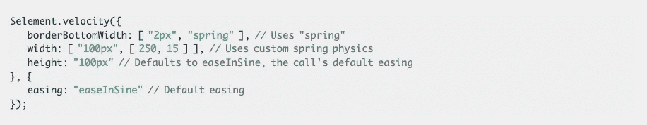
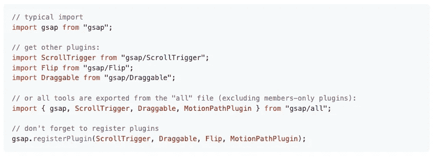
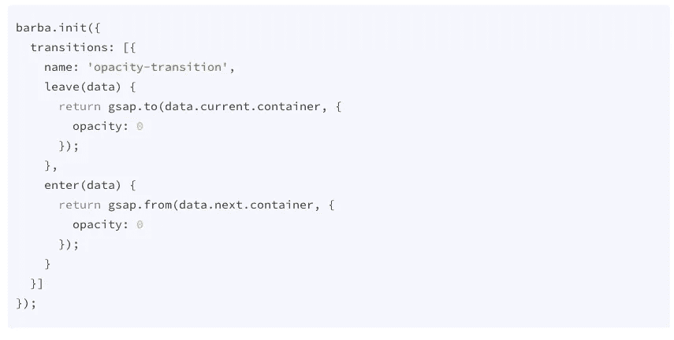
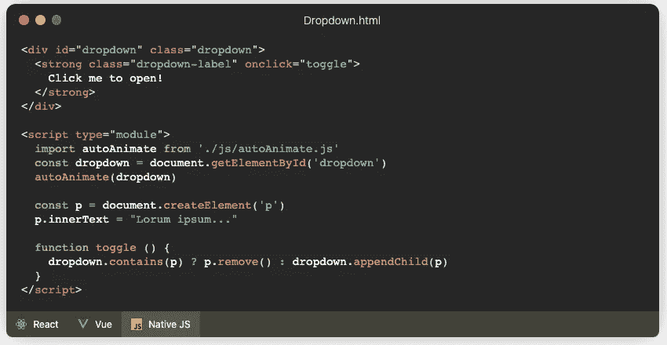
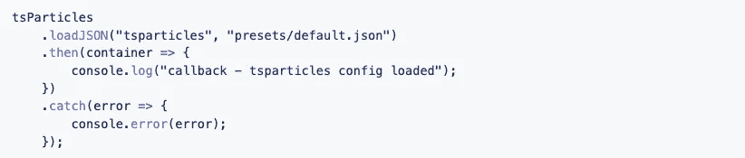
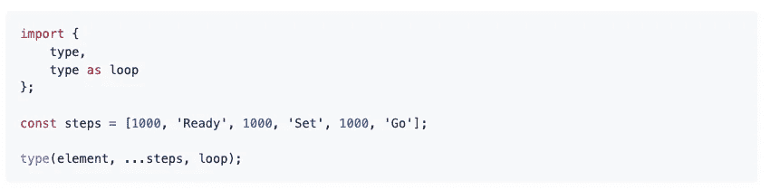

# 你应该知道的 7 个最好的 JavaScript 动画库

> 原文：<https://javascript.plainenglish.io/7-best-javascript-animation-libraries-you-should-know-4b461c7cae25?source=collection_archive---------5----------------------->

## 增强您的 JavaScript 开发

Photo by [Pakata Goh](https://unsplash.com/@pakata?utm_source=unsplash&utm_medium=referral&utm_content=creditCopyText) on [Unsplash](https://unsplash.com/s/photos/programming?utm_source=unsplash&utm_medium=referral&utm_content=creditCopyText)

有句谚语“不必多此一举”。图书馆就是最好的例子。它帮助你以一种简单的方式编写复杂而耗时的功能。根据我的观点，一个好的项目使用一些最好的可用库

我不认为 JavaScript 需要任何介绍。它是几乎所有用途中最常用的编程语言之一。在这里，我编译了 7 个有用的 JavaScript 动画库，它们将在你的开发之旅中帮助你。

# 1.有生命的

这是 GitHub 上明星最多的动画库之一，拥有超过 76k 个明星。这是一个随时可用的跨浏览器动画库，可在您的 web 项目中使用。这对于强调、主页、滑动条和引导注意力的提示来说非常有用。

 [## GitHub - animate-css/animate.css:🍿CSS 动画的跨浏览器库。像…一样易于使用

### 如果你需要旧的文档- v3.x.x 及以下版本-你可以在这里找到。使用 npm 安装:npm install animate.css - save…

github.com](https://github.com/animate-css/animate.css) 

# 2.速度

Windows、三星、优步和数千家其他公司都在使用这个库。它使用与 jQuery 的 *$相同的 API 构建。animate()* 。不管有没有 jQuery，它都可以工作。它非常快，并且具有彩色动画、变换、循环、easings、SVG 支持和滚动功能。它是 jQuery 和 CSS 转换的最佳组合。WhatsApp，还有 Tumblr。它在 GitHub 上有超过 17k 颗星。

 [## GitHub - julianshapiro/velocity:加速的 JavaScript 动画。

### https://github.com/julianshapiro/velocity/wiki WhatsApp，Tumblr，Windows，三星，优步，以及成千上万的其他…

github.com](https://github.com/julianshapiro/velocity) 

# 3.GSAP

这个库把开发者变成了动画超级英雄。它将帮助您构建在各种主流浏览器中都能工作的高性能动画。你可以动画 CSS，SVG，canvas，React，Vue，WebGL，颜色，字符串，运动路径，通用对象…任何 JavaScript 可以触及的东西。它在 GitHub 上有超过 15k 颗星。

 [## GitHub-green sock/GSAP:green sock 的 GSAP JavaScript 动画库(包括 Draggable)。

### GreenSock 的 GSAP JavaScript 动画库(包括 Draggable)。- GitHub -格林索克/GSAP:格林索克的 GSAP…

github.com](https://github.com/greensock/GSAP) 

# 4.巴尔巴

这是一个小的(7kb 缩小和压缩)和易于使用的库，帮助您创建网站页面之间的流畅和平滑的过渡。它有助于减少页面之间的延迟，最大限度地减少浏览器 HTTP 请求，并增强用户的 web 体验。它在 GitHub 上有超过 10k 颗星星。

 [## GitHub - barbajs/barba:在你的网站页面之间创建流畅平滑的过渡。

### js 是一个小的(7kb 缩小和压缩)和易于使用的库，它可以帮助你…

github.com](https://github.com/barbajs/barba) 

# 5.自动制作动画

这是一个零配置、嵌入式的动画库，可以为你的 web 应用添加平滑过渡。您可以将它与 React、Vue、Svelte 或任何其他 JavaScript 应用程序一起使用。这个库在 GitHub 上有超过 6k 的星星。

 [## GitHub - formkit/auto-animate:一个零配置的插入式动画实用程序，增加了平滑的…

### 一个零配置、嵌入式动画实用程序，为您的 web 应用程序添加平滑过渡。可以和 React，Vue 一起用…

github.com](https://github.com/formkit/auto-animate) 

# 6.ts 粒子

这个库将帮助您轻松创建高度可定制的 JavaScript 粒子效果、五彩纸屑爆炸和焰火动画，并将其用作网站的动画背景。React.js、Vue.js (2.x 和 3.x)、Angular、Svelte、jQuery、Preact、Inferno、Solid、Riot 和 Web 组件可用的现成组件。它在 GitHub 上有超过 4k 颗星。

 [## GitHub-matteobruni/ts particles:ts particles-轻松创建高度可定制的 JavaScript…

### 轻松创建高度可定制的 JavaScript 粒子效果，五彩纸屑爆炸和烟火…

github.com](https://github.com/matteobruni/tsparticles) 

# 7.典型的

这个小库(大约 400 字节)将帮助你实现动画打字。它包括许多功能，如表情符号支持，只删除需要删除的内容，步骤之间暂停，零依赖，等等。它在 GitHub 上有超过 1k 颗星。

 [## GitHub - camwiegert/typical:大约 400 字节的动画输入🐡JavaScript 的

### 大约 400 字节的动画打字🐡JavaScript 的。通过在…上创建帐户，为 camwiegert/typical 开发做出贡献

github.com](https://github.com/camwiegert/typical) 

# 其他一些很棒的资源在哪里？

总有新的东西要学。如果你想了解更多关于 React 强大的库，请点击下面的链接。

 [## 你应该在下一个项目中使用的 7 个有用的 Python 库

### 增强您的 Python 开发能力

python .平原英语. io](https://python.plainenglish.io/7-useful-python-libraries-you-should-use-in-your-next-project-6f068441689f) 

今天到此为止。相信这些库对你的开发之旅会有很大的帮助。

如果你知道任何其他漂亮的 JavaScript 库，请在评论中分享。直到我们再次见面…干杯！

***想要连接？*** *如果你愿意，可以在* [***推特***](https://twitter.com/FarhanTanvirBD) ***上与我联系。***

*更多内容请看*[***plain English . io***](https://plainenglish.io/)*。报名参加我们的* [***免费周报***](http://newsletter.plainenglish.io/) *。关注我们关于*[***Twitter***](https://twitter.com/inPlainEngHQ)[***LinkedIn***](https://www.linkedin.com/company/inplainenglish/)*[***YouTube***](https://www.youtube.com/channel/UCtipWUghju290NWcn8jhyAw)*[***不和***](https://discord.gg/GtDtUAvyhW) *。对增长黑客感兴趣？检查* [***电路***](https://circuit.ooo/) *。***