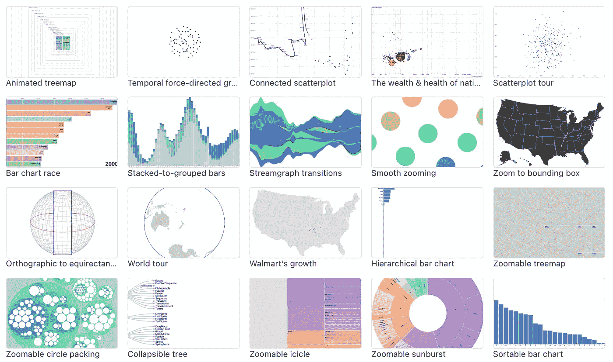
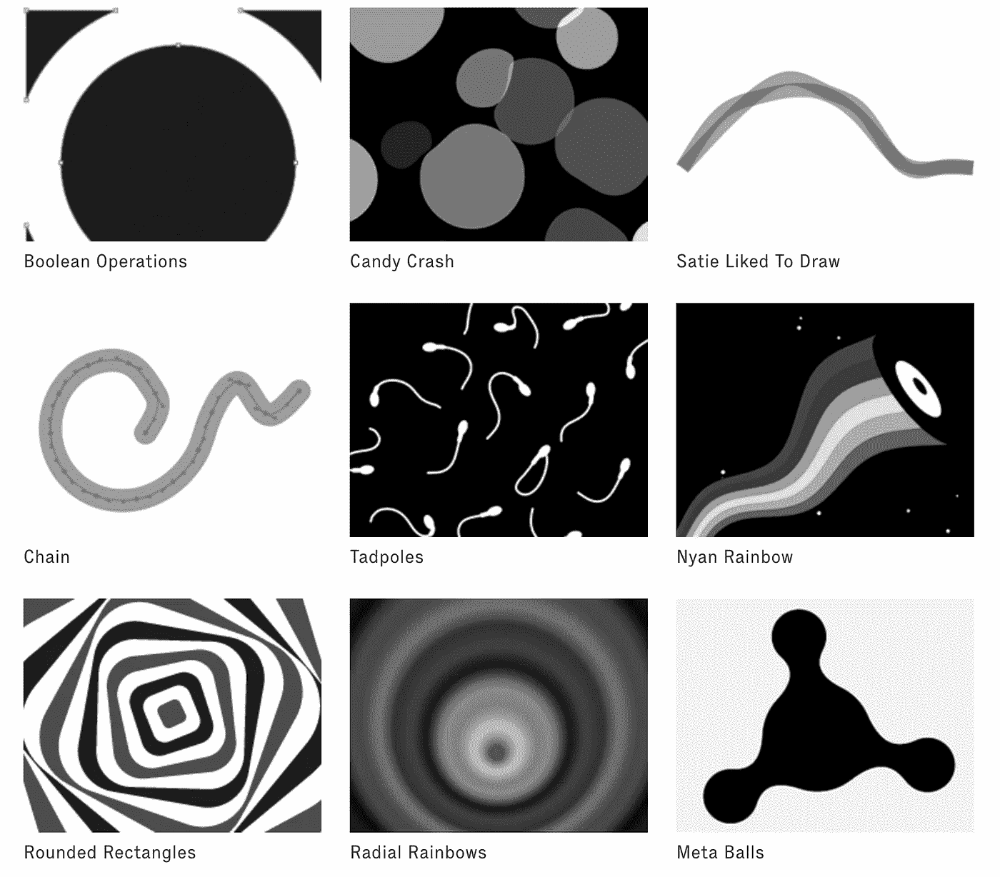
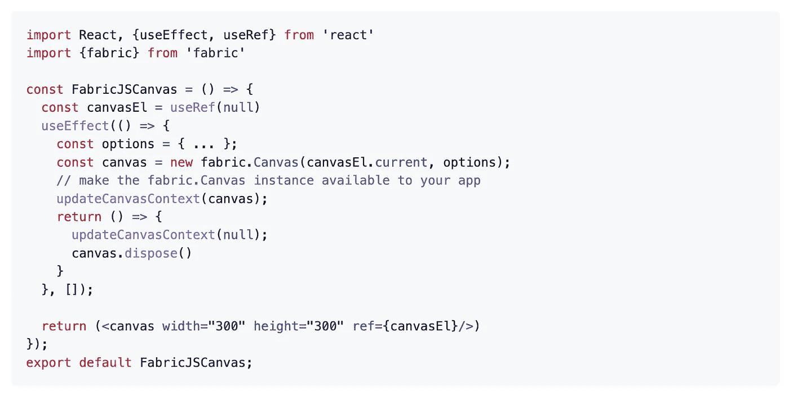
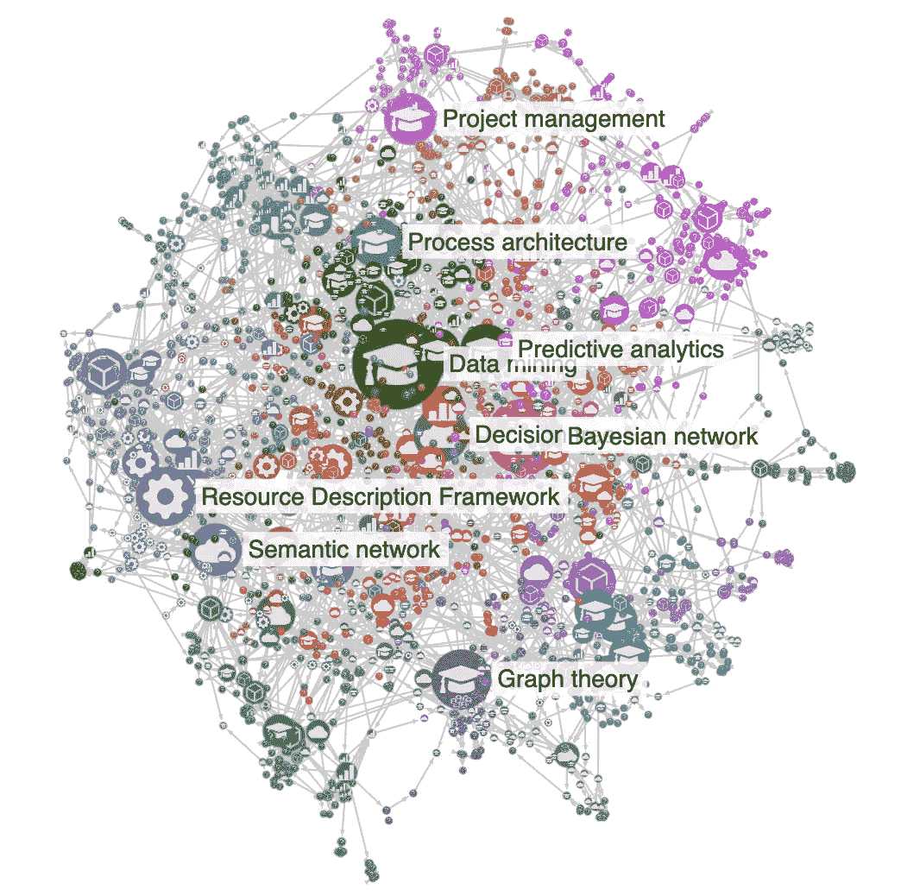
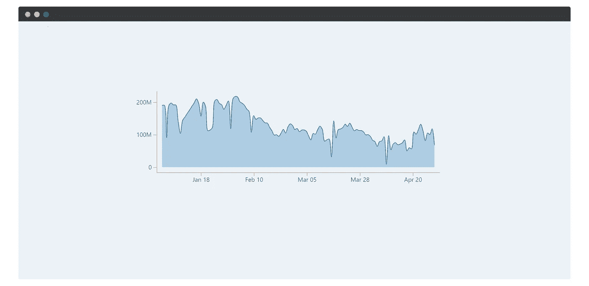
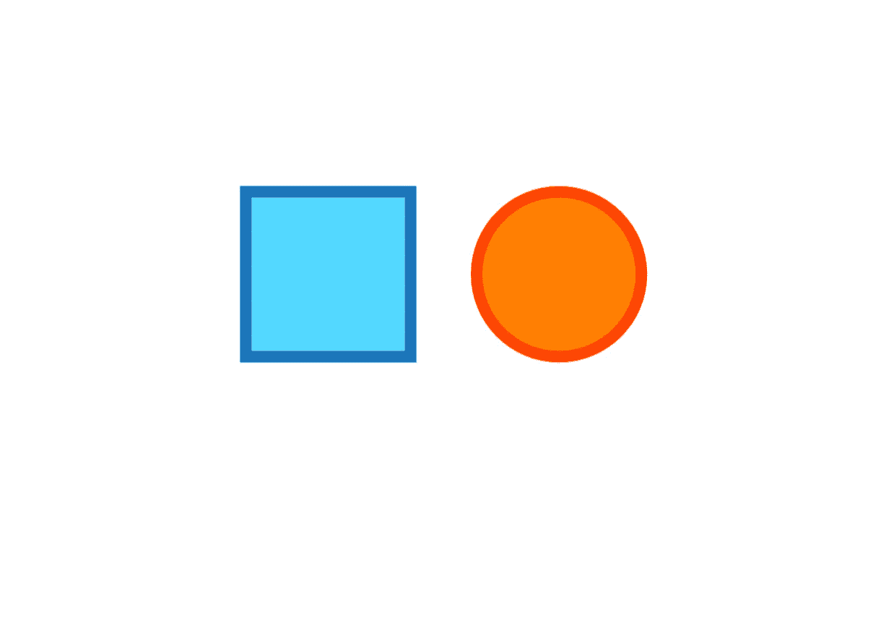
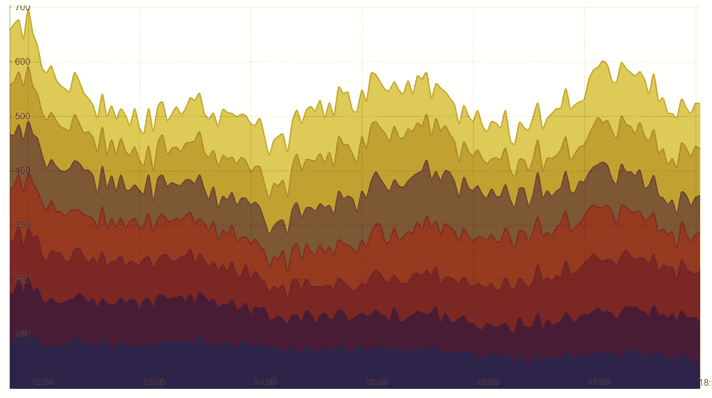

# 您可以在下一个项目中使用的 7 个最佳 JavaScript 数据可视化库

> 原文：<https://javascript.plainenglish.io/7-best-javascript-data-visualization-library-you-can-use-in-your-next-project-24c238952db6?source=collection_archive---------3----------------------->

## 增强你的发展


Photo by [Fili Santillán](https://unsplash.com/@filisantillan?utm_source=unsplash&utm_medium=referral&utm_content=creditCopyText) on [Unsplash](https://unsplash.com/s/photos/javascript?utm_source=unsplash&utm_medium=referral&utm_content=creditCopyText)

处理数据是开发人员最常见也是最重要的任务之一。可视化您的数据将极大地帮助您理解数据想要告诉您什么。在这里，我整理了一个 7 个最佳数据可视化库的列表，可以帮助你完成这个重要的任务。

# 1.d3



这个图书馆需要介绍吗？如果您使用 javascript 已经有一段时间了，那么您很有可能已经了解了它。它是星级最高的 GitHub 库之一，拥有超过 103k 颗星。这是一个使用 web 标准可视化数据的库。它帮助您使用 SVG、Canvas 和 HTML 将数据变为现实。该库将强大的可视化和交互技术与数据驱动的 DOM 操作方法相结合，为您提供了现代浏览器的全部功能以及为您的数据设计正确的可视化界面的自由。

[](https://github.com/d3/d3) [## GitHub - d3/d3:用 SVG、Canvas 和 HTML 赋予数据生命。

### D3(或 D3.js)是一个 JavaScript 库，用于使用 web 标准可视化数据。D3 帮助您将数据融入生活，使用…

github.com](https://github.com/d3/d3) 

# 2.paperjs



这是一个基于 HTML5 画布的矢量图形脚本框架。提供了一个设计良好的、可靠的、干净的编程接口，以及一个清晰的场景图形/文档对象模型和大量用于处理矢量图形和贝塞尔曲线的强大功能。它在 GitHub 上有超过 13k 颗星。

[](https://github.com/paperjs/paper.js) [## GitHub - paperjs/paper.js:矢量图形脚本的瑞士军刀

### 矢量图形脚本的瑞士军刀- Scriptographer 移植到 JavaScript 和浏览器，使用 HTML5…

github.com](https://github.com/paperjs/paper.js) 

# 3.构造



这是一个简单而强大的 Javascript HTML5 画布库。它也是一个 SVG 到画布的解析器。它包括许多功能，如在画布上拖放对象，用鼠标缩放，移动，旋转和分组对象，使用预定义的形状或创建自定义对象，超快地处理许多对象，等等。它在 GitHub 上有超过 22k 颗星。

[](https://github.com/fabricjs/fabric.js) [## GitHub-fabric js/fabric . js:Javascript 画布库，SVG-to-Canvas (& canvas-to-SVG)解析器

### Javascript 画布库，SVG-to-Canvas (& canvas-to-SVG)解析器-GitHub-fabric js/fabric . js:Javascript Canvas…

github.com](https://github.com/fabricjs/fabric.js) 

# 4.sigma.js



如果你的图有很多节点和边，那么这是一个很好的资源。这个库旨在可视化成千上万个节点和边的图形。它使用 WebGL 来呈现图形。这个库在 GitHub 上有超过 10k 颗星星。

[](https://github.com/jacomyal/sigma.js) [## GitHub - jacomyal/sigma.js:一个 JavaScript 库，旨在可视化成千上万个节点的图形…

### Sigma.js 是一个开源 JavaScript 库，旨在可视化成千上万个节点和边的图形，主要是…

github.com](https://github.com/jacomyal/sigma.js) 

# 5.度量-图形



这是一个为可视化和布局时序数据而构建的库。它的大小约为 15kB (gzipped ),提供了一种简单的方法来以有原则且一致的方式制作常见类型的图形。该库目前支持折线图、散点图和直方图，以及地毯图等功能。它在 GitHub 上有超过 7.5k 颗星。

[](https://github.com/metricsgraphics/metrics-graphics) [## GitHub-metrics graphics/metrics-graphics:一个为简洁和有原则的数据优化的库…

### MetricsGraphics 是一个为可视化和布局时序数据而构建的库。大约 15kB (gzipped)，它…

github.com](https://github.com/metricsgraphics/metrics-graphics) 

# 6.two.js



这是一个面向现代网络浏览器的二维绘图 API。它是渲染器不可知的，使相同的 API 能够在多种上下文中绘制，如 SVG、canvas 和 WebGL。它在 GitHub 上有超过 7.5k 颗星。

[](https://github.com/jonobr1/two.js) [## GitHub - jonobr1/two.js:一个与渲染器无关的 web 二维绘图 api。

### 一个为现代浏览器设计的二维绘图 api。它是渲染器不可知的，允许相同的 api 在…

github.com](https://github.com/jonobr1/two.js) 

# 7.人力车



这张是来自 [Shutterstock](http://www.shutterstock.com/) 的。这是一个用于创建交互式时序图的 JavaScript 工具包。它依靠奇妙的 [D3 可视化库](http://mbostock.github.com/d3/)来完成大量堆叠和渲染 SVG 的繁重工作。它使用 [jsdom](https://github.com/tmpvar/jsdom) 在节点中运行单元测试，以便能够进行 SVG 操作。这个库在 GitHub 上有超过 6.5k 的星星。

[](https://github.com/shutterstock/rickshaw) [## GitHub-shutterstock/黄包车:用于创建交互式实时图形的 JavaScript 工具包

### 用于创建交互式实时图形的 JavaScript 工具包

github.com](https://github.com/shutterstock/rickshaw) 

# 其他一些很棒的资源在哪里？

总有新的东西要学。如果你想了解 Python 上的数据可视化库，请点击下面的链接。

[](https://python.plainenglish.io/7-best-python-data-visualization-library-you-can-use-in-your-next-project-1ee5bcd3f0ef) [## 您可以在下一个项目中使用的 7 个最佳 Python 数据可视化库

### 增强您的 Python 开发能力

python .平原英语. io](https://python.plainenglish.io/7-best-python-data-visualization-library-you-can-use-in-your-next-project-1ee5bcd3f0ef) 

今天到此为止。相信这些库对你的开发之旅会有很大的帮助。

如果你知道任何其他漂亮的 JavaScript 数据可视化库，请在评论中分享。直到我们再次见面…干杯！

```
**Want to Connect?.** If you want to,you can connect with me on [**Twitter**](https://twitter.com/FarhanTanvirBD)
```

*更多内容请看*[***plain English . io***](https://plainenglish.io/)*。报名参加我们的* [***免费周报***](http://newsletter.plainenglish.io/) *。关注我们关于*[***Twitter***](https://twitter.com/inPlainEngHQ)[***LinkedIn***](https://www.linkedin.com/company/inplainenglish/)*[***YouTube***](https://www.youtube.com/channel/UCtipWUghju290NWcn8jhyAw)*[***不和***](https://discord.gg/GtDtUAvyhW) *。对增长黑客感兴趣？检查* [***电路***](https://circuit.ooo/) *。***