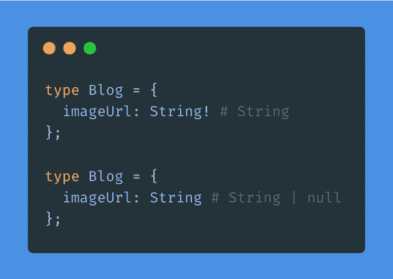

# 设计前沿 GraphQL 模式的 7 个最佳实践

> 原文：<https://javascript.plainenglish.io/7-best-practices-to-design-cutting-edge-graphql-schemas-8ee53be2e601?source=collection_archive---------9----------------------->

## 设计和开发可伸缩的 GraphQL 模式。


Photo by [Kelly Sikkema](https://unsplash.com/@kellysikkema?utm_source=medium&utm_medium=referral) on [Unsplash](https://unsplash.com?utm_source=medium&utm_medium=referral)

GraphQL 是 Meta(以前的脸书)带给世界的一项相对较新的技术。尽管是新的，但它越来越受欢迎。

几乎所有的大行业和许多小组织和创业公司都使用 GraphQL。这就是为什么它是当今时代每个 web 开发人员的必备知识。

在使用 GraphQL 模式时，我们必须遵循一些设计前沿模式的最佳实践。否则随着项目的成长，就不会有顺利的设计，项目就会一塌糊涂。

今天，我们将讨论设计 GraphQL 模式时的一些最佳实践。所以，不多说了，让我们直接进入要点。

## 1.正确使用反对消息。

在团队中工作时，有许多需求变化的场景。有时，我们需要更改字段名或删除一些字段。

例如，假设你正在建立一个博客网站。您正在设计一个获取博客的模式。该模式最初看起来如下所示:

```
blog(id: $id) {
  title
  subtitle
  imageUrl
}
```

现在，需求已经改变，您被告知要为图像包含 alt 文本；现在，您可以设计如下所示的模式:

```
blog(id: $id) {
  title
  subtitle
  image {
    src
    alt
  }
}
```

现在，您更改了 API，并将其发布到生产环境中。

但是，等等！

一旦你发布你对产品的新修改，你的应用就会崩溃，因为你的前端团队还没有实现你的修改！即使你正在实现一个公共的或者合作伙伴的 API，直接推动这些改变也是一个很大的拒绝！

相反，保留这个字段也不能解决问题，因为它是一个冗余字段。您的前端团队或最终用户可能不知道该字段是否会被删除。你也不知道你会保持这个领域多久。

在这个例子中保留这个字段可能不是一个大问题，但是可能有很多区域应该在某个时候被删除。

**那么有什么解决办法呢？**

不要删除该字段，而要说明删除该字段的原因和日期。这样，前端开发人员将有机会研究这个问题，他们可以在某个时候更改这个字段。

```
type Blog {
  title: String
  subtitle: String
  imageUrl: String @deprecated(reason: "This field is deprecated and will be removed on Aug 6, 2022\. Use `image` field instead.")
  image: {
    src: String
    alt: String
  }
}
```

## 2.显式命名变量。

如果您显式命名您的模式变量，将会有所帮助。变量名应该简洁，并返回它承诺的输出。此外，您的变量命名不应该曲解其用途或类型。

以下是设计 GraphQL 模式时命名变量的一些示例:

**不好**

```
imageUrlString
descriptionText
```

**好的**

```
imageUrl
likesCount
```

在这个例子中，如果您用变量传递一个图像 URL，您应该将其命名为`imageURL`。另一方面，如果你给一个图像对象加上`width`、`height`、`src`和`alt`文本，你应该调用这个变量`image`。

类似的情况也适用于`likesCount`。`likesCount`意味着我们在这个变量中传递喜欢的数量，但是如果我们选择`likes`作为我们的命名，这将意味着喜欢这个帖子的用户的列表。

所以，明确地命名你的变量。

## 3.使用别名。

使用别名可以解决很多冗余问题。为了更好地理解，我们来看看下面的例子。

假设我们需要为我们的模式返回两种不同类型的描述。一个是`description`，一个是`descriptionHtml`。我们可以使用别名添加这两个相同类型的字段。

```
{
  description
  descriptionHtml: description(format: "HTML")
}
```

这是如此强大，我们可以在许多用例中使用它，如下所示:

```
{
  descriptionEn: description(lang: "en")
  descriptionEnHTML: description(format: "HTML", lang: "en")
  descriptionFr: description(lang: "fr")
}
```

## 4.使字段可为空。

这是在开发每个 GraphQL 项目时可以考虑的另一个基本但简单的实践。这很简单，因为默认情况下，GraphQL 使字段**可为空**。

使字段可为空是有帮助的，因为我们可能会在项目需求改变时弃用某个字段，并停止为该变量赋值。

如果我们不使字段可空，这将抛出一个错误。因此，保持字段为空是一个好主意，除非您应该使它们不可为空。



Examples of nullable and non-nullable fields

## 5.使用分页时使用中继游标连接规范。

我写了一篇文章，解释了为什么我们需要在 GraphQL 中实现中继光标连接规范，以及如何在 Nest JS 中实现。想看的话可以看看这两篇。

[](/best-practices-to-work-with-graphql-pagination-8f0d1f9937c2) [## 使用 GraphQL 分页的最佳实践

### 再也不用担心使用 GraphQL 分页了

javascript.plainenglish.io](/best-practices-to-work-with-graphql-pagination-8f0d1f9937c2) [](/implement-relay-cursor-connections-specification-in-nestjs-with-graphql-relay-9ba96c4bca79) [## 用 GraphQL 中继实现 NestJS 中的中继游标连接规范

### 在 NestJS 中实现基于 GraphQL 中继光标的分页的简单步骤。

javascript.plainenglish.io](/implement-relay-cursor-connections-specification-in-nestjs-with-graphql-relay-9ba96c4bca79) 

## 6.为经过身份验证的用户创建用户入口点。

不允许客户端应用程序提供用户身份。使用身份验证令牌获取用户数据。此外，创建一个用户入口点来获取经过身份验证的用户的信息。

**不良**

```
user(email: $email) {
  username
  email
  name
  lastLoggedIn
}
```

**好的**

```
me {
  username
  email
  name
  lastLoggedIn
}
```

此外，请记住，不要将您的身份验证令牌保存在 cookies 或本地存储中。我写过一篇文章，描述了在 JavaScript 中存储认证令牌的最佳方式[。想看的话可以看看这篇文章。](/the-ultimate-way-to-store-authentication-tokens-in-javascript-41900756c1ae)

[](/the-ultimate-way-to-store-authentication-tokens-in-javascript-41900756c1ae) [## 在 JavaScript 中存储身份验证令牌的最终方式

### 像专业人士一样处理认证

javascript.plainenglish.io](/the-ultimate-way-to-store-authentication-tokens-in-javascript-41900756c1ae) 

## 7.在生产中关闭内省。

这是最重要的事情之一。在生产中关闭 GraphQL 服务器的自检。除非您为公共应用程序构建 API，否则您不希望向公众公开您的 API 设计。

就是这样。希望这篇文章对你有帮助。祝您愉快！

***想要连接？***

*通过*[***Linkedin***](https://www.linkedin.com/in/ludehsar/)*或* [***与我联系我的网站***](https://rashedul-alam.com/) *。*

## 参考

*   [https://www.youtube.com/watch?v=fG8zy1OROp4](https://www.youtube.com/watch?v=fG8zy1OROp4)
*   [https://www.youtube.com/watch?v=fBkmlFfwRu0](https://www.youtube.com/watch?v=fBkmlFfwRu0)

*更多内容请看*[***plain English . io***](https://plainenglish.io/)*。报名参加我们的* [***免费每周简讯***](http://newsletter.plainenglish.io/) *。关注我们关于*[***Twitter***](https://twitter.com/inPlainEngHQ)[***LinkedIn***](https://www.linkedin.com/company/inplainenglish/)**与* [***不和***](https://discord.gg/GtDtUAvyhW) *。**