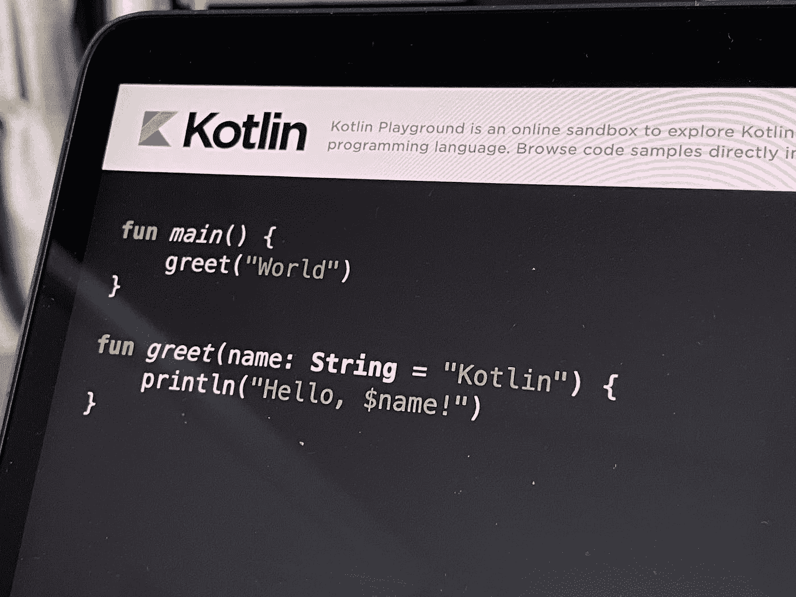
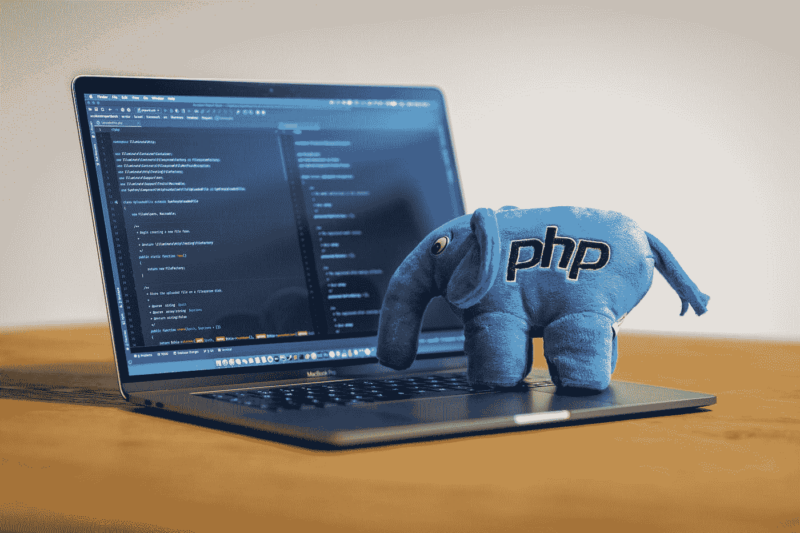

# 2022 年要学的 7 种编程语言

> 原文：<https://javascript.plainenglish.io/7-best-programming-languages-to-learn-in-2022-e4672a4f82d2?source=collection_archive---------9----------------------->

## 编程；编排

## 2022 年最值得学习的编程语言列表。

Photo by [AltumCode](https://unsplash.com/@altumcode?utm_source=medium&utm_medium=referral) on [Unsplash](https://unsplash.com?utm_source=medium&utm_medium=referral)

编程，一般来说，即使是原始的编程，也是从 1883 年就开始了。在当今世界，这是一项非常重要的技能，你只需要学习就可以了。通过编程，你真的可以做任何你想做的事情，编写 web 应用程序、移动应用程序、桌面应用程序、服务器后端、自动化机器人等等。

## 1.计算机编程语言

Python 已经成为近年来最受欢迎的语言，因为它是最容易学习的语言之一。尽管它很容易学，但它的语言比看起来要强大得多。

它可以用于创建人工智能、数据科学、机器学习过程等等。这种语言还支持您可以轻松导入的库和框架，并支持创建 GUI。

Photo by [Hitesh Choudhary](https://unsplash.com/@hiteshchoudhary?utm_source=medium&utm_medium=referral) on [Unsplash](https://unsplash.com?utm_source=medium&utm_medium=referral)

这种语言不像您在这一点上所习惯的那样使用分号，它更多地用于后端，但也可以用于前端。

## 2.Java 语言(一种计算机语言，尤用于创建网站)

Java 是最强大的编程语言之一，自 1995 年问世以来，至今已在超过 30 亿台设备上使用。Java 不同于 Python，它是一种面向对象的语言，所以你可以用类来工作，它更像是基于类型的语言。

Java 可以用于桌面应用、web 开发、移动应用、云应用、人工智能等等。

Photo by [Emile Perron](https://unsplash.com/@emilep?utm_source=medium&utm_medium=referral) on [Unsplash](https://unsplash.com?utm_source=medium&utm_medium=referral)

如果你关心这类事情，你可以用 Java 开发游戏《《我的世界》》的扩展，比如插件和插件。

## 3.Java Script 语言

JavaScript 是网络上最流行的编程语言之一。它用于网页的功能方面，例如，硬动画、按钮动作、发送表单、API、DOM 元素操作等等。

这种语言及其框架——节点。JS 真的是建设网站最强大的工具。如前所述，它可用于创建网站和整个前端节点。JS 它也可以用于后端操作。

Photo by [Gabriel Heinzer](https://unsplash.com/@6heinz3r?utm_source=medium&utm_medium=referral) on [Unsplash](https://unsplash.com?utm_source=medium&utm_medium=referral)

这种语言有许多著名的框架——jQuery、React、React-Native、Vue、electronic 等等。

## 4.科特林

Kotlin 是一种跨平台编程语言，旨在开发 Android 移动应用程序。它的语法与 Java 非常相似，因为 Kotlin 是从 Java 发展而来的，目的是创建一个更容易使用的环境。它们类似于一个点，你可以将一个代码从一个转换到另一个。

Photo by [Louis Tsai](https://unsplash.com/@louis993546?utm_source=medium&utm_medium=referral) on [Unsplash](https://unsplash.com?utm_source=medium&utm_medium=referral)

这种语言可以用于任何类型的开发，服务器端或客户端 web，也可以用于 Android 应用程序。

## 5.服务器端编程语言（Professional Hypertext Preprocessor 的缩写）

PHP 是一种通用脚本语言，它是第一种可以与 HTML webs 一起使用来增加更多功能的服务器端语言。

当 JavaScript 首次发布时，它不能做今天能做的那么多事情。PHP 可以生成动态页面内容、操作服务器上的文件、收集表单数据、处理 cookies、操作数据库数据等等。

Photo by [Ben Griffiths](https://unsplash.com/@benofthenorth?utm_source=medium&utm_medium=referral) on [Unsplash](https://unsplash.com?utm_source=medium&utm_medium=referral)

现在，你可以在 HTML 中使用 Node.js，它也可以做这些事情，但是如果你使用 PHP，你也会得到很好的体验和结果。

## 6.迅速发生的

Swift 是苹果公司设计开发的一种编程语言。它用于在他们的产品上创建苹果外观的应用程序，适用于 iOS、watchOS、macOS 等等。它的语法与其后继的 C 语言和 Objective-C 语言相似。

Photo by [Maxwell Nelson](https://unsplash.com/@maxcodes?utm_source=medium&utm_medium=referral) on [Unsplash](https://unsplash.com?utm_source=medium&utm_medium=referral)

它可以被视为未来市场上最好的高性能和安全的应用程序语言。

## 7.C#

C#是一种运行在。NET 框架，由微软在 2000 年开发。

它用于创建桌面应用程序，例如在 Visual Studio 中，以及各种类型的游戏，例如在 Unity 中。C#也是一种面向对象的语言，在任何地方都有很高的需求。

Photo by [Maksym Zakharyak](https://unsplash.com/@zakharyak?utm_source=medium&utm_medium=referral) on [Unsplash](https://unsplash.com?utm_source=medium&utm_medium=referral)

## 结论

我确信这里没有提到的其他编程语言(例如，C、Ruby、Go、R 等。)也是非常有用和强大的语言，但在我看来，这些是值得学习的 2022 年开发语言。

*更多内容请看*[***plain English . io***](https://plainenglish.io/)*。报名参加我们的* [***免费周报***](http://newsletter.plainenglish.io/) *。关注我们关于*[***Twitter***](https://twitter.com/inPlainEngHQ)*和*[***LinkedIn***](https://www.linkedin.com/company/inplainenglish/)*。加入我们的* [***社区不和谐***](https://discord.gg/GtDtUAvyhW) *。*