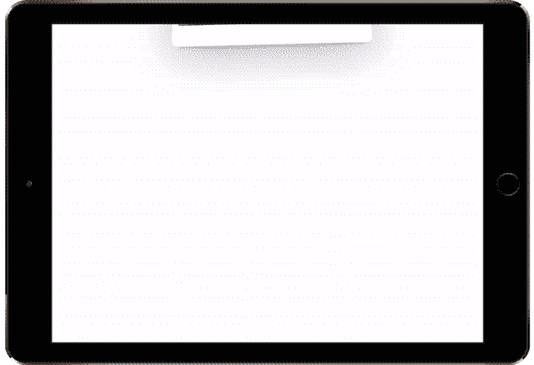
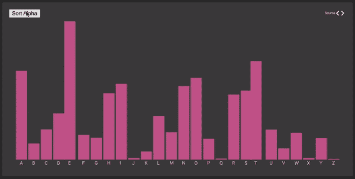
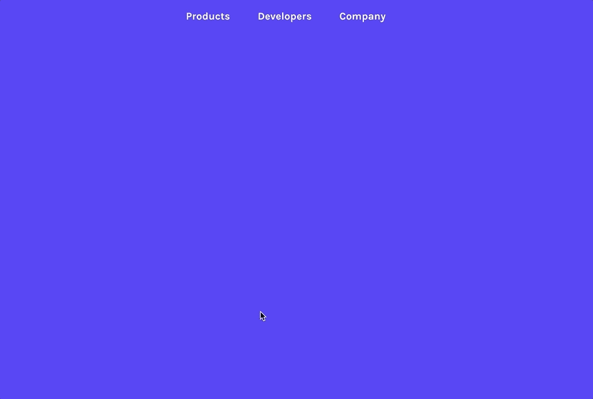
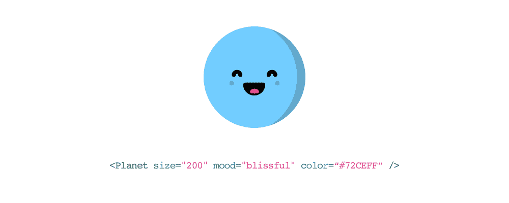
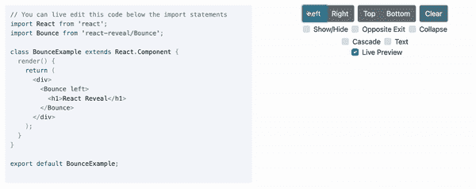
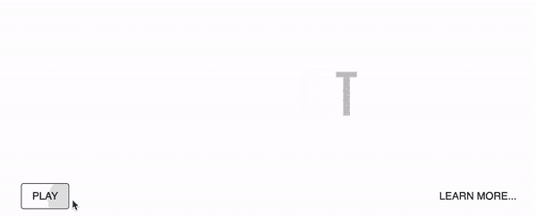

# 你可以在下一个项目中使用的 7 个最佳 React 动画库

> 原文：<https://javascript.plainenglish.io/7-best-react-animation-library-you-can-use-in-your-next-project-b61398b5d772?source=collection_archive---------4----------------------->

## 创造出色的用户体验

Photo by [Nubelson Fernandes](https://unsplash.com/@nublson?utm_source=medium&utm_medium=referral) on [Unsplash](https://unsplash.com?utm_source=medium&utm_medium=referral)

我认为很难找到一个不喜欢动画的人。应用程序中的动画使用户体验更好，并使用户参与到应用程序中。但是如果你把动画放错了地方或者没有有效地处理它，也可能会引起问题。这里我整理了 7 个资源，可以用漂亮的动画让你的 app 的用户体验更好。

# 1.反作用弹簧

这是 React 最常用的动画库之一，拥有超过 23k 个明星。这是一个基于 spring-physics 的动画库，可以满足你的大部分 UI 动画需求。它可以帮助你用你需要的工具将你的想法牢牢地融入到移动界面中。它提供了几个 API，如`spring`、`Motion`、`StaggeredMotion`等。

 [## ✌️:一个基于弹簧物理学的 react 动画库

### react-spring 是一个跨平台的 spring-physics 首个动画库。这很简单:只是关于我们的一点点…

github.com](https://github.com/pmndrs/react-spring) 

# 2.反应移动

如果你的应用程序显示某种数据，那么这是一个有用的库。这个库提供了漂亮的、数据驱动的动画。它提供了很多特性，比如动画 HTML、SVG 和 React-Native、延迟、持续时间和放松的细粒度控制、自定义补间函数等等。它在 GitHub 上有超过 6k 颗星。

 [## GitHub-SG hall/React-Move:React Move | React 的漂亮的数据驱动动画

### React 漂亮的数据驱动动画。只有 3.5 kb(gzip)！动画 HTML，SVG 和 React-原生细粒度…

github.com](https://github.com/sghall/react-move) 

# 3.反应-翻转-工具包

如果你想在转换过程中显示动画，这可能是一个很好的库。这是一个轻量级的魔术库，用于可以定制的布局过渡。它在 GitHub 上有超过 3k 颗星。

 [## GitHub-aholachek/react-flip-toolkit:一个用于可配置布局的轻量级魔动库…

### 与其他 React 翻转库的比较 npm 安装 react-flip-toolkit 或 yarn 添加 react-flip-toolkit Wrap all…

github.com](https://github.com/aholachek/react-flip-toolkit) 

# 4.react-卡哇伊

这是一个可爱的 SVG 插图库。“卡哇伊”是一个日语单词。意思是可爱。如果你想给你的 react 应用程序添加一些可爱和个性的元素，这将会对你有用。这个库的使用非常简单。它在 Github 上有超过 2.5k 颗星。

 [## GitHub - miukimiu/react-kawaii:可爱的 SVG React 组件

### React Kawaii 是一个可爱的 SVG 插图库(React 组件)。理想的，如果你想给一些可爱和…

github.com](https://github.com/miukimiu/react-kawaii) 

# 5.反应显示

这个库可以在你的应用程序中使用，以制作各种各样的滚动动画。它提供了许多效果，如淡化，翻转，旋转，缩放等。它在 GitHub 上有超过 2k 颗星。

 [## GitHub - rnosov/react-reveal:轻松地将滚动动画添加到 react 应用程序中

### 轻松地在你的 React 应用程序中添加滚动显示动画

github.com](https://github.com/rnosov/react-reveal) 

# 6.反作用运动

这是另一个使用最多的动画库，有超过 20k 个明星。当动画组件时，在 95%的情况下，我们不需要使用硬编码的缓动曲线和持续时间。当使用这个库时，你不必担心像中断动画行为这样的小问题。它还为 React 的`TransitionGroup`提供了一个替代的、更强大的 API。

 [## GitHub - chenglou/react-motion:解决你动画问题的弹簧。

### 动画显示计数器从 0 到 10。有关更高级的用法，请参见下文。Npm: npm 安装-保存反应-动作鲍尔:不要…

github.com](https://github.com/chenglou/react-motion) 

# 7.反应-简单-动画

顾名思义，这个库使 React 中的动画变得简单。它提供了许多功能，如从样式 A 到 B 的动画，CSS 关键帧动画，链接动画序列等。它在 GitHub 上有超过 1.5k 颗星。

 [## GitHub-blue bill 1049/react-simple-animate:🎯React UI 动画变得简单

### React UI 动画使从 A 风格到 B 风格的动画变得简单 CSS 关键帧动画链动画序列微小的尺寸…

github.com](https://github.com/bluebill1049/react-simple-animate) 

今天到此为止。我相信这些库会帮助你让你的应用程序的用户体验更好。

如果你知道任何其他漂亮的 React 动画库，请在评论中分享它们。直到我们再次相遇。干杯！

***想要连接？***

*如果你愿意，可以在*[***Twitter***](https://twitter.com/FarhanT99598254)**或*[***LinkedIn***](https://www.linkedin.com/in/farhan-tanvir-b08520151/)***上与我联系。****

**更多内容请看*[***plain English . io***](https://plainenglish.io/)*。报名参加我们的* [***免费周报***](http://newsletter.plainenglish.io/) *。关注我们关于*[***Twitter***](https://twitter.com/inPlainEngHQ)*和*[***LinkedIn***](https://www.linkedin.com/company/inplainenglish/)*。查看我们的* [***社区不和谐***](https://discord.gg/GtDtUAvyhW) *加入我们的* [***人才集体***](https://inplainenglish.pallet.com/talent/welcome) *。**