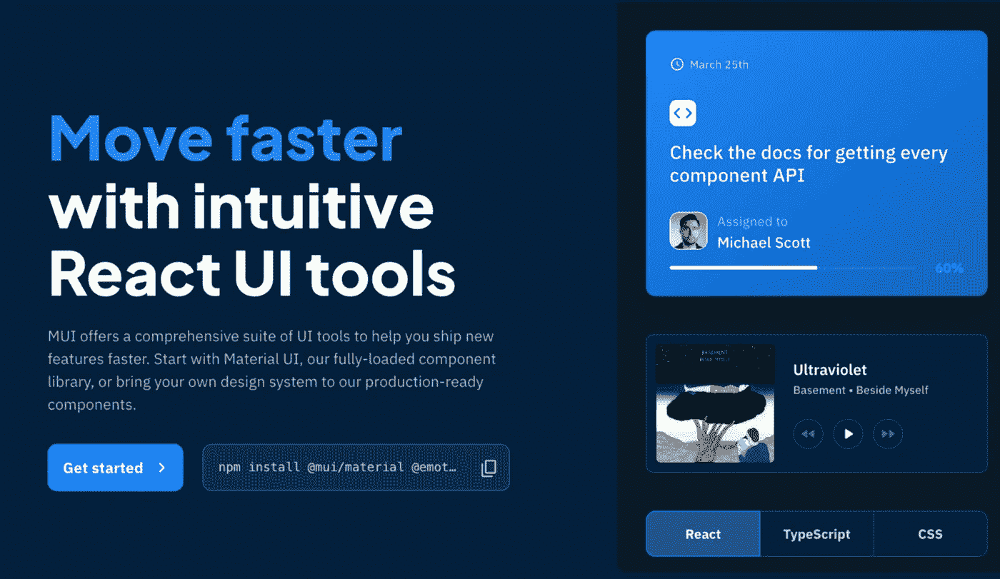
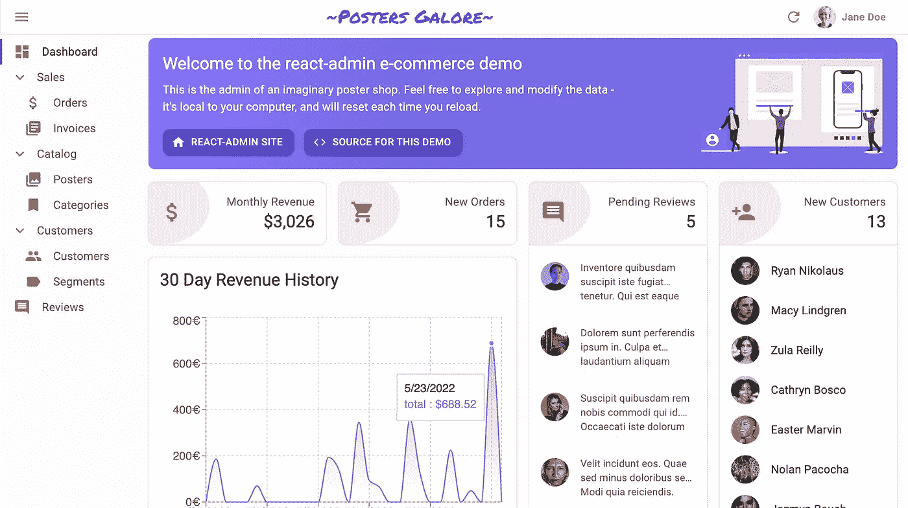
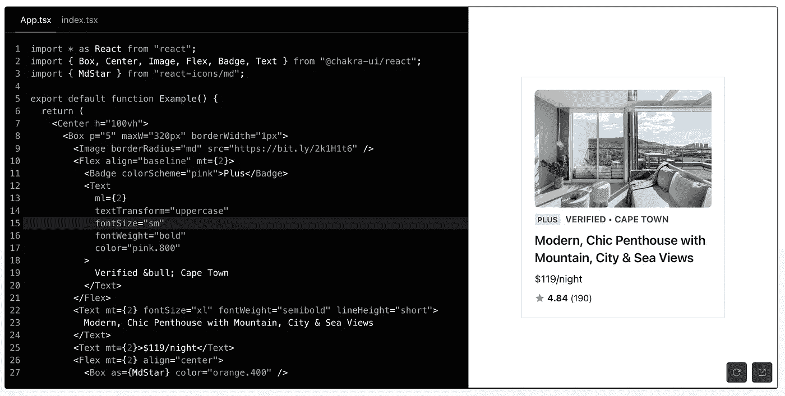
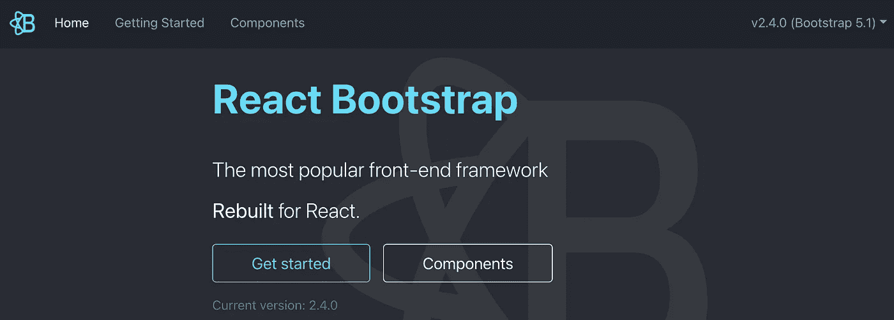
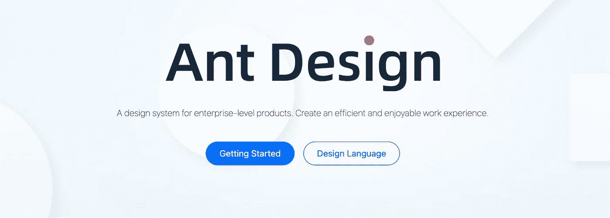
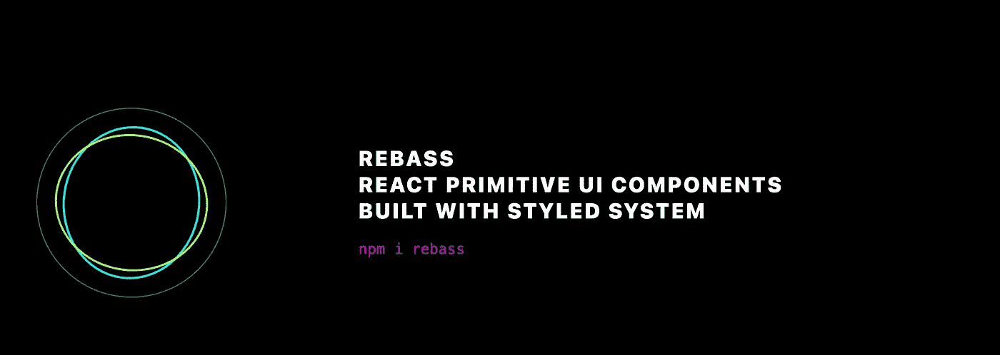

# 你应该在下一个项目中使用的 7 个最好的用户界面库

> 原文：<https://javascript.plainenglish.io/7-best-react-ui-library-you-should-use-in-your-next-project-6e2f490883ab?source=collection_archive---------4----------------------->

## 现在就使用这些 React UI 库来创建一个非常棒的应用程序


Photo by [Nubelson Fernandes](https://unsplash.com/@nublson?utm_source=medium&utm_medium=referral) on [Unsplash](https://unsplash.com?utm_source=medium&utm_medium=referral)

从头开始创建 UI 有时会很耗时。当一个库可以为你做的时候，为什么要写自定义的功能呢？开发人员最好的朋友和生活品味是图书馆。在我看来，一个好的项目利用了一些最好的可用库。我整理了一个包含 7 个 React UI 库的列表，可以帮助你在更短的时间内创建一个很棒的 React 应用。

# 1.MUI 核心



这是我的最爱之一。我在我的大部分项目中使用这个。MUI Core(以前的 Material-UI)是一个开源项目，帮助 React 开发者实现 Google 的材料设计指南。它在 Github 上有超过 78K 颗星，是 React 开发人员中流行的 UI 设计框架。所以我相信没有太多理由不用这个。

[](https://github.com/mui/material-ui) [## GitHub - mui/material-ui: MUI Core(以前的 material-ui)是 React UI 库，你总是…

### MUI Core(以前的 Material-UI)就是你一直想要的 React UI 库。遵循自己的设计体系，或者从…

github.com](https://github.com/mui/material-ui) 

# 2.反应-管理



如果您正在创建一个数据驱动的 React 应用程序，那么这对您来说是一个很好的资源。这个库将帮助您使用 ES6、React 和 Material Design 构建运行在 REST/graph QL API 之上的浏览器中的 B2B 应用程序。它在 Github 上有超过 19k 的星和超过 4k 的叉。

[](https://github.com/marmelab/react-admin) [## GitHub - marmelab/react-admin:一个前端框架，用于构建运行在…

### 一个前端框架，用于构建运行在 REST/graph QL API 之上的浏览器中的 B2B 应用程序，使用 ES6，React…

github.com](https://github.com/marmelab/react-admin) 

# 3.Chakra UI



Chakra UI 是一个组件库，为您提供创建 React 应用程序所需的构建模块。它简单、模块化、易于使用。它提供了像黑暗模式、样式简易、可访问性等特性。它在 Github 上有超过 26k 颗星。

[](https://github.com/chakra-ui/chakra-ui/) [## GitHub - chakra-ui/chakra-ui: ⚡️简单，模块化和可访问的用户界面组件，为您的反应…

### ⚡️简单，模块化和可访问的用户界面组件为您的反应应用

github.com](https://github.com/chakra-ui/chakra-ui/) 

# 4.反应引导



Bootstrap 是最受欢迎的前端框架之一，它将帮助您开发响应迅速、移动优先的网站。顾名思义，这是一个为基于 React 的应用程序提供引导组件的库。它在 Github 上有超过 20k 颗星星。

[](https://github.com/react-bootstrap/react-bootstrap) [## GitHub-react-Bootstrap/React-Bootstrap:用 React 构建的引导组件

### React-Bootstrap 与各种版本的 Bootstrap 兼容。因此，您需要确保使用正确的…

github.com](https://github.com/react-bootstrap/react-bootstrap) 

# 5.蚂蚁设计



我觉得这是 React UI 库最有星的 Github 库之一，有 80k 多星，34k 多叉。如果你想创建一个企业级的应用程序，那么这是一个很好的选择。

[](https://github.com/ant-design/ant-design) [## GitHub - ant-design/ant-design:一种企业级 UI 设计语言和 React UI 库

### 🌈为 web 应用程序设计的企业级 UI。📦一套开箱即用的高质量 React 组件。🛡…

github.com](https://github.com/ant-design/ant-design) 

# 6.语义-用户界面-反应


语义 UI 是一个开发框架，它有助于使用对人类友好的 HTML 创建漂亮的、响应性强的布局。Semantic- UI-React 是语义 UI 的官方 React 集成。它在 Github 上有超过 12k 的星星。

[](https://github.com/Semantic-Org/Semantic-UI-React) [## GitHub-Semantic-Org/Semantic-UI-React:官方的语义-UI-React 集成

### 有关介绍、用法信息和示例，请参见文档。亚马逊出版-全方位服务…

github.com](https://github.com/Semantic-Org/Semantic-UI-React) 

# 7.雷巴斯



Styled System 允许您使用基于主题比例的基于约束的样式道具快速创建自定义 UI 组件。这个库是遵循样式化系统的 UI 组件的集合。它在 Github 上有超过 7k 颗星。

[](https://github.com/rebassjs/rebass) [## GitHub - rebassjs/rebass:用 styled-system 构建的 React 原语 UI 组件。

### 使用样式化系统构建的 React 原始 UI 组件。https://rebassjs.org 启动你的设计系统不沸腾…

github.com](https://github.com/rebassjs/rebass) 

今天到此为止。相信这些库对你的开发之旅会有很大的帮助。

如果你知道任何其他漂亮的 React UI 库，请在评论中分享。直到我们再次相遇。干杯！

```
**Want to Connect?**If you want to,you can connect with me on [**Twitter**](https://twitter.com/FarhanT99598254) or [**LinkedIn**](https://www.linkedin.com/in/farhan-tanvir-b08520151/).
```

*更多内容请看*[***plain English . io***](https://plainenglish.io/)*。报名参加我们的* [***免费周报***](http://newsletter.plainenglish.io/) *。关注我们关于*[***Twitter***](https://twitter.com/inPlainEngHQ)*和*[***LinkedIn***](https://www.linkedin.com/company/inplainenglish/)*。查看我们的* [***社区不和谐***](https://discord.gg/GtDtUAvyhW) *加入我们的* [***人才集体***](https://inplainenglish.pallet.com/talent/welcome) *。*