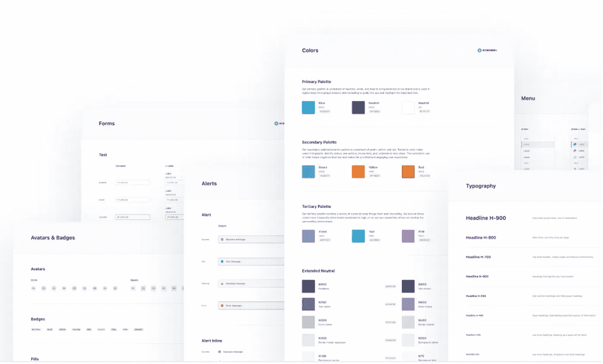
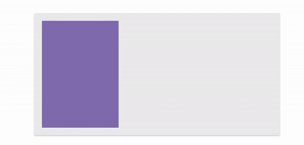
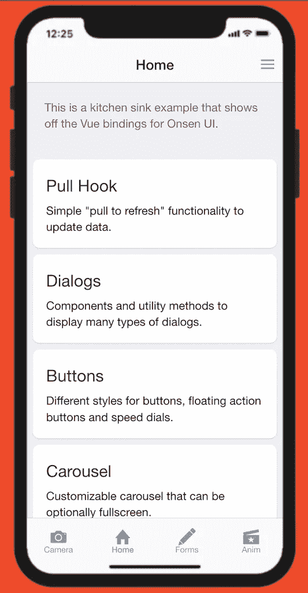
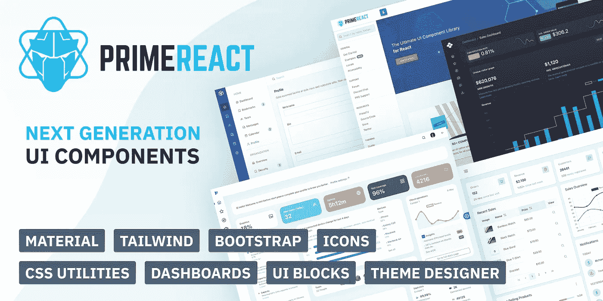

# 你应该在下一个项目中使用的 7 个最好的用户界面库

> 原文：<https://javascript.plainenglish.io/7-best-react-ui-library-you-should-use-in-your-next-project-c8b2d50acb6f?source=collection_archive---------4----------------------->

## 第 2 部分:立即创建一个出色的应用程序


Photo by [Fili Santillán](https://unsplash.com/es/@filisantillan?utm_source=medium&utm_medium=referral) on [Unsplash](https://unsplash.com?utm_source=medium&utm_medium=referral)

有时候从头开始构建一个 UI 需要很长时间。当一个库可以完成必要的工作时，为什么还要创建自己的库呢？库是开发者的救星和最好的朋友。我认为任何像样的项目都会使用一些最好的库。因此，我列出了 7 个 React UI 库，它们会让你更容易、更快地构建令人敬畏的 React 应用。

# 1.蓝图


如果您正在创建一个数据驱动的应用程序，那么这对您来说是一个很好的资源。这是一个用 React 构建的基于 web 的 UI 工具包。它最适合为支持 IE11 和当前浏览器的桌面程序创建复杂的、数据密集的 web 界面。这不是一个移动优先的 UI 工具包。它在 Github 上有超过 19k 的星星和超过 2k 的分叉。

[](https://github.com/palantir/blueprint) [## GitHub - palantir/blueprint:一个基于 React 的 web 工具包

### Blueprint 是一个基于 React 的 web 用户界面工具包。它是为构建复杂的、数据密集的 web 界面而优化的…

github.com](https://github.com/palantir/blueprint) 

# 2.常绿树



这是一个基于客户产品体验的[细分](https://segment.com/) UI 框架。它是一个灵活的框架，它的大部分视觉设计是设计团队和外部贡献者大量迭代的结果。这个框架的原则是灵活性、合理的默认和贡献者友好。它在 Github 上有超过 11k 颗星和超过 500 个分叉。

[](https://github.com/segmentio/evergreen/) [## GitHub - segmentio/evergreen:🌲Evergreen React UI 框架(按细分市场)

### 开箱即用。Evergreen 包含一组开箱即用的 React 组件。灵活&…

github.com](https://github.com/segmentio/evergreen/) 

# 3.反应阱


该库包括面向组合和面向控制的 React 引导组件。该库既不需要 jQuery 也不需要 Bootstrap JavaScript。内容的高级定位，如工具提示、弹出窗口和自动翻转下拉菜单，依赖于通过[反应弹出窗口](https://github.com/popperjs/react-popper)的[弹出窗口。它在 Github 上有 10k 多星，1k 多叉。](https://popper.js.org/)

[](https://github.com/reactstrap/reactstrap) [## GitHub - reactstrap/reactstrap:简单的 React 引导 5 组件

### Bootstrap 5 的无状态 React 组件。如果您使用 Bootstrap 4，您将需要使用 Reactstrap v8，遵循…

github.com](https://github.com/reactstrap/reactstrap) 

# 4.索环



这个基于 React 的框架在一个简洁的包中提供了响应性、模块化、可访问性和主题。根据他们的网站，这个框架被一些著名的公司使用，如网飞，优步等。它在 Github 上有超过 7.5k 的星星和超过 500 个分叉。

[](https://github.com/grommet/grommet) [## GitHub - grommet/grommet:一个基于 react 的框架，提供可访问性、模块化…

### 有关更多信息，请访问索环网站。在打开问题或拉动请求之前，请阅读提供的…

github.com](https://github.com/grommet/grommet) 

# 5.翁塞努伊



这是一个框架和 SDK，用于创建使用 HTML5 和 JavaScript 的移动应用。这个库将帮助你开发出令人惊叹的、高效的跨平台移动应用。通过 Angular 1、2、React 和 Vue.js 的绑定，它建立在 Web 组件的基础上。它在 Github 上有超过 8.5k 的星和超过 1k 的叉。

[](https://github.com/OnsenUI/OnsenUI) [## GitHub - OnsenUI/OnsenUI:使用 HTML5 和 JavaScript 的移动应用开发框架和 SDK

### 使用 HTML5 和 JavaScript 的移动应用开发框架和 SDK。创建漂亮和高性能的跨平台…

github.com](https://github.com/OnsenUI/OnsenUI) 

# 6.rsuite


对于企业系统产品，这是 React 组件库的集合。对于开发者来说，这是一个设计良好且有帮助的 UI 框架。该库支持所有主流浏览器和平台的最新稳定版本。不再支持 IE<=10。这是为了在当代桌面浏览器上使用，而不是在移动浏览器上使用。它在 Github 上有超过 6.5k 的星星和超过 500 个分叉。

[](https://github.com/rsuite/rsuite) [## GitHub - rsuite/rsuite: 🧱一套 React 组件。

### English | 中文版 React Suite is a set of react component libraries for enterprise system products. It is a…

github.com](https://github.com/rsuite/rsuite) 

# 7.primereact



这是一个全面的开源 React UI 组件集合。其 95%的部分是本地的，只有少数例外需要第三方，比如 GMap 的谷歌地图。它在 Github 上有超过 2.5k 的星星和超过 500 个分叉。

[](https://github.com/primefaces/primereact) [## GitHub - primefaces/primereact:最完整的 React UI 组件库

### PrimeReact 是 React 的一组丰富的开源 UI 组件。请访问 PrimeReact 主页，了解现场展示和…

github.com](https://github.com/primefaces/primereact) 

# 前一部分在哪里？

还有很多其他很棒的 React UI 库。我想分享尽可能多的资源，让你的开发之旅更轻松。

如果您错过了前面的部分，请查看下面的内容。

[](/7-best-react-ui-library-you-should-use-in-your-next-project-6e2f490883ab) [## 你应该在下一个项目中使用的 7 个最好的用户界面库

### 现在就使用这些 React UI 库来创建一个非常棒的应用程序

javascript.plainenglish.io](/7-best-react-ui-library-you-should-use-in-your-next-project-6e2f490883ab) 

今天到此为止。相信这些库对你的开发之旅会有很大的帮助。

如果你知道任何其他漂亮的 React UI 库，请在评论中分享。直到我们再次相遇。干杯！

```
**Want to Connect?**If you want to,you can connect with me on [**Twitter**](https://twitter.com/FarhanT99598254) or [**LinkedIn**](https://www.linkedin.com/in/farhan-tanvir-b08520151/).
```

*更多内容请看*[***plain English . io***](https://plainenglish.io/)*。报名参加我们的**[***免费周报***](http://newsletter.plainenglish.io/) *。关注我们关于*[***Twitter***](https://twitter.com/inPlainEngHQ)*和*[***LinkedIn***](https://www.linkedin.com/company/inplainenglish/)*。查看我们的* [***社区不和谐***](https://discord.gg/GtDtUAvyhW) *加入我们的* [***人才集体***](https://inplainenglish.pallet.com/talent/welcome) *。**