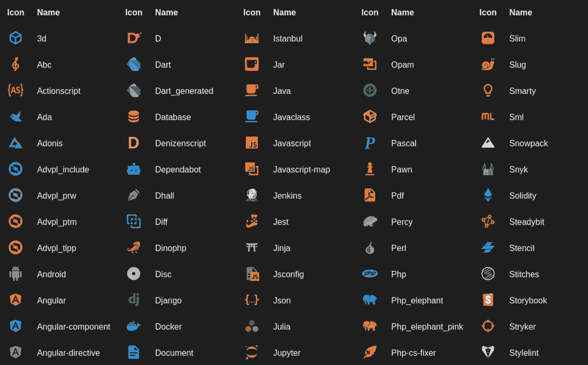
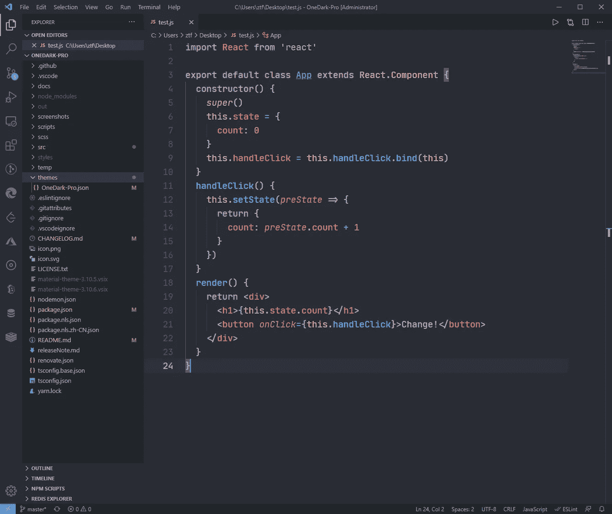
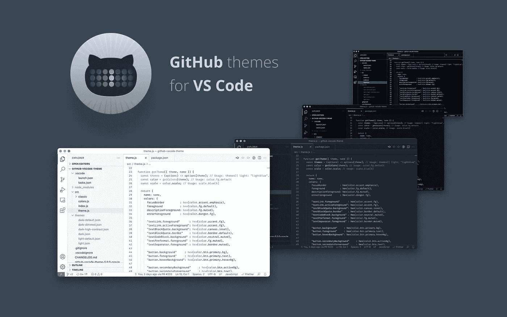
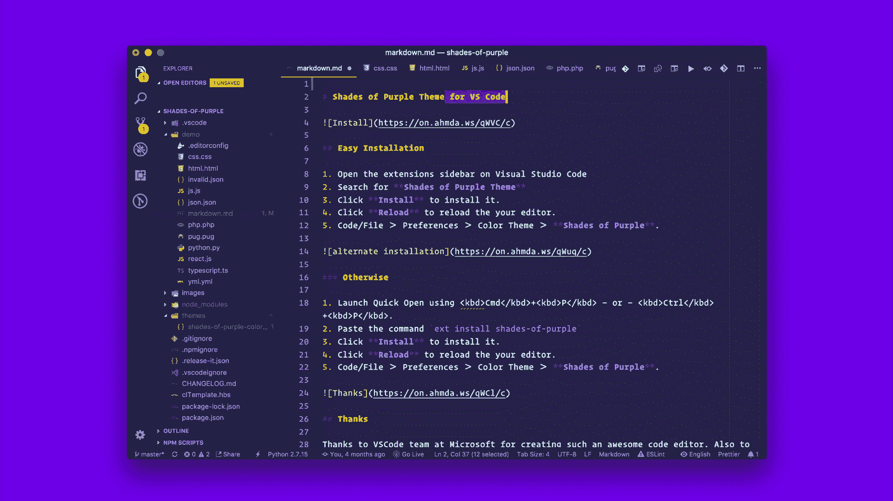
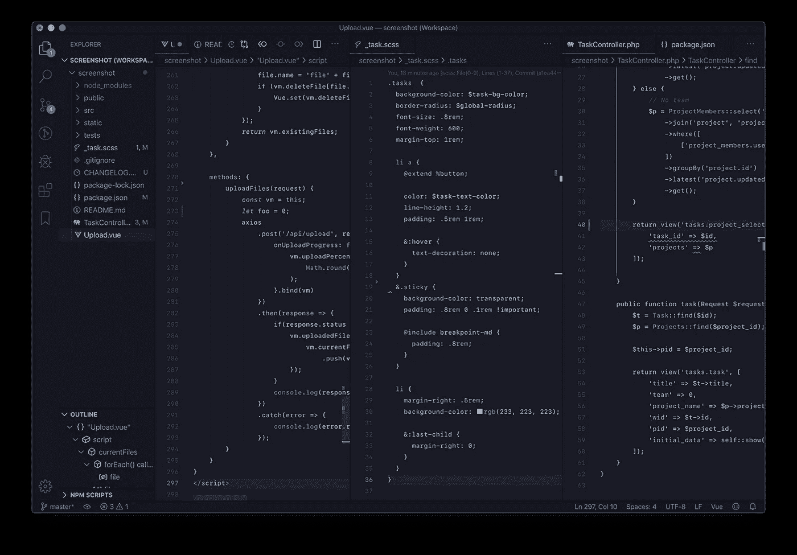

# 让你的生活更美好的 7 个最佳 VSCode 主题

> 原文：<https://javascript.plainenglish.io/7-best-vscode-themes-to-make-your-work-life-beautiful-1123ae0a4a5d?source=collection_archive---------1----------------------->

## 让你的 IDE 更漂亮，提高你的生产力

Photo by [Karl Pawlowicz](https://unsplash.com/@karlp?utm_source=medium&utm_medium=referral) on [Unsplash](https://unsplash.com?utm_source=medium&utm_medium=referral)

作为一名开发人员，我们大部分时间都在寻找 IDE。一个漂亮的 IDE 不仅能让你赏心悦目，还能提高你的工作效率。

VSCode 是开发人员可以拥有的最好的 IDE 之一。虽然美丽的定义取决于一个人的视角，但在这里我整理了 7 个顶级安装的 VSCode 主题，它们会让你的生活更加愉快。

# 1.材料图标主题

这是我现在正在使用的一个。这是我的最爱之一。我想你已经明白了，这个主题提供了基于谷歌材质设计的文件和文件夹图标。这个主题有很多功能，如文件夹和图标颜色定制，改变图标不透明度等。也是安装量最大的主题之一，安装量超过 12.5M。它也有 5 颗星的评级。所以我相信你会喜欢的，我强烈建议这样。

 [## 材料图标主题- Visual Studio 市场

### 在你的 VS 代码中加入材质设计图标。

marketplace.visualstudio.com](https://marketplace.visualstudio.com/items?itemName=PKief.material-icon-theme) 

# 2.一个黑暗职业

我觉得黑色主题是开发者必备的东西。这是你能为你心爱的 IDE 得到的最好的黑暗主题之一。它提供了许多主题，如复古，侏儒，终端等。也是另一个安装量最大的主题，安装量超过 550 万。它在市场上被评为 4.5 级。

 [## 一个黑暗的专业视觉工作室市场

### Atom 标志性的 One Dark 主题，也是 VS 代码安装最多的主题之一！厌倦了浏览文件？获得…

marketplace.visualstudio.com](https://marketplace.visualstudio.com/items?itemName=zhuangtongfa.Material-theme) 

# 3.GitHub 主题

相信大家都用 Github。如果你也想在你的 IDE 中感受 Github，那么这个主题是你最好的选择。它提供了不同种类的主题，如 GitHub 深色色盲、GitHub 浅色高对比度等。它的安装量超过 400 万，在市场上的评级为 4.5。

 [## GitHub 主题- Visual Studio 市场

### 转到 VS 市场。点击“安装”按钮。然后选择一个主题。GitHub 主题试图匹配主题…

marketplace.visualstudio.com](https://marketplace.visualstudio.com/items?itemName=GitHub.github-vscode-theme) 

# 4.夜猫子

作为一名开发人员，我喜欢在晚上工作。我相信我的大脑在晚上工作得很好。如果你和我一样，我想你也会喜欢这个主题。已经为我们这些深夜编码员们微调过了。选择颜色时考虑到了色盲人群和光线不足的情况。对于阅读理解和最佳眼花缭乱，决定也是基于有意义的对比。它的安装量超过 1M，等级为 5。

 [## 夜猫子- Visual Studio 市场

### 一个为夜猫子设计的 Visual Studio 代码主题。对于我们这些喜欢熬夜编码的人来说，这是很好的调整…

marketplace.visualstudio.com](https://marketplace.visualstudio.com/items?itemName=sdras.night-owl) 

# 5.紫色的阴影

这是为你心爱的 VS 代码编辑器和终端准备的专业主题，用手工挑选的，大胆的紫色色调。它有一个超过 100 万的装置。它的评级也是 5。

 [## 紫色的阴影- Visual Studio 市场

### Visual Studio 代码的扩展-🦄一个专业的主题套件，为您的虚拟世界精心挑选大胆的紫色色调

marketplace.visualstudio.com](https://marketplace.visualstudio.com/items?itemName=ahmadawais.shades-of-purple) 

# 6.84 年合成波

如果你真的想让你的代码发光，那么这就是你正在寻找的主题。现代 Synthwave 乐队的音乐和封面艺术，如 FM-84、Timecop 1983 和 The Midnight 都影响了这种配色方案。它的安装超过 885k，等级为 5。

 [## SynthWave '84 - Visual Studio 市场

### 你还记得 84 年那个漫长的夏天吗？在海洋公路上巡航，风在我们的…

marketplace.visualstudio.com](https://marketplace.visualstudio.com/items?itemName=RobbOwen.synthwave-vscode) 

# 7.东京之夜

你喜欢东京的夜生活吗？如果你这样做，你会喜欢这个。如果你没有，我相信你也会喜欢这个。这是一个极简主义的主题，灵感来自东京夜晚市中心的灯光。安装量超过 485k，评级为 5。

 [## 东京夜-视觉工作室市场

### 一个干净的 Visual Studio 代码主题，庆祝东京市中心夜晚的灯光。注意:许多 UI 元素是…

marketplace.visualstudio.com](https://marketplace.visualstudio.com/items?itemName=enkia.tokyo-night) 

# 类似职位

 [## React 开发人员必须了解的 7 个 VS 代码扩展

### 提高你的反应效率。

javascript.plainenglish.io](/7-must-know-vs-code-extensions-for-a-react-developer-d62bf5438740) 

你现在用的是什么主题？

今天到此为止。我希望这个主题将有助于使开发之旅变得愉快。

如果你知道任何其他漂亮的 VS 代码主题，请在评论中分享。直到我们再次相遇。干杯！

***想要连接？***

*如果你愿意，可以在* [***推特***](https://twitter.com/FarhanT99598254) 上与我联系

*更多内容请看*[***plain English . io***](https://plainenglish.io/)*。报名参加我们的* [***免费周报***](http://newsletter.plainenglish.io/) *。关注我们关于*[***Twitter***](https://twitter.com/inPlainEngHQ)*和**[***LinkedIn***](https://www.linkedin.com/company/inplainenglish/)*。查看我们的* [***社区不和谐***](https://discord.gg/GtDtUAvyhW) *加入我们的* [***人才集体***](https://inplainenglish.pallet.com/talent/welcome) *。**