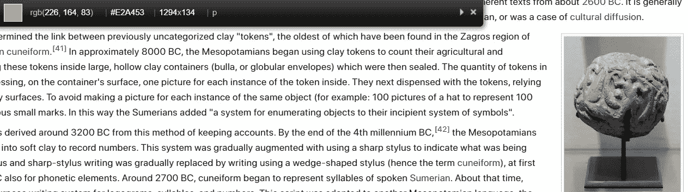

# 面向 Web 开发人员的 7 个 Chrome 扩展

> 原文：<https://javascript.plainenglish.io/7-chrome-extensions-for-web-developers-12a19aeeea6d?source=collection_archive---------6----------------------->

## 发展

## 让你工作更快的 Chrome 扩展列表。

en.wikipedia.org

Google Chrome 扩展是直接在浏览器中实现的非常高效的助手。它们可以帮助你揭示关于网页本身的某些信息，并提供一种更简单的方法来找到这些信息，而不是试图自己做所有的事情并检查你遇到的每一个页面。

# 1.字体忍者

字体忍者是一个免费的扩展，可以检测网页上的所有字体，以及`font weight`、`font size`、`line height`、`spacing`和`colour`。

当按下工具栏上的字体忍者图标时，会出现一个窗口，显示网页上的所有字体。书签选项提供字体保存功能，您可以稍后在`saved`选项卡中返回。

信息选项显示关于字体、`font italics`、`font weights`的附加信息，以及在哪里可以买到该字体，多少钱。

[链接到市场](https://chrome.google.com/webstore/detail/fonts-ninja/eljapbgkmlngdpckoiiibecpemleclhh)

# CSS 查看器

CSS Viewer 是另一个获取 HTML 元素样式的免费扩展。对于文本，该扩展可以显示文本的所有属性以及设置了哪些属性。

只需点击扩展工具栏中的图标就会打开这个窗口，然后你可以指向任何元素，关于 DOM 的信息就会显示出来。

en.wikipedia.org

[链接到市场](https://chrome.google.com/webstore/detail/cssviewer/ggfgijbpiheegefliciemofobhmofgce)

# JSON 查看器

顾名思义，JSON Viewer 是用于 JSON 页面和数据检索的格式化视图。这个扩展不需要任何启动操作，它只是简单地在一个格式化的视图中显示页面。

my-json-server.typicode.com

有很多设置你可以调整，`theme`属性，`spacing`属性一直到用 CSS 写的`custom styles`。

[链接到市场](https://chrome.google.com/webstore/detail/json-viewer/gbmdgpbipfallnflgajpaliibnhdgobh)

# Lorem Ipsum 生成器

Lorem Ipsum generator 只是一个占位文本生成器。您可以选择要生成多少个段落以及每个段落中有多少个句子。

要在扩展工具栏中工作，必须通过单击 Lorem Ipsum 生成器图标来启动该扩展。

[链接到市场](https://chrome.google.com/webstore/detail/lorem-ipsum-generator-def/mcdcbjjoakogbcopinefncmkcamnfkdb)

# 色彩奇拉

ColorZilla 是一个免费的扩展，它只是为网页上的任何元素提供颜色选择功能，例如文本、图像和视频。

en.wikipedia.org

这个扩展可以通过点击 ColorZilla 图标从扩展工具栏运行，颜色选择窗口将会出现。

[链接到市场](https://chrome.google.com/webstore/detail/colorzilla/bhlhnicpbhignbdhedgjhgdocnmhomnp)

# 窗口大小调整器

窗口大小调节器的功能是作为网络响应度测试的扩展工具。该扩展仅提供 7 个设备，但这只是预设的，您可以在`settings > presets`中创建自己的设备。

当你点击扩展工具栏中的窗口大小调整图标，一个包含所有设备的小窗口就会出现。

[链接到市场](https://chrome.google.com/webstore/detail/window-resizer/kkelicaakdanhinjdeammmilcgefonfh)

# React 开发人员工具

React Developer Tools 是一款针对浏览器 Google Chrome 中 React 项目的调试 React 工具。这个扩展让你可以直接在 Chrome 开发者工具中检查 React 组件和 React DOM，并且增加了两个新的标签——`Components`&`Profiler`。

chrome.google.com

通过单击 React 图标，可以从扩展工具栏运行该扩展。React 扩展只能在 React 项目上运行，因为扩展本身不允许您运行它。

[链接到市场](https://chrome.google.com/webstore/detail/react-developer-tools/fmkadmapgofadopljbjfkapdkoienihi)

# 结论

扩展可以节省大量的时间，特别是当你不需要经常检查 inspect 页面来为你的项目收集资源的时候。这些是我认为对你的 web 开发项目最有用的 Chrome 扩展。我希望，这些将提供一个伟大的时间来使用它们。

*更多内容请看*[***plain English . io***](https://plainenglish.io/)*。报名参加我们的* [***免费周报***](http://newsletter.plainenglish.io/) *。关注我们关于*[***Twitter***](https://twitter.com/inPlainEngHQ)*和*[***LinkedIn***](https://www.linkedin.com/company/inplainenglish/)*。查看我们的* [***社区不和谐***](https://discord.gg/GtDtUAvyhW) *加入我们的* [***人才集体***](https://inplainenglish.pallet.com/talent/welcome) *。*