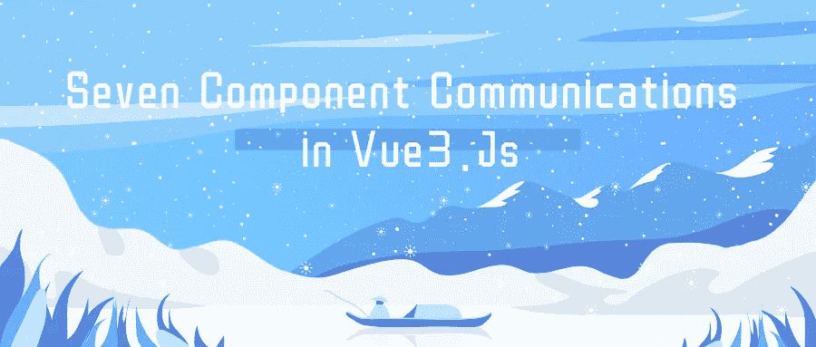
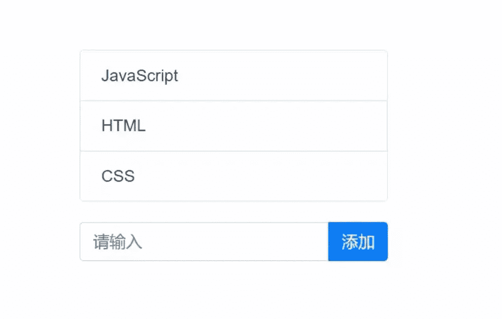

# Vue 3 中的 7 个组件通信

> 原文：<https://javascript.plainenglish.io/7-component-communications-in-vue-3-f4d2d795481d?source=collection_archive---------2----------------------->

## 这里所有的通讯手段都可以使用



# 写在前面

本文采用`<script setup />`的编写方式，比 options API 更自由。那么我们就来说说以下七种组件通信方式:

1.  小道具
2.  发射
3.  v 型车
4.  参考文献
5.  提供/注入
6.  事件总线
7.  vuex/皮尼亚

# 举个例子

本文将使用如下演示，如下图所示:



在上图中，列表和输入框分别是父组件和子组件。根据不同的沟通方式，父子组件会有所调整。

# 1.小道具

道具是 Vue 中最常见的亲子交流方式，使用起来也相对简单。

根据上面的演示，我们在父组件中定义了数据和对数据的操作，子组件只呈现一个列表。

`The parent component code is as follows:`

子组件只需要呈现父组件传递的值。

`The code is as follows:`

# 2.发射

Emit 也是 Vue 中最常见的组件通信方式，用于子组件向父组件传递消息。

我们在父组件中定义列表，子组件只需要传递添加的值。

`The child component code is as follows:`

单击子组件中的[Add]按钮后，我们发出一个自定义事件，并将添加的值作为参数传递给父组件。

`The parent component code is as follows:`

在父组件中，只需要监听子组件的自定义事件，然后执行相应的加法逻辑。

# 3.v 型车

v-model 是 Vue 中优秀的语法糖，比如下面的代码。

```
<ChildComponent v-model:title="pageTitle" />
```

这是以下代码的简写形式

```
<ChildComponent :title="pageTitle" @update:title="pageTitle = $event" />
```

这确实容易多了。现在我们将使用 v-model 来实现上面的例子。

`child component`

在子组件中，我们先定义 props 和 emits，在添加完成后再发出指定的事件。

> ***注:*** *更新:*是 Vue 中固定的写法，*代表道具中的一个属性名。*

它在父组件中使用相对简单，代码如下:

# 4.参考文献

当使用 option API 时，我们可以通过这个获得指定的元素或组件。$refs.name，但不在组合 API 中。如果要通过 ref 获取，需要定义一个同名的 Ref 对象，在组件挂载后可以访问。

`The sample code is as follows:`

`The child component code is as follows:`

> ***注意:*** *默认关闭设置组件，通过模板 ref 获取组件的公共实例。如果需要曝光，需要通过****define expose API****进行曝光。*

# 5.提供/注入

Provide 和 inject 是 Vue 中提供的一对 API。无论层次有多深，API 都可以实现数据从父组件到子组件的传递。

`The sample code looks like this:`

`parent component`

`child component`

> ***注意:*** *使用 provide 进行数据传输时，尽量用 readonly 封装数据，避免子组件修改父组件传递的数据。*

# 6.事件总线

在 Vue 3 中删除了 eventBus，但是可以在第三方工具的帮助下完成。Vue 官方推荐 mitt 或微型发射器。在大多数情况下，不建议使用全局事件总线来实现组件通信。虽然比较简单粗暴，但是从长远来看维护事件总线是个大问题，这里就不解释了。有关详细信息，您可以阅读特定工具的文档。

# 7.Vuex && Pinia

Vuex 和 Pinia 是 Vue 3 中的状态管理工具。使用这两个工具可以很容易地实现组件通信。由于这两个工具都比较强大，这里就不展示了。有关详细信息，请参考文档。

# 最后

本文到此结束，没什么复杂的。

感谢阅读。

*更多内容请看* [***说白了就是***](http://plainenglish.io/) *。报名参加我们的* [***免费每周简讯***](http://newsletter.plainenglish.io/) *。在我们的* [***社区不和谐***](https://discord.gg/GtDtUAvyhW) *获取独家写作机会和建议。*