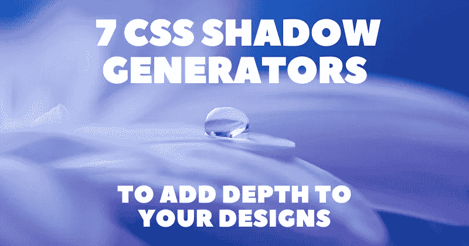
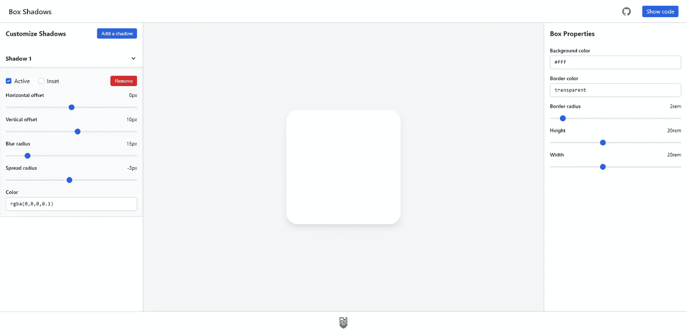
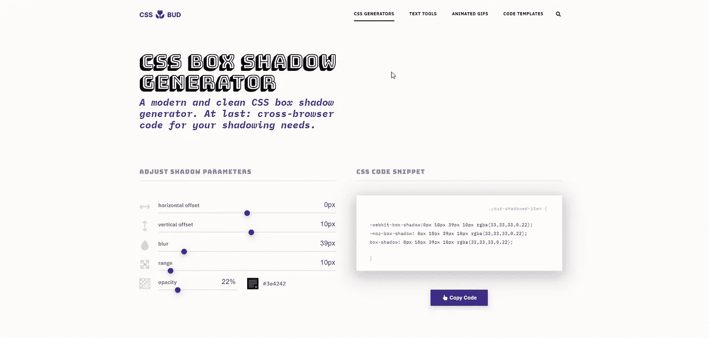
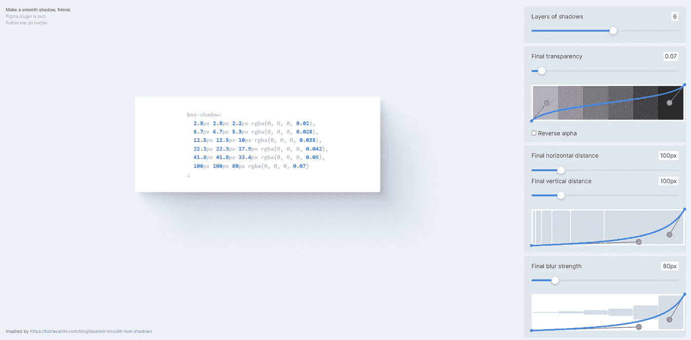
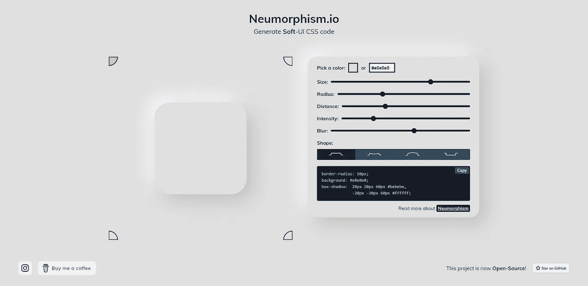
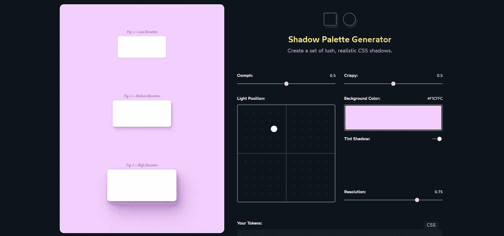
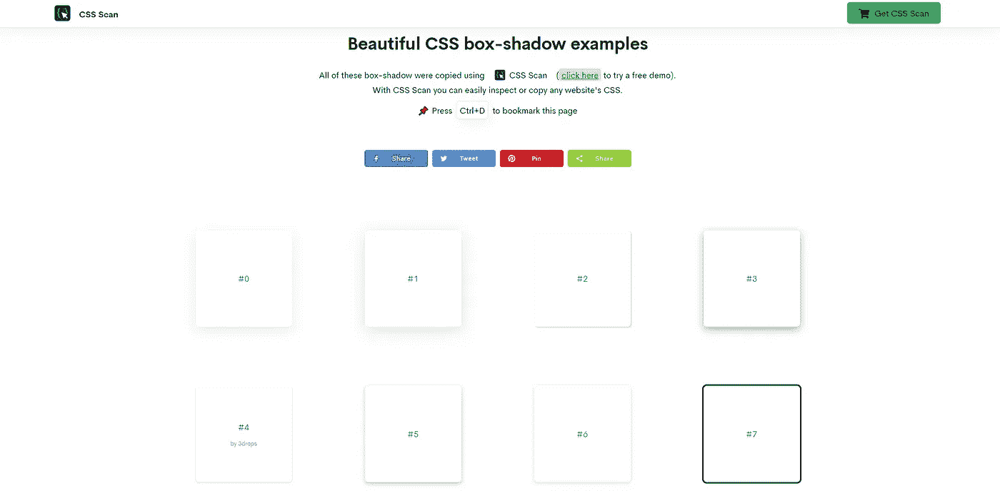
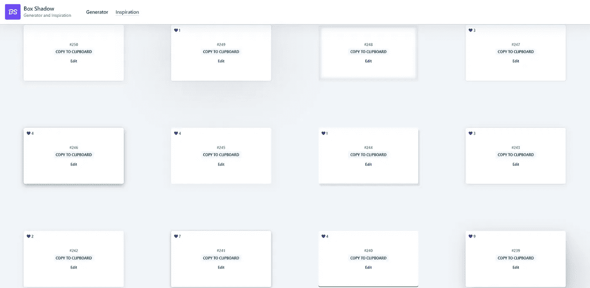

# 7 CSS 阴影生成器，增加设计的深度🎨😍

> 原文：<https://javascript.plainenglish.io/7-css-shadow-generators-to-add-depth-to-your-designs-22b294f52e16?source=collection_archive---------19----------------------->

想过为什么你的设计缺少一些深度吗？添加现代外观的阴影通常可以改善这一点，特别是对于按钮和卡片这样的独立组件。

直接在 CSS 中创建阴影需要很大的耐心。我建议你考虑使用一些工具来节省时间。

在这里，我收集了一些最好的 CSS 阴影生成器来创建光滑和现代的阴影。你所需要做的就是摆弄 UI，准备好了就复制 CSS 代码。

## 1. [Box-shadov.dev](https://box-shadow.dev/)

简单、干净的用户界面，轻松完成工作。通常我的助手。

## 2. [CSSBud](https://cssbud.com/css-generator/css-box-shadow-generator/)

允许您通过在预览区域生成代码来创建阴影的生成器。

## 3.[暗影布鲁姆](https://shadows.brumm.af/)

一个更先进的生成器，允许你控制阴影的层数，透明度，强度，距离等。

## 4.[神经变形](https://neumorphism.io/)

对于那些对基于神经形态的设计感兴趣的人来说，这个发生器是必备的。时尚现代的用户界面。

## 5.[阴影调色板](https://www.joshwcomeau.com/shadow-palette/)

先进的阴影生成器与现代用户界面。由 CSS 领域最优秀的人之一 Josh W.Comeau 创建。

## 6.[阴影示例](https://getcssscan.com/css-box-shadow-examples)

如果发电机不是你的东西，这里有一个巨大的预定义的阴影集合。只要挑你喜欢的，代码就会自动复制。

## 7. [Box-shadow.art](https://box-shadow.art/)

类似于前一个提供了许多预置。不同之处在于，如果您还没有完全感受到设计，您可以选择它们并进一步定制它们。

写作一直是我的激情所在，帮助和激励他人给我带来了快乐。如果您有任何问题，请随时联系我们！

如果这些资源有所帮助，请在 Twitter、LinkedIn 和 GitHub 上联系我！

访问我的[博客](https://madza.dev/blog)获取更多类似的文章！

*更多内容看* [***说白了。报名参加我们的***](https://plainenglish.io/) **[***免费周报***](http://newsletter.plainenglish.io/) *。关注我们关于*[***Twitter***](https://twitter.com/inPlainEngHQ)*和*[***LinkedIn***](https://www.linkedin.com/company/inplainenglish/)*。加入我们的* [***社区***](https://discord.gg/GtDtUAvyhW) *。***