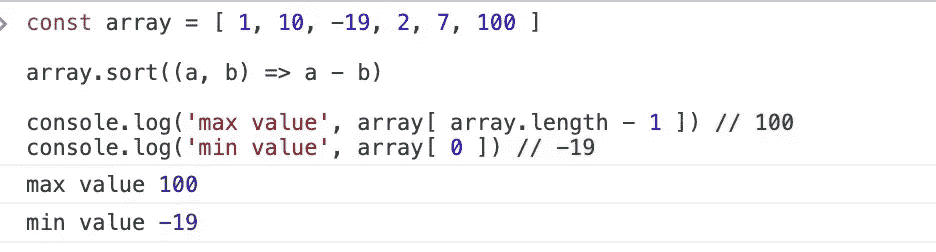
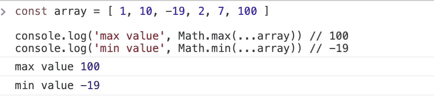
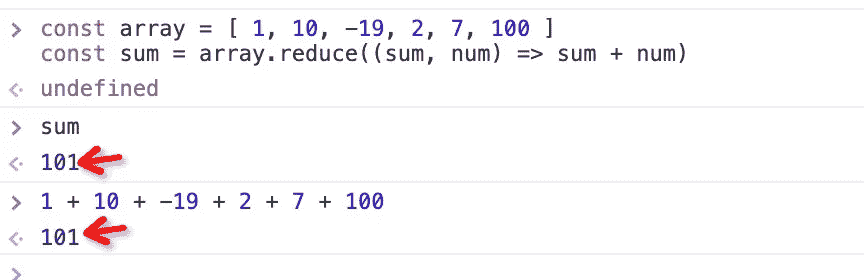

# 7 ES6 JavaScript 技巧让你成为更好的程序员

> 原文：<https://javascript.plainenglish.io/7-es6-javascript-tricks-to-make-you-a-better-programmer-a3edd07c1f52?source=collection_archive---------0----------------------->

## 使用这些 ES6 代码提示，让您的 JavaScript 更具可读性和可扩展性。

# 前言

ES6 在编程方面给我们带来了很多便利。以前用大量代码实现的功能，现在变得非常简洁。

本文总结了我在工作中经常用到的 7 个 **JavaScript 小技巧**，希望也能帮到你。

# 1.找出数组中的最大值或最小值

有时候，我们需要找到数组中的最大值。你通常是怎么做的？

**解决方案 1**

我们可以先对数组进行排序，然后数组的最后一项就是最大值。

**方案二**

还有其他解决方法吗？可以，我们用“Math.max”就能轻松搞定。

# 2.计算数组的和

如果有一组数字，最快的方法是什么？

# 3.从数组中获取一个随机值

给你一个数组，现在你想从中获得一个随机值。你是怎么做到的？

# 4.随机打乱数组的值

我们在做抽奖的时候，需要打乱奖品的顺序。

# 5.展平多层阵列

现在我们有了一个多维嵌套数组。如何铺成一维数组？

**解决方案 1**

**解决方案 2**

其实我们有更简单的办法解决。关于平板，我们来看看 [MDN](https://developer.mozilla.org/en-US/docs/Web/JavaScript/Reference/Global_Objects/Array/flat) 的解释:

> *flat()方法创建一个新数组，所有子数组元素递归连接到该数组中，直到指定深度。*

# 6.检查数组是否包含值

过去，我们总是使用“indexOf”方法来检查数组是否包含值。如果“indexOf”返回的值大于-1，则表示有一个。

但是现在数据更加复杂，我们将无法通过`indexOf`的方法直接确认数组中是否存在“fatfish”。幸运的是，ES6 中提供了`findIndex`方法。

# 7.使用“包含”方法进行判断

你一定见过这样的判断方法。虽然可以达到条件判断的目的，但是看起来很繁琐。

我们可以使用`includes`方法使代码更简单，甚至更具可扩展性

# 最后

**感谢阅读。**期待期待您的关注和阅读更多高质量的文章。

 [## 123['toString']。length + 123)用 JavaScript 打印出来？

### 95%的前端开发者回答错误的问题。

javascript.plainenglish.io](/what-does-123-tostring-length-123-print-out-in-javascript-2c804a414325)  [## 帮助你成为高级前端开发人员的 11 个技巧

### 如果你选择 Chrome 作为开发工具，你必须知道的 11 个技巧

javascript.plainenglish.io](/11-chrome-devtools-tricks-to-help-make-you-a-senior-front-end-developer-67b4ae3e6562)  [## 大多数开发人员不知道的 6 个很酷的现代 JavaScript 特性

### 编写简明 JavaScript 代码的技巧

javascript.plainenglish.io](/6-cool-modern-javascript-features-most-developers-dont-know-about-432f7652dd4c)  [## 在 JavaScript 中实现(a==1 && a==2 && a==3) === true 的 9 种方法

### 是的，这可能是真的，而且有 9 种方式——太神奇了！

javascript.plainenglish.io](/9-ways-to-make-a-1-a-2-a-3-true-in-javascript-c2e1903b24b)  [## 面试官:你工作 3 年了，这种算法题你都不会答？

### 一个女生的面试经历

javascript.plainenglish.io](/interviewer-you-have-been-working-for-3-years-and-you-cant-answer-this-algorithm-question-5f79cba18e06)  [## 让你成为更好的程序员的 8 个 JavaScript 技巧

### 使用这些代码提示，让您的 JavaScript 更具可读性和可扩展性。

javascript.plainenglish.io](/8-javascript-tricks-to-make-you-a-better-programmer-948b5a3c35b4)  [## 我老板:你知道 ES6，为什么不用？😠

### 老板的 10 条抱怨让我受益匪浅。

javascript.plainenglish.io](/my-boss-you-know-es6-but-why-dont-you-use-it-5e0316f14c67)  [## 面向网络开发人员的 15 个黑仔网站

### 99.9%的开发者都不知道。

javascript.plainenglish.io](/15-killer-websites-for-web-developers-35a4c007942a) 

*更多内容请看*[***plain English . io***](https://plainenglish.io/)*。报名参加我们的* [***免费周报***](http://newsletter.plainenglish.io/) *。关注我们关于*[***Twitter***](https://twitter.com/inPlainEngHQ)*和*[***LinkedIn***](https://www.linkedin.com/company/inplainenglish/)*。加入我们的* [***社区不和谐***](https://discord.gg/GtDtUAvyhW) *。*