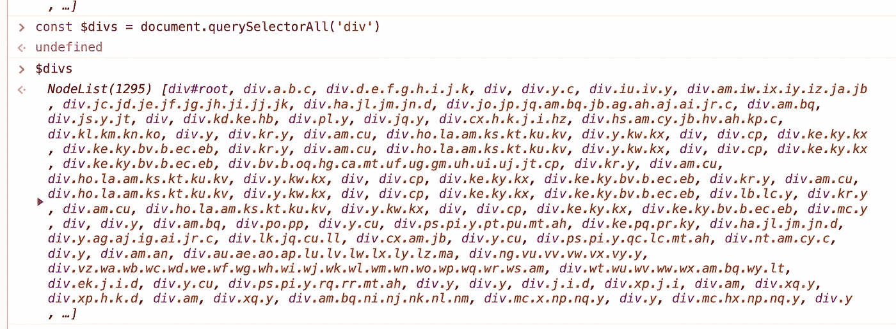

# 每个开发人员都应该知道的 7 ES6 传播运营商技巧

> 原文：<https://javascript.plainenglish.io/7-es6-spread-operator-tricks-every-developer-should-know-f162d602c9d6?source=collection_archive---------3----------------------->

## 7 ES6 招数让你少写多做。

# 前言

ES6 提供了一个新的运算符，称为 spread 运算符，它由三个点(…)组成。

spread 运算符允许您扩展可迭代对象的元素，如 map、array、set 和 object。这甚至允许我们写得更少，做得更多。

**举例:**

在这篇文章中，我想教你 7 个传播操作技巧。

# 1.使用数组的 push()方法的更好方法

我们都知道 push()方法支持传递多个不确定的参数。

通常，我们使用 apply()方法来填充数组，但这毕竟不方便。

其实不需要这么麻烦。扩展操作符可以帮助我们很容易地做到这一点。

# 2.复制新数组

复制数组是 spread 运算符最方便的功能之一。

> ***提示*** *(此处来源于***):*spread 运算符只将数组本身复制到新的数组中，而不复制元素。这意味着复制是浅的，而不是深的。*

***示例:***

# *3.从数组中删除重复的值*

*重复值的数组可以通过 set 数据结构和 spread 运算符删除。*

# *4.连接多个阵列*

*是的，我们可以使用 spread 操作符来链接多个数组，以获得全新的数据。*

# *5.将节点列表转换为真实数组*

*操作 DOM 是前端开发人员每天都要做的事情，比如使用**document . query selector all**获取一个 NodeList。我们可以用 spread 操作符把它转换成一个数组。然后可以用 forEach，map 等。*

***示例:***

**

# *6.解构*

*spread 操作符经常被用来析构数组和对象，看看吧！*

***析构阵:***

***析构对象:***

# *7.将字符串转换为数组*

*一个字符串可以变成这样的数组，是不是很神奇？*

# *最后*

***感谢阅读。**期待期待您的关注和阅读更多高质量的文章。*

* [## 让你看起来像高级开发人员的 8 个很酷的 GitHub 技巧

### 使用 GitHub 可以做的 8 件很酷的事情

javascript.plainenglish.io](/8-cool-github-tricks-to-make-you-look-like-a-senior-developer-ab8fe9ae9b14)  [## 10 个你可能不知道答案的简单面试问题

### 99%的人不一定知道答案。

javascript.plainenglish.io](/10-easy-interview-questions-you-may-not-know-the-answer-e9421a0953b8)  [## 面试官:可以“x！== x "在 JavaScript 中返回 True？

### 你可能不知道的五个神奇的 JavaScript 知识点！

javascript.plainenglish.io](/interviewer-can-x-x-return-true-in-javascript-7e1d1fa7b5cd)  [## 123['toString']。length + 123)用 JavaScript 打印出来？

### 95%的前端开发者回答错误的问题。

javascript.plainenglish.io](/what-does-123-tostring-length-123-print-out-in-javascript-2c804a414325) 

*更多内容请看*[***plain English . io***](https://plainenglish.io/)*。报名参加我们的* [***免费周报***](http://newsletter.plainenglish.io/) *。关注我们关于*[***Twitter***](https://twitter.com/inPlainEngHQ)*和*[***LinkedIn***](https://www.linkedin.com/company/inplainenglish/)*。查看我们的* [***社区不和谐***](https://discord.gg/GtDtUAvyhW) *加入我们的* [***人才集体***](https://inplainenglish.pallet.com/talent/welcome) *。**