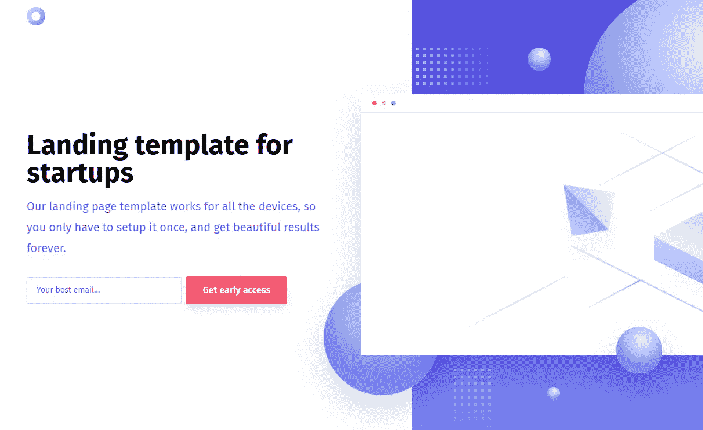
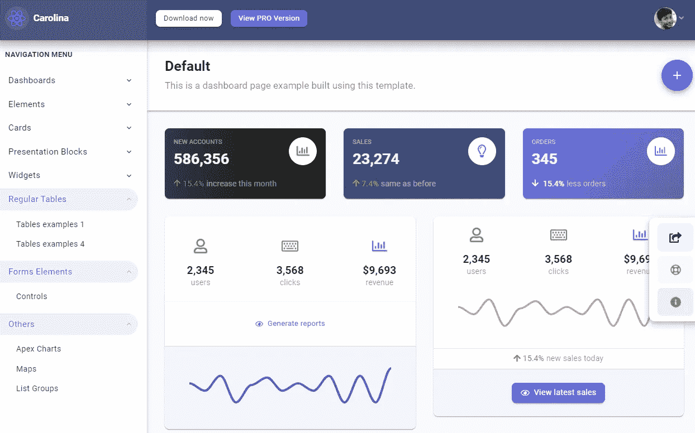
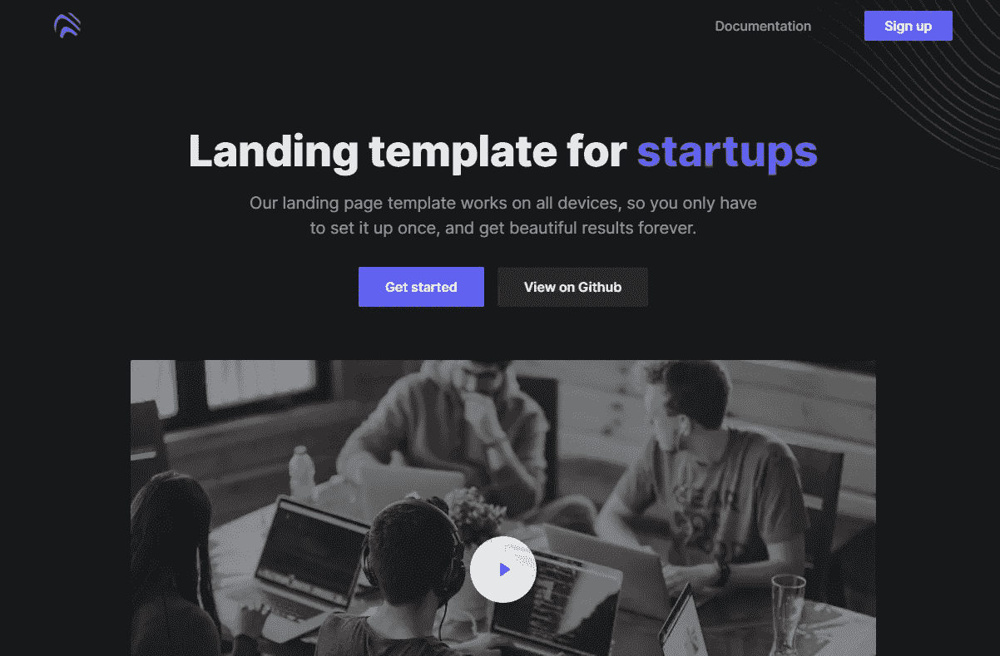
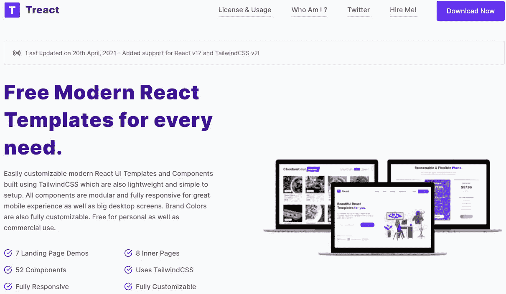
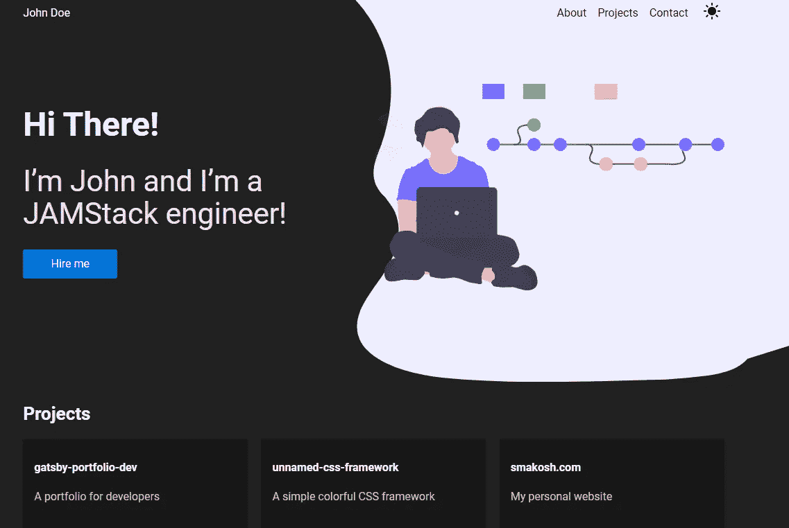
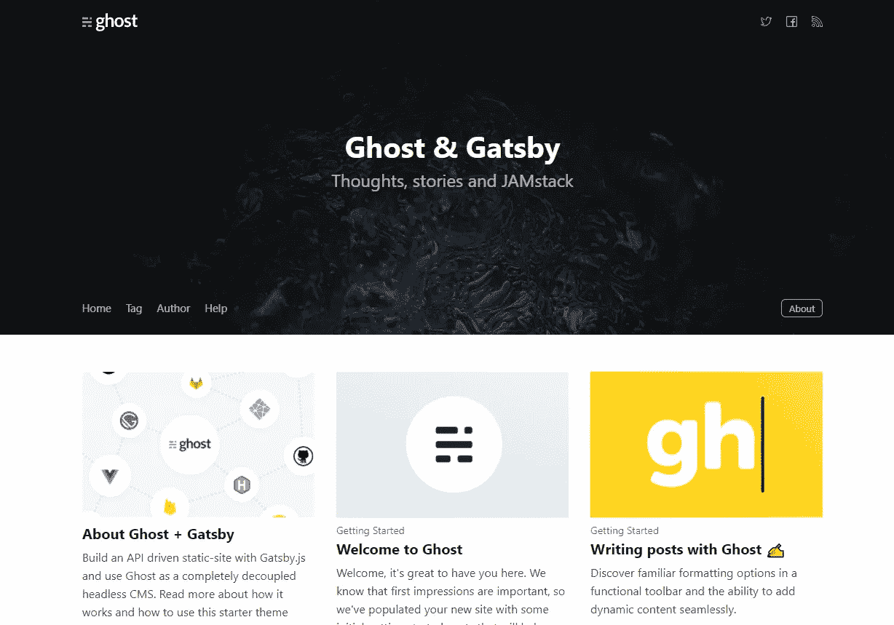
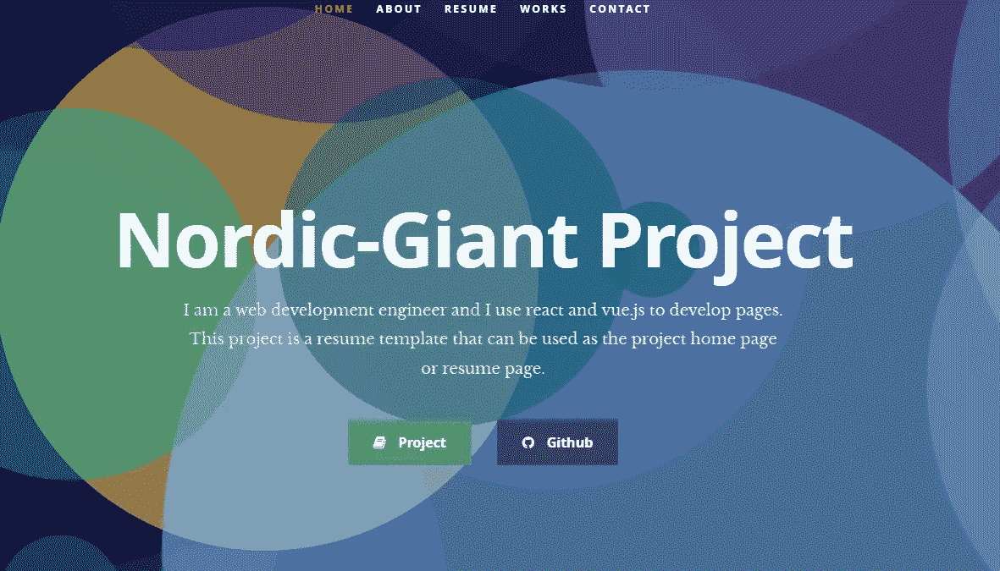

# 7 个免费的 React 模板可以用于您的项目

> 原文：<https://javascript.plainenglish.io/7-free-react-templates-you-can-use-for-your-projects-fb041304bf90?source=collection_archive---------0----------------------->

## 真棒 React 模板和主题，你可以开始建立你的下一个项目。

Photo by [Mohammad Rahmani](https://unsplash.com/@afgprogrammer?utm_source=medium&utm_medium=referral) on [Unsplash](https://unsplash.com?utm_source=medium&utm_medium=referral)

如今，大多数开发人员在他们的 web 开发项目中使用 React。React 是面向前端开发人员的流行 JavaScript 库之一，它是一个强大的工具，可以轻松构建用户界面和创建 web 应用程序。

有很多免费的 React 资源可以帮助你提高工作效率，比以前更快地构建项目。模板和主题是启动 React 项目时节省时间的最佳方式。尤其是如果你只是想快速建立一个项目，而不是把很多精力放在设计过程上。

你可以开始使用的大多数模板都是像你我这样的开发者在 GitHub 上开源的。此外，如果你不是一个好的设计师，这些模板肯定可以帮助你改善项目的设计，并遵循 UI/UX 的最佳实践。

所以在这篇文章中，我将与你分享一个很棒的模板列表，你可以用它来构建任何东西。让我们开始吧。

# 1.冬青模板

Holly 是一个响应式 React 模板，适用于任何想要创建漂亮的登录页面来收集电子邮件的人。

Capture by the author from Holly-react.

您可以使用 Git 轻松地将模板克隆到您的机器上。当然，您也可以根据需要定制模板并编辑代码。如果你想看设计，这里是[现场演示](https://lukemcdonald.github.io/holly-react/)。

# 2.卡罗莱纳州管理仪表板

[Carolina Admin Dashboard](https://uifort.com/template/carolina-react-admin-dashboard-material-ui-free/) 是一个免费的 React 模板，您可以使用 React 构建一个功能性的管理仪表板。

Capture by the author from Carolina Admin Dashboard.

这个专业模板是使用材料 UI 框架构建的。它有许多不同的组件，设计结构简洁。Carolina Admin Dashboard 是一个非常有用的模板，尤其是如果您正在构建某种分析 web 应用程序。

这个模板有什么好处:

*   完全响应。
*   遵循 UI/UX 最佳实践。
*   包括公用设施和助手。
*   整洁的布局和结构。

# 3.打开

Open 是另一个令人惊叹的免费 React 模板，适用于任何想要为任何类型的项目快速创建漂亮的登录页面的开发人员。

Capture by the author from Open.

模板有一个非常干净和专业的设计布局，让你脱颖而出。使用该模板时，您可以受益于许多设计良好的可重用组件和元素。

*优点:*

*   黑暗和最小的设计布局。
*   当然是完全响应。
*   自定义美丽的图标和元素。
*   有利于 SaaS 产品、在线服务和开源项目。

如果你想看完整的设计布局，你也可以看一个现场演示 *(外部链接)*。

# 4.治疗

[Treact](https://treact.owaiskhan.me/) 是一个很棒的图库，带有漂亮的 React UI 模板和组件，你可以免费使用它们快速构建任何类型的项目。

Capture by the author from Treact.

*功能:*

*   完全响应。
*   7 个登录页面演示。
*   使用 TailwindCSS。
*   8 内页。
*   很多精心设计的组件。
*   易于安装和定制。

# 5.下一个投资组合开发

另一个开源 React [模板](https://github.com/smakosh/next-portfolio-dev)帮助你快速构建一个基本的开发者组合网站。

Capture by the author from [GitHub](https://github.com/smakosh/next-portfolio-dev).

该模板使用 TypeScript 和 NextJS，您可以根据需要定制它。代码简洁易懂。你可以在 GitHub 库上看到更多信息。

*功能:*

*   易于安装和定制。
*   简单干净的设计，配有精美的插图。
*   完全响应。
*   黑暗模式功能。
*   PWA(适用于桌面和移动设备)。
*   您可以一键部署它。
*   性能，可访问性和搜索引擎优化 100 分。

# 6.盖茨比启动器幽灵

如果你想轻松创建一个博客或出版物网站，分享你的想法和观点，这是一个非常有用的模板。

Capture by the author from [Gatsby Starter Ghost](https://gatsby.ghost.org/)(external link).

该模板允许您使用 Ghost 和 Gatsby 轻松构建闪电般快速的网站。对于内容驱动的网站来说，这是一个很好的起点。

*功能:*

*   完全响应。
*   非常快。
*   伟大的搜索引擎优化。
*   干净的博客文章设计和结构。
*   易于安装和部署。

# 7.反应不错的简历

[React Nice Resume](https://github.com/nordicgiant2/react-nice-resume) 是一个简单干净的 React 模板，你可以用在作品集网站上。无论您是开发人员、设计人员还是创作者，这个模板都非常适合您，也是您的起点。

Capture by the author from React Nice Resume.

*功能:*

*   完全响应。
*   不错的动画背景。
*   简洁的设计。
*   平滑滚动到节。
*   易于安装和部署。

# 结论

如你所见，这是一个有用的 React 模板列表，你可以以此为起点，按照你喜欢的方式定制它们。从模板开始是帮助您更快地构建项目并提高生产率的好方法。你不必总是从头开始。

*感谢您阅读本文。此外，如果你觉得我的内容有用，而你不是一个媒体成员，你可以抓住你的媒体成员* [***这里***](https://mehdiouss.medium.com/membership) *(媒体推荐链接)获得无限制的访问媒体上的所有文章，并支持我们作为作家。*

 [## 通过我的推荐链接加入 Medium-Mehdi Aoussiad

### 作为一个媒体会员，你的会员费的一部分会给你阅读的作家，你可以完全接触到每一个故事…

mehdiouss.medium.com](https://mehdiouss.medium.com/membership) 

**也读作:**

 [## 您可以在 2021 年使用的 5 个强大的 React 库

### React 库使开发应用程序变得更加容易

javascript.plainenglish.io](/5-powerful-react-libraries-that-you-can-use-in-2021-496b975c7bef)  [## 每个 Web 开发人员都应该知道的 6 个有用的 CSS 函数

### 可以在 CSS 代码中使用的强大功能。

javascript.plainenglish.io](/6-useful-css-functions-every-web-developer-should-know-4be9ad59183f) 

## 进一步阅读

 [## 在组件中组合可重用的登录页面

### 最近，我们不得不创建一个登录页面，允许人们请求演示我们的产品。这一页是…

比特云](https://bit.cloud/blog/composing-reusable-landing-pages-in-components-l4mk36jk) 

*更多内容看* [***说白了。报名参加我们的***](https://plainenglish.io/) **[***免费周报***](http://newsletter.plainenglish.io/) *。关注我们上* [***推特***](https://twitter.com/inPlainEngHQ) ，[***LinkedIn***](https://www.linkedin.com/company/inplainenglish/)***，***[***YouTube***](https://www.youtube.com/channel/UCtipWUghju290NWcn8jhyAw)***，****[***不和***](https://discord.gg/GtDtUAvyhW)*** *对成长黑客感兴趣？检查出* [***电路***](https://circuit.ooo/) ***。***