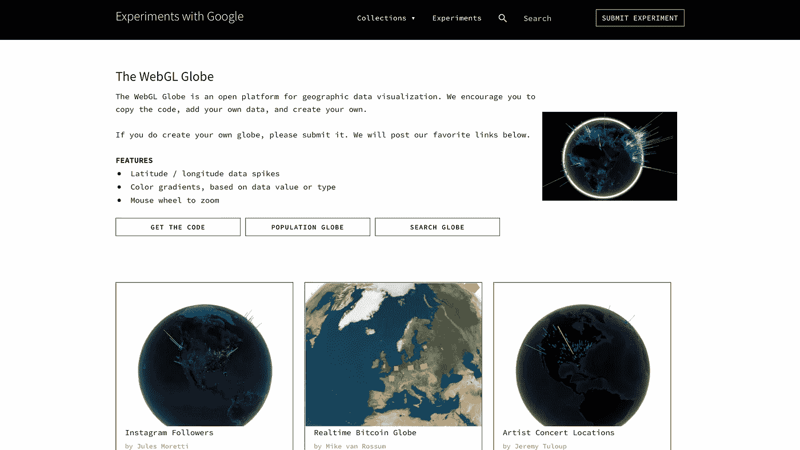
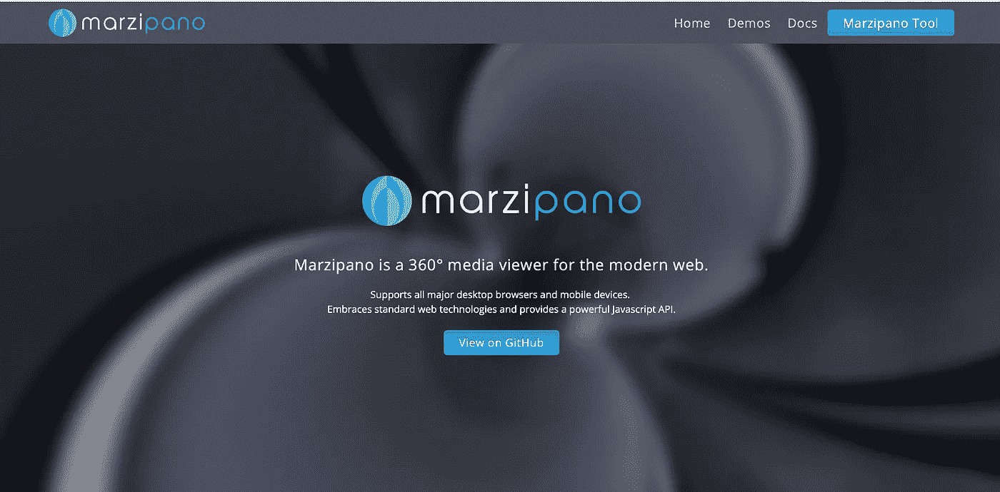
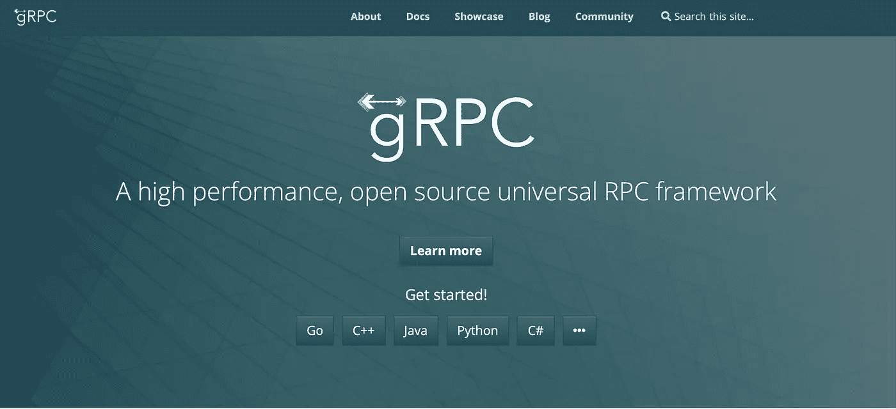
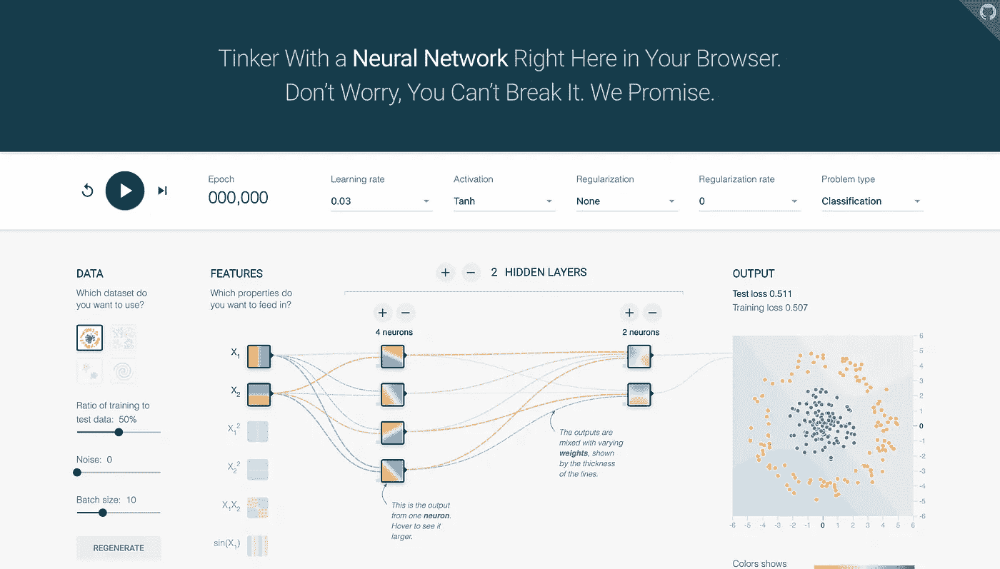

# 帮助开发者节省大量时间的 7 个谷歌项目

> 原文：<https://javascript.plainenglish.io/7-google-projects-that-have-helped-developers-save-tons-of-time-fa8a72d9044c?source=collection_archive---------10----------------------->

## 谷歌如何帮助开发人员创建令人惊叹的应用程序。

Photo by [Jonas Elia](https://unsplash.com/@jonaselia?utm_source=unsplash&utm_medium=referral&utm_content=creditCopyText) on [Unsplash](https://unsplash.com/s/photos/google?utm_source=unsplash&utm_medium=referral&utm_content=creditCopyText)

社区中的大多数开发人员都知道 Angular、Flutter 和 Tensorflow。然而，这篇文章包含了一个由 Google 开发的鲜为人知的工具列表，你可以用它来构建你的下一个应用程序。它们快速、可靠，被 Google 开发人员用在他们的工作流程中。

谷歌从多个渠道获得收入。众所周知，我可能不会去那里。它有大量的产品。但在它的核心，它主要是一个优化搜索结果的数据公司。不是吗！它们每天抓取数十亿的数据，却能在不到一秒钟的时间内为我们提供准确的搜索结果。他们经营的规模难以想象。

但该组织不仅仅是创造和销售让人们生活更轻松的数字产品。它为开发人员做了很多事情，帮助他们轻松地构建他们想要的应用程序。

就个人而言，如果你问我，我会说谷歌是数据和速度方面的王者。我甚至觉得写下这些很愚蠢。他们有世界上最好的开发人员。

但是说到网络，他们在 Github 上有大量开源的好项目。开发人员可以使用这些框架和库来构建他们的应用程序。

尽管该行业的大多数开发人员都非常了解这些技术，但许多人仍然不知道，因为社交媒体上没有关于这些项目的宣传。至少在我写这篇文章的时候没有。因此，我决定写这个帖子。我希望它能在开发者社区引起轰动。

# 1.网络动画

Web Animations Js 是一个 web API，在不支持它的浏览器中提供 Web 动画特性。它提供了必要的聚合填充，web 开发人员可以将其添加到代码中。你的动画可以在现代浏览器上运行，没有任何问题。

太神奇了。请点击下面的链接查看。

[链接到网页动画 JS](https://github.com/web-animations/web-animations-js)

# 2.WebGL 全球

webgl globe screenshot

想用用户的地理数据制作一个三维地球。WebGL globe 是适合您的软件包。

这是一个开放的地理数据可视化平台，由 Google Data Arts 团队创建。

在代码库的核心，它使用 three.js 库在 web 上呈现数据。没错，就是 Github 用来为他们的 web 应用构建登陆页面的 three.js。

[链接到 WebGL Globe](https://experiments.withgoogle.com/chrome/globe)

# 3.杏仁糖

Marzipano website screenshot

这是一个轻量级和高性能的 360 度网络媒体浏览器。

曾经想在网上创建一个 360 度的地方。如果是的话，杏仁糖就是你的朋友。

它支持所有主要的桌面浏览器和移动设备。它为 web 开发者提供了 Javascript API。

尽管谷歌没有认可它为谷歌官方产品，但它可以在谷歌的 Github 存储库中找到。

[链接到杏仁蛋白软糖](https://www.marzipano.net)

# 4.材料运动 JS

JavaScript 开发人员的手势库。

如果你认为你只能在移动设备上使用手势，那么你可能错了。Material Motion JS 是 JavaScript 中一个可重用的手势交互库。

Swift 开发人员可能听说过这个术语。Material Motion Js 是 web 上相同代码的 javascript 实现。

[链接到物料运动 JS](https://github.com/material-motion)

# 5.gRPC

grpc screenshot

gRPC 是一个现代的 RPC 框架，可以在任何环境中运行。

借助对负载平衡、跟踪、健康检查和身份验证的可插拔支持，它可以高效地连接数据中心内和跨数据中心的服务。

带 Protobuff 的 gRPC 可以让你的应用像光线一样传输数据。

从网飞和 Twitter 到谷歌和 Slack，每个人都以这样或那样的方式使用它。

这是一个框架，也有 Javascript 和 node 版本。

[链接到 gRPC](https://grpc.io)

# 6.张量流游乐场

Tensorflow Playground screenshot

我知道，我们都知道机器学习库 TensorFlow，但是你知道 TensorFlow Playground 吗？

这是一个可视化你的神经网络的库。是的，在网络上渲染你的神经网络特征。

这个库是用 d3.js 编写的，任何人都可以使用。

[链接到 TensorFlow 游乐场](https://playground.tensorflow.org)

# 7.Js 绿色许可证

如果您想在将任何 javascript 依赖项添加到项目之前检查其许可，那么您很幸运！因为有了这个的帮助，你就可以做到了。

是的，检查包的许可证。如果它给你一个绿色的信号，把它添加到你的项目中，不用担心。

它不是谷歌的官方产品。而是谷歌 Github 回购的一部分。

感谢您花时间阅读这篇文章。我希望你喜欢它。

**你知道这些工具吗？**

**您计划在下一个项目中使用上述框架和工具吗？**

**在评论区写下。我很想知道你对此的看法。**

*更多内容请看*[***plain English . io***](http://plainenglish.io/)*。报名参加我们的* [***免费周报***](http://newsletter.plainenglish.io/) *。在我们的* [***社区***](https://discord.gg/GtDtUAvyhW) *获得独家获得写作机会和建议。*