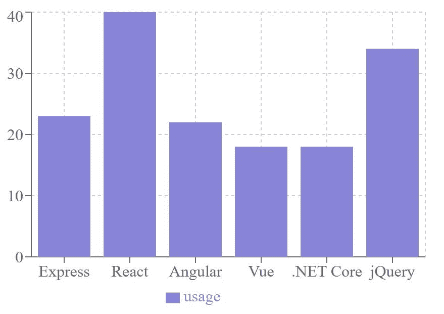
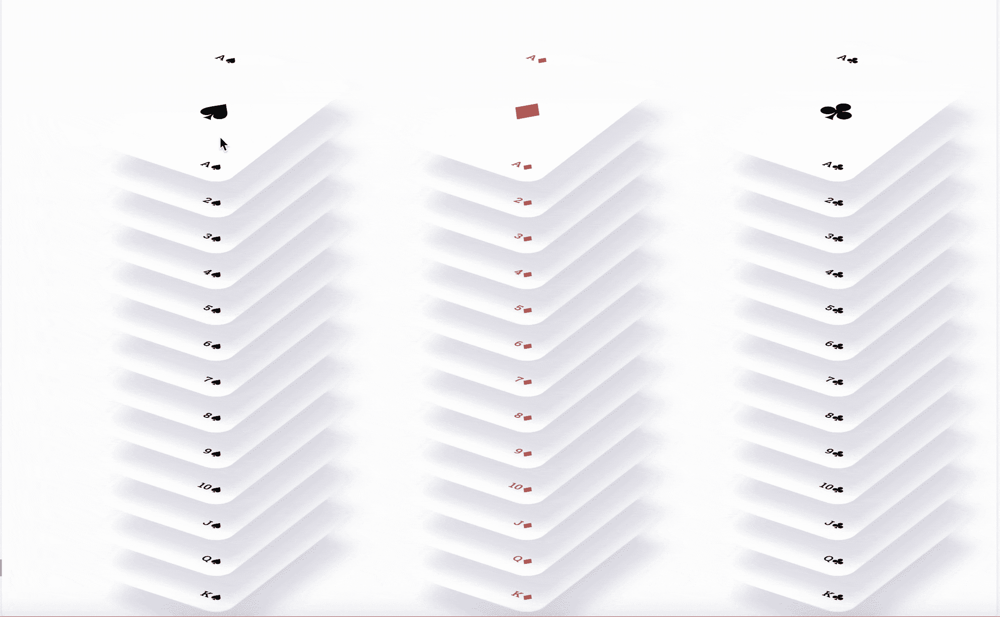

# 为您的下一个项目提供 7 个非常有用的 React 库——没有废话！

> 原文：<https://javascript.plainenglish.io/7-insanely-useful-react-libraries-for-your-next-project-no-bs-7dde47feb54d?source=collection_archive---------0----------------------->

## 最后一个是我最喜欢的。


了解 React 通常是 web 开发人员在熟悉 JavaScript 之后的下一步，因为它很受欢迎。自 2013 年发布以来，它已经获得了巨大的市场份额&作为最容易访问的 JavaScript 库，被全世界的开发人员广泛使用。

根据 Stackoverflow 调查，React 在 2021 年超过 jQuery 成为使用最多的 web 框架。由于 React 非常受欢迎，围绕它开发了几个框架和库，如 Next.js 和 Gatsby。

在 React (16.8)的更高版本中，增加了函数组件中的钩子，使您能够在不创建类的情况下使用状态和其他 React 功能。这改变了游戏规则。

这使得在各种 React 库和定制钩子的帮助下开发某种功能变得更加简单和容易。

在本帖中，我们将分享有用的 React 库的精选列表。

让我们开始吧。

# 1.[漂亮的反应钩](https://antonioru.github.io/beautiful-react-hooks/)

大多数 React 开发人员更喜欢用钩子来管理道具、状态、上下文或生命周期的概念，不仅因为这样更容易，还因为 React 核心团队鼓励这种做法，因为这样可以使代码更简单。

这个包将 React hooks 向前推进了一步。

让我们举一个借助漂亮的反应钩子在本地存储中存储值的例子

```
import React, { useCallback } from 'react';
import { Pill, Paragraph, Icon } from 'beautiful-react-ui';
import useLocalStorage from 'beautiful-react-hooks/useLocalStorage';

const NotificationBadgeExample = ({ notifications }) => {
  const [notificationCount, setNotificationCount] = useLocalStorage('demo-notification-count', notifications);

  const clearNotifications = useCallback(() => {
    setNotificationCount(0);
  }, [notificationCount]);

  return (
    <DisplayDemo>
      <Paragraph>Click on the badge to clear from the local storage</Paragraph>
      <Pill color="primary" onClick={clearNotifications}>
        <Icon name="envelope" />
        You've got {notificationCount} new messages
      </Pill>
    </DisplayDemo>
  )
};

<NotificationBadgeExample notifications={100} />
```

这些类型的定制的、可重用的钩子被预先构建在漂亮的 React Hooks 包中，以加速开发过程。

简而言之，漂亮的 React 挂钩是为开发人员设计的可重用定制挂钩。

您手边有各种自定义挂钩，其中一些如下:

1.  使用 QueryParam 简化在当前位置的 URL 中修改查询字符串的过程。
2.  使用 InfiniteScroll，它负责将无限滚动相关的事件侦听器添加到定义的目标中
3.  使用黑暗模式来处理所有需要的逻辑来添加一个黑暗模式切换到你的网站
4.  useToggle 提供了一个快速安全的管理布尔状态的工具

# 2.[反应过来查询](https://tanstack.com/query/v4)

数据获取可能不像大多数教程看起来那么简单。您可能希望缓存数据、重新提取数据或在不同的页面和组件之间共享数据。

虽然 fetch 和 Axios 等行业标准库能够处理简单的数据获取，但 React Query 包将它带到了一个不同的层次。

它允许您与这些库协同工作，并提供无缝处理分页、缓存、陈旧数据和其他此类复杂功能的方法。

它甚至可以兼作全局状态管理器，并取代大多数应用程序中的 Redux 等库。

让我们看看它是如何工作的。

```
import { QueryClient, QueryClientProvider, useQuery } from '@tanstack/react-query'

const queryClient = new QueryClient()

export default function App() {
return (
  <QueryClientProvider client={queryClient}>
    <Example />
  </QueryClientProvider>
)
}

function Example() {
const { isLoading, error, data } = useQuery({
  queryKey: ['repoData'],
  queryFn: () =>
fetch('https://jsonplaceholder.typicode.com/posts/1').then(res =>
      res.json()
    )
})
if (isLoading) return 'Loading...'
if (error) return 'An error has occurred: ' + error.message

return (
  <div>
    <h1>{data.title}</h1>
    <p>{data.body}</p>
  </div>
)
}
```

正如你所看到的，我们可以使用我们最喜欢的库在`queryFn`函数中获取数据，我们得到了许多有用的变量和函数，比如“error”和“loading”来处理数据。

# 3.[反应钩形](https://react-hook-form.com/)

您以前是否处理过表单数据并发现它很复杂？构建表单需要一个费力的过程，即接受表单输入、提供验证、处理错误和提交表单。

这就是 React 钩子形式的用武之地。它帮助您创建高性能的、灵活的、广泛的、带有简单验证的表单。

考虑下面的例子。

```
import React from "react";
import ReactDOM from "react-dom";
import { useForm } from "react-hook-form";

import "./styles.css";

export default function Form() {
 const { register, errors, handleSubmit } = useForm();
 const onSubmit = (data) => {
   console.log("RESULT", data);
   alert(JSON.stringify(data));
 };
 console.log(errors);

 return (
   <form onSubmit={handleSubmit(onSubmit)}>
     <label>First name</label>
     <input
       type="text"
       {...register("First name", { required: true, maxLength: 80 })}
     />
     <label>Last name</label>
     <input
       type="text"
       {...register("Last name", { required: true, maxLength: 100 })}
     />
     <label>Email</label>
     <input
       type="text"
       {...register("Email", {
         required: true,
         pattern: /^(([^<>()[\]\\.,;:\s@"]+(\.[^<>()[\]\\.,;:\s@"]+)*)|(".+"))@((\[[0-9]{1,3}\.[0-9]{1,3}\.[0-9]{1,3}\.[0-9]{1,3}\])|(([a-zA-Z\-0-9]+\.)+[a-zA-Z]{2,}))$/
       })}
     />
     <input type="submit" />
   </form>
 );
}

const rootElement = document.getElementById("root");
ReactDOM.render(<Form />, rootElement);
```

在这段代码中，我们将析构“register”、“errors”和“handleSubmit”属性并在表单中使用它们。这使得处理不同的表单状态变得很容易。

我们可以定义各种约束和模式来轻松验证用户输入。在上面的示例代码片段中，我们使用了类似“maxLength: 80”的约束，即名字不能超过 80 个字符，以及一个正则表达式来测试用户提供的电子邮件。

# 4.[日期-fns](https://date-fns.org/)

顾名思义，这个库使日期处理变得简单&它非常轻量级，构建大小只有 300 字节。

它提供了最全面、最一致的函数集来轻松处理和操纵 JavaScript 日期。

在下面的代码中，您可以看到格式化日期是多么容易。

```
import { format, formatDistance, formatRelative, subDays } from 'date-fns'

format(new Date(), "'Today is a' eeee")
//=> "Today is a Wednesday"

formatDistance(subDays(new Date(), 3), new Date(), { addSuffix: true })
//=> "3 days ago"

formatRelative(subDays(new Date(), 3), new Date())
//=> "last Friday at 7:26 p.m."
```

它还支持国际化，这使得它在处理日期时成为一个全能的包。

```
import { formatRelative, subDays } from 'date-fns'
import { es, ru } from 'date-fns/locale'

formatRelative(subDays(new Date(), 3), new Date(), { locale: es })
//=> "el viernes pasado a las 19:26"

formatRelative(subDays(new Date(), 3), new Date(), { locale: ru })
//=> "в прошлую пятницу в 19:26"
```

此外，它依赖于原生日期类型，并围绕它提供了一组支持模块化导入的实用函数，因此您只需导入您需要的内容。

# 5.[充值](https://recharts.org/en-US/)

管理面板、图表和图示以可视化方式向最终用户提供大量信息。从展示互动到网站分析，它们已经成为可视化大型数据集的事实标准。

然而，没有简单的方法可以使用 HTML 和 CSS 来创建它们。例如，创建一些图表可能需要几个小时才能做好。

这就是 Recharts 帮助你的地方。

折线图、散点图和树形图只是可以用这个包轻松制作的一些图表和表示形式。

您需要使用以下命令将它安装到您的项目中。

```
npm install recharts
```

该包提供了各种各样的图表，您可以将它们导入到您的项目中进行自定义和使用。

```
import {
 BarChart,
 Bar,
 XAxis,
 YAxis,
 CartesianGrid,
 Tooltip,
 Legend
} from "recharts";

const data = [
 {
   name: "Express",
   usage: 23
 },
 {
   name: "React",
   usage: 40
 },
 {
   name: "Angular",
   usage: 22
 },
 {
   name: "Vue",
   usage: 18
 },
 {
   name: ".NET Core",
   usage: 18
 },
 {
   name: "jQuery",
   usage: 34
 }
];

export default function App() {
 return (
   <BarChart
     width={500}
     height={300}
     data={data}
     margin={{
       top: 5,
       right: 30,
       left: 20,
       bottom: 5
     }}
   >
     <CartesianGrid strokeDasharray="3 3" />
     <XAxis dataKey="name" />
     <YAxis />
     <Tooltip />
     <Legend />
     <Bar dataKey="usage" fill="#8884d8" />
   </BarChart>
 );
}
```

下面是代码的输出。



# 6.[样式组件](https://styled-components.com/)

JavaScript 和 React 有一个很大的开发者社区，团队经常会添加新的特性。

例如，在 ES6 中，引入了一个名为 template literal 的新特性，它允许您设计定制的字符串插值规则。通俗地说，这个模板文字和 CSS 一起可以用来创建样式化的组件。

考虑下面的例子:

在 react 应用程序中安装来自 npm 或 yarn 的样式组件包。

```
npm install styled-components
```

导入到文件中。

```
import styled from 'styled-components
```

现在，您可以定义几个样式化的组件。

```
const Button = styled.button`
  border-radius: 1px;
  border: 2px solid black;
  color: black;
  margin: 0.5em 1em;
  padding: 0.25em 1em;
`;

const Container = styled.div`
  background-color: grey;
  text-align: center;
`

<Container>
  <Button>Click Me</Button>
</Container>
```

简而言之，样式化组件允许你创建可重用的自定义 HTML 元素，并定义 CSS 特征，将它们应用到应用程序中的任何地方。

# 7.[免打扰套件](https://dndkit.com/)

如今，所有的顶级应用程序都能够将各种组件从一个部分拖放到另一个部分。

Dnd 套件就是这么做的。它使您能够添加拖放事件到您的组件，并提供各种预置，如[排序](https://docs.dndkit.com/presets/sortable)来处理列表，树，和其他这样的具体用例。

您必须先安装软件包，然后才能使用它。

```
npm install @dnd-kit/core
```

然后，您可以在 react 应用程序中使用它。

这里有几个例子可以帮助你。

这个软件包非常强大，不仅可以创建简单的拖放功能，还可以构建游戏界面，如下所示:



# 依赖第三方软件包可以吗？

我们在这篇文章中已经看到了很多 react 包，它们都有助于使 web 开发变得更容易和更快。

现代网站需要精美的动画、多样化的功能以及与不同浏览器的兼容性。这些软件包帮助你卸载一些功能给他们，通常，他们有一个非常低的学习曲线，也使他们更容易插入到你的项目中。

你可以使用更多的 React 包，比如 [React Responsive](https://contra.io/react-responsive/) 、 [Apollo Client](https://www.apollographql.com/docs/react/) 、 [Formik](https://formik.org/) 和 [Zustand](https://zustand-demo.pmnd.rs/) 等等，它们都会对你很有帮助，但是有一点要记住，如果过度使用，这些包会大大增加你的包的大小，也会降低你的网站的性能。

因此，删除不需要的包总是一个好的做法&只要有可能，只导入包中您将会用到的部分。

另一个久经考验的实践是将你的 React 应用分成更小的、可管理的组件，以促进可重用性和更容易的长期维护。这就是 [Locofy.ai](https://www.locofy.ai) 可以帮忙的地方。

使用 Figma 和 Adobe XD 的 Locofy.ai 插件，您可以将您的设计导出到生产就绪、高度可扩展的 React 代码中，更重要的是，您甚至可以将您的代码拆分为接受 props 的组件。

这使得管理它们变得更加容易，并且您可以只在需要的组件中安全地导入包，从而提高整体性能和维护。

希望你喜欢。

就这样——谢谢。

[*如果你喜欢看这样的故事，并想帮助我成为一名作家，可以考虑成为一名中等会员*](https://nitinfab.medium.com/membership) *。每月花费 5 美元，你可以无限制地访问媒体内容。如果你通过我的链接注册，我会得到一点佣金。*

*原载于*[*https://blog . locofy . ai*](https://blog.locofy.ai/popular-web-development-libraries)*。*

[](/5-github-repositories-that-will-make-you-standout-from-99-of-web-developers-4ba6e7c1d733) [## 5 个 GitHub 库，让你从 99%的 Web 开发者中脱颖而出

### 当然，大多数你都没听说过。

javascript.plainenglish.io](/5-github-repositories-that-will-make-you-standout-from-99-of-web-developers-4ba6e7c1d733) [](/what-is-jamstack-the-best-way-to-build-content-sites-ae381d8a92da) [## 什么是 Jamstack:构建内容网站的最佳方式？

### 在这篇博客中，我们来看看 Jamstack，这是一个现代的 web 架构，它使得构建内容驱动的网站变得很容易。

javascript.plainenglish.io](/what-is-jamstack-the-best-way-to-build-content-sites-ae381d8a92da) 

*报名参加我们的* [***免费周报***](http://newsletter.plainenglish.io/) *。关注我们关于*[***Twitter***](https://twitter.com/inPlainEngHQ)，[***LinkedIn***](https://www.linkedin.com/company/inplainenglish/)*，*[***YouTube***](https://www.youtube.com/channel/UCtipWUghju290NWcn8jhyAw)*，以及* [***不和***](https://discord.gg/GtDtUAvyhW) ***。***

***有兴趣缩放你的软件启动*** *？检查* [***电路***](https://circuit.ooo?utm=publication-post-cta) *。*