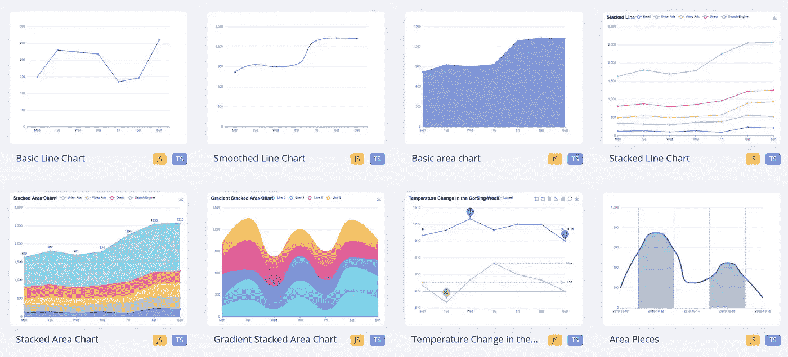
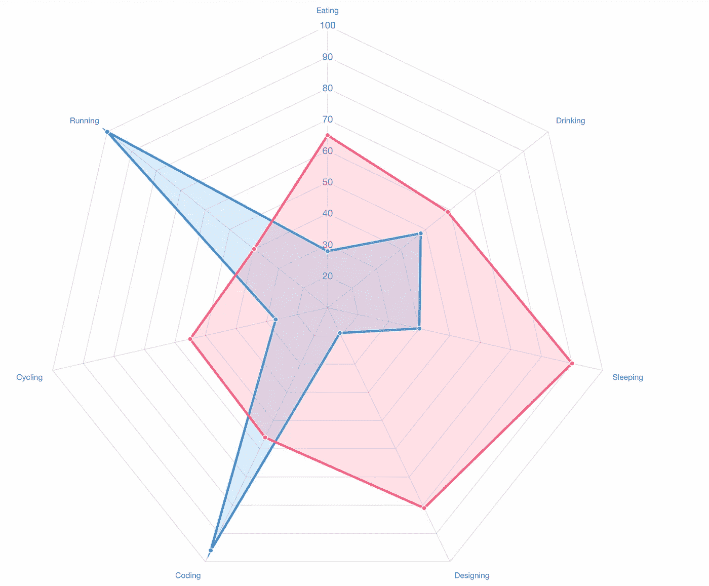
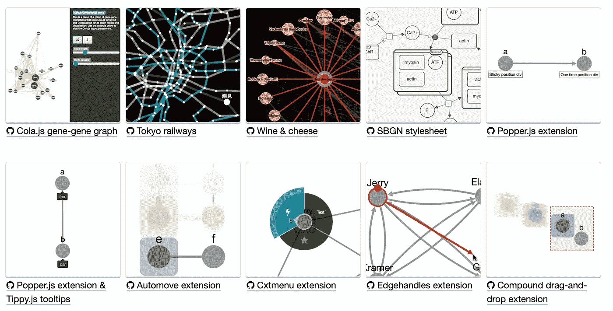
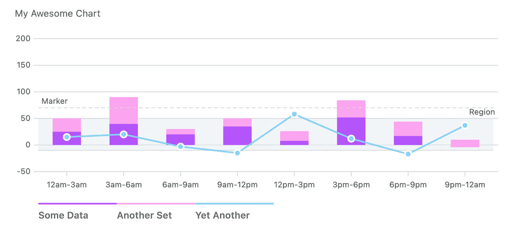
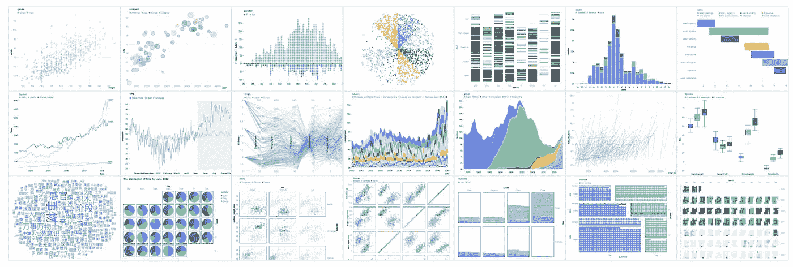
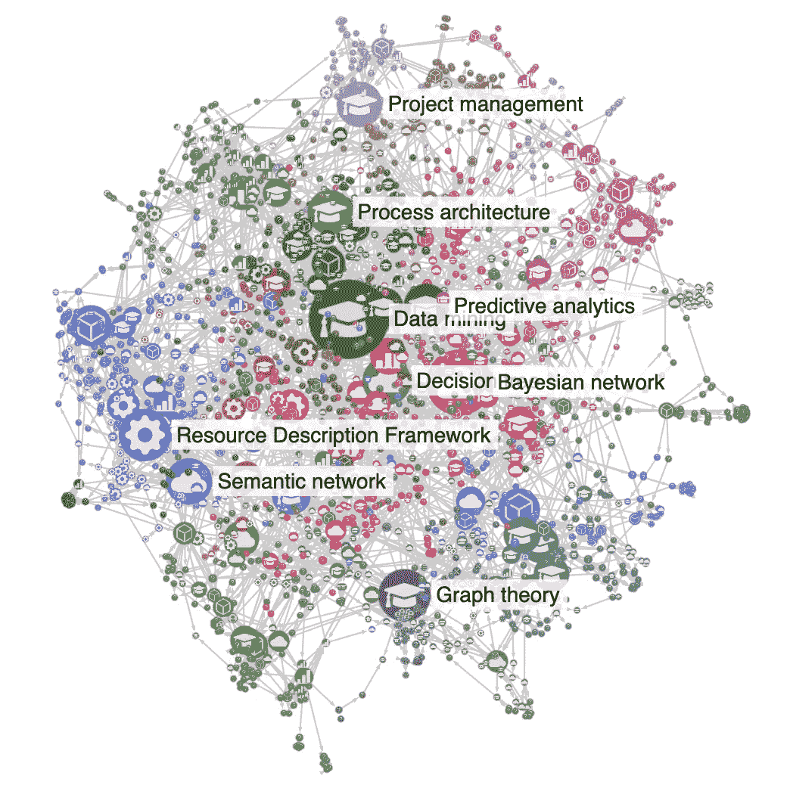
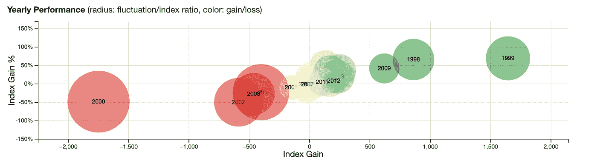

# 您可以在下一个项目中使用的 7 个 JavaScript 图表库

> 原文：<https://javascript.plainenglish.io/7-javascript-chart-libraries-you-can-use-in-your-next-project-8dbb6e960dcf?source=collection_archive---------5----------------------->

## 增强你的发展


Photo by [Luke Chesser](https://unsplash.com/@lukechesser?utm_source=unsplash&utm_medium=referral&utm_content=creditCopyText) on [Unsplash](https://unsplash.com/s/photos/chart?utm_source=unsplash&utm_medium=referral&utm_content=creditCopyText)

对于开发人员来说，处理数据是最常见也是最重要的任务之一。可视化您的数据将极大地帮助您理解数据想要告诉您什么。在这里，我整理了一份 7 个最佳图表库的列表，它们将帮助你完成这项重要的任务。

# 1.埃查尔兹



这是一个免费的、强大的图表和可视化库，提供了一种简单的方式来添加直观的、交互式的和高度可定制的图表。这个库提供了 20 多种现成的图表类型，以及十几个组件，每一种都可以任意组合使用。它在 GitHub 上有超过 53k 颗星。

[](https://github.com/apache/echarts) [## GitHub-Apache/ECharts:Apache ECharts 是一个强大的交互式图表和数据可视化工具…

### Apache ECharts 是一个免费的、功能强大的图表和可视化库，提供了一种简单的方法来添加直观的…

github.com](https://github.com/apache/echarts) 

# 2.Chart.js



我想你已经知道这个了。这是 GitHub 上拥有超过 58k 颗星的最有星的图表库之一。这个库将帮助你以 8 种不同的方式可视化你的数据，并且每种方式都是可定制的动画。这个库很容易上手。所需要的只是页面中包含的脚本以及一个呈现图表的节点。

[](https://github.com/chartjs/Chart.js) [## GitHub — chartjs/Chart.js:使用标签的简单 HTML5 图表

### 使用标签的简单 HTML5 图表。在 GitHub 上创建一个帐户，为 chartjs/Chart.js 的开发做出贡献。

github.com](https://github.com/chartjs/Chart.js) 

# 3.细胞景观



如果你需要显示关系数据，如生物数据或社交网络，那么这是一个很好的资源。它包含一个图论模型和一个可选的渲染器来显示交互式图形。这个库旨在使程序员和科学家尽可能容易地在他们的应用程序中使用图论，无论是在 Node.js 应用程序中进行服务器端分析还是丰富的用户界面。它在 GitHub 上有超过 8.5k 颗星。

[](https://github.com/cytoscape/cytoscape.js) [## GitHub — cytoscape/cytoscape.js:用于可视化和分析的图论(网络)库

### 用于可视化和分析的图论(网络)库:https://js.cytoscape.org 细胞景观。js 是一个完全…

github.com](https://github.com/cytoscape/cytoscape.js) 

# 4.图表



这个库提供了简单、快速、现代的 SVG 图表，并且没有任何依赖性。它的灵感来自 GitHub。这个库在 GitHub 上有超过 14.5k 的星星。

[](https://github.com/frappe/charts) [## GitHub - frappe/charts:简单、响应迅速、现代化的 SVG 图表，零依赖性

### 通过 NPM $ npm 安装 frappe-charts 并包含在您的项目中:或包含以下…

github.com](https://github.com/frappe/charts) 

# 5.G2 Esports 电子竞技俱乐部



这种高度交互式的数据驱动的统计图可视化语法。具有高度的可用性和可伸缩性。它提供了一套语法，将用户从有限的图表带到了几乎无限的图形世界。有了这个库，只需一条语句就可以描述可视化的视觉外观和交互行为，并使用 Canvas 或 SVG 生成基于 web 的视图。它在 GitHub 上有超过 11k 颗星。

[](https://github.com/antvis/G2) [## GitHub - antvis/G2:📊一种可视化语法，用于仪表板构建、数据探索和…

### English | 简体中文 G2 5.0 仍在开发中，4.x 稳定版在 master 分支上. G2 的名字来自于 Wilkinson 的《Grammar of Graphics》，并在功能和 API…

github.com](https://github.com/antvis/G2) 

# 6.sigma.js



如果你的图有很多节点和边，那么这是一个很好的资源。这个库旨在可视化成千上万个节点和边的图形。它使用 WebGL 来呈现图形。这个库在 GitHub 上有超过 10k 颗星星。

[](https://github.com/jacomyal/sigma.js) [## GitHub - jacomyal/sigma.js:一个 JavaScript 库，旨在可视化成千上万个节点的图形…

### Sigma.js 是一个开源 JavaScript 库，旨在可视化成千上万个节点和边的图形，主要是…

github.com](https://github.com/jacomyal/sigma.js) 

# 7.直流 js



这是一个多维图表，旨在使用 d3.js 呈现的 cross filter 进行本地工作。在这个库中，每个图表通过其元素的位置、大小和颜色显示一些属性的集合，还提供了一个可以过滤的维度。当滤镜或笔刷更改时，所有其他图表都会使用动画转场进行动态更新。这个库在 GitHub 上有超过 7k 的星星。

[](https://github.com/dc-js/dc.js) [## GitHub - dc-js/dc.js:多维制图构建为与交叉过滤渲染一起本机工作…

### 多维图表构建为与使用 d3.js - GitHub - dc-js/dc.js 渲染的 crossfilter 一起工作…

github.com](https://github.com/dc-js/dc.js) 

# 其他一些很棒的资源在哪里？

总有新的东西要学。如果你想了解 Javascript 上令人敬畏的库，请查看下面的链接。

[](/7-useful-javascript-libraries-you-should-use-in-your-next-project-47d233d24480) [## 你应该在下一个项目中使用的 7 个有用的 JavaScript 库

### 增强您的 JavaScript 开发

javascript.plainenglish.io](/7-useful-javascript-libraries-you-should-use-in-your-next-project-47d233d24480) 

今天到此为止。相信这些库对你的开发之旅会有很大的帮助。

如果你知道任何其他漂亮的 JavaScript 图表库，请在评论中分享。直到我们再次见面…干杯！

```
**Want to Connect?.** If you want to,you can connect with me on [**Twitter**](https://twitter.com/FarhanTanvirBD)
```

*更多内容请看*[***plain English . io***](https://plainenglish.io/)*。报名参加我们的* [***免费周报***](http://newsletter.plainenglish.io/) *。关注我们关于*[***Twitter***](https://twitter.com/inPlainEngHQ)[***LinkedIn***](https://www.linkedin.com/company/inplainenglish/)*[***YouTube***](https://www.youtube.com/channel/UCtipWUghju290NWcn8jhyAw)*[***不和***](https://discord.gg/GtDtUAvyhW) *。对增长黑客感兴趣？检查* [***电路***](https://circuit.ooo/) *。***