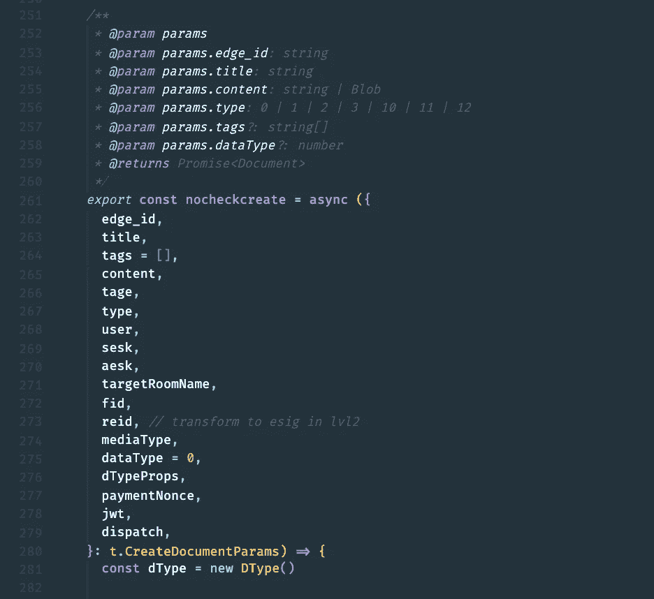

# 你的同事会喜欢你的 7 个 JavaScript 代码实践

> 原文：<https://javascript.plainenglish.io/7-javascript-code-practices-your-teammates-will-love-you-for-ea6fca2c7025?source=collection_archive---------8----------------------->

## 成为一名团队成员

*Photo by Nubelson Fernandes on Unsplash*

JavaScript 是一种有趣但高效的编程语言，它的发展速度前所未有。由于 JavaScript 语言的灵活性，我们可以自由地构建 web 应用程序。

如今构建 web 应用程序的常见方法通常与像 React 这样的流行库有关。有经验的开发人员通常会告诉你“做最适合你的事情”，当你在比较一个和另一个的时候，当你询问在你的项目中使用哪个工具的时候。

不幸的是，这种自由可能会带来另一个问题，我们可能会忘乎所以，习惯于编写适合自己而不是他人的代码*。*

这里有一个例子来说明我的意思:

这是一个在产品中的代码的老例子，当调试一个问题时，我不得不试图理解它。`args`是一个析构`{ apiBufferResult, reqOptions }`的对象，但是没有提到`_handledCode`是什么数据类型，或者当移除这些行时*是否会在某个时间*破坏应用程序。*只有编写代码的开发人员了解那里发生了什么。你会问，为什么这是个问题？因为现在我们别无选择，只能让这些代码保持原样，等待下一个开发人员变得困惑，就像我联系不到编写这些代码的作者一样！*

这篇文章将介绍 7 个你的队友会喜欢的 JavaScript 代码实践。这篇文章中的技巧来自我作为团队领导全栈工程师的意见和经验，我更关注前端方面的事情，所以我向你保证，这些技巧可以帮助你成为更有价值的队友，它们是有效的。

# 1.记录您的功能

我怎么强调都不为过！我非常喜欢和那些习惯于记录自己职能的队友一起工作:

这里有几件事需要注意。名称`matchInArray` *可能*就足够了，只需一点点思考和常识就可以忽略上面多余的 JSDoc 注释。但是*我们还不确定*。上面的评论澄清了我们提出的任何谜团。我们知道期望什么作为输入，并且我们对当前处理什么和不处理什么有一个全面的了解。你允许其他人拥有你的代码。

让我们来看看这段没有注释的代码，我会解释为什么我会对这段代码有疑问:

好吧，至少我知道这个函数打算使用其中一个键在数组`arr`中找到一个匹配值。但是看这个:`arr[i]?.[key] == value`。我们能从`arr[i]?.[key]`那里期待什么价值？它可以是另一个数组，一个对象，一个数字，从 A 到 Z 的完整字母表，任何东西。

假设写这段代码的作者联系不上，我们现在必须在同一天内开发一个涉及数组的新特性。我们需要完成的一项任务是拥有一个从某个数组中获取匹配产品 id 号的函数。

由于我们不能重用`matchInArray`，因为它正在使用`==`进行比较(这意味着`"5"`将为数字`5`返回`true`)，我们必须创建一个单独的函数。由于我们的新任务与`matchInArray`试图完成的目标相似，我们的新功能很可能有一个相似的名称。我们现在有两个听起来相似的函数。试图理解我们的代码的开发人员现在不得不面对一个两难的问题，他们可以使用什么功能来完成类似的任务。

这个故事的寓意？尝试帮助你的队友避免在岩石表面行走。他们不应该担心下一步该怎么走。

# 2.遵循相同的代码风格

当你的队友读到遵循相同编码风格的代码变化时，他们会喜欢的。安装`prettier`有时是不够的，例如，为这个数组做自动格式化会更好:

如果在 repo 中经常看到禁用 prettier 以允许它们都在同一行的代码，那么这应该是一个提示，您应该做一些类似的事情:

这将 9 行代码减少到了 2 行。

# 3.建立单元测试

当你为你的代码创建单元测试时，你就建立了“官方”的身份。它消除了神秘感，验证了你的代码，并给你周围的人带来了信心。

这是板上钉钉的事。我们知道你的代码的一切，它完成了它的任务。

当疑虑减少时，它会成为一种更有成效的开发体验。

# 4.提出有效的问题

有两种问题。第一种会悄悄地触动你询问对象的神经。

这里有一个问题*没有引起*的注意:

“我在谷歌上找不到关于这段代码的答案，为什么我们需要这部分？”

这里有一个*将*:

“这是用来做什么的，我们为什么需要这个零件？”

第二个问题很粗鲁，因为这表明你没有花时间自己解决这个问题，并且怀疑自己不是一个可靠的队友。你因为你的懒惰而占用了别人的时间，你表现出你不够在乎。

我曾经有一个员工问了很多这样的问题，超过 90%的时候(我甚至没有夸大这个百分比)我在谷歌搜索结果的首页找到了他的问题的答案。这个人有学士学位，有一份漂亮的简历，但最终却不符合他的职业道德。

不要误解我。我们喜欢被问到问题，但不是那种在谷歌搜索结果中搜索前 3 分钟就能找到的问题。

是 JavaScript。到处都是信息*。*

# *5.写作/写作功能流畅*

*不是每个人都能优雅地编写函数，因为更好地编写函数需要时间和练习，所以我们不会详细讨论这个问题。但就编写或命名函数而言，当以一种读起来像一本书的方式编写时，它会对你作为队友的价值产生难以置信的影响。*

*一本名为《T0》的巨著中有一节讲述了`filter`，[完美地解释了这一点](https://github.com/getify/Functional-Light-JS/blob/master/manuscript/ch9.md/#filtering-out--filtering-in)。*

*例如，当实现过滤器功能时。在现实生活中，当我们想到过滤时，我们会想到过滤掉不好的东西，比如水的过滤。*

*但是在编程中，一些概念的行为方式相反。*

# *6.抓虫子*

*作为一名领导者，我可以立即确认我喜欢队友在我之前发现我(或他们)代码中的错误，并大声说出来。这防止了用户可能会意外遇到的错误，并且我们都少了一个需要担心的错误。*

*我高度重视那些自己抓虫子的队友，大声说出来，不浪费一分钟让虫子飞起来。*

# *7.对您的参数排序*

*大多数情况下，在函数变成这样之前，参数的声明没有特定的顺序，这没什么大不了的:*

**

*当处理这样的函数时，我们不得不上下跳动来寻找参数。在某些情况下，这可能是好的，比如将它们排列在需要的位置，从顶部开始，或者强调一些重点(比如 *title* ，如果它与博客帖子或其他内容相关的话)。但是如果没有好的理由，我强烈建议帮每个人一个忙，把他们分类，否则你就像第四步中的人一样。*

# *结论*

*本帖到此结束！我希望你发现这是有价值的，并期待在未来更多！*

**更多内容请看*[***plain English . io***](https://plainenglish.io/)*。报名参加我们的* [***免费周报***](http://newsletter.plainenglish.io/) *。关注我们关于*[***Twitter***](https://twitter.com/inPlainEngHQ)*和**[***LinkedIn***](https://www.linkedin.com/company/inplainenglish/)*。加入我们的* [***社区***](https://discord.gg/GtDtUAvyhW) *。***