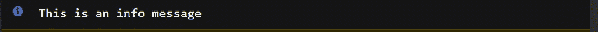
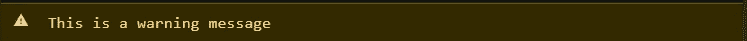
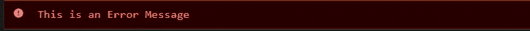
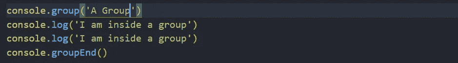
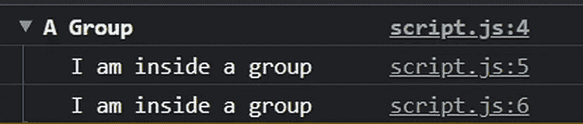
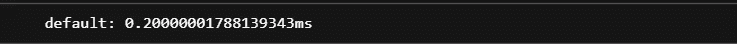
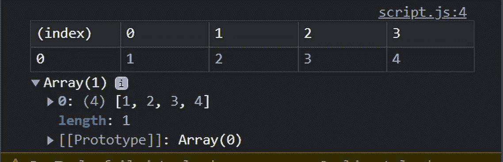

# 您需要了解的 7 种 JavaScript 控制台方法

> 原文：<https://javascript.plainenglish.io/7-javascript-console-methods-you-need-to-know-about-3efd3010c77d?source=collection_archive---------14----------------------->

## 不仅仅是 console.log()


Photo by [Christopher Gower](https://unsplash.com/@cgower?utm_source=medium&utm_medium=referral) on [Unsplash](https://unsplash.com?utm_source=medium&utm_medium=referral)

当谈到在 JavaScript 中使用控制台时，除了 console.log()语句之外，还有更多的东西可以提供。

在本文中，我将向您展示 7 种控制台方法，让您更有效地使用控制台。

# 1.控制台。清除()

第一种方法是 console.clear()方法。

console.clear()命令的作用是清除所有以前的控制台语句。这有助于在调试时保持控制台整洁有序。

```
console.clear();
```

# 2.控制台。信息()

我们打印到控制台的能力不仅限于使用 console.log()语句。

我们的下一个控制台方法 c **onsole.info()，**打印一条信息性消息，其中包含我们传递给该方法的字符串。在大多数浏览器中，该控制台语句将具有蓝色样式，旁边有一个小的“I”图标。

console.info()的语法如下:

```
console.info("This is an info message");
```



What a Console.Info() message looks like in the console

# 3.控制台。警告()

与 console.info()类似的 **console.warn()** 方法提供了一种不同的打印到控制台的方法。

console.warn()方法将向控制台输出一条警告消息，可以通过它的黄色样式来区分。

console.warn()的语法如下:

```
console.warn("This is a warning message");
```



What a Console.Warn() message looks like in the console

# 4.控制台。错误()

**Console.error()** 是一个输出错误消息的控制台方法。

这是捕捉应用程序中错误的一个很好的方法，因为很难忽略 console.error()方法独特的红色样式。

console.error()的语法如下:

```
console.error(“This is an Error Message”);
```



What a console.error() message looks like

# 5.控制台。组和控制台。GroupEnd()

我们的下一个方法实际上是两个独立的方法控制台。group()和 console.groupEnd()。这些方法被认为是一种方法的原因是，没有一种方法，你就不能真正使用另一种方法。

console.group()和 console.groupEnd()所做的是对出现在 console.group()之后、console.groupEnd()之前的控制台语句进行分组。

这是为您的控制台语句提供结构的一个很好的方式，并且使控制台的调试更加容易。

您甚至可以更进一步，将一个字符串传递到控制台。group()来命名组



Using Console.Group() and console.groupEnd()



The effects using console.group() and console.groupEnd()

# 6.Console.time()和 console.timeEnd()

我们还有两种方法，缺一不可。Console.time()和 console.timeEnd()。这两种方法允许我们向控制台添加计时器

console.time()启动计时器，console.timeEnd()结束计时器。一旦调用 console.timeEnd()，两者之间经过的时间将被打印到控制台。



Result of using console.time() and console.timeEnd()

# 7.控制台。表格()

我们的最后一个方法是 console.table()，它允许我们在控制台中显示一个表格。我们要做的就是传递一个数组和控制台。table()将完成剩下的工作。

console.table()的 Sytnax:

```
const randomArr=[[1,2,3,4]]
console.table(randomArr);
```



Console.Table() output in console

*注:控制台。Table()最适合二维或更高的数组。如果你想看到上表中的一维数组用括号括起来，如下:*

```
const arr=[1,2,3]
console.table([arr])
```

# 结论

感谢您阅读完我关于**‘7 个您绝对没听说过的 Javascript 控制台方法’**的文章。如果你有任何问题，请随意提问，我会尽快回答。

我希望你有美好的一天。如果你刚接触媒体，你可以点击这里的[链接加入。](https://bookeraziz.medium.com/membership)

*更多内容请看**[***说白了。*** *报名参加我们的*](http://plainenglish.io/) [***免费每周简讯***](http://newsletter.plainenglish.io/) ***。*** *在我们的**[***社区不和谐***](https://discord.gg/GtDtUAvyhW) ***中获得独家写作机会和建议。*****