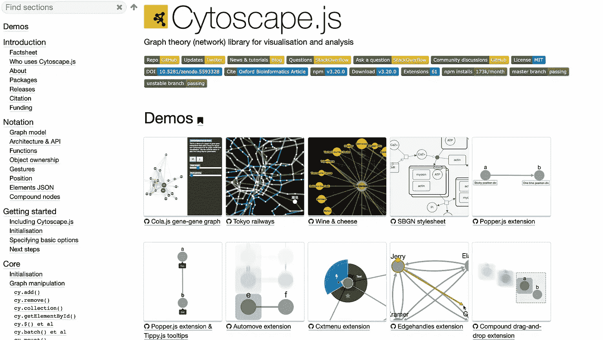
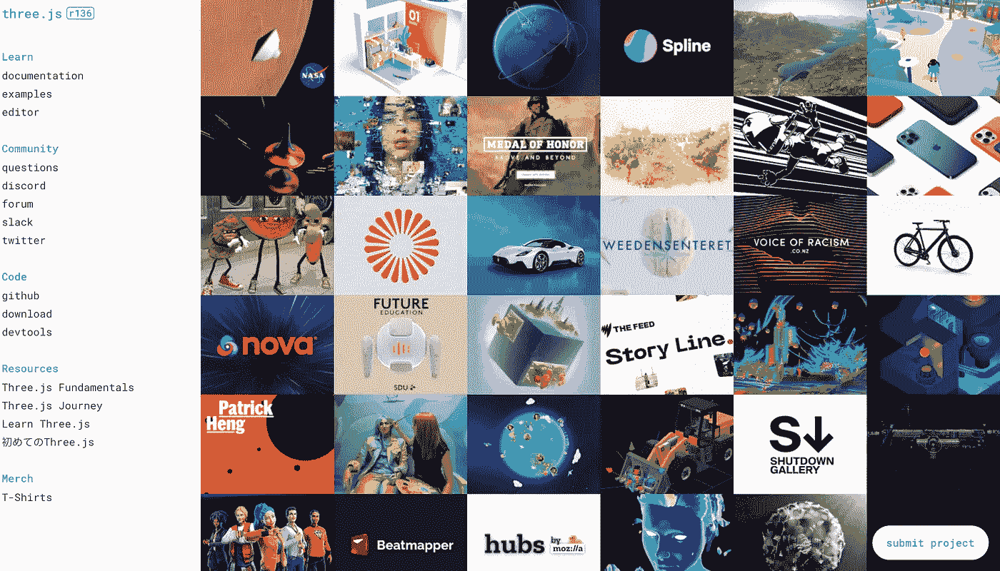

# 7 个 JavaScript 库，用于数据操作、可视化和机器学习。

> 原文：<https://javascript.plainenglish.io/7-javascript-libraries-for-data-manipulation-visualization-and-machine-learning-70530a898a32?source=collection_archive---------1----------------------->

## 你试过这些套餐了吗？

Photo by [Shubham Dhage](https://unsplash.com/@theshubhamdhage?utm_source=unsplash&utm_medium=referral&utm_content=creditCopyText) on [Unsplash](https://unsplash.com/s/photos/visualization?utm_source=unsplash&utm_medium=referral&utm_content=creditCopyText)

我们说数据大家首先想到的就是 Python。当我们开发 web 应用程序时，我们经常忘记我们是用 JavaScript 编码的。我们可以在同一个浏览器中实时查看、编辑和编码所有内容。

是的，JavaScript 是网络的默认编程语言，而且在未来 5-10 年内都是如此(至少可以这么说)。它在网络上无处不在。

我们学习东西的同一个网络。所以，如果我们想做数据分析，可视化，或者机器学习，我们应该想到 JavaScript 而不是 Python。

我们开发人员在软件开发中总是说一句话——除非必要，否则永远不要试图重新发明轮子。

如果某个东西存在，就将其作为依赖项添加。如果没有，尝试找到一个类似的开源项目，并根据自己的需要进行调整。

我不知道你怎么想，但我真的相信。

谈到 JavaScript 开发，npm 注册表中列出了大量超酷的开源项目和包，您可能会发现它们对您的项目非常有用。

在这里，我将讨论七个 npm 包，我发现它们对开发人员操作数据、可视化和执行机器学习最有帮助。

# 1 Tidy.js

screenshot

Tidy.js 是一个用 JavaScript 从头开始开发的数据辩论库。它

在 JavaScript 应用程序中进行数据操作时，这是最容易开始的。

如果您已经掌握了 JavaScript 数组和对象的知识，那么这个库对您来说是最容易学习的。

[链接到 Tidy.js](https://pbeshai.github.io/tidy/)

# 2.阿帕奇箭头

该项目旨在建立一种 arrow 技术，使数据从数据格式的大簇反序列化到像 Python 或任何其他语言中的 Pandas library 这样的内存解决方案，比现有的解决方案更容易和更快。

Apache Arrow 是一个用于内存分析的跨语言开发平台。API 有多种语言版本，如 JavaScript、Python、Java 等。

# 3.TensorFlow.js

screenshot

TensorFlow 是软件行业几乎所有人都熟知的库。不开玩笑！Tensorflow 现在也有 JavaScript 版本。它允许开发者通过 Node.js 在浏览器或后端直接构建机器学习模型。

[链接到 Tensorflow.js](https://www.tensorflow.org/js)

# 4.Cytoscape.js

screenshot

Cytoscape 是一个丰富的 JavaScript 库，用于分析图形。它是一个鲜为人知的库，允许开发人员以一种独特的方式在浏览器中可视化图形数据。它包括了可视化库中所有的手势，比如缩放、框选和平移。它支持 web 和移动应用程序。

[链接到 Cytoscape.js](https://js.cytoscape.org/)

# 5.D3.js

screenshot

它是一个通用的、最成熟的数据可视化库。甚至谷歌也用它来创建这个库的数据实验和可视化。

D3.js 帮助您使用 HTML、SVG 和 CSS 将数据变得生动。

它很容易与任何现代 JavaScript web 框架集成，如 React、Angular、Vue.js 等。

[链接到 D3.js](https://d3js.org)

# 6.三. js

screenshot

Three.js 是一个面向创意开发者的 3d 可视化库。

你有没有想过 Github 是如何在其登陆页面上制作出那个创意地球仪的？是的，他们从 three.js 那里得到了一点帮助来减轻他们的工作。

如果你想把你的 3d 模型放到网上，这个库是你必须尝试的。

[链接到 Three.js](https://threejs.org)

# 7.Chart.js

顾名思义，它是一个网络图表库。它有一个离线库，并支持浏览器内 API，可以在现代浏览器上毫无困难地创建有吸引力的交互式图表。

[链接到 Chart.js](https://www.chartjs.org)

这个帖子到此为止。我希望你喜欢它。

你觉得这篇文章有用吗？你会在下一个项目中使用这些库吗？请在评论区告诉我。我很想知道你对此的看法。

## *延伸阅读*

 [## 你的商业危机管理计划可能已经过时了

### 任何企业都可能在其生命周期中面临许多逆境。据说有坚韧不拔的精神去经受风雨…

简明英语. io](https://plainenglish.io/blog/your-business-crisis-management-plan-may-be-outdated) 

*更多内容请看*[***plain English . io***](https://plainenglish.io/)*。报名参加我们的* [***免费周报***](http://newsletter.plainenglish.io/) *。关注我们关于*[***Twitter***](https://twitter.com/inPlainEngHQ)[***LinkedIn***](https://www.linkedin.com/company/inplainenglish/)*[***YouTube***](https://www.youtube.com/channel/UCtipWUghju290NWcn8jhyAw)*[***不和***](https://discord.gg/GtDtUAvyhW) *。对增长黑客感兴趣？检查* [***电路***](https://circuit.ooo/) *。***