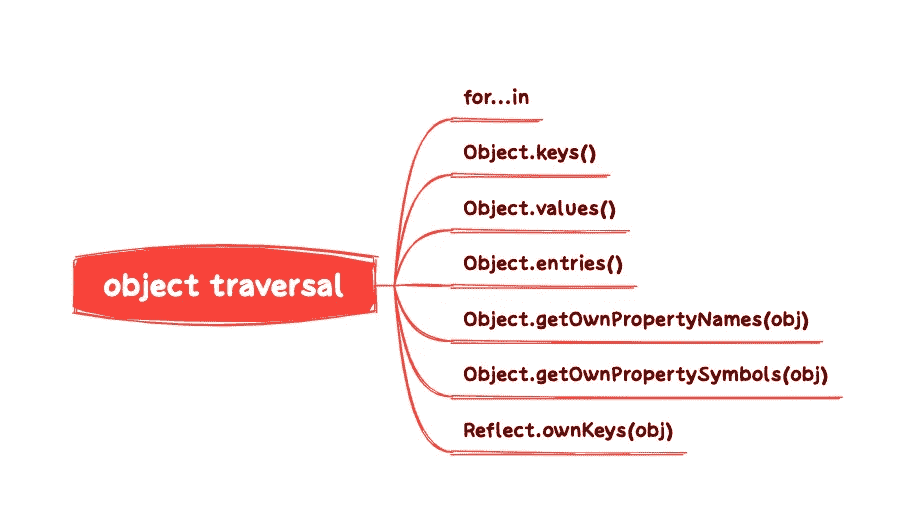

# 你应该知道的 7 种 JavaScript 对象遍历方法

> 原文：<https://javascript.plainenglish.io/7-javascript-object-traversal-methods-you-should-know-about-5b4da5edb61a?source=collection_archive---------1----------------------->

我们在工作中经常会遇到 JavaScript 对象遍历的场景，但是我们不知道合适的用法以及它们之间的区别。

所以我系统整理了 JavaScript 对象遍历的常用方法，供大家参考。

# 这是思维导图

# 1.为了…在

*   遍历对象自身和继承的可枚举属性的键名(不包括`Symbol`属性)。
*   因为对象的属性没有顺序，`for… in`会对每个属性返回一次，但是输出的属性顺序是不可预知的。

这里的`var`运算符不是必须的，但是为了保证局部变量，建议使用上面的写法。

在下面的代码中，`for…in`属性遍历了`tom`对象本身的对象和方法，以及从构造器 Person 的`prototype`原型继承的属性和方法。

## `for…in`用于数组遍历

遍历数组的缺点:

a.数组的键名是一个数字，但是`for…in`循环采用一个字符串作为键名“0”、“1”、“2”，以此类推。

b.for… In 循环不仅遍历数字键名，还遍历手动添加的其他键，甚至是原型链上的键。

c.在某些情况下，`for…in`循环会以任何顺序遍历键名。

d.`for…in`循环主要用于遍历对象，而不是数组。

## 使用 `for…in`进行深度克隆

# 2.Object.keys(obj)，Object.values(obj)，Object.entries(obj)

`Object.keys(obj)`、 `Object.values(obj)`、`Object.entries(obj)` 都返回一个数组。区别在于数组成员不同(它们不包含`Symbol`属性)。

*   **Object.keys(obj)**

返回一个数组，数组成员是参数对象本身所有可枚举属性的键名**(无继承)。**

*   **对象.值(obj)**

返回一个数组，数组成员是**参数对象本身所有可枚举属性的键值**(不包括继承)。

*   `**Object.entries(obj)**`

返回一个数组，数组成员是参数对象本身所有可枚举属性的键值对的**数组(不包括继承)。**

## 用数组方法遍历对象属性

*   组合`for…of`遍历

*   组合`Array.forEach()` | `Array.filter()` | `Array.map()` | `Array.findIndex()` | `Array.every()` | `Array.some()`等。

## `Object.entries(obj)`把物体变成真实的地图结构

# 3.object . getownpropertymanames(obj)

`Object.getOwnPropertyNames(obj)`返回一个数组，数组成员包含对象本身所有属性的键名(不包括符号属性，但包括不可枚举属性)。

使用 array 方法可以遍历由`Object.getOwnPropertyNames(obj)`返回的数组

# 4.object . getownpropertymodals(obj)

`Object.getOwnPropertySymbols(obj)` 返回一个数组，数组成员包含**对象本身的所有符号属性**的键名。

`Object.getOwnPropertySymbols (obj)`与`for…in`回路和`Object.getOwnProperNames(obj)`的比较。

这里是一个`Object.getOwnPropertySymbols(obj)`遍历对象的例子。

# 5.Reflect.ownKeys(obj)

`Reflect.ownKeys(obj)`会返回一个数组，其成员包含**对象本身的所有键名(不包括继承)**，无论键名是`Symbol`还是 string，或者是否可枚举，都是`Object. getOwnPropertyNames(obj)`和`Object.getOwnPropertySymbols(obj)`之和。

# 其他的

## 遍历对象属性的顺序规则

上述遍历对象的方法都遵循相同的规则:

*   首先，遍历所有的数字键，按升序排列。
*   其次，遍历所有的字符串键，按照添加时间升序排列。
*   最后遍历所有的`Symbol`键，按照添加时间升序排列。

## 注意事项

*   ES6 规定所有类原型的方法都是可枚举的。
*   在操作中引入继承属性会使问题复杂化。很多时候，我们只关心物体本身的属性。因此，尽量不要使用`for…in`回路，而使用`Object. keys(obj)`代替。

*更多内容请看*[***plain English . io***](https://plainenglish.io/)*。报名参加我们的* [***免费周报***](http://newsletter.plainenglish.io/) *。关注我们关于*[***Twitter***](https://twitter.com/inPlainEngHQ)[***LinkedIn***](https://www.linkedin.com/company/inplainenglish/)*[***YouTube***](https://www.youtube.com/channel/UCtipWUghju290NWcn8jhyAw)***，以及****[***不和***](https://discord.gg/GtDtUAvyhW) *对成长黑客感兴趣？检查* [***电路***](https://circuit.ooo/) ***。*****