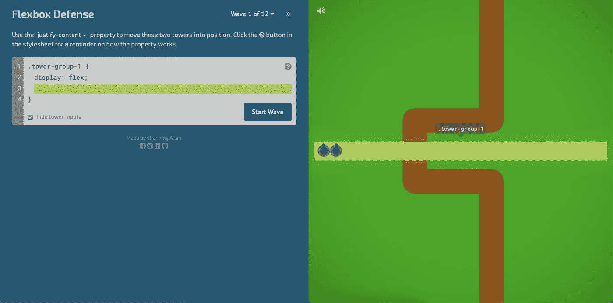
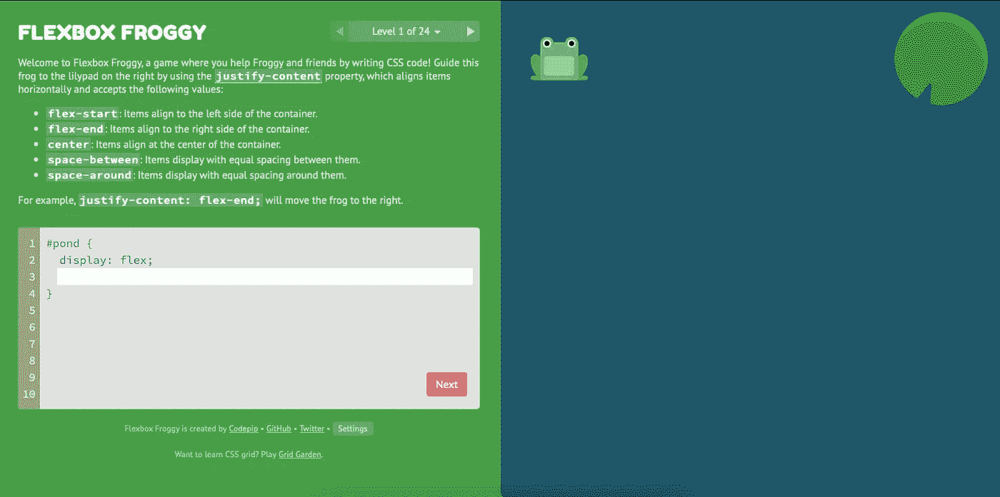

# 帮助你学习 CSS 概念的 7 个黑仔游戏

> 原文：<https://javascript.plainenglish.io/7-killer-games-to-help-you-learn-css-concepts-a83febeaa0b6?source=collection_archive---------12----------------------->

## 在这些游戏的帮助下学习 CSS 很有趣

Photo by [kazuend](https://unsplash.com/@kazuend?utm_source=medium&utm_medium=referral) on [Unsplash](https://unsplash.com?utm_source=medium&utm_medium=referral)

开发人员经常抱怨 CSS 令人厌烦和沮丧。

我同意学习 CSS 是令人沮丧的。刚学 CSS 的时候，我觉得自己是个失败者。我挣扎了三个小时都没把一个扣子扣好。我停止学习 CSS，转而学习 JavaScript，因为它需要太长的学习时间。

但是在我开发生涯的后期，我又回到了 CSS。要正确学习 CSS，我找了一些游戏，可以帮助你学习 CSS 概念。

我也没有踢完所有的比赛，我也不会建议你仅仅为了比赛而比赛。只需在 CSS 中挑选对你来说最难的题目，然后挑选正确的游戏。通过玩正确的游戏来学习那些困难的概念。

# 1.Flexbox 防御

Photo from [Flexboxdefense website](http://www.flexboxdefense.com)

## 关键特征

*   [Flexbox Defense](http://www.flexboxdefense.com) 是一款基于塔防游戏的游戏。
*   您需要使用 CSS 命令将元素放在正确的位置。
*   整个屏幕将被分成两部分。
*   你必须在屏幕的左边输入命令。
*   Flexbox 防御包括诸如 align-items、justify-content、align-self 和 order 等属性。
*   在这个游戏中总共有 12 个不同的关卡。
*   在最后三关你会学到很多 CSS。

# 2.Flexbox 青蛙

Photo from [Flexbox Froggy](https://flexboxfroggy.com) website

## 关键特征

*   顾名思义，制作 [Flexbox Froggy](https://flexboxfroggy.com) 游戏是为了让你了解 Flexbox。
*   这个游戏一共 24 关。
*   仅用基础知识，第一级是很容易通过的。
*   当你通过最初几关时，关卡会变得很难。
*   涵盖了各种 flex 属性。包括对齐项目、对齐上下文、对齐内容、伸缩方向、伸缩换行、伸缩流和自对齐。
*   后三关复杂又过瘾。

# 3.网格花园

Photo from [Grid Garden](https://cssgridgarden.com) Website

## 关键特征

*   [网格花园](https://cssgridgarden.com)详细介绍了所有的网格属性。
*   这个游戏总共有 28 个不同的关卡。
*   难度逐渐增加。
*   你必须使用网格的各种属性来浇灌和培育游戏中的胡萝卜园。
*   代码编辑器和可视区域都在同一个屏幕上。
*   当您使用 grid 属性时，您将直接看到它的结果。
*   您可以使用的各种网格属性包括网格-列-开始、网格-列-结束、网格-列、网格-行-开始、网格-行-结束、网格-行、网格-区域、顺序、网格-模板-列、网格-模板-行和网格-模板。

# 4.CSS 晚餐

Photo from [Flukeout](https://flukeout.github.io) website

## 关键特征

*   [CSS 晚餐](http://Key features)涵盖了不同类型的 CSS 选择器。
*   这个游戏总共有 32 个不同的关卡。
*   第一级教授基本的选择器，比如元素选择器和类选择器。
*   在后面的层次中，包含了一些高级概念，如 only-of-type 和 not(x)。
*   一旦你通过了这个游戏，你将成为 CSS 选择器的大师。

# 5.Flexbox 僵尸

Photo From [Mastery Games](https://mastery.games/flexboxzombies/) website

## 关键特征

*   [Flexbox 僵尸](http://Key features)是一门故事驱动的课程。
*   你将使用 Flexbox 和狩猎不同的僵尸。
*   你必须注册才能玩这个游戏。
*   你必须不断猎杀僵尸才能在游戏中生存。
*   在游戏的每一部分，你都会学到 flexbox 的新概念。
*   这个游戏将确保你对 flexbox 概念的掌握。

# 6.路标

Photo From [Roadmap](http://victordarras.fr/cssgame/) website

## 关键特征

*   玩[路线图](http://victordarras.fr/cssgame/)，速度和技巧都需要。
*   只是用 CSS 和 HTML 做的。
*   当你看源代码的时候，你会学到很多关于 CSS 的知识。它将教授剪辑路径，变换和动画。
*   这个游戏很好玩，玩起来很有意思。

# 7.狂欢节

Photo From [Original](https://codepen.io/una/full/NxZaNr) website

## 关键特征

*   在这个名为[嘉年华](https://codepen.io/una/full/NxZaNr)的游戏中，你必须使用复选框和 CSS 动画。
*   你只有八秒钟的时间击中所有目标。
*   这个游戏只用 CSS 做的。
*   Javascript 没有被用来构建这个游戏。

# 想联系作者？

[加入一个人人社区，欣赏与技术相关的文章。我们讨论最新的技术和独特的见解。](https://codertoentrepreneurs.substack.com/)

*更多内容请看*[*plain English . io*](http://plainenglish.io/)*。报名参加我们的* [*免费周报*](http://newsletter.plainenglish.io/) *。在我们的* [*社区*](https://discord.gg/GtDtUAvyhW) *获得独家的写作机会和建议。*