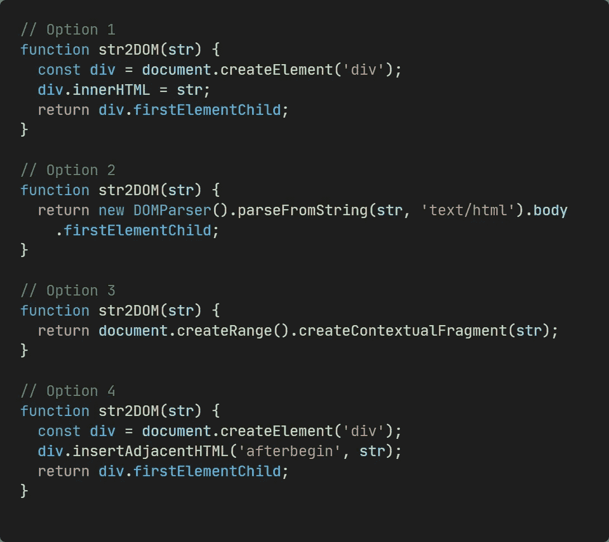
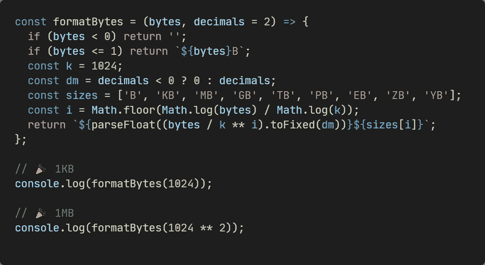
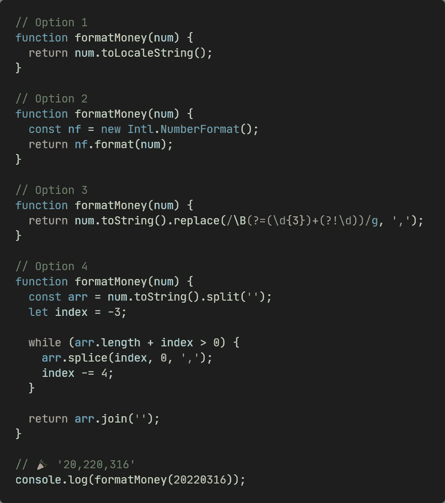
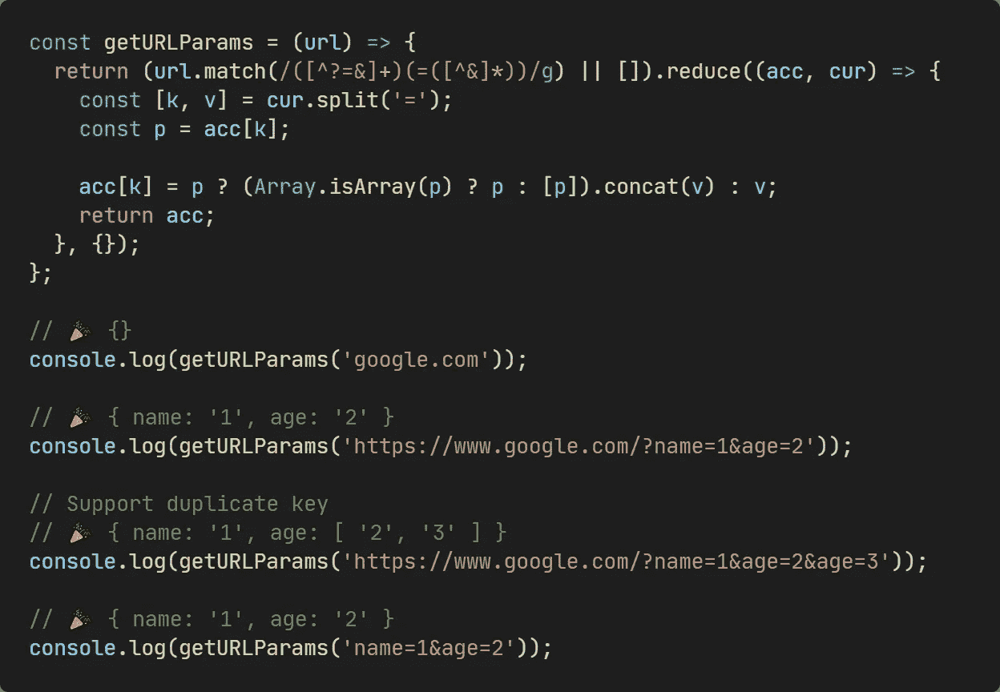
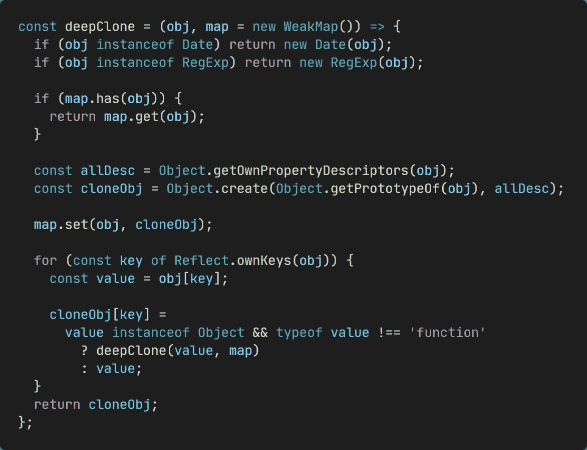
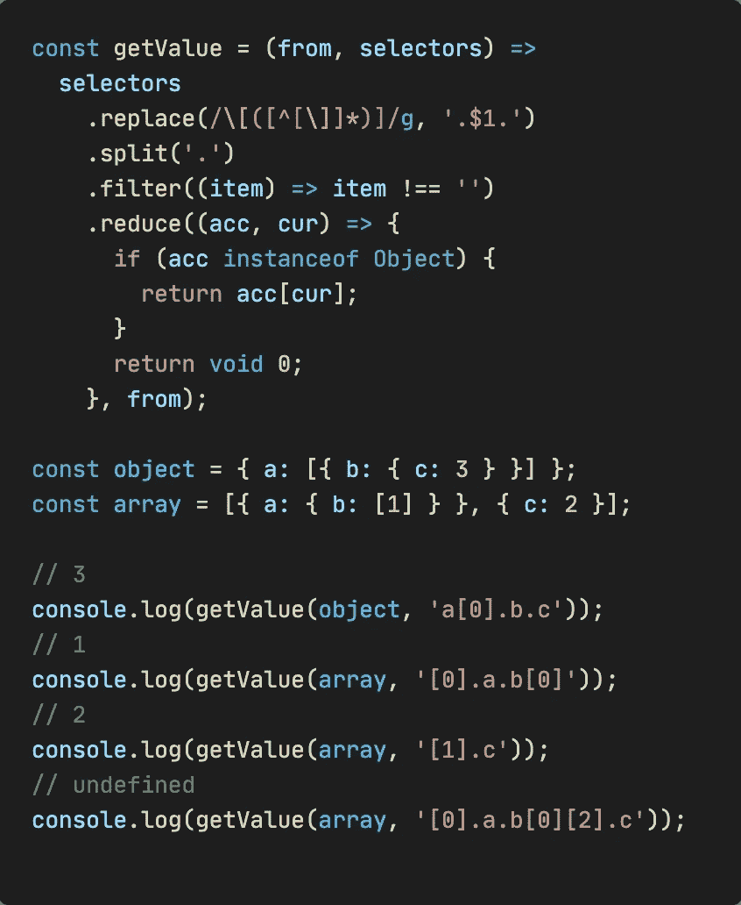
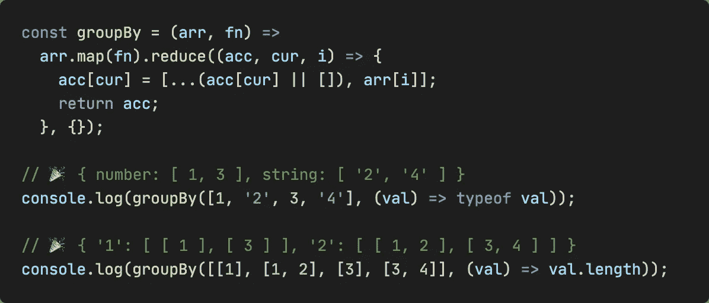

# 7 个黑仔 JavaScript 代码片段让你的生活更简单

> 原文：<https://javascript.plainenglish.io/7-killer-javascript-snippets-dbe49a9ccf11?source=collection_archive---------3----------------------->

## 高效的代码片段来拯救你的生命。

Image by Author

由于 JavaScript 简洁明了的语法赢得了众多开发者的青睐，越来越多的开发者开始使用它。今天，我将向您介绍 7 个杀手级 JavaScript 代码片段，每个代码片段都有相应的图像和堆栈，您可以在其中修改和查看结果。

这些代码片段不仅可以提高我们的开发效率，而且在某些情况下甚至可以取代额外的第三方库，使我们的应用程序更轻便，性能更好。所以让我们开始吧！

# 1.用 4 种方法将 HTML 字符串转换成 DOM

我们可以使用 ES6 提供的模板文字(模板字符串)来编写 HTML 字符串，这样我们就可以将那些变量嵌入到 HTML 中，然后通过下面的函数将字符串转换成真正的 DOM。通常在 3D 或地图中，这种动态 DOM 非常有用。

# 2.格式化字节

当我们想把字节转换成可读的文本时，下面的代码可能会对你有所帮助。

# 3.以 4 种方式格式化货币

太多的钱可能是一个烦恼，下面的代码将帮助你摆脱它！

# 4.将 URL 参数转换为对象

当您想从 URL 获取参数，但浏览器或 Node.js 似乎没有提供类似的便利方法时。下面的代码做你想要的，它也支持重复键(将成为数组)。

# 5.近乎完美的深度复制

当你在担心 JavaScript 为什么不提供原生的深度复制功能时，下面这个深度复制功能考虑了几乎所有的极端情况，足以让你面对复杂的需求。

下面文章详细解释。

 [## 如何在 JavaScript 中获得完美的深度拷贝？

### 实现大约 20 行的几乎完美的深度复制

levelup.gitconnected.com](https://levelup.gitconnected.com/use-pure-javascript-to-get-a-perfect-deep-copy-5fdc2d9e3d42) 

# 6.获取对象给定路径的值

# 7.按函数对数组分组

根据某些特征对数组进行分组在某些情况下会很有用。

# 了解更多信息

 [## 7 箭头功能和传统功能的区别

### 箭头函数能完全取代传统函数吗？

levelup.gitconnected.com](https://levelup.gitconnected.com/7-differences-between-an-arrow-function-and-a-traditional-function-bbf8a6dc8ca4)  [## 如何在 JavaScript 中得到一个完美的深度相等？

### 在反应浅相等的基础上实现几乎完美的深相等。

levelup.gitconnected.com](https://levelup.gitconnected.com/how-to-get-a-perfect-deep-equal-in-javascript-b849fe30e54f) 

*今天就到这里，感谢您阅读我的文章。我是李。我会继续输出前端技术相关的故事。如果你喜欢这样的故事，想支持我，请考虑成为* [*中等会员*](https://medium.com/@islizeqiang/membership) *。每月 5 美元，你可以无限制地访问媒体内容。如果你通过* [*我的链接*](https://medium.com/@islizeqiang/membership) *报名，我会得到一点佣金。*

你的支持对我来说非常重要——谢谢。

*更多内容请看*[***plain English . io***](https://plainenglish.io/)*。报名参加我们的* [***免费周报***](http://newsletter.plainenglish.io/) *。关注我们关于*[***Twitter***](https://twitter.com/inPlainEngHQ)*和*[***LinkedIn***](https://www.linkedin.com/company/inplainenglish/)*。加入我们的* [***社区不和谐***](https://discord.gg/GtDtUAvyhW) *。*