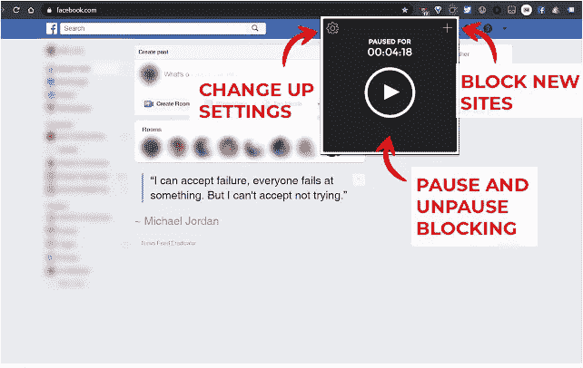
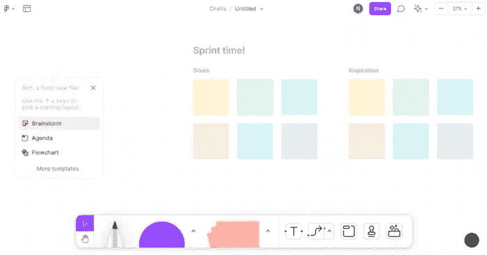
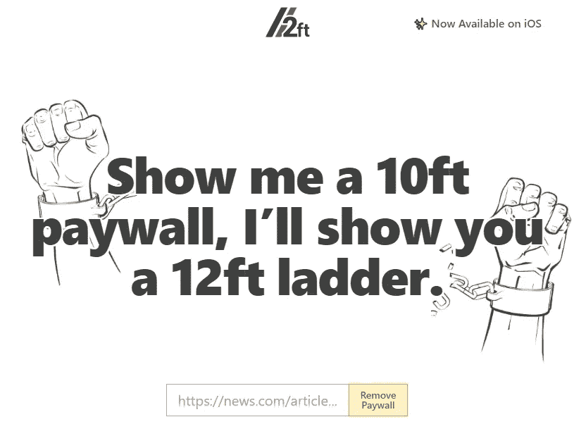
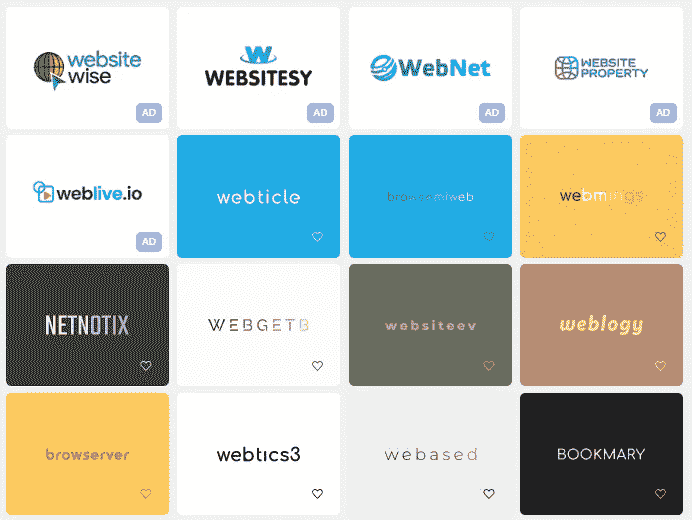
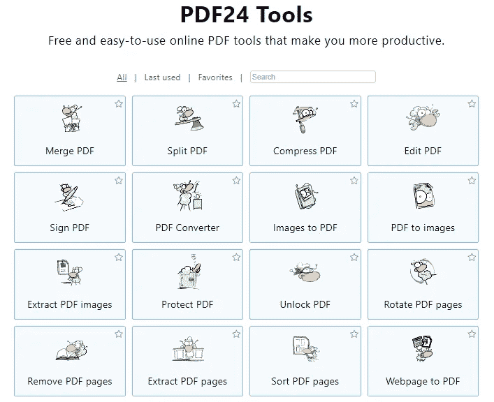

# 7 个黑仔生产力工具如此有价值，以至于他们觉得知道它们是违法的

> 原文：<https://javascript.plainenglish.io/7-killer-productivity-tools-that-are-so-valuable-they-feel-illegal-to-know-6cf8506b2bb9?source=collection_archive---------0----------------------->

## 是的，我不能没有这些。

Photo by [Nachristos](https://unsplash.com/@nachristos?utm_source=medium&utm_medium=referral) on [Unsplash](https://unsplash.com?utm_source=medium&utm_medium=referral)

你不一定要成为专家才能开始工作、创业、创业或副业。

富有成效是唯一重要的能力。努力工作，忽略大多数干扰，专注于你的任务是实现你想要的最简单的方法。

是的，就这些。

尼廷，你是个骗子。准确地说，没有。我过去没有写作技能，从小到大没有写过一首诗，但通过不断努力，我建立了一个报酬丰厚的兼职。

这就是原因，我在过去写了很多文章解释了几种可能让你的生活变得更容易的工具。同样，我今天发布另一篇文章来帮助你变得更有效率，节省时间，并在几秒钟内完成你的任务。

> 注意:这不是一篇宣传文章，因为没有网站付钱让我写它。它们在一定程度上都是免费的，所以不要担心必须花钱。

我们开始吧。

1.  [**去他妈的工作**](https://www.gofuckingwork.com/)

你在做什么吗？YouTube、Twitter、Gmail、Instagram 和许多其他网站会试图转移你的注意力。

为什么？因为当你花更多的时间时，他们正在产生金钱。

信不信由你，大多数人都成了它的受害者，浪费了他们宝贵的时间，却没有生产力。你使用社交媒体越多，你的大脑就变得越不专注。

解决方法是什么？使用该网站并阻止非生产性网站。

**2。** [**FigJam**](https://www.figma.com/figjam/) **或** [**网络白板**](https://webwhiteboard.com/)

你可能是个体户，也可能是雇员。不管你做什么，有时你必须创建工作流程和图表，向你的队友解释，有时甚至更多。

最好的工具是 FigJam 或 Web 白板。你可以把它想象成一块白板，在这里你可以产生想法、创建工作流程等等。

**3。**[**12 英尺梯子**](https://12ft.io/)

作为一名技术内容作者和程序员，我每天都会阅读大量博客。

是的，有些是免费的，有些是收费的。是的，我可以每月支付 5 美元(因为我赚钱)，但我不能支付几个网站。

解决方法是什么？使用 12 英尺长的梯子；只需粘贴网址，该工具将尝试删除付费墙，让您访问内容。

4. [**Namelix**](https://namelix.com/)

我在过去建立了许多网站，甚至在我为一家需要名字的初创公司工作的时候。我真的要花很长时间来命名一些东西。

事实上，我花了一个多星期才为我的网站获得一个域名。现在我相信这根本没用。比如小米、谷歌、铃木、Chrome 我不确定他们都是什么意思，但他们都在自己的领域做得很好。

你可能会问我解决办法是什么。很简单:使用 Namelix。

简单地写一个常见的词，如技术、数字、空间或基于你所从事的业务的信息。而且它会产生大量简短、朗朗上口的企业名称。

**5。** [**临时邮件**](https://temp-mail.org/) **，** [**假邮件**](https://www.fakemail.net/) **，或者** [**游击邮件**](https://www.guerrillamail.com/)

我经常从各种网站上寻找灵感，因此我必须熟悉它们的功能和设计。此外，我想订阅其他网站，以便从中获益。

为了学习新技术，我也必须做一个帐户，并阅读其内容。

这些都需要我用邮箱地址登录。为此，我已经建立了一个新的电子邮件地址。但不久之后，我发现了一些制作临时电子邮件地址的神奇工具。

其中一些是:

*   [游击邮件](https://www.guerrillamail.com/)
*   [假邮件](https://www.fakemail.net/)
*   [临时邮件](https://temp-mail.org/)

**6。**[**mix kit**](https://mixkit.co/)**，**[**Pexels**](https://www.pexels.com/)**，** [**Canva**](https://www.canva.com/)

你可能意识到你可以通过出售图片或电影在网上赚钱。Shutterstock 是可用于此目的的网站的一个例子。

毫无疑问，创作者或 YouTubers 使用这些平台来创作他们的内容。类似地，许多企业使用在线图像和视频为他们的企业创建演示文稿或视频。他们为此付出了代价。

但是如果我告诉你有一些免费的工具可以给你提供视频剪辑、图像、声音效果、视频模板等等，那会怎么样呢？
明显免费。

是不是很奇妙？

你可以使用 Mixkit 和 [Pexels](https://www.pexels.com/) 这两个网站来达到这个目的。 [Canva](https://www.canva.com/) 是另一种选择。

**7。** [**PDF24 工具**](https://tools.pdf24.org/en/)

如果您关注我，您可能会意识到，我以前使用过许多网站来处理 pdf。

我很快了解了 PDF24 工具。

你真的可以合并 pdf，签名 pdf，编辑 pdf，保护 pdf，转换成图像，等等。

嗯，除此之外我不能说太多；简单地使用它，你会发现它很有用。

就这样——谢谢。

如果你愿意，你可以免费获得我的 side hustle [电子书](https://nitinfab.gumroad.com/l/programming-side-hustle-book)。

[*如果你喜欢看这样的故事，并想帮助我成为一名作家，请考虑成为一名中等会员*](https://nitinfab.medium.com/membership) *。它每月花费 5 美元，给你* [*无限制访问媒体内容*](https://nitinfab.medium.com/membership) *。如果你通过我的链接注册，我会得到一点佣金。*

 [## 7 个你可能不用的黑仔工具可以帮你节省 1000 多美元

### 无论你是学生、朝九晚五的员工还是自由职业者。

medium.com](https://medium.com/swlh/7-killer-tools-youre-probably-not-using-that-could-save-you-1-000-aecd9f37b216)  [## 9 个让你大吃一惊的侧推工具

### 无论你是程序员、员工还是创造者。

medium.com](https://medium.com/swlh/9-side-hustle-tools-that-will-blow-your-mind-6ebb57787eb6) 

*更多内容请看*[***plain English . io***](https://plainenglish.io/)*。报名参加我们的* [***免费周报***](http://newsletter.plainenglish.io/) *。关注我们关于*[***Twitter***](https://twitter.com/inPlainEngHQ)[***LinkedIn***](https://www.linkedin.com/company/inplainenglish/)*[***YouTube***](https://www.youtube.com/channel/UCtipWUghju290NWcn8jhyAw)*[***不和***](https://discord.gg/GtDtUAvyhW) *。对增长黑客感兴趣？检查* [***电路***](https://circuit.ooo/) *。***