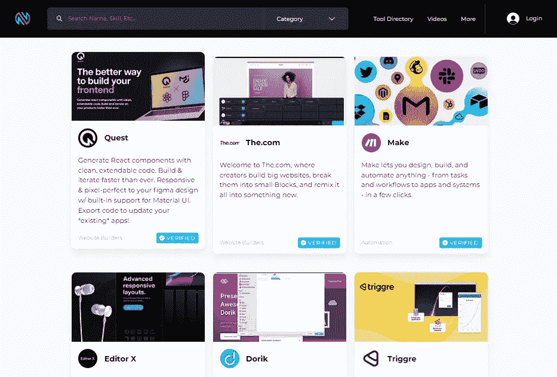
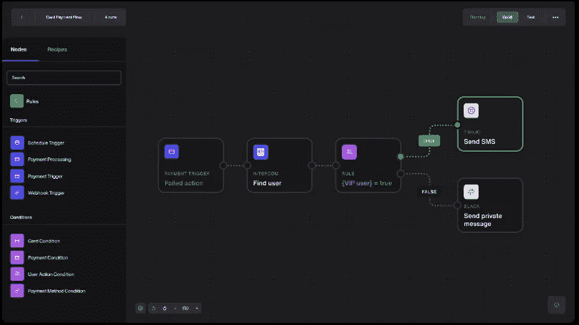
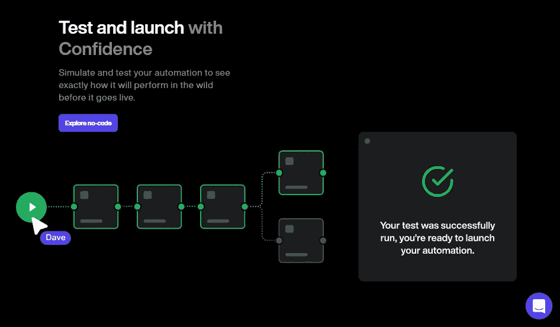
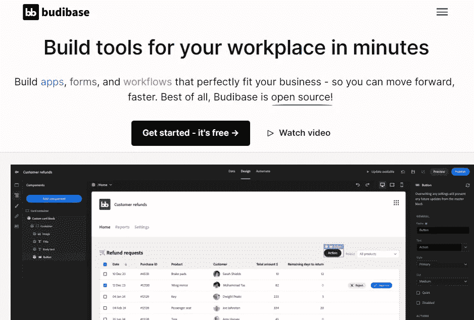
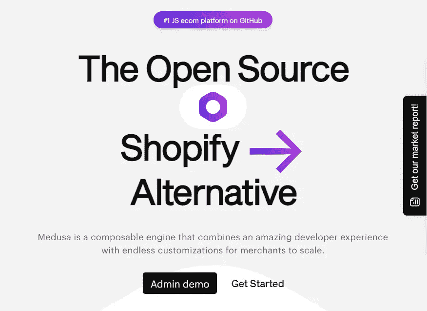
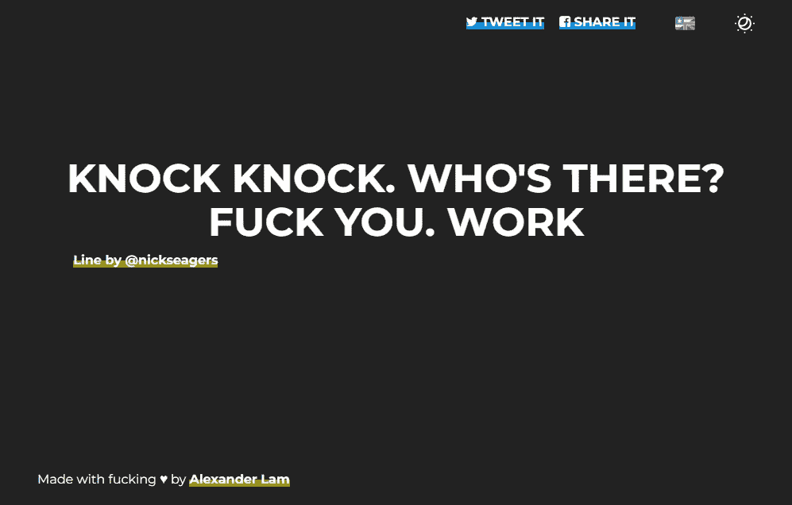
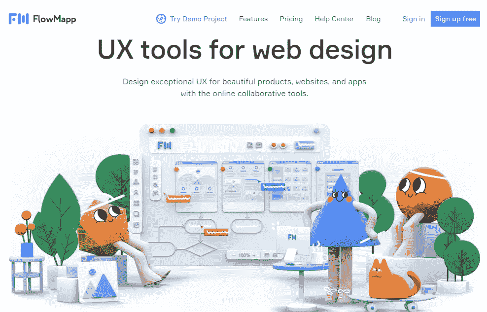

# 7 个黑仔工具是如此的有价值，以至于他们觉得知道它们是非法的——没有废话

> 原文：<https://javascript.plainenglish.io/7-killer-tools-that-are-so-valuable-they-feel-illegal-to-know-no-bs-5bfee6192871?source=collection_archive---------2----------------------->

## 我敢肯定，你从来没有听说过他们中的任何一个。

Photo by [Nachristos](https://unsplash.com/@nachristos?utm_source=medium&utm_medium=referral) on [Unsplash](https://unsplash.com?utm_source=medium&utm_medium=referral)

大多数人使用互联网来寻找工作、拓展业务或开始新的职业生涯。

毫无疑问，甚至我也是从程序员开始我的职业生涯，现在在家工作。除此之外，我还有副业，为几家公司做自由职业者。

我知道我大部分时间都在工作，为此，我通常依靠一些互联网工具来减少我的工作并节省我的时间。

具体来说，我使用[几个在线工具](https://medium.com/swlh/30-killer-tools-that-are-so-valuable-they-feel-illegal-to-know-no-bs-bfde1a56b5df)，并经常发现更多。如果你看我的个人资料，你会注意到我写了关于[的各种工具](https://medium.com/swlh/9-side-hustle-tools-that-will-blow-your-mind-6ebb57787eb6)，它们可以帮助你节省时间并完成任务(通常是免费的)。

即使是现在，我也想分享一些我最近发现的工具。

所以让我们开始吧。

> 注意:我写这篇文章并没有从这些工具中得到任何报酬。换句话说，我没有从他们的创始人那里得到任何报酬。没有附属链接，每一个都是免费使用的。

1.  

****

**如果你想建立一个网站或应用程序，或者如果你需要设计或自动化工具，NoCodeDevs 将会帮助你。**

**它包括一个资源列表，您可以使用它来完成您的工作。**

****2。** [**那时**](https://whenthen.com/)**

****

**如果你正在开发一个电子商务网站或应用程序，并且在自动化支付过程中遇到困难，WhenThen 可以帮助你。**

****

**这是一个基本流程，你可以用来测试和自动化你的支付过程。**

****3。**[**budi base**](https://budibase.com/)**

****

**Figma 是我个人最喜欢的工具，因为它允许你创建任何东西，从设计到工作流程。即使我写了很多关于 Figma 的东西，仍然有其他互联网工具可能有用。**

**其中一个就是 [Budibase](https://budibase.com/) 。它使您能够快速创建现代化的应用程序、表单和工作流程。**

**是的，有了这个工具，你不用写一行代码就可以快速构造应用，而且是完全可定制的。**

**需要更多吗？它是免费提供的。**

****4。** [**寻呼机**](https://www.beeper.com/)**

****

**当我检查手机时，我注意到各种聊天应用程序，包括 WhatsApp，Slack，Discord，Gmail，Telegram，以及许多其他应用程序。**

**更不方便的是，我不得不打开每一个应用程序来阅读消息。是的，我们需要使用各种应用程序，只是为了与朋友或同事聊天。**

**那么，解决办法是什么呢？使用[蜂鸣器](https://www.beeper.com/)在一个应用程序中访问您的所有聊天。**

**是不是很酷？**

****5。** [**美杜莎**](https://medusajs.com/)**

****

**我不知道你怎么想，但我发现构建一个电子商务网站非常麻烦，需要编写大量页面，使其具有响应性，创建管理面板，然后添加支付流程和其他一切。**

**这需要相当长的时间。**

**那么，解决办法是什么呢？[美杜莎](https://medusajs.com/)，一个免费开源的 Shopify 替代品，**

****6。** [**去他妈的工作**](https://www.gofuckingwork.com/)**

****

**程序员经常花时间写代码、学习新技术和构建东西。**

**浪费时间的最大原因是分心。**

**所以，从现在开始，你可以用[去他妈的工作](https://www.gofuckingwork.com/)。它将阻止非生产性网站。**

**7。[**flow mapp**](https://www.flowmapp.com/)**

****

**在 UX、战略、设计和开发中收集、组织和协作的非常简单的工具。设计网站地图，构建流程图，研究用户，规划客户旅程，管理内容，等等！**

**很酷，对吧？**

**希望你喜欢。**

**就这样——谢谢。**

**[*如果你喜欢看这样的故事，并且想帮助我这个作家，那就考虑成为一个中等成员吧*](https://nitinfab.medium.com/membership) *。每月花费 5 美元，你可以无限制地访问媒体内容。如果你通过我的链接注册，我会得到一点佣金。***

***更多内容请看*[***plain English . io***](https://plainenglish.io/)*。报名参加我们的* [***免费周报***](http://newsletter.plainenglish.io/) *。关注我们关于*[***Twitter***](https://twitter.com/inPlainEngHQ)[***LinkedIn***](https://www.linkedin.com/company/inplainenglish/)*[***YouTube***](https://www.youtube.com/channel/UCtipWUghju290NWcn8jhyAw)*[***不和***](https://discord.gg/GtDtUAvyhW) *。对增长黑客感兴趣？检查* [***电路***](https://circuit.ooo/) *。*****