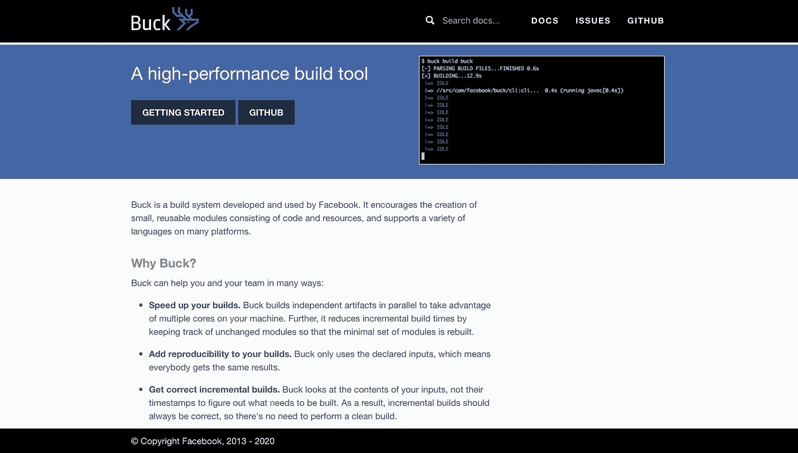

# 帮助开发人员节省大量时间的 7 个元项目

> 原文：<https://javascript.plainenglish.io/7-meta-projects-that-have-helped-developers-save-tons-of-time-5a5d25d2ce09?source=collection_archive---------14----------------------->

## Meta 如何帮助网络和移动应用开发者。

Photo by [Dima Solomin](https://unsplash.com/@solomin_d?utm_source=unsplash&utm_medium=referral&utm_content=creditCopyText) on [Unsplash](https://unsplash.com/s/photos/meta?utm_source=unsplash&utm_medium=referral&utm_content=creditCopyText)

社区中的大多数开发者都知道 React 和 Pytorch。然而，这篇文章包含了一个由 Meta 开发的鲜为人知的工具列表，您可以用它来构建您的下一个应用程序。

人们可能会指责 Meta，正式名称为脸书，窃取数据，侵犯用户的移动隐私等等。我可能不会去那里，但我觉得“组织”已经为开发人员做了很多事情，帮助他们轻松地构建他们想要的应用程序。

就个人而言，如果你问我，我会说 Meta 是开发 web 应用程序的王者。他们在 Github 上有大量开源的好项目。开发人员可以使用这些框架和库来构建他们的应用程序。

尽管该行业的大多数开发人员都非常了解这些技术，但许多人仍然不知道，因为社交媒体上没有关于这些项目的宣传。至少在我写这篇文章的时候没有。因此，我决定写这个帖子。我希望它能在开发者社区引起轰动。

# 1.巴克

Buck 是一个构建工具，它支持跨许多平台的多种编程语言，如 iOS、Android、.Net 等。

它允许项目中的快速迭代。它让开发人员可以快速编译和运行他们的更改。Buck 针对增量构建进行了优化，这意味着只有那些文件被重新编译，我们在那里进行修改，同时保持其他工件不变。

它简化了开发人员的构建过程，因为他们只需要重新构建他们当前正在使用的东西，这导致了更高的生产率。

[链接到巴克](https://buck.build)

# 2.Docusaurus

Docusaurus 是一个静态站点生成器。我总是说 Docusaurus 就像 WordPress 和 PHP 一样。

大多数开发人员和组织使用 Docusaurus 为他们的项目构建文档。它支持内置的 Algolia 搜索，支持多种语言，允许项目的简单版本。

[链接到 Docusaurus](https://docusaurus.io)

# 3.GraphQL

简单地说，它是你的 API 的查询语言。无论您需要什么数据，它都可以让您通过一个查询从服务器获取数据。

可以把它想象成所有的 API 都存储在一个类似图形的数据结构中，你可以问图形一些复杂的问题，比如事物之间是如何联系的。

在典型的应用程序开发中，您将通过 REST API 从服务器通过多个 URL 获取数据。GraphQL APIs 将在一个请求中获取所有数据。

[链接到 GraphQl](https://graphql.org)

# 4.玩笑

Jest 是一个 Javascript 测试框架。

您可以用它来为您的 JavaScript 代码编写测试用例。它适用于所有使用 Angular、React、Svelte、Vue、Node、TypeScript、Babel 等的 JavaScript 项目。

问我，我会说它比其他测试框架好 10 倍，耗时更少。

[链接到笑话](https://jestjs.io)

# 5.先知

先知是一个开发时间序列模型的人工智能库。

这里不想讲太多细节。但是你可以用这个软件包来预测你的数据中的任何事情。几乎每个科技组织都有大量的预测问题。用它！相信我！你不会后悔的。

[链接到先知](https://facebook.github.io/prophet/)

# 6.砍

hack 是 Meta 开发的一种服务器端编程语言。它无缝地与您的 PHP 项目集成，因为它是 PHP 的一种方言。Meta 几乎在任何地方都使用它。

它提供了即时的类型检查，极大地提高了用 PHP 编写的应用程序的性能。

[链接黑客](https://hacklang.org)

# 7.Wit.ai

使用 Wit.ai，您可以在很短的时间内为您的用户构建自然语言体验。

你可以把它想象成在你的应用程序中创建或实现一个 Siri 或类似 Alexa 的功能。

通过 Wit.ai，您的用户可以使用文本和语音与您的产品进行交互。

[链接到 Wit.ai](https://wit.ai)

感谢您花时间阅读这篇文章。我希望你喜欢它。

**你知道这些工具吗？**

**您计划在下一个项目中使用上述框架和工具吗？**

**在评论区写下。我很想知道你对此的看法。**

*更多内容请看* [***说白了就是***](http://plainenglish.io/) *。报名参加我们的* [***免费每周简讯***](http://newsletter.plainenglish.io/) *。在我们的* [***社区不和谐***](https://discord.gg/GtDtUAvyhW) *获得独家获取写作机会和建议。*