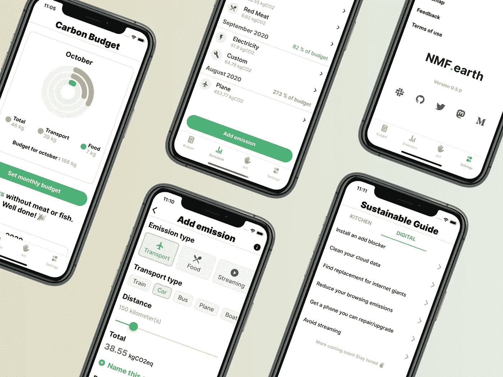
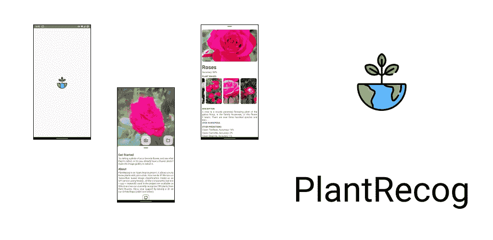
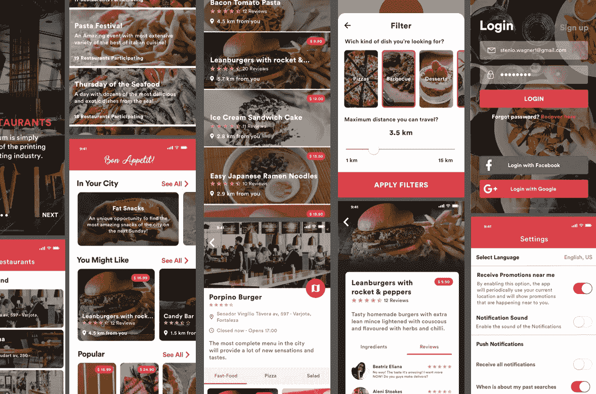
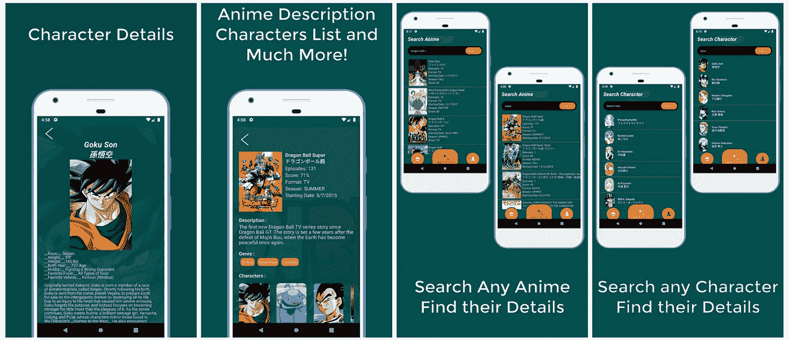
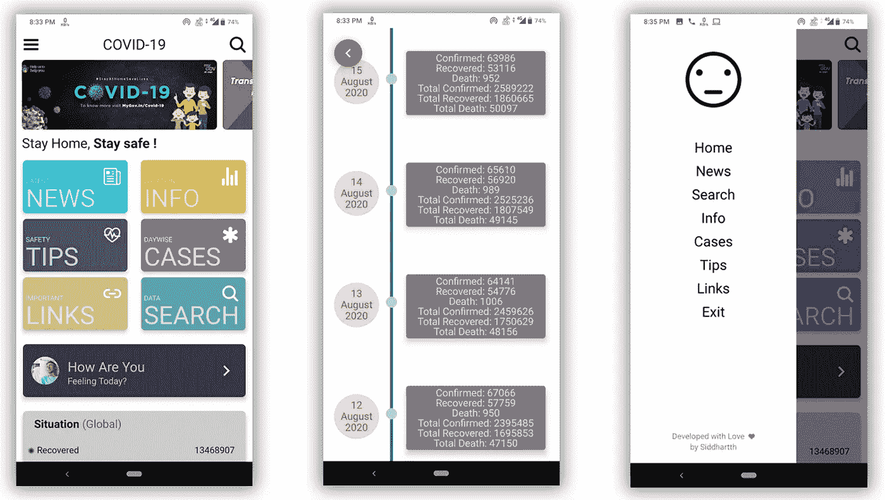
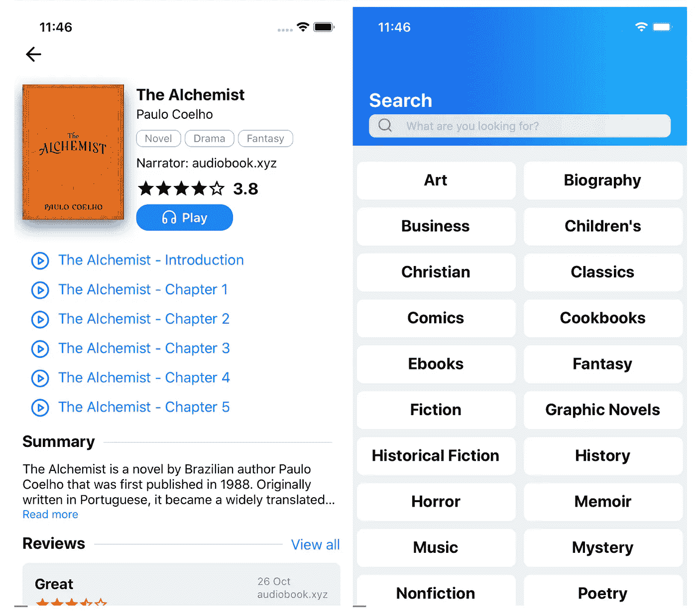

# 7 更多反应原生开源项目，成为更好的移动应用开发者

> 原文：<https://javascript.plainenglish.io/7-more-react-native-open-source-projects-to-become-a-better-mobile-app-developer-724729403ef9?source=collection_archive---------1----------------------->

## 使用这 7 个 React 原生开源项目增强您的移动应用程序开发。


Photo by [Farzad](https://unsplash.com/@euwars?utm_source=medium&utm_medium=referral) on [Unsplash](https://unsplash.com?utm_source=medium&utm_medium=referral)

提高开发技能的最好方法之一是阅读大量代码。开源项目是学习最佳实践、编码风格和其他主题的最有价值的资源。

本文是 react native 令人惊叹的开源项目系列文章的一部分，在该系列文章中，我一直在整理 7 个 React Native 开源项目的列表，这些项目将帮助您学习许多新东西。

# 1.nmf-app



这是一款可以让世界变得更美好的应用。这个应用程序将帮助你了解并减少你的碳足迹。交通、食品、电力、流媒体、服装、加密货币、购物和任何种类的碳排放都可以在这个应用程序中找到。你也可以扫描食品上的条形码来获得你所吃的食物对环境的影响。您将能够从这个资源库中学习 Expo、Redux Toolkit、Typescript 等。你可以在 [PlayStore](https://play.google.com/store/apps/details?id=nmf.earth) 和 [AppStore](https://apps.apple.com/us/app/nmf-earth/id1494561829) 查看应用。

[](https://github.com/NMF-earth/nmf-app) [## GitHub-NMF-地球/nmf-app:了解并减少你的碳足迹🌱iOS 和 Android。

### NMF.earth React 本地应用程序的存储库，使用 Expo、Redux Toolkit 和 Typescript 构建。设计可以是…

github.com](https://github.com/NMF-earth/nmf-app) 

# 2.PlantRecog



顾名思义，这个应用程序将有助于识别植物。该项目的当前版本能够识别 299 种植物的花。这个花识别模型和在这个项目下开发的 API 可以在资源库中免费获得。任何想要使用这些服务来构建自己的应用程序的人都可以自行托管它们。你也可以在 [PlayStore](https://play.google.com/store/apps/details?id=com.plantrecog) 查看应用。

[](https://github.com/sarthakpranesh/PlantRecog) [## GitHub-sarthakpranesh/PlantRecog:免费植物识别 App +公共 API +模型

### PlantRecog 旨在成为或引领 goto“免费植物识别”解决方案。为什么？截至今天，2021 年 8 月 30 日…

github.com](https://github.com/sarthakpranesh/PlantRecog) 

# 3.好胃口应用程序



这个应用程序显示了福塔莱萨市的餐馆、美食活动和菜肴的选项。这个应用程序的想法是根据用户想吃的东西和他在城市中的位置，显示城市中不同的餐馆、菜肴和美食活动。你将能够从这个项目中学到很多东西，比如 redux、redux-saga、flow、babel 等等。

[](https://github.com/steniowagner/bon-appetit-app) [## GitHub-steniowagner/bon-appetit-App:一个显示餐馆选项的 React-Native 应用程序

### 一个 React-Native 应用程序，显示福塔莱萨市(巴西)的餐厅、美食活动和菜肴的选项…

github.com](https://github.com/steniowagner/bon-appetit-app) 

# 4.动漫-吉首



如果你是一个动漫爱好者，或者想创建一个动漫应用，那么这可能是一个很好的资源。这个应用程序将帮助你探索动漫世界。你将能够从这个项目中学到很多东西，比如 react-navigation、styled component、react apollo、apollo client、GraphQL 等等。

[](https://github.com/AurangzaibRamzan/Anime-jisho) [## GitHub-AurangzaibRamzan/Anime-jisho:用于搜索动漫的 Android 和 IOS 应用程序

### 一个探索动画世界的 React 本地应用程序，包括多方面的功能，包括:搜索…

github.com](https://github.com/AurangzaibRamzan/Anime-jisho) 

# 5.反应-原生-Airbnb-克隆


创建一个大型应用程序的克隆是另一种很好的学习方式。正如你所猜测的，这是一个 Airbnb 克隆应用程序。你将能够学到很多东西，比如 react-native-vector-icons、react-navigation、react-redux、redux 等等。

[](https://github.com/imandyie/react-native-airbnb-clone) [## GitHub-imand yie/React-Native-airbnb-clone:使用 React Native & Redux 的 Airbnb 克隆应用程序

### AirBnB 移动应用克隆使用 React Native & Redux Clone 运行 npm 安装在终端运行在 IOS 或 Android 项目上…

github.com](https://github.com/imandyie/react-native-airbnb-clone) 

# 6.covidInfo



这个应用程序根据用户的当前位置显示当前的 covid 数据。这个应用程序不直接与政府数据通信，它使用一些公共 API 来获取数据。它包括许多功能，如每日案例、状态搜索选项、重要链接、自我检查等。

[](https://github.com/siddsarkar/CovidInfo) [## GitHub - siddsarkar/CovidInfo:该应用程序根据当前的数据获取用户当前的 Covid19 数据…

### 该应用程序根据用户的当前位置为用户获取当前的 Covid19 数据。注意安全，呆在家里！😷 …

github.com](https://github.com/siddsarkar/CovidInfo) 

# 7.有声读物应用



有声读物正日益流行。正如你所猜测的，这是一个有声读物应用程序。这款应用有手机版和网页版。你可以在 [PlayStore](https://play.google.com/store/apps/details?id=app.sachnoi) 、 [AppStore](https://apps.apple.com/us/app/id1453643910) 、 [Web](https://audioaz.com/) 查看 app。

[](https://github.com/homielab/audiobookapp) [## GitHub - homielab/audiobookapp:有声读物移动应用程序，使用 React Native 和…

### 有声读物移动应用程序由 React Native 和 React 生态系统完成，两者只有一个代码库…

github.com](https://github.com/homielab/audiobookapp) 

# 另一部分在哪里？

有很多很棒的 React 原生开源资源。我想分享尽可能多的资源，让你的开发之旅更轻松。

如果你想了解更多牛逼的 React 原生开源项目，请查看以下内容:

[](/7-react-native-open-source-projects-to-become-a-better-mobile-app-developer-43a77b1cb389) [## 7 对原生开源项目做出反应，成为更好的移动应用开发者

### 增强您的移动应用开发

javascript.plainenglish.io](/7-react-native-open-source-projects-to-become-a-better-mobile-app-developer-43a77b1cb389) [](/7-react-native-open-source-projects-to-become-a-better-mobile-app-developer-345840199fcd) [## 7 对原生开源项目做出反应，成为更好的移动应用开发者

### 第 2 部分:增强您的移动应用程序开发

javascript.plainenglish.io](/7-react-native-open-source-projects-to-become-a-better-mobile-app-developer-345840199fcd) [](/7-react-native-open-source-projects-to-become-a-better-mobile-app-developer-e33ef5b73ec) [## 7 对原生开源项目做出反应，成为更好的移动应用开发者

### 第 3 部分:使用这些 React 原生开源项目增强您的移动应用程序开发。

javascript.plainenglish.io](/7-react-native-open-source-projects-to-become-a-better-mobile-app-developer-e33ef5b73ec) 

今天到此为止。谢谢你坚持到最后。相信这些项目会帮助你学到很多新的东西。

如果你知道任何其他漂亮的开源项目，请在评论中分享。直到我们再次见面…干杯！

```
**Want to Connect?**If you want to, you can connect with me on [**Twitter**](https://twitter.com/FarhanT99598254) or [**LinkedIn**](https://www.linkedin.com/in/farhan-tanvir-b08520151/).
```

*更多内容请看*[***plain English . io***](https://plainenglish.io/)*。报名参加我们的* [***免费周报***](http://newsletter.plainenglish.io/) *。关注我们关于*[***Twitter***](https://twitter.com/inPlainEngHQ)**和*[***LinkedIn***](https://www.linkedin.com/company/inplainenglish/)*。查看我们的* [***社区不和谐***](https://discord.gg/GtDtUAvyhW) *加入我们的* [***人才集体***](https://inplainenglish.pallet.com/talent/welcome) *。**