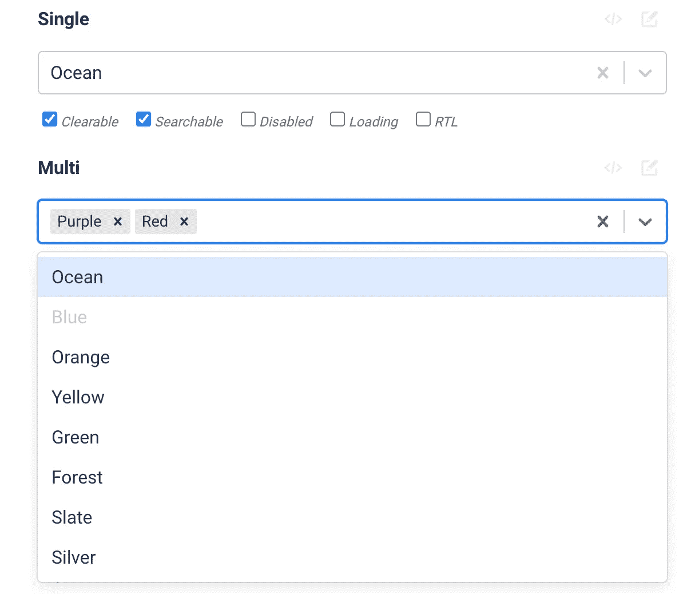
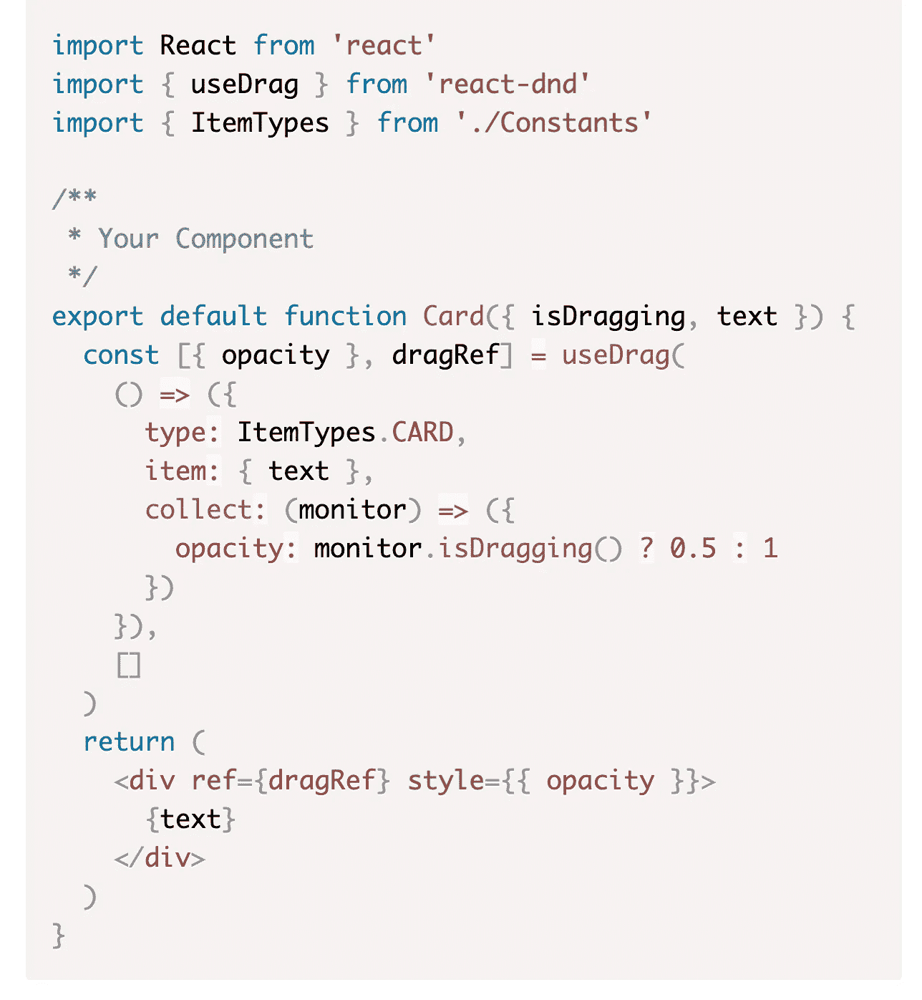
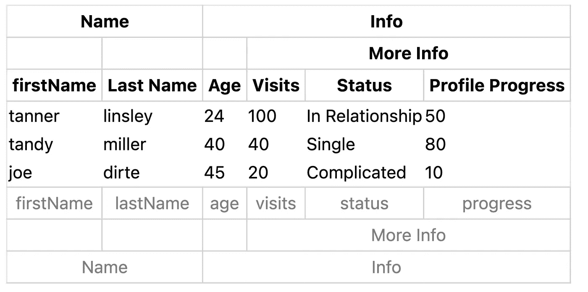
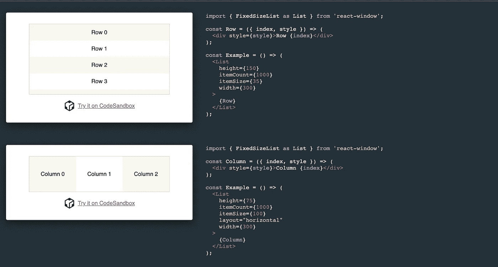
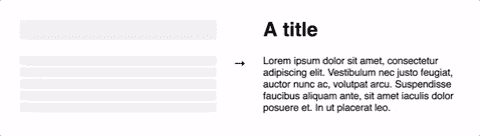

# 您应该在下一个项目中使用的 7 个更有用的 React 库

> 原文：<https://javascript.plainenglish.io/7-more-useful-react-libraries-you-should-use-in-your-next-project-5699594be1c8?source=collection_archive---------4----------------------->

## 加快你的反应发展

Photo by [Fili Santillán](https://unsplash.com/@filisantillan?utm_source=medium&utm_medium=referral) on [Unsplash](https://unsplash.com?utm_source=medium&utm_medium=referral)

当一个库可以轻松实现相同的目标时，为什么还要创建自定义功能呢？。开发人员最好的朋友和救星是库。我相信一个好的项目会利用一些最好的可用库。

用于 UI 开发的最好的 JavaScript 库之一是 React。这里有一些有用的库，可以让你更容易、更快地构建你的项目。

# 1.反应-选择

我相信 select 是 React 开发中使用最多的组件之一。这是一个灵活漂亮的选择输入控件，支持多选、自动完成、异步和可创建。它在 Github 上有超过 24.5k 的星和超过 3.5k 的叉。

 [## GitHub-Jed Watson/react-Select:react . js 的选择组件

### React.js .的 Select 组件通过在 GitHub 上创建一个帐户，为 JedWatson/react-select 开发做出了贡献。

github.com](https://github.com/JedWatson/react-select) 

# 2.反应 DnD

这个 React 库将帮助您创建复杂的拖放用户界面，同时保持组件的解耦特性。它非常适合 Trello 和 Storify 这样的应用程序，在这些应用程序中，拖放会导致组件改变它们的外观和应用程序的状态，同时还会在应用程序的各个部分之间传输数据。它在 Github 上有超过 17.5k 的星和超过 1.5k 的叉。

 [## GitHub - react-dnd/react-dnd:拖放 react

### 此时您不能执行该操作。您已使用另一个标签页或窗口登录。您已在另一个选项卡中注销，或者…

github.com](https://github.com/react-dnd/react-dnd) 

# 3.桌子

如果您想要一个完全控制标记和实现的表，可以考虑使用这个无头表库。这个库是一个无头表库，这意味着它没有组件、标记或样式。这需要你完全控制标记和样式(CSS，CSS-in-JS，UI 组件库等等。)，而且也解释了为什么便携。甚至 React Native 都允许使用这个。它在 Github 上有超过 17.5k 的星和超过 2.5k 的叉。

 [## GitHub - TanStack/table:🤖为 TS/JS 构建强大的表格和数据网格的无头 UI…

### 为 React、Solid、Vue、Svelte 和 TS/JS 构建强大的表格和数据网格的无头 UI。正在寻找第 7 版的…

github.com](https://github.com/TanStack/table) 

# 4.反应日期

这个库提供了一些存在于一个伟大的日期选择器中的组件。也可以自定义。如果你为每个组件提供必要的道具，你将得到一个全功能的交互式日期选择器。通过额外的可选道具，您可以定制输入、日历等的外观和感觉。它在 Github 上有 11.5k 多星，1.5k 多叉。

 [## GitHub - react-dates/react-dates:一个易于国际化、移动友好的日期选择器库…

### 一个易于国际化、易于访问、移动友好的 web 日期选择器库。例如…

github.com](https://github.com/react-dates/react-dates) 

# 5.React 兜风

有时，我们希望告知用户应用程序的新功能。在这种情况下，这个库可以成为您的一个很好的资源。此库将帮助您向新用户展示您的应用程序或解释新功能的功能。它在 Github 上有超过 4.5k 颗星。

 [## GitHub-Gil Barbara/react-joyride:在应用程序中创建导游

### 为您的应用程序创建精彩的旅程！向新用户展示您的应用或解释新功能的功能。它使用…

github.com](https://github.com/gilbarbara/react-joyride) 

# 6.反应窗口

如果您想要高效地呈现大型列表和表格数据，那么这是一个很好的资源。该库仅通过渲染大型数据集的一部分来工作(仅够填充视口)。这有助于解决一些常见的性能瓶颈，比如减少呈现初始视图和处理更新所需的工作量(和时间)，通过避免 DOM 节点的过度分配来减少内存占用，等等。它在 Github 上有超过 12.5k 颗星。

 [## GitHub-bvaughn/React-window:React 组件，用于高效呈现大型列表和表格…

### React 组件可以有效地呈现大型列表和表格数据，React window 只需呈现一个

github.com](https://github.com/bvaughn/react-window) 

# 7.反作用力-载荷-骨架

该库提供了`Skeleton`组件，可以直接在组件中使用，代替正在加载的内容。当其他库要求你精心制作一个匹配字体大小、行高和内容边距的框架屏幕时，`Skeleton`组件会自动调整到正确的尺寸。

 [## GitHub-dv TNG/react-loading-skeleton:创建自动适应您的…

### 制作漂亮的动画加载骨骼，自动适应你的应用程序。了解版本 3 中的变化…

github.com](https://github.com/dvtng/react-loading-skeleton) 

# 另一部分在哪里？

有很多很棒的 React 库。我想分享尽可能多的资源，让你的开发之旅更轻松。

如果你想知道更多牛逼的 React 库，请查看下面。

 [## React 开发人员必须知道的 7 个库

### 加快你的反应发展

javascript.plainenglish.io](/7-must-know-libraries-for-a-react-developer-57a324da9520)  [## 您应该在下一个项目中使用的 7 个有用的 React 库

### 第 3 部分:用这些库加速 React 开发。

javascript.plainenglish.io](/7-useful-react-libraries-you-should-use-in-your-next-project-dec9b577f15c)  [## 您应该在下一个项目中使用的 7 个有用的 React 库

### 加快你的反应发展

javascript.plainenglish.io](/7-useful-react-libraries-you-should-use-in-your-next-project-8f33b9cf83e7) 

今天到此为止。我希望这些库有助于简化开发过程。

如果你知道任何其他有用的 React 库，请在评论中分享。直到我们再次相遇。干杯！

***想要连接？***

*如果你愿意，可以在* [***推特***](https://twitter.com/FarhanT99598254) 上与我联系

*更多内容请看*[***plain English . io***](https://plainenglish.io/)*。报名参加我们的* [***免费周报***](http://newsletter.plainenglish.io/) *。关注我们关于*[***Twitter***](https://twitter.com/inPlainEngHQ)*和*[***LinkedIn***](https://www.linkedin.com/company/inplainenglish/)*。查看我们的* [***社区不和谐***](https://discord.gg/GtDtUAvyhW) *加入我们的* [***人才集体***](https://inplainenglish.pallet.com/talent/welcome) *。*