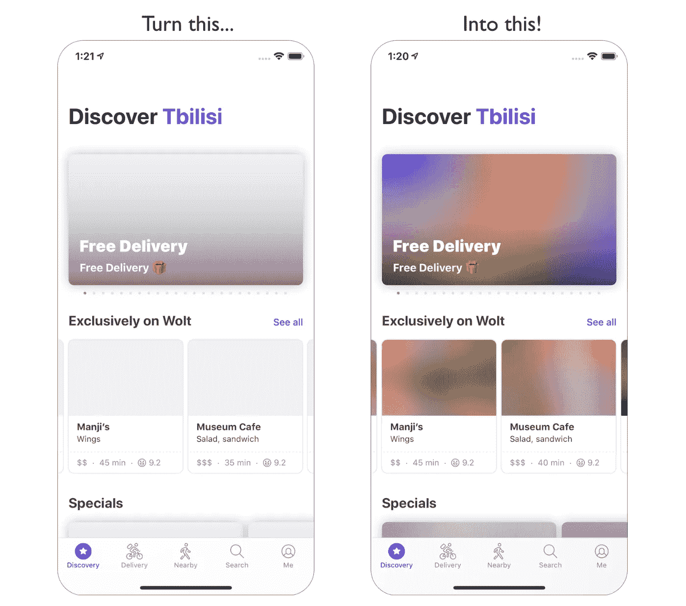
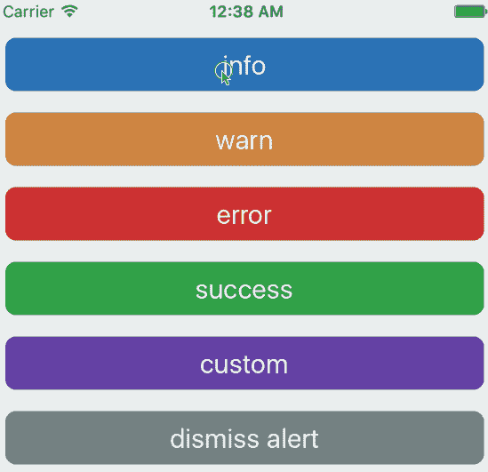
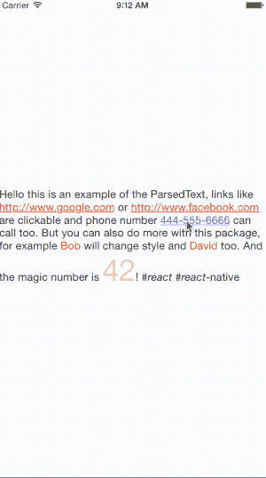

# 您应该在下一个项目中使用的 7 个更有用的 React 原生库

> 原文：<https://javascript.plainenglish.io/7-more-useful-react-native-libraries-you-should-use-in-your-next-project-2d2a49dfcead?source=collection_archive---------3----------------------->

## 增强您的反应能力


Photo by [Jexo](https://unsplash.com/@jexo?utm_source=medium&utm_medium=referral) on [Unsplash](https://unsplash.com?utm_source=medium&utm_medium=referral)

当一个库可以完成同样的事情时，你为什么要创建定制的功能呢？库是开发者最好的朋友和救星。在我看来，一个好的项目利用了一些最好的可用库。

本文是 React Native 的令人敬畏的库系列的一部分，在该系列中，我总是汇编 7 个 React Native 库的列表，这些库将在您的开发之旅中帮助您。

# 1.react-native-blurhash



正确处理加载屏幕是良好用户体验的一个重要因素。这个库将在这种情况下帮助您。当你的内容加载时，它会显示彩色模糊的占位符。这是图像占位符的简洁表示。当你的图像加载时，不要显示无聊的灰色小方框，而是显示一个模糊的预览，直到整个图像加载完毕。这个库在 Github 上有 1k 多颗星。

[](https://github.com/mrousavy/react-native-blurhash) [## github-mrousavy/react-native-blur hash:🖼️一个库，用于显示彩色模糊占位符，同时…

### 🖼️为您的用户提供他们想要的装载体验。通过 npm 安装:NPM I react-native-blur hash npx pod-install…

github.com](https://github.com/mrousavy/react-native-blurhash) 

# **2。react-native-vision-相机**


我觉得相机是大部分 app 的常用功能之一。这个库是从头开始设计的，旨在提供相机应用程序应该具有的所有功能。您可以完全控制所使用的设备，甚至可以配置帧速率、色彩空间等选项。这个库在 Github 上有超过 2.8k 的星星。

[](https://github.com/mrousavy/react-native-vision-camera) [## GitHub-mrousavy/react-native-vision-camera:📸看到视觉的相机库。

### 照片、视频和快照捕捉可定制的设备和多摄像头(平滑缩小至“鱼眼”摄像头)…

github.com](https://github.com/mrousavy/react-native-vision-camera) 

# 3.反应-原生-大小-物质


维护所有设备屏幕的一致设计是开发人员的主要职责之一。这个库将有助于完成这一职责。这是一个轻量级、零依赖性的库，用于在不同大小的设备上扩展应用程序的 UI。这个库在 Github 上有超过 1.8k 的星星。

[](https://github.com/nirsky/react-native-size-matters) [## GitHub—NIR sky/react-native-size-matters:一个轻量级、零依赖性、React-Native 实用程序…

### 一个轻量级、零依赖性、反应原生的实用工具带，用于跨不同大小的…

github.com](https://github.com/nirsky/react-native-size-matters) 

# 4.fbt


这个来自脸书。它是 JavaScript 的国际化框架，不仅功能强大、灵活，而且简单直观。它包括许多功能，比如组织翻译的源文本，编写语法正确的可翻译 UI，等等。它在 Github 上有超过 3.5k 颗星。

[](https://github.com/facebook/fbt) [## GitHub - facebook/fbt:一个 JavaScript 国际化框架

### FBT 是一个 JavaScript 的国际化框架，它不仅功能强大、灵活，而且简单易用

github.com](https://github.com/facebook/fbt) 

# 5.react-native-dropdownalert



与用户沟通是任何 app 的常见任务之一。这个库将帮助您通知用户新的聊天消息、出错或一切正常。可通过点击取消按钮、自动使用`closeInterval`、平移响应器上升手势或通过编程(`this.dropDownAlertRef.closeAction()`)来关闭。这个库在 Github 上有超过 1.5k 的星星。

[](https://github.com/testshallpass/react-native-dropdownalert) [## GitHub-testshallpass/react-native-drop down alert:一个通知用户有新聊天的简单警报…

### 提醒用户新的聊天消息、出错或一切正常。它可以通过点击关闭…

github.com](https://github.com/testshallpass/react-native-dropdownalert) 

# 6.反应-本地-弹出菜单


这个库为 Android、iOS 和 web 提供了弹出菜单组件。它包括许多功能，如简单易用的弹出/上下文菜单，多种模式(动画，非动画，从底部或弹出滑动)，默认的打开和关闭动画，简单的样式，等等。这个库在 Github 上有超过 1.3k 的星星。

[](https://github.com/instea/react-native-popup-menu) [## GitHub-instea/React-Native-Popup-menu:React Native 的弹出菜单组件

### 用于 Android、iOS 和(非官方)UWP 和 react-native-web 的可扩展弹出菜单组件。

github.com](https://github.com/instea/react-native-popup-menu) 

# 7.react-原生-解析-文本



这个库允许你使用一个`RegExp`或者预定义的模式来解析一个文本和提取部分。目前有三种预定义类型:`url`、`phone`和`email`。如果有匹配的文本，所有的属性都被传递给一个新的`Text`组件。如果这些是函数，它们将接收文本值作为参数。这个库在 Github 上有超过 1.1k 的星星。

[](https://github.com/taskrabbit/react-native-parsed-text) [## GitHub-task rabbit/React-Native-parsed-text:解析文本并使其成为多个 React Native…

### 这个库允许您解析文本，并使用正则表达式或预定义的模式提取部分内容。目前有 3 个…

github.com](https://github.com/taskrabbit/react-native-parsed-text) 

# 另一部分在哪里？

有很多很棒的 react-native 库。我想分享尽可能多的资源，让你的开发之旅更轻松。

如果你想知道更多的 react-native 库，请查看下面。

[](/7-useful-react-native-libraries-you-should-use-in-your-next-project-7484c8c7da93) [## 您应该在下一个项目中使用的 7 个有用的 React 原生库

### 增强您的反应能力

javascript.plainenglish.io](/7-useful-react-native-libraries-you-should-use-in-your-next-project-7484c8c7da93) [](/7-more-useful-react-native-libraries-you-should-use-in-your-next-project-85267f105f61) [## 您应该在下一个项目中使用的 7 个更有用的 React 原生库

### 增强您的反应能力

javascript.plainenglish.io](/7-more-useful-react-native-libraries-you-should-use-in-your-next-project-85267f105f61) [](/7-more-useful-react-native-libraries-you-should-use-in-your-next-project-ed3bcbd58b86) [## 您应该在下一个项目中使用的 7 个更有用的 React 原生库

### 增强您的反应能力

javascript.plainenglish.io](/7-more-useful-react-native-libraries-you-should-use-in-your-next-project-ed3bcbd58b86) 

今天到此为止。相信这些库对你的开发之旅会有很大的帮助。

如果你知道任何其他漂亮的 React 原生库，请在评论中分享。直到我们再次相遇。干杯！

```
**Want to Connect?**If you want to, you can connect with me on [**Twitter**](https://twitter.com/FarhanT99598254) 
```

*更多内容请看*[***plain English . io***](https://plainenglish.io/)*。报名参加我们的* [***免费周报***](http://newsletter.plainenglish.io/) *。关注我们关于*[***Twitter***](https://twitter.com/inPlainEngHQ)*和*[***LinkedIn***](https://www.linkedin.com/company/inplainenglish/)*。查看我们的* [***社区不和谐***](https://discord.gg/GtDtUAvyhW) *加入我们的* [***人才集体***](https://inplainenglish.pallet.com/talent/welcome) *。*