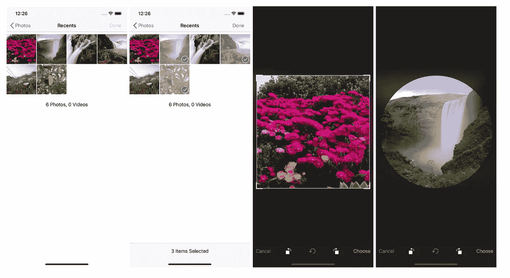
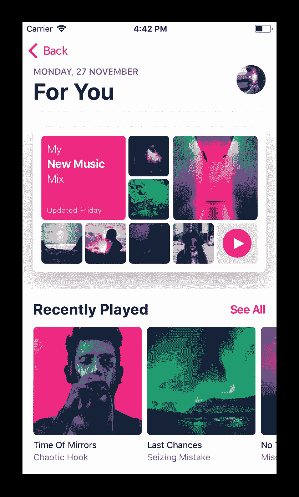
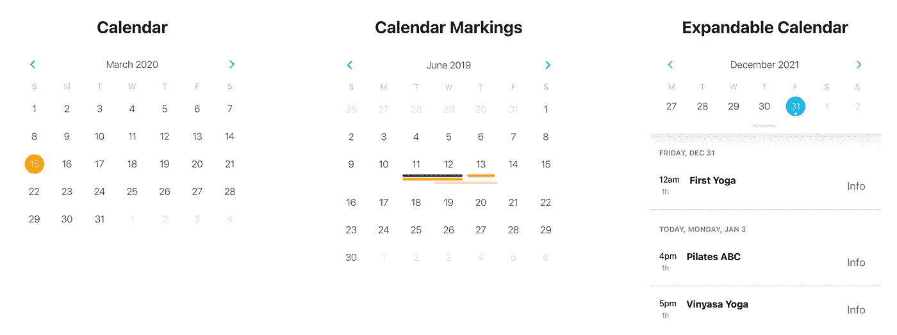
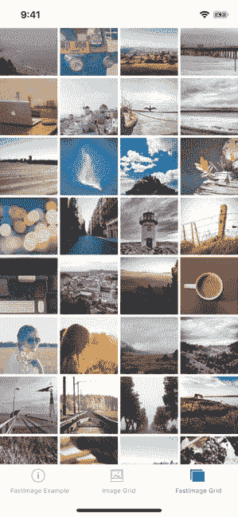

# 您应该在下一个项目中使用的 7 个更有用的 React 原生库

> 原文：<https://javascript.plainenglish.io/7-more-useful-react-native-libraries-you-should-use-in-your-next-project-85267f105f61?source=collection_archive---------2----------------------->

## 增强您的反应能力


Photo by [Oskar Yildiz](https://unsplash.com/@oskaryil?utm_source=medium&utm_medium=referral) on [Unsplash](https://unsplash.com?utm_source=medium&utm_medium=referral)

当一个库可以为你做的时候，为什么要写自定义的功能呢？开发人员最好的朋友和救命恩人是图书馆。在我看来，一个好的项目利用了一些最好的可用库。我编译了一个包含 7 个 React 原生库的列表，可以帮助你开始你的项目。

# 1.react-native-image-作物选取器



处理图像是大多数应用程序的常见功能之一。这个库将在这种情况下帮助你。这个库是 iOS 和 Android 的图像拾取器，包括相机、视频、可配置压缩、多幅图像和裁剪。它在 Github 上有超过 5k 颗星。

[](https://github.com/ivpusic/react-native-image-crop-picker) [## GitHub-ivpusic/react-native-image-crop-picker:支持相机的 iOS/Android 图像拾取器…

### iOS/Android 图像拾取器，支持相机、视频、可配置压缩、多幅图像和裁剪，如果您…

github.com](https://github.com/ivpusic/react-native-image-crop-picker) 

# 2.反应-原生-排版



在 React Native 中创建优秀的文本样式并不容易。这往往需要大量的摆弄和处理边缘情况。这个库包括一组很好的默认设置和帮助器，涵盖了绝大多数场景，简化了代码，在 ios、Android 和 web 上看起来都很棒。它在 Github 上有超过 3k 颗星。

[](https://github.com/hectahertz/react-native-typography) [## GitHub-hectahertz/react-native-typography:像素完美、具有本机外观的印刷样式，适用于…

### React Native 的像素完美、具有本机外观的印刷样式。在 React Native 中创建优秀的文本样式并不是一件…

github.com](https://github.com/hectahertz/react-native-typography) 

# 3.反应-本地-日历



如果你想在你的应用程序中显示一个漂亮的定制日历，那么这个库将对你有所帮助。正如您可能已经猜到的，这个库包含许多可定制的 React-Native 日历组件。你可以用这个库定制日期标记、多点标记、周期标记、多周期标记等。它在 Github 上有超过 7.5k 颗星。

[](https://github.com/wix/react-native-calendars) [## github-wix/react-native-calendars:react 本地日历组件🗓️📆

### React 本地日历组件🗓️📆。通过创建帐户，为 wix/react-native-calendars 开发做出贡献…

github.com](https://github.com/wix/react-native-calendars) 

# 4.反应-本机-快速-图像



在大多数情况下，React Native 的图像组件处理图像缓存的方式与浏览器相同。如果服务器为图像返回正确的缓存控制头，您将得到您期望从浏览器得到的那种内置缓存。一般来说，很多人都报告过闪烁、缓存未命中、从缓存加载的低性能以及低性能。这个库是解决这些问题的替代品。它在 Github 上有超过 6.5k 颗星。

[](https://github.com/DylanVann/react-native-fast-image) [## GitHub-Dylan vann/react-native-fast-image:🚩快速图像，高性能反应本机图像组件。

### FastImage 示例应用程序。React Native 的图像组件在很大程度上像浏览器一样处理图像缓存。如果…

github.com](https://github.com/DylanVann/react-native-fast-image) 

# 5.戒瘾诊所


高速原生移动开发需要持续的集成工作流，这意味着我们必须显著减少对人工 QA 的依赖。该库与您的移动应用程序交互，就像它在真实设备或模拟器上运行时是真实用户一样。它在 Github 上有超过 9.5k 颗星。

[](https://github.com/wix/detox) [## GitHub - wix/Detox:用于移动应用的灰盒端到端测试和自动化框架

### 灰盒端到端测试和移动应用自动化框架- GitHub - wix/Detox:灰盒端到端测试…

github.com](https://github.com/wix/detox) 

# 6.反应-原生-文本输入-效果


如果你想给你的应用添加一些漂亮的文本输入动画，那么这是一个很好的资源。这个库为 iOS 和 Android 提供了带有自定义标签和图标动画的文本输入。它在 Github 上有超过 2.5k 颗星。

[](https://github.com/halilb/react-native-textinput-effects) [## GitHub-halib/react-native-textinput-effects:带有自定义标签和图标动画的文本输入…

### iOS 和 android 的带有自定义标签和图标动画的文本输入。由 react native 制造，灵感来自 Codrops…

github.com](https://github.com/halilb/react-native-textinput-effects) 

# 7.反应-本地-本地化


如果你曾与任何国际应用程序，那么有很大的机会，你已经与本地化。有时处理本地化可能是一个挑战。在这种情况下，这个库可以帮助您。您可能已经猜到，这个库是您的应用程序本地化的工具箱。它在 Github 上有超过 1.5k 颗星。

[](https://github.com/zoontek/react-native-localize) [## GitHub-zoon tek/react-native-localize:🌍React 本地应用程序本地化的工具箱

### React 本地应用本地化工具箱。这个模块是按原样提供的，我在空闲时间对它进行研究。如果你的…

github.com](https://github.com/zoontek/react-native-localize) 

# 前一部分在哪里？

有很多很棒的 react-native 库。我想分享尽可能多的资源，让你的开发之旅更轻松。

如果你错过了前面的部分，请检查下面。

[](/7-useful-react-native-libraries-you-should-use-in-your-next-project-7484c8c7da93) [## 您应该在下一个项目中使用的 7 个有用的 React 原生库

### 增强您的反应能力

javascript.plainenglish.io](/7-useful-react-native-libraries-you-should-use-in-your-next-project-7484c8c7da93) [](/7-more-useful-react-native-libraries-you-should-use-in-your-next-project-ed3bcbd58b86) [## 您应该在下一个项目中使用的 7 个更有用的 React 原生库

### 增强您的反应能力

javascript.plainenglish.io](/7-more-useful-react-native-libraries-you-should-use-in-your-next-project-ed3bcbd58b86) 

今天到此为止。相信这些库对你的开发之旅会有很大的帮助。

如果你知道任何其他漂亮的 React 原生库，请在评论中分享。直到我们再次相遇。干杯！

```
**Want to Connect?**If you want to, you can connect with me on [**Twitter**](https://twitter.com/FarhanT99598254) 
```

*更多内容请看*[***plain English . io***](https://plainenglish.io/)*。报名参加我们的* [***免费周报***](http://newsletter.plainenglish.io/) *。关注我们关于*[***Twitter***](https://twitter.com/inPlainEngHQ)*和*[***LinkedIn***](https://www.linkedin.com/company/inplainenglish/)*。查看我们的* [***社区不和谐***](https://discord.gg/GtDtUAvyhW) *加入我们的* [***人才集体***](https://inplainenglish.pallet.com/talent/welcome) *。*