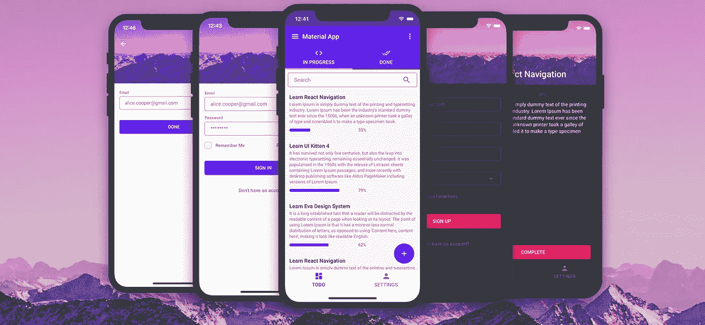
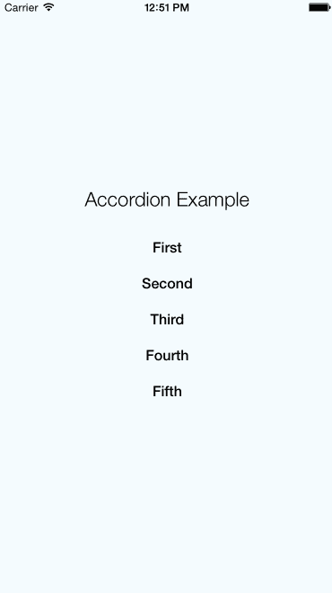
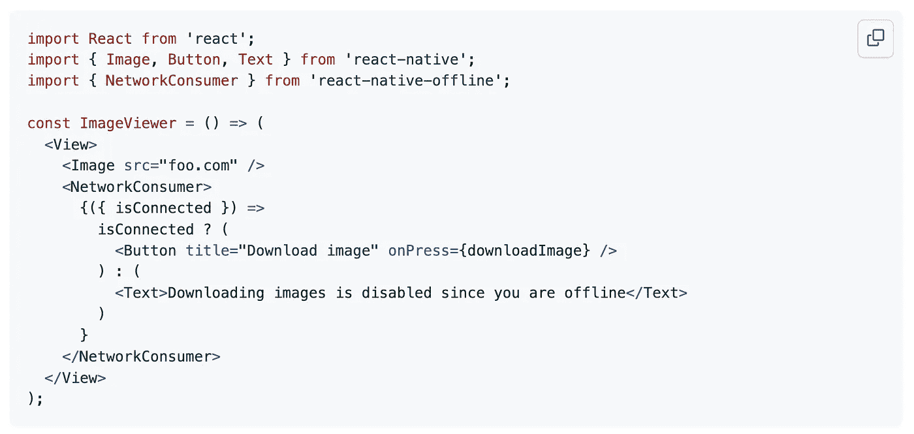
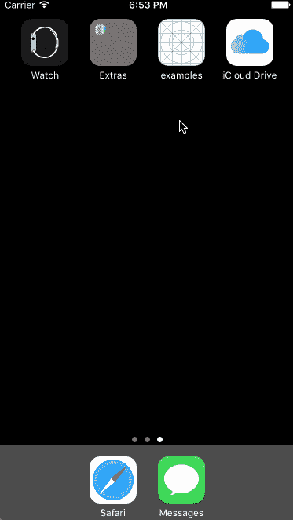

# 您应该在下一个项目中使用的 7 个更有用的 React 原生库

> 原文：<https://javascript.plainenglish.io/7-more-useful-react-native-libraries-you-should-use-in-your-next-project-ed3bcbd58b86?source=collection_archive---------6----------------------->

## 增强您的反应能力


Photo by [Farzad](https://unsplash.com/@euwars?utm_source=medium&utm_medium=referral) on [Unsplash](https://unsplash.com?utm_source=medium&utm_medium=referral)

当一个库可以完成同样的事情时，你为什么要创建定制的功能呢？图书馆是开发者最好的朋友和生活品味。在我看来，一个好的项目利用了一些最好的可用库。我已经列出了 7 个 React 本地库，它们将帮助您进行开发。

# 1.反应-本机-快照-旋转木马


当我们需要显示大量图像时，最可能的解决方案是使用图像旋转器/传送带。这是一个最好的旋转木马，你可以得到的反应本地。它提供了许多功能，如预览、多种布局、视差图像、对大量项目的高性能处理等等。这个库与 Android 和 iOS 兼容。它在 Github 上有超过 9.5k 颗星。

[](https://github.com/meliorence/react-native-snap-carousel) [## GitHub-meliorence/React-Native-snap-carousel:React Native 的 Swiper/carousel 组件…

### React Native 的 Swiper/carousel 组件，具有预览、多种布局、视差图像、性能处理…

github.com](https://github.com/meliorence/react-native-snap-carousel) 

# 2.react-native-ui-kitten



这是一个 React 原生 UI 库，允许您创建令人惊叹的多品牌跨平台移动应用程序。该库基于 Eva 设计系统，为设计和开发流程带来了一致性和可扩展性。它包含一组以类似方式设计的通用 UI 组件。最棒的是你可以在运行时改变主题，而不需要重新加载应用程序。它在 Github 上有超过 9k 颗星。

[](https://github.com/akveo/react-native-ui-kitten) [## GitHub-AK veo/react-Native-ui-kitten:基于 Eva 设计系统黑暗模式的 React 原生 UI 库

### 文档 UI Kitten 是一个 React 本机 UI 库，允许您创建令人惊叹的多品牌跨平台…

github.com](https://github.com/akveo/react-native-ui-kitten) 

# 3.反应-本地-进度


Progressbar 是任何应用程序中使用最多的组件之一。因为这样让用户体验更好。正如您已经猜到的，这个库使用 React Native SVG 为 React Native 提供了进度指示器和微调器。它在 Github 上有超过 3k 颗星。

[](https://github.com/oblador/react-native-progress) [## GitHub-ob rador/React-Native-Progress:React Native 的进度指示器和微调器

### 使用 React Native SVG 的 React Native 的进度指示器和微调器。$ npm 安装 react-native-progress -保存到…

github.com](https://github.com/oblador/react-native-progress) 

# 4.react-native-可折叠



这个库使用重新激活的 API 为 React Native 提供了一个动画的可折叠组件。它支持动态内容高度和知道其`collapsed`状态的组件(适合切换箭头等)。它在 Github 上有超过 2k 颗星。

[](https://github.com/oblador/react-native-collapsible) [## GitHub-ob ador/React-Native-collapsible:React Native 的动画可折叠组件，好…

### 支持动态内容高度和知道其折叠状态的组件(适合切换箭头等)

github.com](https://github.com/oblador/react-native-collapsible) 

# 5.react-native-大型列表


如果你在应用程序中显示大量数据，那么这是一个很好的库。因为这个库为 React-Native 提供了一个非常高性能的大列表组件。它还提供了许多特性，如分页功能、嵌套支持、大型媒体优化等。它在 Github 上有超过 2k 颗星。

[](https://github.com/bolan9999/react-native-largelist) [## GitHub-bolan 9999/React-Native-large list:React Native 最好的大列表组件。

### React-native-largelist 是 React-native 的一个非常高性能的大型列表组件。(iOS 和 Android)大数据…

github.com](https://github.com/bolan9999/react-native-largelist) 

# 6.反应-本机-脱机



一个好的应用程序在在线和离线场景下都能提供良好的用户体验。这个库提供了一些实用工具，您应该把它们放在工具箱中，以便在 React Native 中处理离线/在线连接。它支持 iOS、Android 和 Windows 平台。您可以利用提供的所有功能，或者只利用符合您需求的功能，这些模块可以方便地解耦。它在 Github 上有超过 2k 颗星。

[](https://github.com/rgommezz/react-native-offline) [## GitHub-rgommezz/react-native-offline:方便的工具箱，可以很好地处理离线/在线…

### 在 React Native 中，您应该在工具箱中准备一些实用程序来处理离线/在线连接。它…

github.com](https://github.com/rgommezz/react-native-offline) 

# 7.反应-本机-闪屏



闪屏是应用程序打开时显示的启动屏幕。它用于展示你的应用品牌或创造更好的用户体验。您可能已经了解，这个库为 react-native 提供了一个闪屏。它可以在 iOS 和 Android 上运行。它在 Github 上有超过 5k 颗星。

[](https://github.com/crazycodeboy/react-native-splash-screen) [## GitHub-crazy code boy/react-native-splash-screen:react-native 的闪屏，隐藏当…

### 一个用于 react-native 的闪屏 API，可以通过编程隐藏和显示闪屏。适用于 iOS 和…

github.com](https://github.com/crazycodeboy/react-native-splash-screen) 

# 前一部分在哪里？

有很多很棒的 react-native 库。我想分享尽可能多的资源，让你的开发之旅更轻松。

如果你想知道更多牛逼的 React 原生库请查看下面。

[](/7-useful-react-native-libraries-you-should-use-in-your-next-project-7484c8c7da93) [## 您应该在下一个项目中使用的 7 个有用的 React 原生库

### 增强您的反应能力

javascript.plainenglish.io](/7-useful-react-native-libraries-you-should-use-in-your-next-project-7484c8c7da93) [](/7-more-useful-react-native-libraries-you-should-use-in-your-next-project-85267f105f61) [## 您应该在下一个项目中使用的 7 个更有用的 React 原生库

### 增强您的反应能力

javascript.plainenglish.io](/7-more-useful-react-native-libraries-you-should-use-in-your-next-project-85267f105f61) 

今天到此为止。相信这些库对你的开发之旅会有很大的帮助。

如果你知道任何其他漂亮的 React 原生库，请在评论中分享。直到我们再次相遇。干杯！

```
**Want to Connect?**If you want to, you can connect with me on [**Twitter**](https://twitter.com/FarhanT99598254) 
```

*更多内容请看*[***plain English . io***](https://plainenglish.io/)*。报名参加我们的* [***免费周报***](http://newsletter.plainenglish.io/) *。关注我们关于*[***Twitter***](https://twitter.com/inPlainEngHQ)*和*[***LinkedIn***](https://www.linkedin.com/company/inplainenglish/)*。查看我们的* [***社区不和谐***](https://discord.gg/GtDtUAvyhW) *加入我们的* [***人才集体***](https://inplainenglish.pallet.com/talent/welcome) *。*