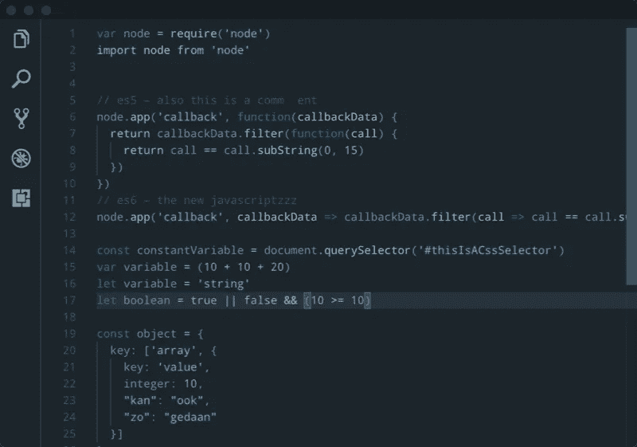

# 7 个 VSCode 主题，让你的生活更美好

> 原文：<https://javascript.plainenglish.io/7-more-vscode-themes-to-make-your-life-beautiful-b876fb8e8764?source=collection_archive---------4----------------------->

## 让你的 IDE 更漂亮，提高你的生产力

Photo by [Pakata Goh](https://unsplash.com/@pakata?utm_source=medium&utm_medium=referral) on [Unsplash](https://unsplash.com?utm_source=medium&utm_medium=referral)

作为开发人员，我们的大部分时间都花在了查看 IDE 上。除了赏心悦目之外，漂亮的 IDE 还能提高工作效率。

开发人员可以拥有的最好的 ide 之一是 VSCode。虽然每个人对美的定义不同，但我还是整理了 7 个 VSCode 主题，让你的生活更加愉悦。

# 1.Monokai Pro

这是一个完整的图标集，配色方案，和你心爱的 Visual Studio 代码的用户界面主题。最初莫诺凯颜色的创造者创造了它。一个不妥协、不分散注意力的用户界面建立在精心选择的调色板上。Monokai Pro 的唯一目标是给你时间专注于你的代码。它的安装高度超过 1.5 米。

 [## Monokai Pro - Visual Studio 市场

### 概述版本历史评级&审查 Monokai Pro 是一个配色方案，定制的用户界面主题和完整的…

marketplace.visualstudio.com](https://marketplace.visualstudio.com/items?itemName=monokai.theme-monokai-pro-vscode) 

# 2.熊猫主题

这是一个超级小的，黑暗的语法主题。它是特别用微妙的颜色制作的，意在让眼睛看起来舒服。它有超过 67 万个安装，评级为 4.5。

 [## 熊猫主题- Visual Studio 市场

### 一个极小的，黑暗的语法主题。这是熊猫语法主题的最新版本。这是一个黑暗的语法主题…

marketplace.visualstudio.com](https://marketplace.visualstudio.com/items?itemName=tinkertrain.theme-panda) 

# 3.诺德

这是一个北极，北蓝色的干净，优雅的主题。它基于 [Nord](https://www.nordtheme.com/) 调色板，旨在实现流畅清晰的工作流程。它有超过 603，000 个安装，评级为 5。

 [## Nord - Visual Studio 市场

### 北极，北蓝干净和优雅的 Visual Studio 代码主题。为流畅清晰的工作流程而设计，基于…

marketplace.visualstudio.com](https://marketplace.visualstudio.com/items?itemName=arcticicestudio.nord-visual-studio-code) 

# 4.Eva 主题

由于这个语义着色的主题，你会对编程感到更加放心。共有六种不同的风格:深色、深色粗体、深色斜体；浅、浅粗体和浅斜体。粗体样式使关键字和函数名更加醒目。斜体样式使关键字成为斜体。它有超过 42 万个安装，评级为 5。

 [## Eva 主题- Visual Studio 市场

### Visual Studio 代码的扩展--一个舒适的语义主题。

marketplace.visualstudio.com](https://marketplace.visualstudio.com/items?itemName=fisheva.eva-theme) 

# 5.松弛主题

如果你喜欢 slack 的配色方案，那么这个主题很适合你。正如你已经猜到的，这是一个受[松弛](https://slack.com/)默认主题启发的配色方案。它有超过 260，000 个安装，评级为 5。

 [## 松弛主题- Visual Studio 市场

### 受松弛默认主题启发的配色方案。新的松弛色主题和经典色主题也是想象中的深色…

marketplace.visualstudio.com](https://marketplace.visualstudio.com/items?itemName=felipe-mendes.slack-theme) 

# 6.雨辉

这是许多不同编辑器和平台的颜色主题集合。这个扩展包含 320 多个用于 Visual Studio 代码的语法和 UI 主题。它有超过 260，000 个安装，评级为 5。

 [## Rainglow - Visual Studio 市场

### Dayle Rees 对 Visual Studio 代码的扩展- Rainglow 颜色主题

marketplace.visualstudio.com](https://marketplace.visualstudio.com/items?itemName=daylerees.rainglow) 

# 7.城市之光主题

这个主题是一个华丽的黑暗语法主题，设计时考虑了重点。它有许多定制的可视化辅助工具来帮助您更快更准确地编码。目前支持超过八种最流行的编码语言。它有超过 170，000 个安装，等级是 5。

 [## 城市之光主题- Visual Studio 市场

### 将“editor . semantic highlighting . enabled”:false 添加到您的 settings.json 中。城市之光颜色主题是华丽的暗…

marketplace.visualstudio.com](https://marketplace.visualstudio.com/items?itemName=Yummygum.city-lights-theme) 

# 前一部分在哪里？

有很多很棒的 VS 代码主题。我想尽可能多地分享你所钟爱的 IDE 的强大之处。

如果你错过了前面的部分，请检查下面。

 [## 7 个最佳 VSCode 主题，让您的工作生活更加美好

### 让你的 IDE 更漂亮，提高你的生产力

javascript.plainenglish.io](/7-best-vscode-themes-to-make-your-work-life-beautiful-1123ae0a4a5d) 

你现在用的是什么主题？

今天到此为止。我希望这个主题将有助于使开发之旅变得愉快。

如果你知道任何其他漂亮的 VS 代码主题，请在评论中分享。直到我们再次相遇。干杯！

***想要连接？***

*如果你愿意，可以在* [***推特***](https://twitter.com/FarhanT99598254) 上与我联系

[*更多内容看* ***说白了。报名参加我们的* ***免费每周简讯*** *。关注我们****Twitter****和****LinkedIn****。查看我们的* ***社区不和谐*** *加入我们的* ***人才集体*** *。***](https://medium.com/p/dcac2d547a9c/edit)