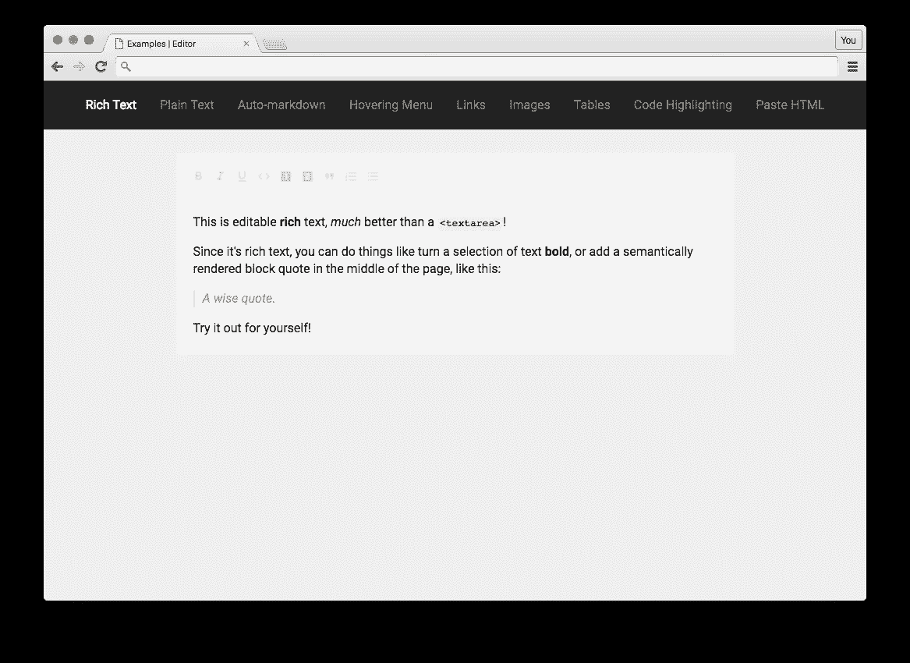
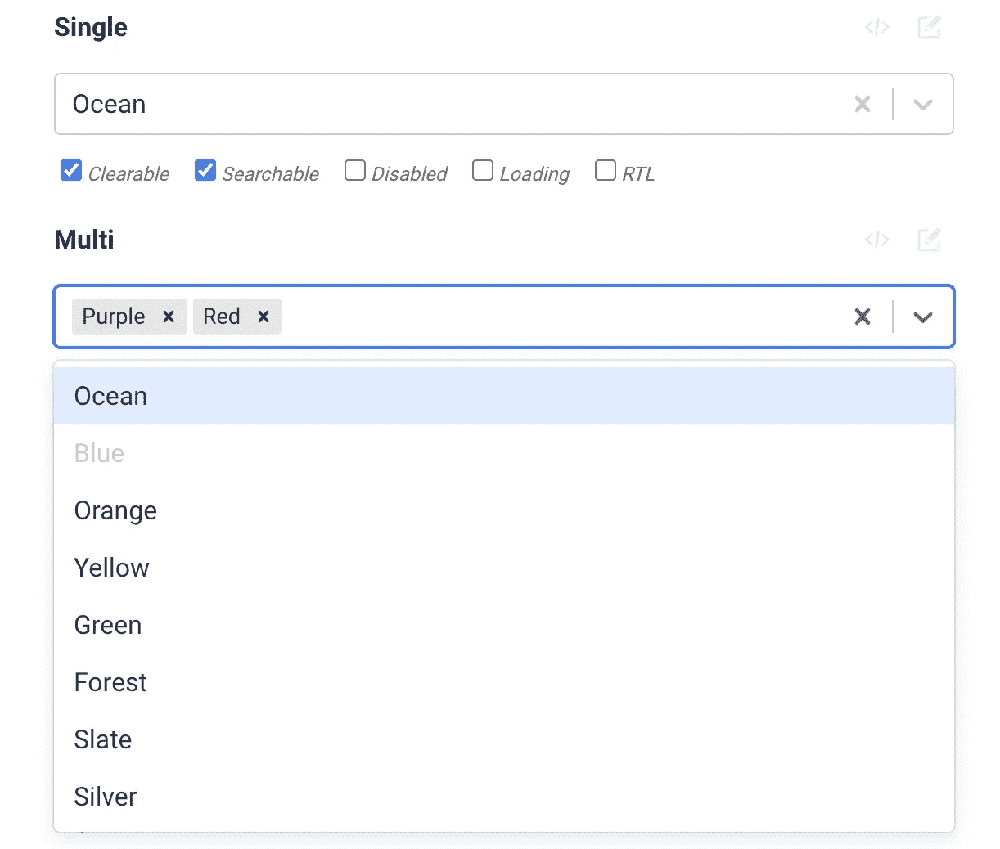
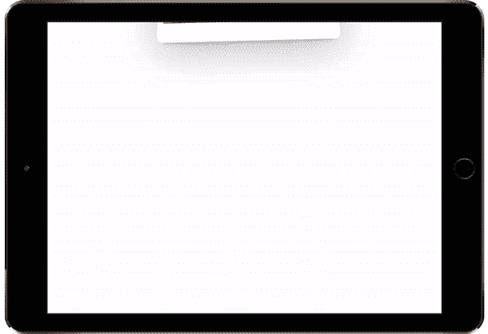
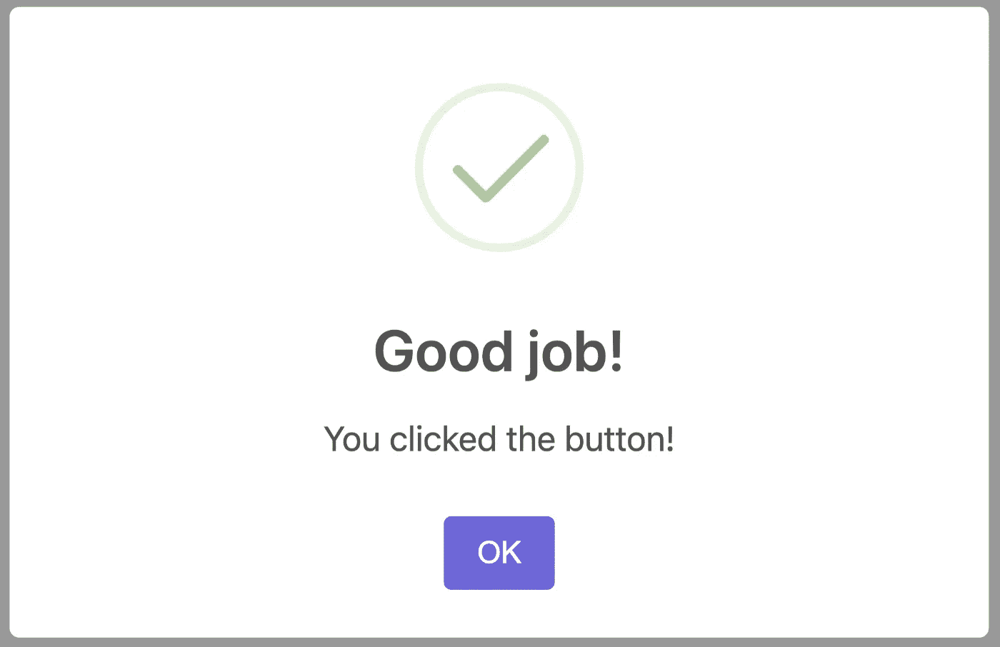
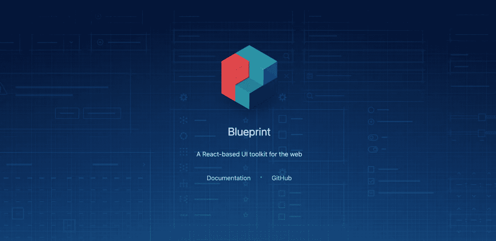

# 你应该知道的 7 个最著名的 React 库

> 原文：<https://javascript.plainenglish.io/7-most-starred-react-libraries-you-should-know-19fc3508d2c1?source=collection_archive---------2----------------------->

## 使用这些 React 库增强您的开发能力。

Photo by [Juanjo Jaramillo](https://unsplash.com/@juanjodev02?utm_source=unsplash&utm_medium=referral&utm_content=creditCopyText) on [Unsplash](https://unsplash.com/s/photos/reactjs?utm_source=unsplash&utm_medium=referral&utm_content=creditCopyText)

当一个库可以为你做的时候，为什么要写自定义的功能呢？库是开发者最好的朋友和生命救星。在我看来，一个好的项目利用了一些最好的可用库。我认为当使用一个库时，大多数人首先会看到它在 GitHub 上有多少颗星。在这里，我编译了一个 7 个最受欢迎的 React 库的列表，它们将在您的开发之旅中对您有所帮助。

# 1.MUI 核心

GitHub 上有超过 80k 颗星星，这个库拥有这个列表中最多的星星。MUI Core(以前的 Material-UI)是一个开源项目，有助于在 React 中应用 Google 的材质设计指南。它是 React 开发人员中流行的 UI 设计框架。所以我相信没有太多理由不用这个。

 [## GitHub - mui/material-ui: MUI Core:随时可用的基础 React 组件，永远免费。它…

### MUI 核心包含基本的 React UI 组件库，用于更快地发布新功能。材质 UI 是一个…

github.com](https://github.com/mui/material-ui) 

# 2.石板

从头开始创建一个漂亮的富文本编辑器有时会很耗时或者很复杂。这将帮助你构建丰富、直观的编辑器，就像那些在 [Medium](https://medium.com/) 、 [Dropbox Paper](https://www.dropbox.com/paper) 或 [Google Docs](https://www.google.com/docs/about/) 中的编辑器。它可以做到这一点，因为它的所有逻辑都是通过一系列插件实现的，所以你永远不会受到“核心”中有什么或没有什么的约束。你可以把它看作是建立在 [React](https://facebook.github.io/react/) 之上的`contenteditable`的可插拔实现。它的灵感来自于像 [Draft.js](https://facebook.github.io/draft-js/) 、 [Prosemirror](http://prosemirror.net/) 和 [Quill](http://quilljs.com/) 这样的库。它在 GitHub 上有超过 25.5k 颗星。

 [## GitHub - ianstormtaylor/slate:一个完全可定制的框架，用于构建富文本编辑器…

### 一个完全可定制的框架，用于构建富文本编辑器。Slate 让您构建丰富、直观的编辑器，如…

github.com](https://github.com/ianstormtaylor/slate) 

# 3.反应-选择

我相信 select 是 React 开发中使用最多的组件之一。这是一个灵活漂亮的选择输入控件，支持多选、自动完成、异步和可创建。它在 Github 上有超过 25k 的星星和超过 3.5k 的叉子。

 [## GitHub-Jed Watson/react-Select:react . js 的选择组件

### React.js .的 Select 组件通过在 GitHub 上创建一个帐户，为 JedWatson/react-select 开发做出了贡献。

github.com](https://github.com/JedWatson/react-select) 

# 4.Redux

如果您还没有使用它，这是您应该在下一个或当前项目中使用的库之一。这是另一个使用最多的库，有超过 58k 的星和 3k 的叉。它帮助您编写行为一致、在不同环境(客户机、服务器和本机)中运行、易于测试的应用程序。Redux 不仅可以与 React 一起使用，还可以与任何其他视图库一起使用。

 [## GitHub-reduxjs/redux:JavaScript 应用程序的可预测状态容器

### Redux 是 JavaScript 应用程序的可预测状态容器。(不要和 WordPress 框架混淆——Redux…

github.com](https://github.com/reduxjs/redux) 

# 5.反作用弹簧

如果你想在你的项目中加入动画，这是一个很好的资源。这个基于 spring physics 的动画库应该可以满足你的大部分 UI 动画需求。你得到了足够灵活的工具，可以大胆地将你的概念转化为移动的用户界面。这个库有超过 24k 的恒星。

 [## ✌️:一个基于弹簧物理学的 react 动画库

### react-spring 是一个跨平台的 spring-physics 首个动画库。这很简单:只是关于我们的一点点…

github.com](https://github.com/pmndrs/react-spring) 

# 6.sweetalert2

GitHub 上有超过 15k 颗星，这个库拥有这个列表中最低的星。如果你想摆脱无聊的 JavaScript 弹出框，并想提供一个定制的体验，那么是一个很好的资源给你。这是一个漂亮的、反应灵敏的、高度可定制的、可访问的 JavaScript 弹出框的替代品。它不依赖于第三方。

 [## GitHub - sweetalert2/sweetalert2:一款美观、反应灵敏、高度可定制且易于使用的…

### 一个漂亮的、反应灵敏的、高度可定制的和可访问的(WAI-ARIA)JavaScript 弹出框的替代品。零…

github.com](https://github.com/sweetalert2/sweetalert2) 

# 7.蓝图

如果你想为桌面应用程序创建一个复杂的基于数据的界面，这可能对你非常有用。这个库为运行在现代浏览器和 IE11 中的桌面应用程序构建复杂的、数据密集的 web 界面而优化。但是请记住，这不是一个移动优先的 UI 工具包。它在 Github 上有超过 19k 颗星。

 [## GitHub - palantir/blueprint:一个基于 React 的 web 工具包

### Blueprint 是一个基于 React 的 web 用户界面工具包。它是为构建复杂的、数据密集的 web 界面而优化的…

github.com](https://github.com/palantir/blueprint) 

# 其他一些很棒的资源在哪里？

总有新的东西要学。如果你想了解更多关于编程的优秀资源，请点击下面的链接。

 [## 你应该知道的 7 个最受欢迎的 Python 库

### 增强您的 Python 开发能力

medium.com](https://medium.com/codex/7-most-starred-python-library-you-should-know-b6f2f87274d4) 

今天到此为止。相信这些库对你的开发之旅会有很大的帮助。

如果你知道任何其他漂亮的 React 库，请在评论中分享。直到我们再次见面…干杯！

***想要连接？*** *如果你愿意，可以在* [***推特***](https://twitter.com/FarhanTanvirBD) ***上与我联系。***

# 进一步阅读

 [## 2023 年最佳的 5 个 React UI 框架和组件库——开发者指南

### MUI，Saas UI，Mantine，Tailwind。基于组件多样性、性能和效率的 React UI 库综合指南

javascript.plainenglish.io](/best-react-ui-frameworks-and-component-libraries-408df66a1f31)  [## 你应该在 2023 年的下一个项目中使用的 8 个最好的用户界面库

### 现在就使用这些 React UI 库来创建一个非常棒的应用程序

javascript.plainenglish.io](/7-best-react-ui-libraries-you-should-use-in-your-next-project-in-2023-1dabb26b552d) 

*更多内容请看* [***说白了就是***](https://plainenglish.io/) *。报名参加我们的* [***免费每周简讯***](http://newsletter.plainenglish.io/) *。关注我们关于* [***推特***](https://twitter.com/inPlainEngHQ) ，[***LinkedIn***](https://www.linkedin.com/company/inplainenglish/)*，*[***YouTube***](https://www.youtube.com/channel/UCtipWUghju290NWcn8jhyAw)*[***不和***](https://discord.gg/GtDtUAvyhW) *。对增长黑客感兴趣？检查出* [***电路***](https://circuit.ooo/) *。**