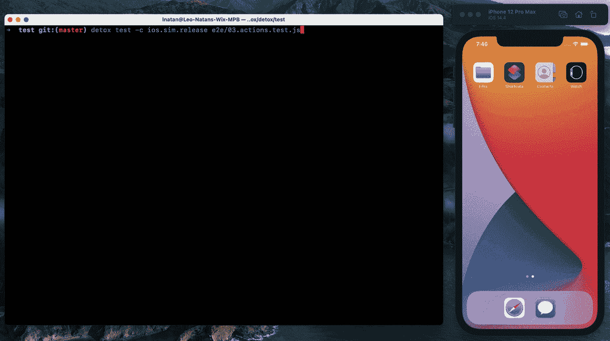
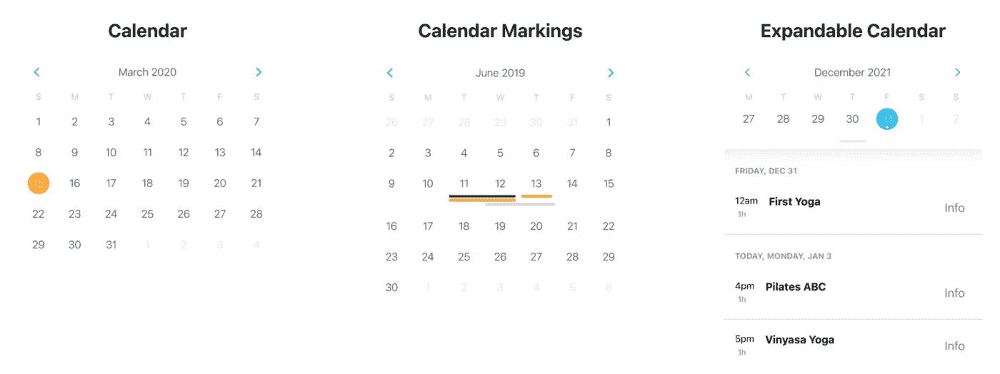
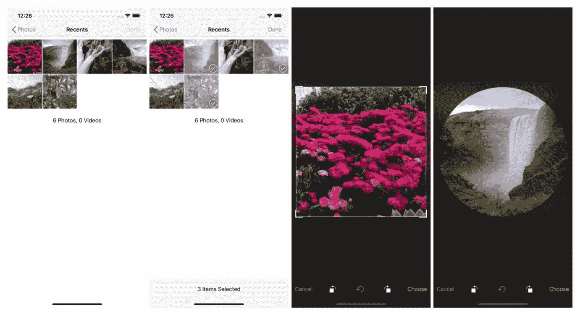
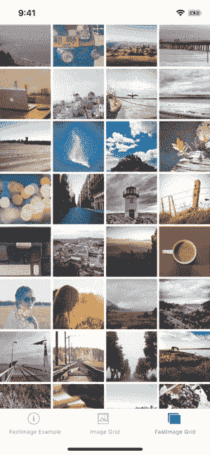
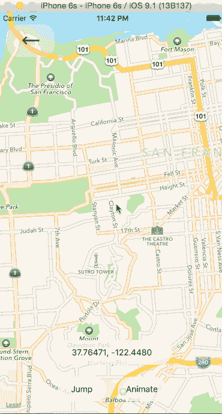

# 你应该知道的 7 个最著名的 React 原生库

> 原文：<https://javascript.plainenglish.io/7-most-starred-react-native-libraries-you-should-know-1125f93b7506?source=collection_archive---------3----------------------->

## 增强您的移动应用开发


Photo by [Oskar Yildiz](https://unsplash.com/@oskaryil?utm_source=unsplash&utm_medium=referral&utm_content=creditCopyText) on [Unsplash](https://unsplash.com/s/photos/react-native?utm_source=unsplash&utm_medium=referral&utm_content=creditCopyText)

有句谚语“不必多此一举”。图书馆就是最好的例子。它帮助你以一种简单的方式编写复杂而耗时的功能。根据我的观点，一个好的项目使用一些最好的库。我认为当使用一个库时，大多数人首先会看到它在 GitHub 上有多少颗星。在这里，我整理了一份 7 个最受欢迎的 React 本地库的列表，它们将在您的开发之旅中对您有所帮助。

# 1.洛蒂


动画是创造更好的用户体验的最好方法之一。Lottie 是向您的移动应用程序添加动画的最简单方法之一。Lottie 是一个库集合，用于解析和渲染使用身体移动导出为 JSON 的 Adobe After Effects 动画。这个库为 React Native 提供了 Lottie 组件。它在 Github 上有超过 15k 颗星。

[](https://github.com/lottie-react-native/lottie-react-native) [## GitHub-lottie-React-Native/Lottie-React-Native:React Native 的 Lottie 包装器。

### Lottie 组件用于 React Native ( iOS、Android 和 Windows) Lottie 是一个用于解析 Adobe 的库生态系统…

github.com](https://github.com/lottie-react-native/lottie-react-native) 

# 2.戒瘾诊所



测试是软件开发最重要的阶段之一。这是一个用于移动应用的灰盒端到端测试和自动化框架。当你的移动应用运行在一个真实的设备/模拟器上时，它会测试你的移动应用，就像一个真实的用户一样与之互动。它包括许多特性，比如跨平台、自动同步、独立于测试运行程序、可调试等等。它在 GitHub 上有超过 9.5k 颗星。

[](https://github.com/wix/detox) [## GitHub - wix/Detox:用于移动应用的灰盒端到端测试和自动化框架

### 灰盒端到端测试和移动应用自动化框架- GitHub - wix/Detox:灰盒端到端测试…

github.com](https://github.com/wix/detox) 

# 3.反应-本地-日历



如果你想在你的应用程序中显示一个漂亮的定制日历，那么这个库将对你有所帮助。正如您可能已经猜到的，这个库包含许多可定制的 React-Native 日历组件。你可以用这个库定制日期标记、多点标记、周期标记、多周期标记等。它在 Github 上有超过 8k 颗星。

[](https://github.com/wix/react-native-calendars) [## github-wix/react-native-calendars:react 本地日历组件🗓️📆

### React 本地日历组件🗓️📆。通过创建帐户，为 wix/react-native-calendars 开发做出贡献…

github.com](https://github.com/wix/react-native-calendars) 

# 4.图像-裁剪-选取器



GitHub 上有 5.5k 颗星，这个库在这个列表中有最低的星。处理图像是大多数应用程序的常见功能之一。这个库将在这种情况下帮助你。这个库是 iOS 和 Android 的图像拾取器，包括相机、视频、可配置压缩、多幅图像和裁剪。

[](https://github.com/ivpusic/react-native-image-crop-picker) [## GitHub-ivpusic/react-native-image-crop-picker:支持相机的 iOS/Android 图像拾取器…

### iOS/Android 图像拾取器，支持相机、视频、可配置压缩、多幅图像和裁剪，如果您…

github.com](https://github.com/ivpusic/react-native-image-crop-picker) 

# 5.快速成像



在大多数情况下，React Native 的图像组件处理图像缓存的方式与浏览器相同。如果服务器为图像返回正确的缓存控制头，您将得到您期望从浏览器得到的那种内置缓存。一般来说，很多人都报告过闪烁、缓存未命中、从缓存加载的低性能以及低性能。这个库是解决这些问题的替代品。它在 Github 上有超过 7k 颗星。

[](https://github.com/DylanVann/react-native-fast-image) [## GitHub-Dylan vann/react-native-fast-image:🚩快速图像，高性能反应本机图像组件。

### FastImage 示例应用程序。React Native 的图像组件在很大程度上像浏览器一样处理图像缓存。如果…

github.com](https://github.com/DylanVann/react-native-fast-image) 

# 6.地图



如果你正在使用地图，那么这是一个有用的库。顾名思义这是 React Native (iOS + Android)的 Mapview 组件。它提供了许多功能，如自定义地图风格，跟踪地区/位置等。它在 Github 上有超过 13k 颗星。

[](https://github.com/react-native-maps/react-native-maps) [## GitHub-React-Native-maps/React-Native-maps:适用于 iOS + Android 的 React Native Mapview 组件

### react iOS+Android 的原生地图组件这个项目是由一小群人维护的，任何帮助…

github.com](https://github.com/react-native-maps/react-native-maps) 

# 7.矢量图标


图标是每个应用程序都有的东西之一。该库提供了 React Native 的可定制图标，支持图像源和完整的样式。这个库非常适合按钮、徽标和导航/标签栏。它在 Github 上有超过 16k 颗星。

[](https://github.com/oblador/react-native-vector-icons) [## GitHub-ob ador/React-Native-vector-Icons:React Native 的可定制图标，支持…

### 非常适合按钮、徽标和导航/标签栏。易于扩展、设计和集成到您的项目中。如果你想用…

github.com](https://github.com/oblador/react-native-vector-icons) 

# 其他一些很棒的资源在哪里？

总有新的东西要学。如果你想了解更多关于编程的优秀资源，请点击下面的链接。

[](https://medium.com/codex/7-most-starred-python-library-you-should-know-b6f2f87274d4) [## 你应该知道的 7 个最受欢迎的 Python 库

### 增强您的 Python 开发能力

medium.com](https://medium.com/codex/7-most-starred-python-library-you-should-know-b6f2f87274d4) 

今天到此为止。相信这些库对你的开发之旅会有很大的帮助。

如果你知道任何其他漂亮的 React 原生库，请在评论中分享。直到我们再次相遇。干杯！

```
**Want to Connect?** If you want to, you can connect with me on [**Twitter**](https://twitter.com/FarhanTanvirBD)
```

*更多内容请看*[***plain English . io***](https://plainenglish.io/)*。报名参加我们的* [***免费周报***](http://newsletter.plainenglish.io/) *。关注我们关于*[***Twitter***](https://twitter.com/inPlainEngHQ)[***LinkedIn***](https://www.linkedin.com/company/inplainenglish/)*[***YouTube***](https://www.youtube.com/channel/UCtipWUghju290NWcn8jhyAw)*[***不和***](https://discord.gg/GtDtUAvyhW) *。对增长黑客感兴趣？检查* [***电路***](https://circuit.ooo/) *。***