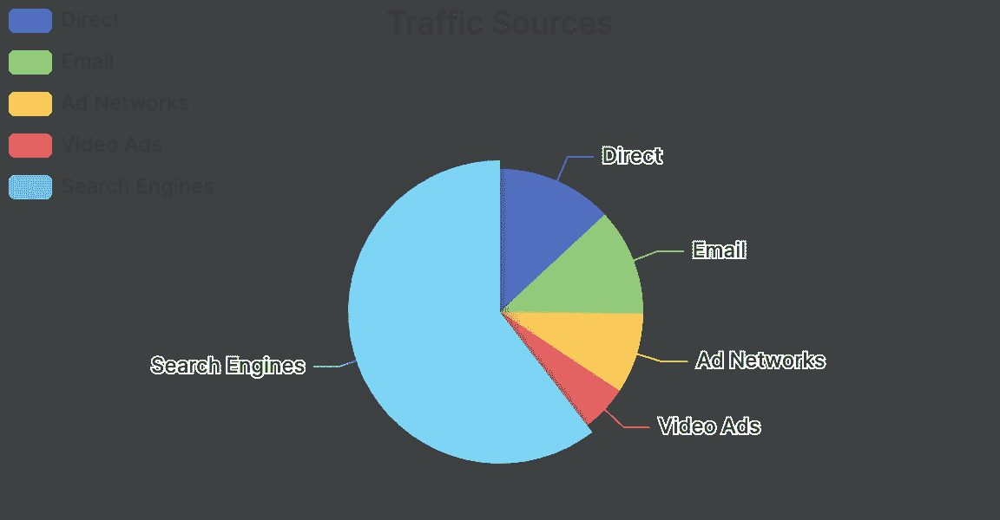
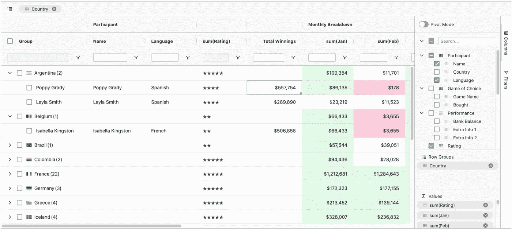
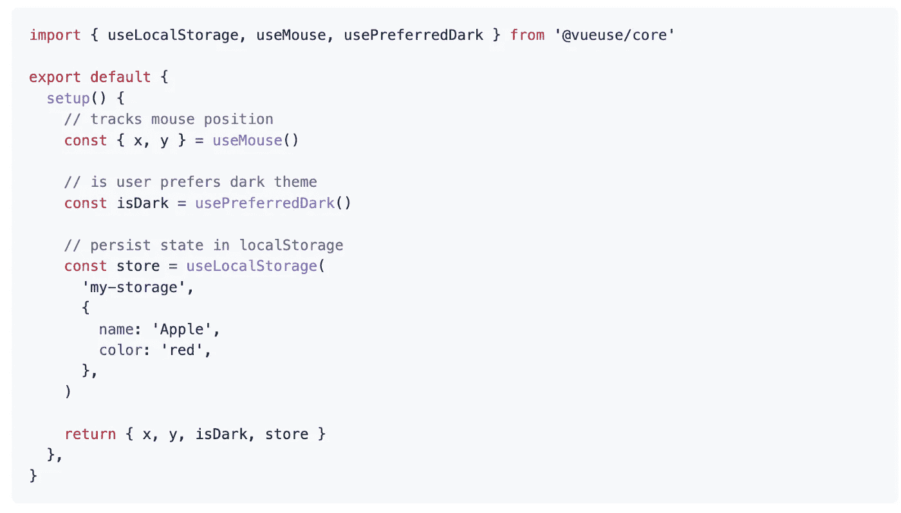
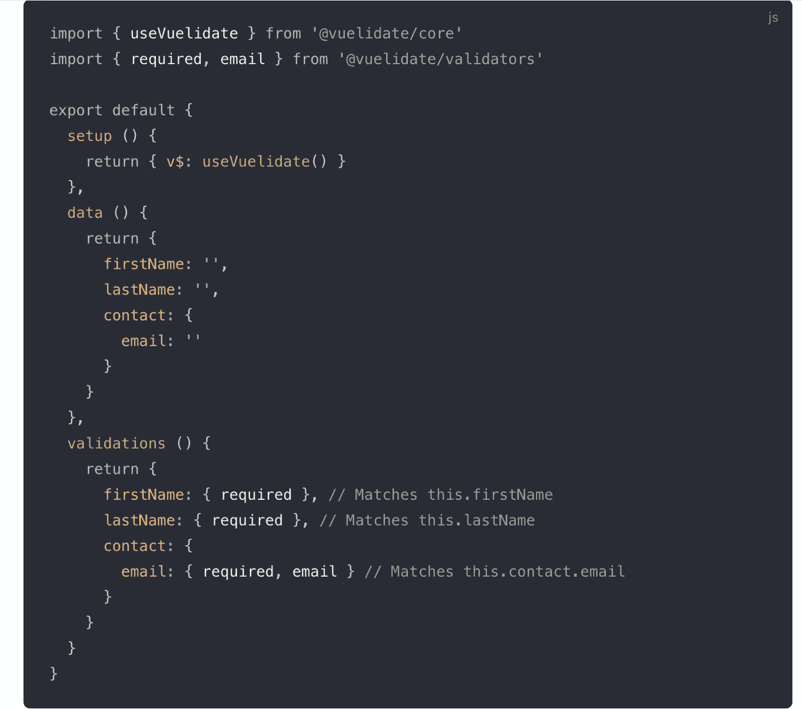
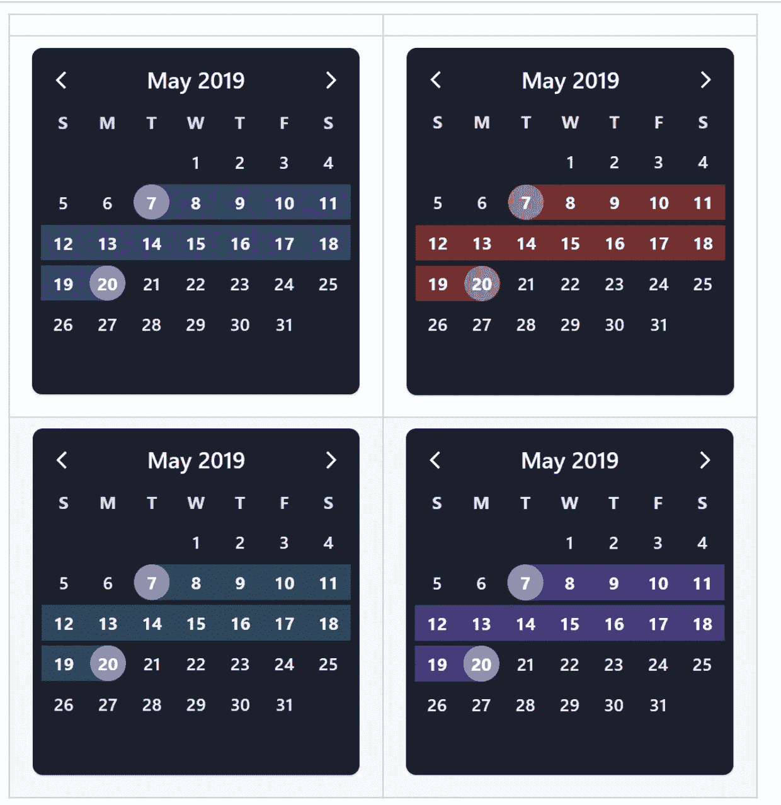
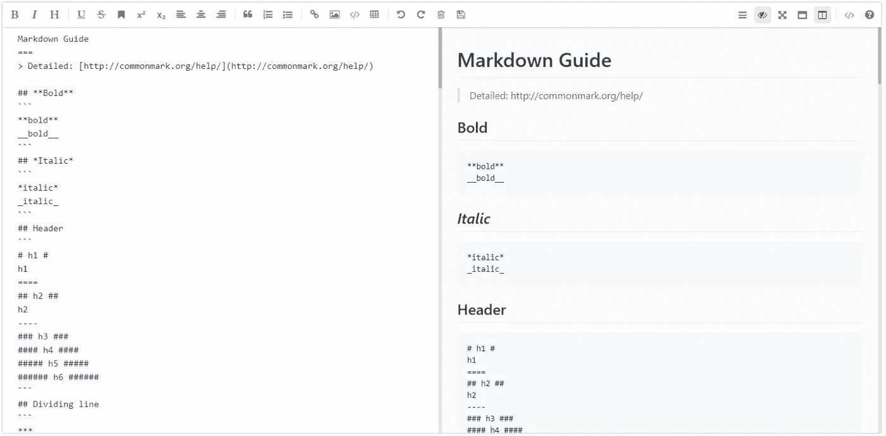

# 你应该知道的 7 个最受欢迎的 Vue.js 库

> 原文：<https://javascript.plainenglish.io/7-most-starred-vue-js-libraries-you-should-know-dcd2ef801847?source=collection_archive---------3----------------------->

## 加速您的 Vue.js 开发


Photo by [Mohammad Rahmani](https://unsplash.com/@afgprogrammer?utm_source=unsplash&utm_medium=referral&utm_content=creditCopyText) on [Unsplash](https://unsplash.com/s/photos/programmer?utm_source=unsplash&utm_medium=referral&utm_content=creditCopyText)

有句谚语“不必多此一举”。图书馆就是最好的例子。它帮助你以一种简单的方式编写复杂而耗时的功能。根据我的观点，一个好的项目使用一些最好的库。

我认为当使用一个库时，大多数人首先会看到它在 GitHub 上有多少颗星。这里我整理了一个列表，列出了 7 个最受欢迎的 Vue.js 库，对你的开发之旅有所帮助。

# 1.埃查尔兹



如果你正在创建一个数据驱动的应用程序，它很有可能有一个图表。在这种情况下，这个库对您来说是一个很好的资源。这个库提供了许多漂亮的可定制的图表，如条形图、饼图、极坐标图、散点图等等。这个库在 Github 上有超过 7.5k 的星星。

[](https://github.com/ecomfe/vue-echarts) [## GitHub-ECOM Fe/vue-e charts:vue . js 的 Apache ECharts 组件。

### Apache ECharts 的 Vue.js 组件。使用 Apache ECharts 5 并适用于 Vue.js 2/3。如果您从…迁移

github.com](https://github.com/ecomfe/vue-echarts) 

# 2.银栅



显示和处理数据是开发人员执行的重要且常见的任务之一。这个库将帮助您完成这项任务。这是一个功能全面、高度可定制的 JavaScript 数据网格。它提供卓越的性能，并且独立于第三方。它还包括许多功能，如列交互(调整大小、重新排序和锁定列)、分页、排序、行选择等等。这个库在 Github 上有 9k 多颗星。

[](https://github.com/ag-grid/ag-grid) [## GitHub - ag-grid/ag-grid:构建企业应用程序的最佳 JavaScript 数据表…

### 构建企业应用程序的最佳 JavaScript 数据表。支持 React/Angular/Vue/Plain JavaScript…

github.com](https://github.com/ag-grid/ag-grid) 

# 3.武尤斯



GitHub 上有超过 12kk 颗星星，这个库拥有这个列表中最多的星星。这是一个基于[组合 API](https://v3.vuejs.org/guide/composition-api-introduction.html) 的实用函数集合。如果您不熟悉组合 API，请在继续之前了解一些关于[组合 API](https://v3.vuejs.org/guide/composition-api-introduction.html) 的基本概念。

[](https://github.com/vueuse/vueuse) [## GitHub - vueuse/vueuse:为 Vue 2 和 3 收集基本的 Vue 合成工具

### 基本 Vue 组合实用程序的集合请参考功能列表或文档以了解更多详细信息。🎩来自…

github.com](https://github.com/vueuse/vueuse) 

# 4.Vuelidate



对于 Vue.js 3 和 2，这是一个简单但功能强大的轻量级基于模型的验证。它被认为是基于模型的，因为验证规则是在数据旁边定义的，并且验证树结构与数据模型结构相匹配。它在 GitHub 上有超过 6.5k 颗星。

[](https://github.com/vuelidate/vuelidate/tree/next) [## GitHub-vue lidate/vue lidate:vue . js 的简单、轻量级的基于模型的验证

### 用于 Vue.js 2.x 和 3.0 的简单、轻量级的基于模型的验证，请访问 Vuelidate 文档以获取详细说明。你可以…

github.com](https://github.com/vuelidate/vuelidate/tree/next) 

# 5.虚拟日历



GitHub 上有超过 3.5k 颗星，这个库在这个列表中有最低的星。处理日期是每个开发人员都需要处理的常见功能之一。在这种情况下，这个图书馆会让你的生活更轻松。正如你已经猜到的，这是一个优雅的日历和日期选择器。它提供了许多功能，如鞋钉突出，点，酒吧，自定义 popovers，日期范围，等等。

[](https://github.com/nathanreyes/v-calendar) [## GitHub - nathanreyes/v-calendar:一个优雅的日历和日期选择器插件。

### 此时您不能执行该操作。您已使用另一个标签页或窗口登录。您已在另一个选项卡中注销，或者…

github.com](https://github.com/nathanreyes/v-calendar) 

# 6.vue-js-modal


正如你已经猜到的，这是一个易于使用、高度可定制的 Vue.js 模态库。该库支持静态和动态两种模式。静态是通过模板显式定义的。动态是根据传递给“显示模态”函数的配置生成的。这个库在 Github 上有超过 4k 的星星。

[](https://github.com/euvl/vue-js-modal) [## GitHub — euvl/vue-js-modal:易于使用、高度可定制的 Vue.js 模态库。

### 易于使用，高度可定制的 Vue.js 模态库。版本 2.0.0 候选发行版将会有突破性的变化…

github.com](https://github.com/euvl/vue-js-modal) 

# 7.mavonEditor



如果你想添加一个 markdown 编辑器的功能，那么这是一个很好的资源。这个库提供了一个 markdown 编辑器，支持各种个性化的特性。它支持表情符号、下标、上标、容器、定义列表等等。这个库在 Github 上有超过 5.5k 的星星。

[](https://github.com/hinesboy/mavonEditor) [## GitHub-hines boy/mavon editor:mavon editor-一个基于 Vue 的 markdown 编辑器，支持多种…

### mavonEditor -基于 Vue 的 markdown 编辑器，支持多种个性化功能- GitHub …

github.com](https://github.com/hinesboy/mavonEditor) 

# 其他一些很棒的资源在哪里？

总有新的东西要学。如果你想了解更多关于编程的优秀资源，请点击下面的链接。

[](https://medium.com/codex/7-most-starred-python-library-you-should-know-b6f2f87274d4) [## 你应该知道的 7 个最受欢迎的 Python 库

### 增强您的 Python 开发能力

medium.com](https://medium.com/codex/7-most-starred-python-library-you-should-know-b6f2f87274d4) 

今天到此为止。我希望这些库有助于简化开发过程。

如果你知道任何其他有用的 Vue.js 库，请在评论中分享。直到我们再次见面…干杯！

```
**Want to Connect?**If you want to, you can connect with me on [**Twitter**](https://twitter.com/FarhanTanvirBD)
```

*更物在* [***素朴***](https://plainenglish.io/) *。报名参加我们的* [***免费周报***](http://newsletter.plainenglish.io/) *。*[***Twitter***](https://twitter.com/inPlainEngHQ)[***LinkedIn***](https://www.linkedin.com/company/inplainenglish/)*[***YouTube*****和**](https://www.youtube.com/channel/UCtipWUghju290NWcn8jhyAw)*[*不和*](https://discord.gg/GtDtUAvyhW) *对 Growth Hacking 感兴趣吗？查看* [***电路***](https://circuit.ooo/) ***。*****