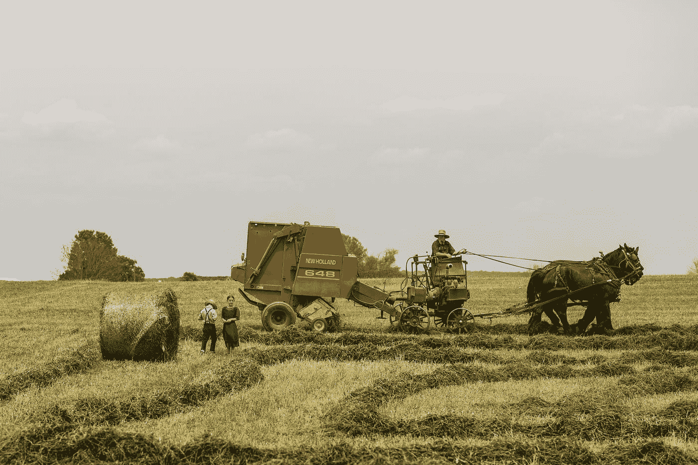

# 农场管理应用程序的 7 个必备功能

> 原文：<https://javascript.plainenglish.io/7-must-have-features-of-farm-management-app-6b75a9351d5d?source=collection_archive---------13----------------------->

Photo by [Vladimir Kudinov](https://unsplash.com/@madbyte?utm_source=medium&utm_medium=referral) on [Unsplash](https://unsplash.com?utm_source=medium&utm_medium=referral)

让我们承认[农场管理软件正在走向](https://www.resourcifi.com/blog/agriculture-software-development-trends?utm_source=InPlainEnglish&utm_medium=Offsite)。市场上有许多农场管理应用程序。然而，相当多的农民正在转向为他们提供足够自由的存储、速度、用户界面/UX 和计算能力的解决方案，以快速处理信息。

构建第二个功能并将其整合到一个应用程序中并不是明智之举，从长远来看也不会对你的业务有所帮助，而且[应用程序的开发成本](https://www.resourcifi.com/resources/ebooks/resourcifi-ebook-cost-to-develop-an-app?utm_source=InPlainEnglish&utm_medium=Offsite)会非常昂贵。然而，不要让它阻碍你开发功能丰富的农场管理应用程序。

在这里，我谈到了 2023 年要考虑的农场管理应用的 7 个必备功能。

## 实时数据

实时数据是任何农场管理应用的核心功能之一，也是它的一大优势。当你拥有实时数据时，你可以用它来进行分析、预测和计算。

因此，依赖性大大降低。你不需要等很长时间就能知道这块地是否适合播种，或者现在是否是灌溉的好时机。许多问题可以通过实时数据来解决，如果你聪明地设计应用程序，你可以在方便的时候得到你的农事安排的提醒。

实时数据现在已经成为任何农场管理应用程序的一个非常基本但必需的功能，因为它减少了误判的机会。

## 牲畜管理

牲畜管理功能将允许跟踪所有多物种、多品种的畜群和羊群。没有牛、绵羊、猪、山羊、马、羊驼或鸡会失踪。有了牲畜管理功能，农民将始终知道他们的位置。

农民会知道他们每天的通勤情况以及他们的产量。由于这一特点，牲畜管理将变得更容易，他们将知道哪里可以改进，以提高生产率。

## 存货管理

像牲畜管理一样，需要维护和管理库存。库存管理功能允许您跟踪仓库中的产品。您还可以管理正在生产的商品，或为进一步加工而保存的原材料。

这一库存管理功能背后的整个想法是减少人为错误的机会，并保持一切精简。另一个隐藏的好处是，它大大增加了用户的参与度和保持度。

## 天气预报

最准确的天气预报有助于节省农作物和资源，并最大限度地减少损失。农民可以决定什么对他们的作物最好，什么时候保护他们。天气预报对农业至关重要，因为它有助于你相应地安排工作，并提前为灾难做好准备。

## 合作

众所周知，农业不是一个人的工作。种植健康的作物有时需要农学家、农民、会计师和气象学家。协作特性的作用来了。

借助这一功能，农民可以与上述人员分享他们的想法、数据、报告和各种其他信息。他们甚至可以创建一个可信的群组来无缝共享信息。

因此，每当农民需要咨询农学家或会计师时，他们可以用更好的方式来做同样的事情。因此，生产率将大幅提高。

## 田疃管理

你不能在 3 或 4 磅的土地上种庄稼。他们需要大量的田地，而且对农民或任何人来说，独自监控所有的田地几乎是不可能的。然而，当你[雇佣一家应用程序开发公司](https://medium.com/@scarlett8285/top-10-mobile-app-development-companies-in-2020-d9b4c20f419b)来开发一个具有农田管理功能的农场管理应用程序时，你可以密切关注它。

田地之间不需要不必要的奔跑。您甚至可以使用应用程序监控灌溉的轮换。此外，还将记录耕作或施肥的总持续时间，以便使用此功能进行进一步分析。

## 把…编入预算

顾名思义，预算功能是关于财务规划的。它有两种方式。农民可以自己使用它来对他们的月份进行财务规划，或者与银行家/会计师实时合作，获取收入和支出等财务信息。

## 农场管理应用的优势

[开发一款管理农场活动的智能应用](https://www.resourcifi.com/industry/agriculture-software-development?utm_source=InPlainEnglish&utm_medium=Offsite)有很多显著的优势。当你有了所说的 app，你就不用担心你不在的时候可能错过的信息不准确了。

除此之外，这种应用程序允许在许多方面监控数据。当所有这些数据都可以在一个框架中查看时，交叉引用和模式就变得容易了。

同样，这些数据对收入和支出也有帮助。农民和农学家非常明白，即使收入/费用的微小变化也会带来重大变化。

## 以下是农场管理应用程序的一些其他好处:

*   更好的增长
*   更好地管理田地
*   资源大幅减少
*   活动跟踪
*   改善牲畜管理
*   改进对时间和持续时间的跟踪
*   轻松的风险管理
*   节省劳动力和投资的资金
*   更好的计划和控制

## 结论

移动技术正被广泛应用。农业也不例外。与祖父辈不同，如今农民将大部分工作时间花在平板电脑和笔记本电脑上。他们中 98%的人有一部手机，用于农场管理。

如果没有移动应用，跟踪和管理农场活动将会非常费力。想象一下收割、灌溉、耕种和照顾许多其他重要的活动，同时还要关注田地里的日常杂务。

几乎不可能，对吧？但是 T2 农业应用软件的发展使得所有这些事情成为可能，并且提高了效率。在这里，我谈到了农场管理应用程序的 7 大功能以及 2023 年要考虑的好处。

*更多内容看* [***说白了就是***](https://plainenglish.io/) *。*

*报名参加我们的* [***免费每周简讯***](http://newsletter.plainenglish.io/) *。关注我们关于*[***Twitter***](https://twitter.com/inPlainEngHQ)，[***LinkedIn***](https://www.linkedin.com/company/inplainenglish/)*，*[***YouTube***](https://www.youtube.com/channel/UCtipWUghju290NWcn8jhyAw)*[***不和***](https://discord.gg/GtDtUAvyhW) ***。****

****有兴趣规模化你的软件创业*** *？检查* [***电路***](https://circuit.ooo?utm=publication-post-cta) *。**