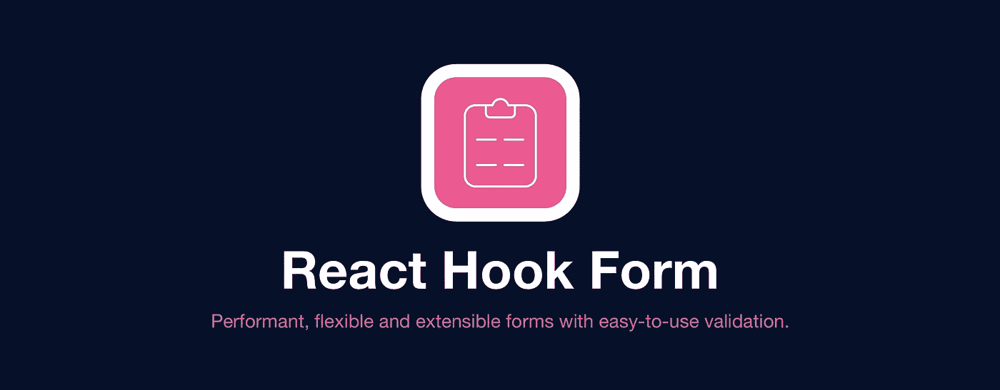
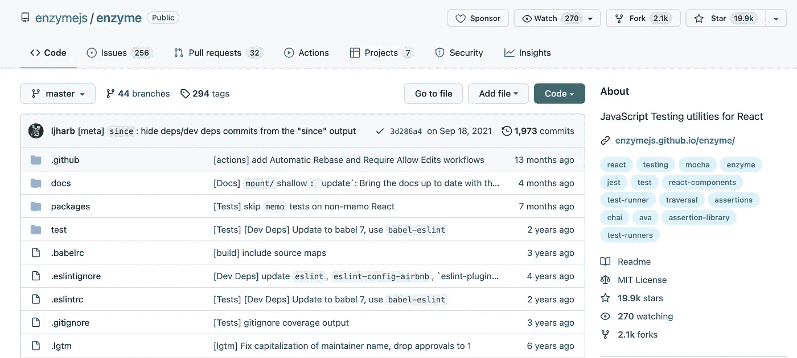
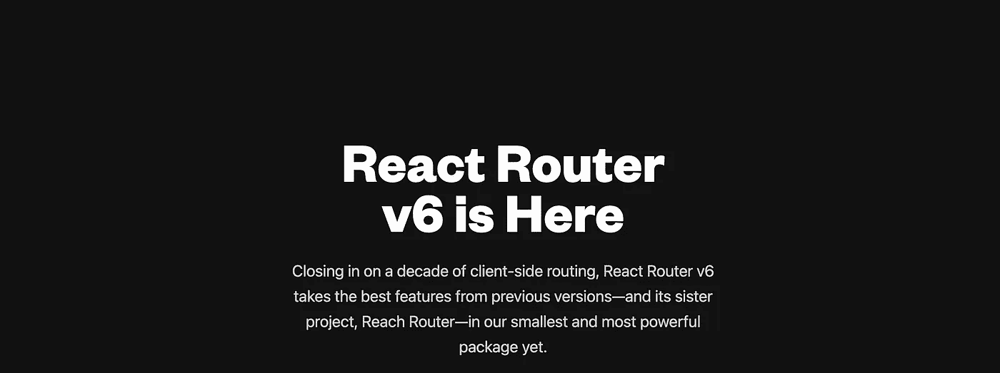

# React 开发人员必须知道的 7 个库

> 原文：<https://javascript.plainenglish.io/7-must-know-libraries-for-a-react-developer-57a324da9520?source=collection_archive---------2----------------------->

## 加快你的反应发展

Photo by [Nubelson Fernandes](https://unsplash.com/@nublson?utm_source=medium&utm_medium=referral) on [Unsplash](https://unsplash.com?utm_source=medium&utm_medium=referral)

当我们可以通过使用一个库轻松实现相同的结果时，为什么还要编写自定义功能呢？。开发人员最好的朋友和救星是库。我相信一个好的项目会利用一些最好的可用库。

React 是创建用户界面的最好的 JavaScript 库之一。这里有一些有用的库，可以帮助你更快更有效地构建你的项目。

# 1.反应挂钩形式

如果你有一个项目，我认为它有一个形式。很难找到不使用表单的应用程序。在这种情况下，这个图书馆会让你的生活更轻松。这个库将帮助您减少需要编写的代码量，同时删除不必要的重新渲染。它有超过 27k 颗恒星。

 [## GitHub-react-hook-form/react-hook-form:📋表单状态管理和验证的 React 钩子…

### npm 安装 react-hook-form 感谢这些善良可爱的赞助商(公司和个人)！感谢所有人…

github.com](https://github.com/react-hook-form/react-hook-form) 

# 2.Redux

如果您还没有使用它，这是您应该在下一个或当前项目中使用的库之一。这是使用最多的库之一，有超过 57k 的星和 3k 的叉。它帮助您编写行为一致、在不同环境(客户机、服务器和本机)中运行、易于测试的应用程序。Redux 不仅可以与 React 一起使用，还可以与任何其他视图库一起使用。

 [## GitHub-reduxjs/redux:JavaScript 应用程序的可预测状态容器

### Redux 是 JavaScript 应用程序的可预测状态容器。(不要和 WordPress 框架混淆——Redux…

github.com](https://github.com/reduxjs/redux) 

# 3.MUI 核心

MUI Core(以前的 Material-UI)是一个开源项目，有助于在 React 中应用 Google 的材质设计指南。它是 React 开发人员中流行的 UI 设计框架，在 Github 上有超过 77K 的️tars。所以我相信没有太多理由不用这个。

 [## GitHub - mui/material-ui: MUI Core(以前的 material-ui)是 React UI 库，你总是…

### MUI Core(以前的 Material-UI)就是你一直想要的 React UI 库。遵循自己的设计体系，或者从…

github.com](https://github.com/mui/material-ui) 

# 4.蓝图

如果你想为桌面应用程序创建一个复杂的基于数据的界面，这可能对你非常有用。这个库为运行在现代浏览器和 IE11 中的桌面应用程序构建复杂的、数据密集的 web 界面而优化。但是请记住，这不是一个移动优先的 UI 工具包。它在 Github 上有超过 18k 颗星。

 [## GitHub - palantir/blueprint:一个基于 React 的 web 工具包

### Blueprint 是一个基于 React 的 web 用户界面工具包。它是为构建复杂的、数据密集的 web 界面而优化的…

github.com](https://github.com/palantir/blueprint) 

# 5.酶

测试是软件开发最重要的阶段之一。它会让你的应用防弹。Enzyme 是一个 React JavaScript 测试工具，它使测试 React 组件的输出变得更加容易。您还可以使用输出以某种方式操作、遍历和模拟运行时。它在 Github 上有超过 19k 颗星。

 [## GitHub-enzyme js/enzyme:React 的 JavaScript 测试实用程序

### React 的 JavaScript 测试实用程序。在 GitHub 上创建一个帐户，为 enzymejs/enzyme development 做出贡献。

github.com](https://github.com/enzymejs/enzyme) 

# 6.样式组件

这个库可以帮助你在 React 应用中组织 CSS。它允许你通过利用[标记的模板文字](https://www.styled-components.com/docs/advanced#tagged-template-literals)和 CSS 的力量来编写实际的 CSS 代码来设计你的组件。它还删除了组件和样式之间的映射。它在 Github 上有超过 35k 颗星。

 [## GitHub-styled-components/styled-components:组件时代的视觉原语。使用最好的…

### 组件时代的视觉原语。使用 ES6 和 CSS 的精华来设计你的应用，没有压力💅- GitHub…

github.com](https://github.com/styled-components/styled-components) 

# 7.反应路由器

这是你应该考虑在当前或下一个项目中使用的另一个库。它在 Github 上有超过 46k 的星星和 9k 的叉子。相信从名字上你已经明白了，它是 React 的一个全功能路由库。它也是轻量级的。

 [## GitHub-remix-run/React-router:React 的声明性路由

### React 的声明性路由。在 GitHub 上创建一个帐户，为 remix-run/react-router 开发做出贡献。

github.com](https://github.com/remix-run/react-router) 

# 下一部分在哪里？

有很多很棒的 React 库。我想分享尽可能多的资源，让你的开发之旅更轻松。

如果你想知道更多牛逼的 React 库，请查看下面。

 [## 您应该在下一个项目中使用的 7 个更有用的 React 库

### 加快你的反应发展

javascript.plainenglish.io](/7-more-useful-react-libraries-you-should-use-in-your-next-project-5699594be1c8)  [## 您应该在下一个项目中使用的 7 个有用的 React 库

### 第 3 部分:用这些库加速 React 开发。

javascript.plainenglish.io](/7-useful-react-libraries-you-should-use-in-your-next-project-dec9b577f15c)  [## 您应该在下一个项目中使用的 7 个有用的 React 库

### 加快你的反应发展

javascript.plainenglish.io](/7-useful-react-libraries-you-should-use-in-your-next-project-8f33b9cf83e7) 

今天到此为止。我希望这些库有助于简化开发过程。

如果你知道任何其他有用的 React 库，请在评论中分享。直到我们再次相遇。干杯！

***想要连接？***

*如果你愿意，可以在* [***推特***](https://twitter.com/FarhanT99598254) 上与我联系

## 进一步阅读

 [## 帮助您在 React 中更快开发的 5 种工具和实践

### React 工具、技巧和最佳实践将帮助您更快地构建应用

javascript.plainenglish.io](/5-tools-practices-to-help-you-develop-faster-in-react-b884c1b20fc2) 

*更多内容请看*[***plain English . io***](https://plainenglish.io/)*。报名参加我们的* [***免费周报***](http://newsletter.plainenglish.io/) *。关注我们关于*[***Twitter***](https://twitter.com/inPlainEngHQ)[***LinkedIn***](https://www.linkedin.com/company/inplainenglish/)*[***YouTube***](https://www.youtube.com/channel/UCtipWUghju290NWcn8jhyAw)*[***不和***](https://discord.gg/GtDtUAvyhW) *。***