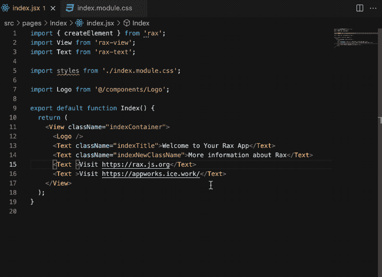
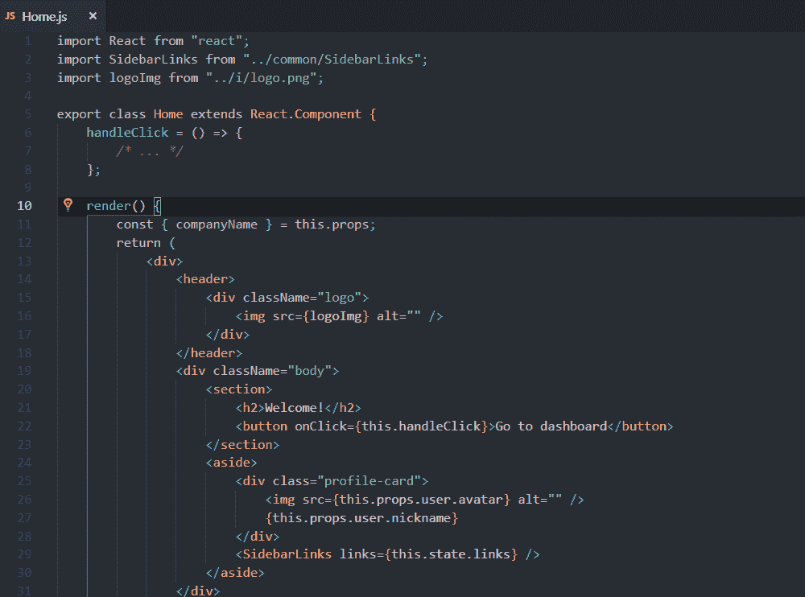
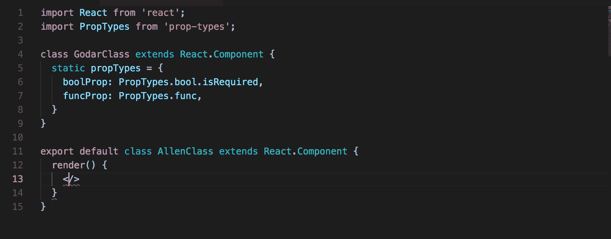
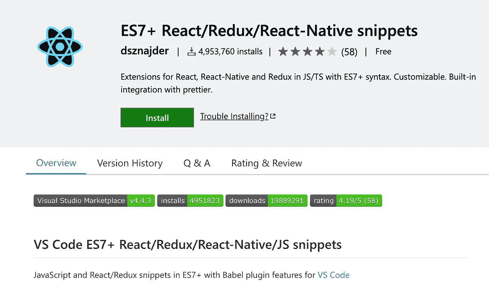
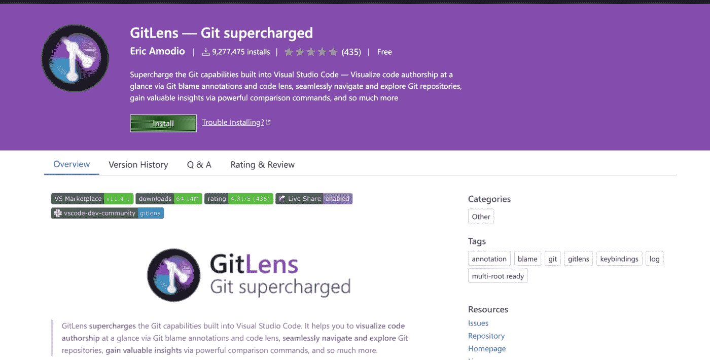
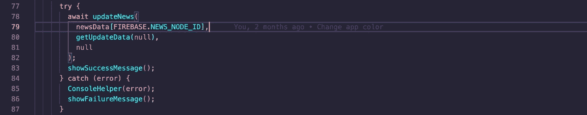
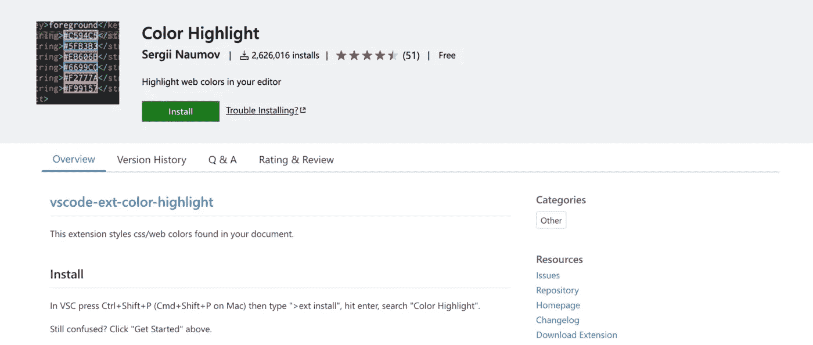
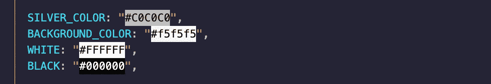
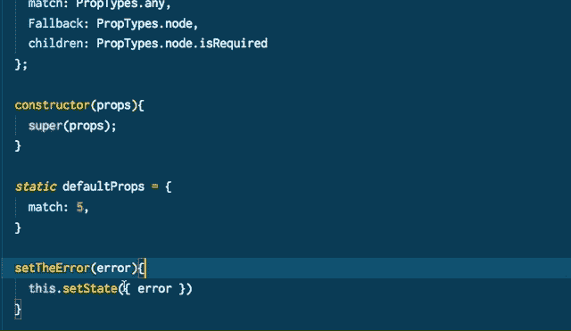

# React 开发人员必须了解的 7 个 VS 代码扩展

> 原文：<https://javascript.plainenglish.io/7-must-know-vs-code-extensions-for-a-react-developer-d62bf5438740?source=collection_archive---------1----------------------->

## 提高你的反应效率。

Photo by [Nubelson Fernandes](https://unsplash.com/@nublson?utm_source=medium&utm_medium=referral) on [Unsplash](https://unsplash.com?utm_source=medium&utm_medium=referral)

一个士兵对武器的热爱高于一切。开发者是士兵，集成开发环境(IDE)是武器。一名士兵最重要的职责是时刻为他的武器充电并有效地使用它。

对于一个士兵来说，VS 代码是最好的武器之一。如果你是 React 开发者，这里有七个优秀的扩展，可以让你的武器更加强大。

# 1.反应风格助手

如果你是 React 开发人员，我相信你必须编写许多样式元素。在这种情况下，这个 VS 代码扩展将对您有所帮助。它将帮助你在 JSX 更容易地写风格。它还在 CSS、LESS、SASS 等样式文件中提供了强大的辅助开发功能。它也有许多其他功能，如自动完成，去定义，创建 JSX/TSX 内联 CSS 样式等。它有超过 52k 的安装。

# 2.VS 代码反应重构

重构是每个开发人员都要做的任务之一。如果你从事一个大项目，有时候，重构会有问题。这个扩展将在这种情况下帮助您。它有许多功能，如提取 JSX 代码部分到一个新的类或功能组件，支持类型脚本和 TSX，兼容反应钩子 API 等。它有大约 88k 个安装。

 [## VSCode React 重构- Visual Studio 市场

### 这个简单的扩展为 React 开发人员提供了 JSX 重构代码操作。

marketplace.visualstudio.com](https://marketplace.visualstudio.com/items?itemName=planbcoding.vscode-react-refactor) 

# 3.反应属性类型智能感知

我相信如果你用过 React，你一定用过 PropTypes。在一个大型项目中，会有很多 PropTypes。该扩展查找 React PropTypes 并将它们添加到建议列表中。它有大约 85，000 个装置。

 [## React 属性类型智能感知- Visual Studio 市场

### 该扩展查找 React PropTypes 并将它们添加到建议列表中。它适用于的所有实现…

marketplace.visualstudio.com](https://marketplace.visualstudio.com/items?itemName=OfHumanBondage.react-proptypes-intellisense) 

# 4.ES7+React/Redux/React-原生片段

我认为这是 React 开发者使用最多的 VS 代码扩展。因为它有超过 400 万个安装。据我说，这是你必备的 VS 代码扩展。这会让你的生活轻松很多。我相信从名字上，你已经理解了这个在 ES7+中提供 JavaScript 和 React/Redux 片段。

 [## ES7+React/Redux/React-本机代码片段- Visual Studio 市场

### Visual Studio 代码的扩展-使用 ES7+语法在 JS/TS 中扩展 React、React-Native 和 Redux

marketplace.visualstudio.com](https://marketplace.visualstudio.com/items?itemName=dsznajder.es7-react-js-snippets) 

# 5.Git 镜头

Who wrote the code?

你可能会想，等等，这不应该是 React 的 VS 代码扩展列表吗？但是我相信 Git 是每个开发者唯一使用的东西。所以我认为如果你是一个 React 开发者，这对你也会非常有帮助。这个扩展增强了 Git 的能力。这有助于我们了解谁、为什么以及何时更改了代码。有许多可以定制的功能。

 [## GitLens - Git 增压版- Visual Studio 市场

### Visual Studio 代码的扩展——在 VS 代码中为 Git 增压——通过 Git 使代码作者身份一目了然

marketplace.visualstudio.com](https://marketplace.visualstudio.com/items?itemName=eamodio.gitlens) 

# 6.彩色高光

这是一个简单的扩展，但会有很大帮助。作为开发人员，有时我们必须使用许多颜色。这个插件有助于通过颜色代码识别颜色。

 [## 颜色突出显示- Visual Studio 市场

### 这个扩展设计了文档中的 css/web 颜色。在 VSC 按 Ctrl+Shift+P(在 Mac 上按 Cmd+Shift+P ),然后输入…

marketplace.visualstudio.com](https://marketplace.visualstudio.com/items?itemName=naumovs.color-highlight) 

# 7.React 文档

文档是开发人员的朋友。它在很多方面帮助我们，比如理解属性的作用，为什么使用它，等等。我想从名字上看，您已经理解了这个扩展显示了各种与 React 相关的方法/属性的内联文档。

 [## React 文档- Visual Studio 市场

### Visual Studio 代码显示弹出式菜单的扩展，包含各种 React 方法/属性的文档

marketplace.visualstudio.com](https://marketplace.visualstudio.com/items?itemName=avraammavridis.vsc-react-documentation) 

今天到此为止。我希望这个扩展将有助于简化开发过程。

如果你知道任何其他有用的 VS 代码扩展，请在评论中分享。直到我们再次相遇。干杯！

***想要连接？***

*如果你愿意，可以在*[***Twitter***](https://twitter.com/FarhanT99598254)**或*[***LinkedIn***](https://www.linkedin.com/in/farhan-tanvir-b08520151/)***上与我联系。****

**更多内容请看*[***plain English . io***](https://plainenglish.io/)*。报名参加我们的* [***免费每周简讯***](http://newsletter.plainenglish.io/) *。关注我们*[***Twitter***](https://twitter.com/inPlainEngHQ)*和*[***LinkedIn***](https://www.linkedin.com/company/inplainenglish/)*。加入我们的* [***社区不和谐***](https://discord.gg/GtDtUAvyhW) *。**