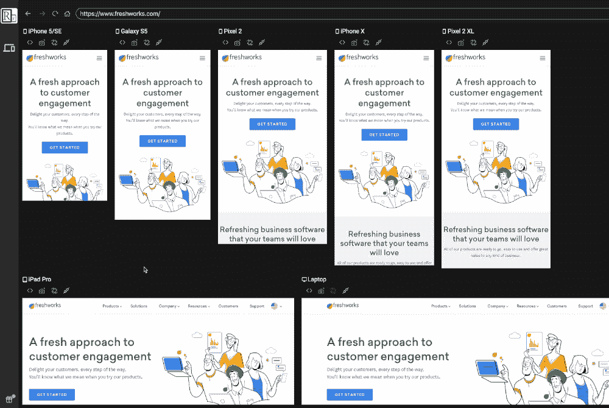
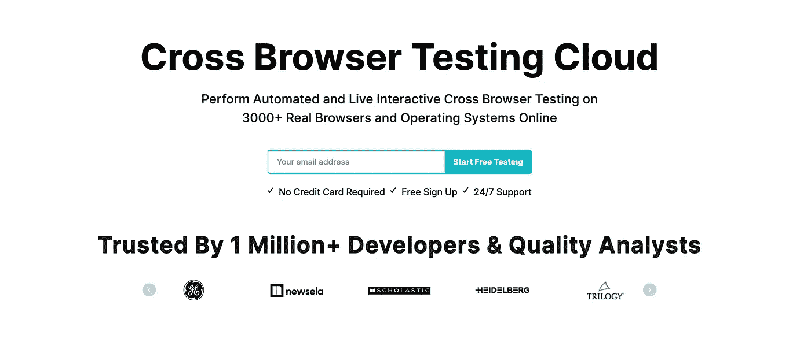
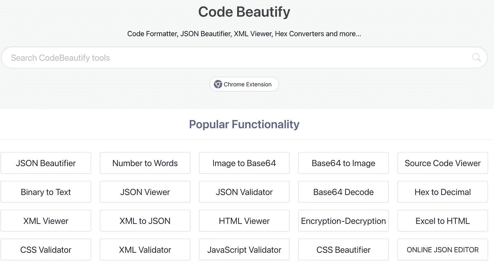
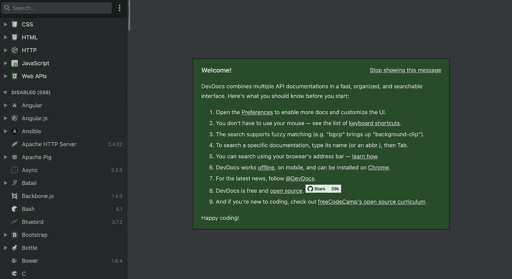
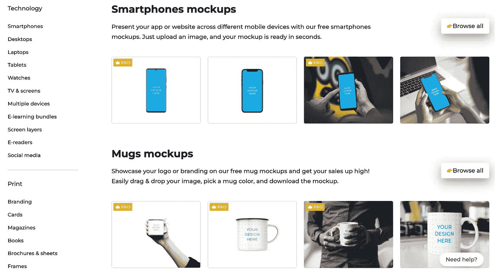
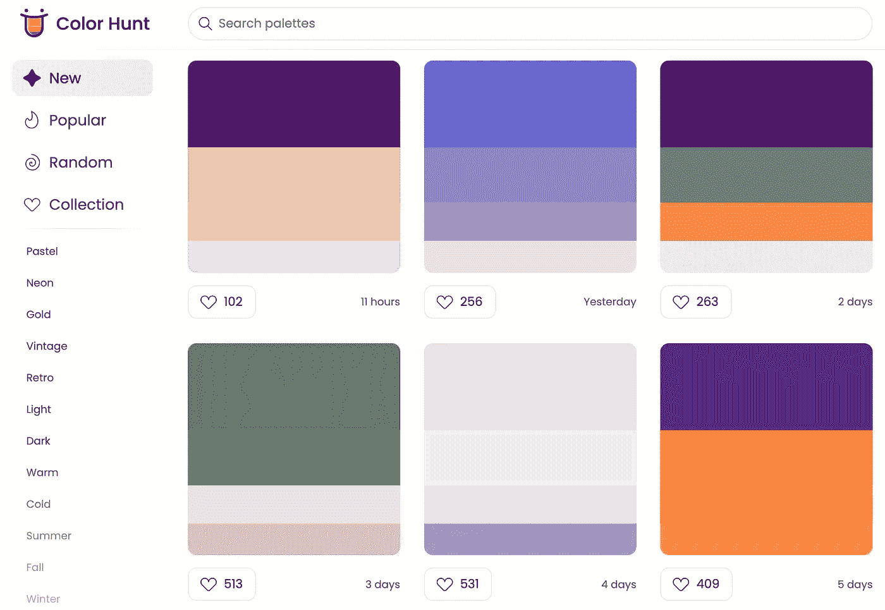
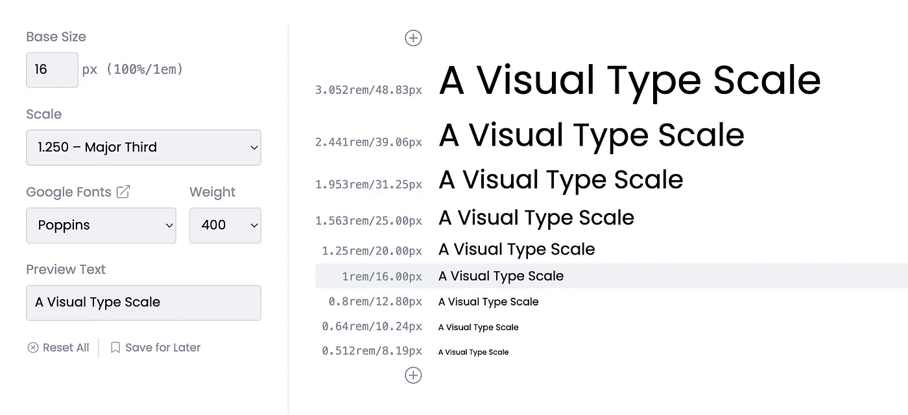

# 开发人员必须访问的 7 个网站

> 原文：<https://javascript.plainenglish.io/7-must-visit-websites-for-developers-50d176a344d7?source=collection_archive---------3----------------------->

## 作为一名开发者，最好的网站将帮助你更有效率。

Photo by [Arif Riyanto](https://unsplash.com/@arifriyanto?utm_source=medium&utm_medium=referral) on [Unsplash](https://unsplash.com?utm_source=medium&utm_medium=referral)

作为一名开发人员，我们需要尽可能地多产，为了多产，我们需要适当地利用资源。网上有很多资源，很容易迷失其中。在这里，我整理了 7 个网站，可以帮助你成为一名更有效率的开发者。

# 1.响应地

这可能是你的救命稻草。开发人员的主要职责之一是创建一个响应迅速的应用程序。这是一个修改过的网络浏览器，有助于快速响应的网络开发。它提供了许多功能，如跨所有设备的镜像用户交互，可定制的预览布局以满足您的所有需求，等等。它在 GitHub 上也有超过 16k 颗星。

请访问网站 [**这里**](https://responsively.app/) 和 GitHub [**这里**](https://github.com/responsively-org/responsively-app) **。**

# 2.λ测试

测试是软件开发生命周期中最重要的阶段之一。它让你的应用防弹。这是一个基于云的跨浏览器测试平台，不仅可以测试 web 应用程序，还可以测试移动应用程序。它还允许您在桌面、Android 和 iOS 移动浏览器上运行 Selenium 测试自动化。还有很多其他功能会让你的生活更轻松。

请点击 访问 [**网站。**](https://www.lambdatest.com/)

# 3.代码美化

编码是一门艺术，没有人想弄糟这门艺术。每个开发人员的责任是让代码更具可读性。顾名思义，这是一个支持大多数编程语言的在线代码美化器。

请访问网站 [**这里**](https://codebeautify.org/) 。

# 4.Devdocs

文档是学习编程的最好方法之一。DevDocs 在一个单一的、可搜索的界面中汇集了多个 API 文档。它提供了许多功能，如离线支持，移动版本，黑暗主题，键盘快捷键，等等。它是开源的，在 GitHub 上有超过 28k 颗星。

请访问网站 [**这里**](https://devdocs.io/) 和 GitHub [**这里**](https://github.com/freeCodeCamp/devdocs) **。**

# 5.智能模型

出于各种原因，如项目规划、演示等，模型是每个开发人员都需要做的事情之一。这个网站可以让你在不了解 photoshop 或任何其他软件的情况下创建漂亮的、专业外观的模型。它有免费和付费两种功能。

请访问网站 [**这里**](https://smartmockups.com/) 。

# 6.颜色搜索

你有没有遇到过为你的项目选择正确颜色的问题？大部分时间都发生在我身上。如果你和我一样，这个网站会给你很多帮助。顾名思义，这个网站将帮助你从大量的颜色选项中生成一个调色板。

请访问网站 [**这里**](https://colorhunt.co/) 。

# 7.视觉类型量表

排版比你想象的更重要。它有能力改变你整个项目的意义。我想你已经明白，这个网站将有助于改善网页上的排版。

请点击 访问 [**网站。**](https://type-scale.com/)

今天到此为止。我相信这些网站会帮助你提高开发人员的工作效率。

如果你知道任何其他必须访问的网站，请在评论中分享。直到我们再次相遇。干杯！

***想要连接？***

*如果你愿意，可以在*[***Twitter***](https://twitter.com/FarhanT99598254)**或*[***LinkedIn***](https://www.linkedin.com/in/farhan-tanvir-b08520151/)***上与我联系。****

**更多内容请看*[***plain English . io***](https://plainenglish.io/)*。报名参加我们的* [***免费周报***](http://newsletter.plainenglish.io/) *。关注我们关于*[***Twitter***](https://twitter.com/inPlainEngHQ)*和**[***LinkedIn***](https://www.linkedin.com/company/inplainenglish/)*。加入我们的* [***社区***](https://discord.gg/GtDtUAvyhW) *。***